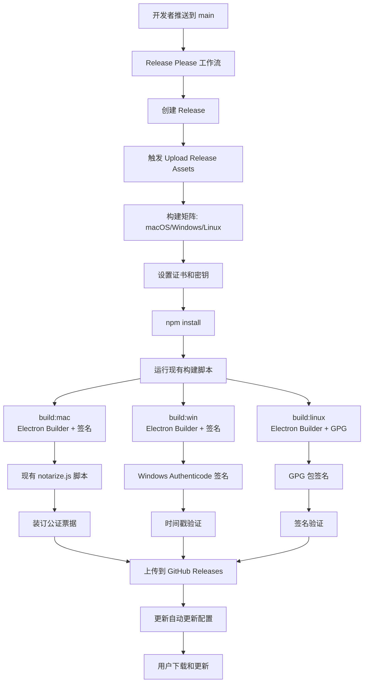
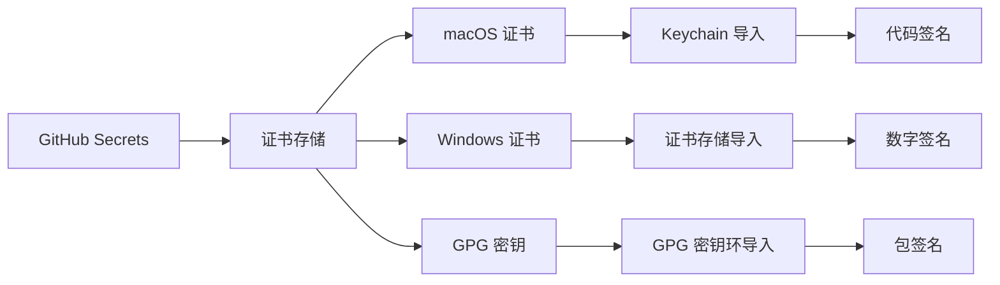

# 设计文档

## 概述

本设计文档描述了 Photasa 应用程序的全面分发和代码签名系统架构。该系统将在现有的工具链基础上构建，包括：

**现有工具链集成：**

- **Electron Builder**: 已配置的主要构建工具（electron-builder.yml），支持 macOS、Windows 和 Linux
- **GitHub Actions**: 现有的 CI/CD 流水线（build-matrix.yml, release.yml, upload-release-assets.yml）
- **Release Please**: 自动化版本管理和发布流程
- **现有签名基础设施**: 已有的 notarize.js 脚本和 entitlements.mac.plist
- **NPM 脚本**: 现有的构建脚本（build:mac, build:win, build:linux）

**增强功能：**

- 完善 macOS 代码签名和公证流程
- 添加 Windows 代码签名支持
- 新增 Linux GPG 包签名
- 增强证书管理和安全性
- 改进错误处理和监控

系统将支持三个主要平台：

- **macOS**: 增强现有的 Apple Developer Certificate 签名和公证流程
- **Windows**: 新增 Code Signing Certificate 数字签名支持
- **Linux**: 新增 GPG 密钥包签名支持

## 现有工具链集成

### Electron Builder 集成

现有的 `electron-builder.yml` 配置将被增强以支持完整的代码签名：

```yaml
# 增强的 electron-builder.yml 配置
appId: me.photasa.app
productName: Photasa

# macOS 签名配置（增强现有配置）
mac:
    category: public.app-category.photography
    entitlementsInherit: build/entitlements.mac.plist
    hardenedRuntime: true
    gatekeeperAssess: false
    identity: "Developer ID Application: Your Name (TEAM_ID)"

# Windows 签名配置（新增）
win:
    certificateFile: "path/to/certificate.p12"
    certificatePassword: "${env.WIN_CSC_KEY_PASSWORD}"
    timeStampServer: "http://timestamp.digicert.com"
    signAndEditExecutable: true
    signDlls: true

# Linux 签名配置（新增）
linux:
    executableName: "photasa"
    desktop:
        Name: "Photasa"
        Comment: "Photo management application"
```

### GitHub Actions 工作流集成

现有的工作流将被增强以支持证书管理和签名：

#### 1. 增强 build-matrix.yml

```yaml
# 在现有构建步骤前添加证书设置
- name: Setup certificates (macOS)
  if: matrix.os == 'macos-latest'
  run: |
      echo "${{ secrets.APPLE_CERT_DATA }}" | base64 --decode > certificate.p12
      security create-keychain -p "${{ secrets.KEYCHAIN_PASSWORD }}" build.keychain
      security import certificate.p12 -k build.keychain -P "${{ secrets.APPLE_CERT_PASSWORD }}" -T /usr/bin/codesign
      security set-key-partition-list -S apple-tool:,apple: -s -k "${{ secrets.KEYCHAIN_PASSWORD }}" build.keychain

- name: Setup certificates (Windows)
  if: matrix.os == 'windows-latest'
  run: |
      echo "${{ secrets.WIN_CERT_DATA }}" | base64 --decode > certificate.p12
      # 导入证书到 Windows 证书存储
```

#### 2. 增强 upload-release-assets.yml

```yaml
# 在构建后添加签名验证步骤
- name: Verify signatures
  run: |
      # macOS: codesign --verify --deep --strict
      # Windows: signtool verify
      # Linux: gpg --verify
```

### NPM 脚本集成

现有的构建脚本将保持不变，但会通过环境变量和 electron-builder 配置自动启用签名：

```json
{
    "scripts": {
        "build:mac": "npm run build && electron-builder --mac --config",
        "build:win": "npm run build && npm run sharp:win && electron-builder --win --config",
        "build:linux": "npm run build && electron-builder --linux --config"
    }
}
```

签名将通过以下方式自动触发：

1. **环境变量检测**: 如果检测到签名相关的环境变量，自动启用签名
2. **配置文件**: electron-builder 配置文件中的签名设置
3. **条件签名**: 仅在 CI 环境中进行签名，本地开发时跳过

## 架构

### 高级架构图



### 证书获取和准备

#### D-U-N-S 号码详细说明

**什么是 D-U-N-S 号码？**

D-U-N-S (Data Universal Numbering System) 是由邓白氏公司 (Dun & Bradstreet) 创建和维护的独特九位数字标识符，用于识别全球的商业实体。它是国际上广泛认可的商业标识符标准。

**为什么需要 D-U-N-S 号码？**

- **Apple Developer Program**: 公司账户注册时需要
- **EV Code Signing**: 证书颁发机构用于验证公司合法性
- **政府合同**: 许多政府采购要求 D-U-N-S 号码
- **商业信用**: 建立商业信用记录的基础

**如何获取 D-U-N-S 号码？**

1. **免费申请（推荐）**

    ```bash
    # 访问邓白氏官方网站
    https://www.dnb.com/duns-number.html

    # 或通过 Apple 专用链接申请（更快）
    https://developer.apple.com/enroll/duns-lookup/
    ```

    **申请流程:**
    - 填写公司基本信息（公司名称、地址、电话）
    - 提供公司法定代表人信息
    - 验证公司营业执照或注册文件
    - 等待审核（通常 1-30 个工作日）

2. **加急申请（付费）**

    ```bash
    # 邓白氏加急服务
    # 费用: $500-2000 USD
    # 时间: 1-5 个工作日
    ```

3. **不同国家/地区的申请**

    **中国大陆:**
    - 访问: https://www.dnb.com.cn/
    - 需要: 营业执照、组织机构代码证
    - 时间: 5-15 个工作日

    **香港:**
    - 需要: 公司注册证书 (Certificate of Incorporation)
    - 商业登记证 (Business Registration Certificate)

    **美国:**
    - 需要: EIN (Employer Identification Number)
    - 州政府注册文件

    **欧盟:**
    - 需要: VAT 号码
    - 当地商业注册文件

**常见问题:**

**问题 1: 公司信息不匹配**

```bash
# 错误: Company information doesn't match D-U-N-S record
# 解决: 确保所有申请中的公司信息与 D-U-N-S 记录完全一致
# 包括: 公司名称、地址、电话号码的格式和拼写
```

**问题 2: D-U-N-S 号码查找**

```bash
# 如果不确定是否已有 D-U-N-S 号码
# 访问: https://www.dnb.com/duns-number/lookup.html
# 输入公司信息进行查找
```

**问题 3: 更新 D-U-N-S 信息**

```bash
# 如果公司信息发生变更
# 联系邓白氏客服更新记录
# 电话: 各国客服热线
# 邮箱: 通过官网提交更新请求
```

**替代方案（如果无法获取 D-U-N-S）:**

- 使用个人 Apple ID 注册（限制较多）
- 选择 Standard Code Signing 而非 EV（Windows）
- 考虑通过代理公司申请证书

#### 成本优化策略和替代方案

**总成本概览:**

```bash
# 完整签名解决方案年度成本:
Apple Developer Program: $99/年
Windows Code Signing (Standard): $179-474/年
Linux GPG: 免费
总计: $278-573/年

# 预算友好的替代方案:
仅 macOS 签名: $99/年
仅 Linux 签名: 免费
Windows 自签名证书: 免费（但有限制）
```

**1. 预算友好的签名策略**

**阶段性实施:**

```bash
# 第一阶段: 免费/低成本方案
- Linux: 使用 GPG 签名（免费）
- Windows: 自签名证书（免费，但有 SmartScreen 警告）
- macOS: 暂时不签名，提供源码编译说明

# 第二阶段: 优先 macOS
- 购买 Apple Developer Program ($99/年)
- macOS 用户体验最佳，投资回报率高

# 第三阶段: 添加 Windows 签名
- 选择最便宜的 Standard Code Signing 证书
- Sectigo: $179/年 (最便宜的选择)
```

**2. Windows 低成本签名方案**

**自签名证书（免费但有限制）:**

```bash
# 创建自签名证书
makecert -sv mykey.pvk -n "CN=Photasa" mycer.cer -b 01/01/2024 -e 01/01/2026 -r
pvk2pfx -pvk mykey.pvk -spc mycer.cer -pfx mycert.pfx

# 使用 signtool 签名
signtool sign /f mycert.pfx /p password /t http://timestamp.digicert.com Photasa.exe

# 限制:
# - Windows SmartScreen 仍会显示警告
# - 用户需要手动信任证书
# - 不适合商业分发
```

**最便宜的商业证书选项:**

```bash
# SSL.com PositiveSSL Code Signing
# 价格: $199/年
# 特点: 基础代码签名，适合小型项目

# Sectigo Code Signing Certificate
# 价格: $179/年
# 特点: 行业认可，性价比高

# K Software Code Signing
# 价格: $84/年
# 特点: 最便宜的选择，但知名度较低
```

**3. 开源项目特殊方案**

**如果 Photasa 是开源项目:**

```bash
# GitHub 赞助商计划
# - 某些证书供应商为开源项目提供折扣
# - 社区赞助可以覆盖证书成本

# 开源证书计划
# - Let's Encrypt (不支持代码签名)
# - 某些 CA 为开源项目提供免费证书

# 社区签名服务
# - 使用可信的社区成员代为签名
# - 风险: 需要信任第三方
```

**4. 分发策略优化**

**无签名分发方案:**

```bash
# macOS:
# - 提供详细的安装说明
# - 用户需要在"安全性与隐私"中允许应用运行
# - 考虑通过 Homebrew 分发: brew install --cask photasa

# Windows:
# - 提供 SmartScreen 绕过说明
# - 考虑通过 Chocolatey 分发: choco install photasa
# - 使用 Windows Package Manager: winget install photasa

# Linux:
# - 通过包管理器分发 (apt, yum, pacman)
# - Flatpak/Snap 商店分发
# - AppImage 格式（便携式，无需安装）
```

**5. 渐进式信任建立**

**建立软件信誉的免费方法:**

```bash
# 1. 开源透明度
# - 公开源代码
# - 提供构建脚本
# - 允许用户自行编译

# 2. 社区验证
# - 鼓励用户验证下载文件的哈希值
# - 提供多个下载镜像
# - 建立用户反馈机制

# 3. 第三方验证
# - 提交到 VirusTotal 等安全扫描服务
# - 获得安全软件白名单
# - 寻求技术博客和媒体评测
```

**推荐的最小可行方案:**

```bash
# 预算 < $100/年:
# - 仅 Linux GPG 签名
# - Windows/macOS 提供安装说明
# - 重点建设社区信任

# 预算 $100-300/年:
# - Apple Developer Program ($99)
# - 最便宜的 Windows 证书 ($179)
# - Linux GPG 签名

# 预算 > $300/年:
# - 完整的签名解决方案
# - 考虑 EV 证书提升信任度
```

#### macOS 证书获取流程

1. **Apple Developer 账户设置**

    **步骤 1: 注册 Apple Developer Program**
    - 访问 https://developer.apple.com/programs/
    - 选择 Apple Developer Program ($99/年)
    - 使用公司 Apple ID 注册（推荐）或个人 Apple ID
    - 完成身份验证（可能需要 D-U-N-S 号码用于公司账户，详见下文说明）

    **步骤 2: 创建 App ID**
    - 登录 Apple Developer Portal
    - 导航到 Certificates, Identifiers & Profiles
    - 点击 Identifiers -> App IDs -> 注册新的 App ID
    - Bundle ID: `me.photasa.app`
    - 描述: "Photasa Photo Management Application"
    - 启用必要的 Capabilities（如果需要）

    **步骤 3: 创建证书**
    - 在 Certificates 部分点击 "+"
    - 选择 "Developer ID Application" (用于在 Mac App Store 外分发)
    - 上传 Certificate Signing Request (CSR)

    **创建 CSR 文件:**

    ```bash
    # 在 macOS 上使用 Keychain Access
    # 1. 打开 Keychain Access
    # 2. 菜单: Keychain Access -> Certificate Assistant -> Request a Certificate from a Certificate Authority
    # 3. 输入邮箱地址和常用名称
    # 4. 选择 "Saved to disk" 和 "Let me specify key pair information"
    # 5. 密钥大小: 2048 bits, 算法: RSA
    # 6. 保存 CSR 文件
    ```

2. **证书下载和安装**

    **下载证书:**
    - 在 Apple Developer Portal 下载 .cer 文件
    - 双击安装到 Keychain Access
    - 确保证书显示在 "login" keychain 中

    **验证证书安装:**

    ```bash
    # 列出所有可用的签名身份
    security find-identity -v -p codesigning

    # 应该看到类似输出:
    # 1) XXXXXXXXXX "Developer ID Application: Your Name (TEAM_ID)"
    ```

3. **证书导出和准备**

    **导出 .p12 文件:**

    ```bash
    # 方法 1: 使用 Keychain Access GUI
    # 1. 打开 Keychain Access
    # 2. 找到 "Developer ID Application" 证书
    # 3. 展开证书，确保包含私钥
    # 4. 选择证书（不是私钥）
    # 5. 右键 -> Export -> 选择 Personal Information Exchange (.p12)
    # 6. 设置强密码（记录此密码）

    # 方法 2: 使用命令行
    security export -k login.keychain -t identities -f pkcs12 -o certificate.p12
    ```

    **转换为 Base64:**

    ```bash
    # 转换 .p12 文件为 Base64 编码
    base64 -i certificate.p12 -o certificate.p12.base64

    # 验证 Base64 文件
    base64 -d certificate.p12.base64 > test.p12
    # 确保 test.p12 与原文件相同
    ```

4. **App-Specific Password 创建**

    **创建步骤:**
    - 访问 https://appleid.apple.com/
    - 登录你的 Apple ID
    - 在 "Security" 部分找到 "App-Specific Passwords"
    - 点击 "Generate Password"
    - 输入标签: "Photasa CI/CD Notarization"
    - 保存生成的密码（只显示一次）

5. **常见问题和解决方案**

    **问题 1: 证书不受信任**

    ```bash
    # 错误: "Developer ID Application" certificate is not trusted
    # 解决: 确保从 Apple Developer Portal 下载正确的证书
    # 检查证书链完整性
    security verify-cert -c certificate.cer
    ```

    **问题 2: 私钥不匹配**

    ```bash
    # 错误: The specified item could not be found in the keychain
    # 解决: 确保 CSR 是在同一台机器上生成的
    # 或者重新生成 CSR 和证书
    ```

    **问题 3: 公证失败**

    ```bash
    # 错误: Invalid credentials
    # 解决: 检查 Apple ID 和 App-Specific Password
    # 确保启用了双重认证
    ```

#### Windows 证书获取流程

1. **代码签名证书购买**

    **证书类型选择:**
    - **Standard Code Signing**: 适合大多数应用，价格较低
    - **EV Code Signing**: 提供即时信任，但需要硬件令牌

    **推荐供应商和价格 (年费):**
    - **DigiCert**: $474/年 (Standard), $1,040/年 (EV)
    - **Sectigo**: $179/年 (Standard), $399/年 (EV)
    - **GlobalSign**: $199/年 (Standard), $599/年 (EV)
    - **SSL.com**: $199/年 (Standard), $399/年 (EV)

    **购买流程:**
    - 选择供应商和证书类型
    - 提供公司信息和验证文档
    - 完成域名/组织验证（1-7天）
    - 下载证书文件

2. **身份验证要求**

    **Standard Code Signing:**
    - 公司注册文档
    - 营业执照或同等文件
    - 电话验证
    - 邮箱验证

    **EV Code Signing (额外要求):**
    - D-U-N-S 号码（详见下文说明）
    - 律师意见书或会计师证明
    - 更严格的身份验证流程
    - 硬件令牌要求

3. **证书格式准备**

    **从 CA 下载证书:**

    ```bash
    # 通常会收到以下文件:
    # - certificate.crt (证书文件)
    # - private.key (私钥文件)
    # - ca-bundle.crt (中间证书链)

    # 合并证书链
    cat certificate.crt ca-bundle.crt > fullchain.crt

    # 转换为 .p12 格式
    openssl pkcs12 -export -out certificate.p12 \
      -inkey private.key \
      -in fullchain.crt \
      -name "Photasa Code Signing Certificate"
    # 输入导出密码（记录此密码）
    ```

    **验证证书:**

    ```bash
    # 检查证书信息
    openssl pkcs12 -info -in certificate.p12 -noout

    # 验证证书有效期
    openssl pkcs12 -in certificate.p12 -nokeys -clcerts | openssl x509 -noout -dates
    ```

    **转换为 Base64:**

    ```bash
    # 转换 .p12 文件为 Base64 编码
    base64 -i certificate.p12 -o certificate.p12.base64

    # 在 Windows 上使用 PowerShell
    [Convert]::ToBase64String([IO.File]::ReadAllBytes("certificate.p12")) > certificate.p12.base64
    ```

4. **EV 证书特殊处理**

    **云端 HSM 解决方案:**

    ```bash
    # DigiCert KeyLocker (推荐用于 CI/CD)
    # 1. 购买 DigiCert EV Code Signing + KeyLocker
    # 2. 获取 API 密钥和证书 ID
    # 3. 在 CI/CD 中使用 DigiCert 工具签名

    # Azure Key Vault Code Signing
    # 1. 在 Azure 中创建 Key Vault
    # 2. 上传 EV 证书到 Key Vault
    # 3. 使用 Azure CLI 进行签名
    ```

    **传统硬件令牌 (不适合 CI/CD):**

    ```bash
    # SafeNet eToken 或类似硬件令牌
    # 需要物理访问，不适合自动化构建
    # 仅用于手动签名场景
    ```

5. **时间戳服务器配置**

    **免费时间戳服务器:**

    ```bash
    # DigiCert
    http://timestamp.digicert.com

    # Sectigo
    http://timestamp.sectigo.com

    # GlobalSign
    http://timestamp.globalsign.com/scripts/timstamp.dll
    ```

6. **常见问题和解决方案**

    **问题 1: 证书导入失败**

    ```bash
    # 错误: The specified network password is not correct
    # 解决: 检查 .p12 文件密码是否正确
    # 尝试重新导出证书
    ```

    **问题 2: SmartScreen 警告**

    ```bash
    # 问题: 即使签名后仍显示 SmartScreen 警告
    # 原因: 新证书需要建立信誉
    # 解决:
    # 1. 使用 EV 证书获得即时信任
    # 2. 或等待用户下载建立信誉（几周到几个月）
    ```

    **问题 3: 时间戳失败**

    ```bash
    # 错误: The timestamp signature and/or certificate could not be verified
    # 解决:
    # 1. 检查网络连接
    # 2. 尝试不同的时间戳服务器
    # 3. 重试签名过程
    ```

    **问题 4: 证书过期**

    ```bash
    # 错误: Certificate has expired
    # 解决:
    # 1. 续费证书
    # 2. 更新 CI/CD 中的证书
    # 3. 重新签名所有应用程序
    ```

#### Linux GPG 密钥创建

1. **GPG 密钥对生成**

    **交互式生成:**

    ```bash
    # 生成新的 GPG 密钥对
    gpg --full-generate-key

    # 选择选项:
    # (1) RSA and RSA (default)
    # 密钥大小: 4096
    # 有效期: 0 = key does not expire (推荐) 或 2y (2年)
    #
    # 输入用户信息:
    # Real name: Photasa Development Team
    # Email address: dev@photasa.me
    # Comment: Photasa Package Signing Key
    #
    # 设置强密码短语（记录此密码）
    ```

    **批量生成 (适合自动化):**

    ```bash
    # 创建密钥生成配置文件
    cat > gpg-key-config <<EOF
    %echo Generating GPG key for Photasa
    Key-Type: RSA
    Key-Length: 4096
    Subkey-Type: RSA
    Subkey-Length: 4096
    Name-Real: Photasa Development Team
    Name-Comment: Photasa Package Signing Key
    Name-Email: dev@photasa.me
    Expire-Date: 0
    Passphrase: YOUR_STRONG_PASSPHRASE
    %commit
    %echo Done
    EOF

    # 生成密钥
    gpg --batch --generate-key gpg-key-config
    rm gpg-key-config
    ```

2. **密钥验证和管理**

    **列出密钥:**

    ```bash
    # 列出所有密钥
    gpg --list-keys

    # 列出私钥（获取密钥 ID）
    gpg --list-secret-keys --keyid-format LONG

    # 输出示例:
    # sec   rsa4096/1234567890ABCDEF 2024-01-01 [SC]
    #       ABCDEF1234567890ABCDEF1234567890ABCDEF12
    # uid                 [ultimate] Photasa Development Team (Photasa Package Signing Key) <dev@photasa.me>
    # ssb   rsa4096/FEDCBA0987654321 2024-01-01 [E]
    ```

    **密钥 ID 说明:**
    - 短 ID: `1234567890ABCDEF` (16字符)
    - 长 ID: `ABCDEF1234567890ABCDEF1234567890ABCDEF12` (40字符)
    - 指纹: 完整的40字符标识符

3. **密钥导出和准备**

    **导出密钥:**

    ```bash
    # 使用邮箱地址导出
    gpg --export-secret-keys --armor dev@photasa.me > private.key
    gpg --export --armor dev@photasa.me > public.key

    # 或使用密钥 ID 导出
    gpg --export-secret-keys --armor 1234567890ABCDEF > private.key
    gpg --export --armor 1234567890ABCDEF > public.key
    ```

    **验证导出的密钥:**

    ```bash
    # 验证私钥
    gpg --import --dry-run private.key

    # 验证公钥
    gpg --import --dry-run public.key
    ```

    **Base64 编码:**

    ```bash
    # 编码私钥用于 GitHub Secrets
    base64 -w 0 private.key > private.key.base64

    # 编码公钥用于分发
    base64 -w 0 public.key > public.key.base64

    # 验证编码
    base64 -d private.key.base64 | gpg --import --dry-run
    ```

4. **公钥分发和信任建立**

    **上传到密钥服务器:**

    ```bash
    # 上传到 Ubuntu 密钥服务器
    gpg --keyserver keyserver.ubuntu.com --send-keys 1234567890ABCDEF

    # 上传到 MIT 密钥服务器
    gpg --keyserver pgp.mit.edu --send-keys 1234567890ABCDEF

    # 上传到 OpenPGP 密钥服务器
    gpg --keyserver keys.openpgp.org --send-keys 1234567890ABCDEF
    ```

    **创建公钥文件供用户下载:**

    ```bash
    # 创建用户友好的公钥文件
    cat > photasa-signing-key.asc <<EOF
    -----BEGIN PGP PUBLIC KEY BLOCK-----
    Comment: Photasa Package Signing Key
    Comment: Fingerprint: ABCD EFGH IJKL MNOP QRST UVWX YZ12 3456 7890 ABCD

    $(cat public.key | grep -v "^-----" | grep -v "^Comment:")
    -----END PGP PUBLIC KEY BLOCK-----
    EOF
    ```

5. **包签名配置**

    **为不同包格式配置签名:**

    ```bash
    # AppImage 签名
    # AppImage 本身不支持内置签名，使用分离签名
    gpg --detach-sign --armor Photasa-1.6.0.AppImage
    # 生成 Photasa-1.6.0.AppImage.asc

    # Debian 包签名
    dpkg-sig --sign builder photasa_1.6.0_amd64.deb

    # Snap 包签名（通过 Snap Store 自动处理）
    # 需要在 Snap Store 中配置开发者账户
    ```

6. **常见问题和解决方案**

    **问题 1: GPG 代理问题**

    ```bash
    # 错误: gpg: signing failed: No such file or directory
    # 解决: 配置 GPG 代理
    export GPG_TTY=$(tty)
    echo "use-agent" >> ~/.gnupg/gpg.conf
    echo "pinentry-mode loopback" >> ~/.gnupg/gpg.conf
    ```

    **问题 2: 密码短语输入**

    ```bash
    # 错误: gpg: signing failed: Inappropriate ioctl for device
    # 解决: 在 CI 环境中使用批处理模式
    echo "batch" >> ~/.gnupg/gpg.conf
    echo "yes" >> ~/.gnupg/gpg.conf
    ```

    **问题 3: 密钥信任问题**

    ```bash
    # 警告: This key is not certified with a trusted signature
    # 解决: 在本地信任自己的密钥
    gpg --edit-key dev@photasa.me
    # 在 GPG 提示符下输入: trust
    # 选择: 5 = I trust ultimately
    # 输入: y (确认)
    # 输入: quit
    ```

    **问题 4: 密钥过期**

    ```bash
    # 延长密钥有效期
    gpg --edit-key dev@photasa.me
    # 在 GPG 提示符下输入: expire
    # 选择新的过期时间
    # 输入: save

    # 重新上传到密钥服务器
    gpg --keyserver keyserver.ubuntu.com --send-keys 1234567890ABCDEF
    ```

7. **安全最佳实践**

    **密钥备份:**

    ```bash
    # 创建密钥备份
    gpg --export-secret-keys --armor dev@photasa.me > photasa-private-key-backup.asc
    gpg --export-ownertrust > photasa-trust-backup.txt

    # 安全存储备份文件（离线存储）
    ```

    **密钥轮换策略:**
    - 每2年轮换一次签名密钥
    - 保留旧密钥用于验证历史包
    - 提前3个月通知用户密钥更换

    **访问控制:**
    - 限制对私钥的访问
    - 使用强密码短语
    - 定期审计密钥使用情况

#### GitHub Secrets 配置

需要在 GitHub 仓库设置以下 Secrets：

```yaml
# macOS 签名
APPLE_CERT_DATA: <base64 encoded .p12 file>
APPLE_CERT_PASSWORD: <certificate password>
APPLE_ID: <apple id email>
APPLE_ID_PASS: <app-specific password>
APPLE_TEAM_ID: <10-character team id>

# Windows 签名
WIN_CERT_DATA: <base64 encoded .p12 file>
WIN_CERT_PASSWORD: <certificate password>
WIN_TIMESTAMP_URL: "http://timestamp.digicert.com"

# Linux 签名
GPG_PRIVATE_KEY: <base64 encoded private key>
GPG_PASSPHRASE: <gpg key passphrase>
GPG_KEY_ID: <gpg key id>

# 通用
KEYCHAIN_PASSWORD: <random password for temporary keychain>
```

### 现有脚本增强

#### notarize.js 脚本增强

现有的 `build/notarize.js` 脚本将被增强以提供更好的错误处理和日志记录：

```javascript
// 增强的 notarize.js
const { notarize } = require("@electron/notarize");

module.exports = async (context) => {
    if (process.platform !== "darwin") return;

    console.log("开始 macOS 应用公证流程...");

    // 增强的环境变量检查
    const requiredEnvVars = ["APPLE_ID", "APPLE_ID_PASS", "APPLE_TEAM_ID"];
    const missingVars = requiredEnvVars.filter((varName) => !process.env[varName]);

    if (missingVars.length > 0) {
        throw new Error(`缺少必需的环境变量: ${missingVars.join(", ")}`);
    }

    const { appOutDir } = context;
    const appName = context.packager.appInfo.productFilename;
    const appPath = `${appOutDir}/${appName}.app`;

    try {
        // 增强的公证流程
        await notarize({
            appBundleId: "me.photasa.app",
            appPath: appPath,
            appleId: process.env.APPLE_ID,
            appleIdPassword: process.env.APPLE_ID_PASS,
            teamId: process.env.APPLE_TEAM_ID,
        });

        console.log(`✅ 应用公证成功: ${appPath}`);
    } catch (error) {
        console.error(`❌ 公证失败: ${error.message}`);
        throw error;
    }
};
```

### 证书管理架构



## 组件和接口

### 1. 证书管理组件

#### macOS 证书管理器

```typescript
interface MacOSCertificateManager {
    importCertificate(p12Data: Buffer, password: string): Promise<void>;
    signApplication(appPath: string, identity: string): Promise<void>;
    notarizeApplication(appPath: string, bundleId: string): Promise<string>;
    stapleNotarization(appPath: string): Promise<void>;
    validateSignature(appPath: string): Promise<boolean>;
}
```

#### Windows 证书管理器

```typescript
interface WindowsCertificateManager {
    importCertificate(pfxData: Buffer, password: string): Promise<void>;
    signExecutable(exePath: string, timestampUrl?: string): Promise<void>;
    signInstaller(installerPath: string): Promise<void>;
    validateSignature(filePath: string): Promise<boolean>;
}
```

#### Linux GPG 管理器

```typescript
interface LinuxGPGManager {
    importGPGKey(privateKey: string, passphrase: string): Promise<void>;
    signPackage(packagePath: string, keyId: string): Promise<void>;
    createDetachedSignature(filePath: string): Promise<string>;
    verifySignature(filePath: string, signaturePath: string): Promise<boolean>;
}
```

### 2. 构建流水线组件

#### 构建协调器

```typescript
interface BuildOrchestrator {
    triggerBuild(platform: Platform, version: string): Promise<BuildResult>;
    monitorBuildProgress(buildId: string): Promise<BuildStatus>;
    handleBuildFailure(buildId: string, error: Error): Promise<void>;
    validateBuildArtifacts(artifacts: BuildArtifact[]): Promise<ValidationResult>;
}

enum Platform {
    MACOS = "macos",
    WINDOWS = "windows",
    LINUX = "linux",
}

interface BuildResult {
    buildId: string;
    platform: Platform;
    artifacts: BuildArtifact[];
    signatureInfo: SignatureInfo;
    status: BuildStatus;
}
```

### 3. 分发管理组件

#### 分发协调器

```typescript
interface DistributionCoordinator {
    uploadToGitHubReleases(artifacts: BuildArtifact[]): Promise<void>;
    updateAutoUpdaterConfig(version: string, artifacts: BuildArtifact[]): Promise<void>;
    publishToDirectDownload(artifacts: BuildArtifact[]): Promise<void>;
    notifyDistributionChannels(releaseInfo: ReleaseInfo): Promise<void>;
}

interface ReleaseInfo {
    version: string;
    releaseNotes: string;
    artifacts: BuildArtifact[];
    checksums: Record<string, string>;
    signatures: Record<string, string>;
}
```

### 4. 验证和测试组件

#### 签名验证器

```typescript
interface SignatureValidator {
    validateMacOSSignature(appPath: string): Promise<ValidationResult>;
    validateWindowsSignature(exePath: string): Promise<ValidationResult>;
    validateLinuxSignature(packagePath: string): Promise<ValidationResult>;
    generateVerificationReport(results: ValidationResult[]): Promise<VerificationReport>;
}
```

## 数据模型

### 证书配置模型

```typescript
interface CertificateConfig {
    macOS: {
        developerCertificate: string; // Base64 encoded P12
        certificatePassword: string;
        appleId: string;
        appleIdPassword: string;
        teamId: string;
    };
    windows: {
        codeSigningCertificate: string; // Base64 encoded PFX
        certificatePassword: string;
        timestampUrl: string;
    };
    linux: {
        gpgPrivateKey: string;
        gpgPassphrase: string;
        keyId: string;
    };
}
```

### 构建配置模型

```typescript
interface BuildConfig {
    version: string;
    platforms: Platform[];
    signing: {
        enabled: boolean;
        skipOnPullRequest: boolean;
        requireAllPlatforms: boolean;
    };
    distribution: {
        githubReleases: boolean;
        autoUpdater: boolean;
        directDownload: boolean;
    };
    validation: {
        runTests: boolean;
        verifySignatures: boolean;
        generateChecksums: boolean;
    };
}
```

### 构建产物模型

```typescript
interface BuildArtifact {
    id: string;
    platform: Platform;
    type: ArtifactType;
    filePath: string;
    fileName: string;
    size: number;
    checksum: string;
    signature?: string;
    signatureType?: SignatureType;
    metadata: ArtifactMetadata;
}

enum ArtifactType {
    DMG = "dmg",
    APP = "app",
    EXE = "exe",
    MSI = "msi",
    APPIMAGE = "appimage",
    DEB = "deb",
    SNAP = "snap",
}

enum SignatureType {
    APPLE_CODESIGN = "apple-codesign",
    WINDOWS_AUTHENTICODE = "windows-authenticode",
    GPG = "gpg",
}
```

## 错误处理

### 错误分类和处理策略

#### 证书相关错误

```typescript
class CertificateError extends Error {
    constructor(
        message: string,
        public readonly platform: Platform,
        public readonly errorCode: CertificateErrorCode,
    ) {
        super(message);
    }
}

enum CertificateErrorCode {
    CERTIFICATE_EXPIRED = "CERT_EXPIRED",
    CERTIFICATE_INVALID = "CERT_INVALID",
    CERTIFICATE_NOT_FOUND = "CERT_NOT_FOUND",
    WRONG_PASSWORD = "WRONG_PASSWORD",
    KEYCHAIN_ACCESS_DENIED = "KEYCHAIN_ACCESS_DENIED",
}
```

#### 构建错误处理

```typescript
interface ErrorHandler {
    handleCertificateError(error: CertificateError): Promise<ErrorResolution>;
    handleBuildError(error: BuildError): Promise<ErrorResolution>;
    handleDistributionError(error: DistributionError): Promise<ErrorResolution>;
    notifyDevelopers(error: Error, context: ErrorContext): Promise<void>;
}

interface ErrorResolution {
    canRetry: boolean;
    retryDelay?: number;
    fallbackAction?: string;
    requiresManualIntervention: boolean;
}
```

### 错误恢复机制

1. **自动重试**: 对于临时性错误（网络问题、服务暂时不可用）
2. **降级处理**: 如果某个平台签名失败，继续其他平台的构建
3. **通知机制**: 关键错误立即通知开发团队
4. **日志记录**: 详细记录所有错误信息用于调试

## 测试策略

### 单元测试

- 证书管理组件测试
- 签名验证逻辑测试
- 构建配置解析测试
- 错误处理逻辑测试

### 集成测试

- 端到端构建流程测试
- 多平台签名集成测试
- 分发渠道集成测试
- 自动更新机制测试

### 验收测试

```typescript
interface AcceptanceTestSuite {
    testMacOSSigningAndNotarization(): Promise<TestResult>;
    testWindowsCodeSigning(): Promise<TestResult>;
    testLinuxPackageSigning(): Promise<TestResult>;
    testAutomatedReleaseFlow(): Promise<TestResult>;
    testSignatureVerification(): Promise<TestResult>;
    testDistributionChannels(): Promise<TestResult>;
}
```

### 测试环境配置

- **开发环境**: 使用测试证书进行本地验证
- **CI 环境**: 使用真实证书进行完整流程测试
- **预发布环境**: 验证签名的应用程序在真实系统上的行为

## 安全考虑

### 证书安全

1. **存储安全**: 所有证书和密钥使用 GitHub Secrets 加密存储
2. **访问控制**: 限制对证书的访问权限，仅授权的工作流可以使用
3. **轮换策略**: 定期轮换证书和密钥
4. **审计日志**: 记录所有证书使用情况

### 构建安全

1. **环境隔离**: 每次构建使用干净的环境
2. **依赖验证**: 验证所有构建依赖的完整性
3. **产物验证**: 构建完成后验证所有产物的签名
4. **传输安全**: 使用 HTTPS 传输所有构建产物

### 分发安全

1. **签名验证**: 用户下载前验证所有签名
2. **校验和验证**: 提供 SHA256 校验和供用户验证
3. **安全通道**: 仅通过 HTTPS 分发应用程序
4. **更新验证**: 自动更新前验证新版本的签名

## 性能优化

### 构建优化

1. **并行构建**: 多平台并行构建以减少总时间
2. **缓存策略**: 缓存依赖和中间构建产物
3. **增量构建**: 仅在相关文件更改时重新构建
4. **资源优化**: 根据平台需求分配适当的构建资源

### 分发优化

1. **CDN 分发**: 使用 CDN 加速全球用户下载
2. **压缩优化**: 优化包大小以减少下载时间
3. **增量更新**: 支持增量更新以减少更新包大小
4. **镜像站点**: 提供多个下载镜像以提高可用性

## 监控和日志

### 监控指标

```typescript
interface BuildMetrics {
    buildDuration: number;
    signingDuration: number;
    notarizationDuration: number;
    distributionDuration: number;
    successRate: number;
    errorRate: number;
    platformSpecificMetrics: Record<Platform, PlatformMetrics>;
}

interface PlatformMetrics {
    buildSuccessRate: number;
    signingSuccessRate: number;
    averageBuildTime: number;
    commonErrors: ErrorFrequency[];
}
```

### 日志策略

1. **结构化日志**: 使用 JSON 格式记录所有操作
2. **日志级别**: 区分 DEBUG、INFO、WARN、ERROR 级别
3. **敏感信息过滤**: 自动过滤证书密码等敏感信息
4. **日志聚合**: 集中收集和分析所有构建日志

### 告警机制

1. **构建失败告警**: 构建失败时立即通知
2. **证书过期告警**: 证书即将过期时提前通知
3. **性能告警**: 构建时间异常时告警
4. **安全告警**: 检测到安全问题时立即告警
