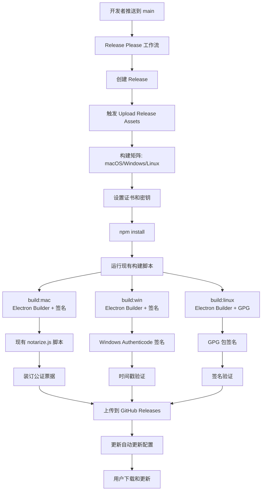
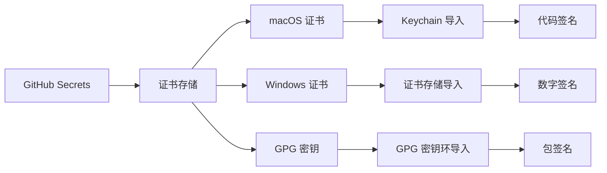

# 设计文档

## 概述

本设计文档描述了 Photasa 应用程序的全面分发和代码签名系统架构。该系统将在现有的工具链基础上构建，包括：

**现有工具链集成：**

- **Electron Builder**: 已配置的主要构建工具（electron-builder.yml），支持 macOS、Windows 和 Linux
- **GitHub Actions**: 现有的 CI/CD 流水线（build-matrix.yml, release.yml, upload-release-assets.yml）
- **Release Please**: 自动化版本管理和发布流程
- **现有签名基础设施**: 已有的 notarize.js 脚本和 entitlements.mac.plist
- **NPM 脚本**: 现有的构建脚本（build:mac, build:win, build:linux）

**增强功能：**

- 完善 macOS 代码签名和公证流程
- 添加 Windows 代码签名支持
- 新增 Linux GPG 包签名
- 增强证书管理和安全性
- 改进错误处理和监控

系统将支持三个主要平台：

- **macOS**: 增强现有的 Apple Developer Certificate 签名和公证流程
- **Windows**: 新增 Code Signing Certificate 数字签名支持
- **Linux**: 新增 GPG 密钥包签名支持

## 现有工具链集成

### Electron Builder 集成

现有的 `electron-builder.yml` 配置将被增强以支持完整的代码签名：

```yaml
# 增强的 electron-builder.yml 配置
appId: com.thepicasa.photasa
productName: Photasa

# macOS 签名配置（增强现有配置）
mac:
    category: public.app-category.photography
    entitlementsInherit: build/entitlements.mac.plist
    hardenedRuntime: true
    gatekeeperAssess: false
    identity: "Developer ID Application: Your Name (TEAM_ID)"

# Windows 签名配置（新增）
win:
    certificateFile: "path/to/certificate.p12"
    certificatePassword: "${env.WIN_CSC_KEY_PASSWORD}"
    timeStampServer: "http://timestamp.digicert.com"
    signAndEditExecutable: true
    signDlls: true

# Linux 签名配置（新增）
linux:
    executableName: "photasa"
    desktop:
        Name: "Photasa"
        Comment: "Photo management application"
```

### GitHub Actions 工作流集成

现有的工作流将被增强以支持证书管理和签名：

#### 1. 增强 build-matrix.yml

```yaml
# 在现有构建步骤前添加证书设置
- name: Setup certificates (macOS)
  if: matrix.os == 'macos-latest'
  run: |
      echo "${{ secrets.APPLE_CERT_DATA }}" | base64 --decode > certificate.p12
      security create-keychain -p "${{ secrets.KEYCHAIN_PASSWORD }}" build.keychain
      security import certificate.p12 -k build.keychain -P "${{ secrets.APPLE_CERT_PASSWORD }}" -T /usr/bin/codesign
      security set-key-partition-list -S apple-tool:,apple: -s -k "${{ secrets.KEYCHAIN_PASSWORD }}" build.keychain

- name: Setup certificates (Windows)
  if: matrix.os == 'windows-latest'
  run: |
      echo "${{ secrets.WIN_CERT_DATA }}" | base64 --decode > certificate.p12
      # 导入证书到 Windows 证书存储
```

#### 2. 增强 upload-release-assets.yml

```yaml
# 在构建后添加签名验证步骤
- name: Verify signatures
  run: |
      # macOS: codesign --verify --deep --strict
      # Windows: signtool verify
      # Linux: gpg --verify
```

### NPM 脚本集成

现有的构建脚本将保持不变，但会通过环境变量和 electron-builder 配置自动启用签名：

```json
{
    "scripts": {
        "build:mac": "npm run build && electron-builder --mac --config",
        "build:win": "npm run build && npm run sharp:win && electron-builder --win --config",
        "build:linux": "npm run build && electron-builder --linux --config"
    }
}
```

签名将通过以下方式自动触发：

1. **环境变量检测**: 如果检测到签名相关的环境变量，自动启用签名
2. **配置文件**: electron-builder 配置文件中的签名设置
3. **条件签名**: 仅在 CI 环境中进行签名，本地开发时跳过

## 架构

### 高级架构图



### 证书获取和准备

#### macOS 证书获取流程

1. **Apple Developer 账户设置**
    - 注册 Apple Developer Program ($99/年)
    - 在 Apple Developer Portal 创建 App ID: `com.thepicasa.photasa`
    - 创建 Distribution Certificate (Developer ID Application)

2. **证书导出和准备**

    ```bash
    # 从 Keychain Access 导出证书为 .p12 格式
    # 1. 打开 Keychain Access
    # 2. 找到 "Developer ID Application" 证书
    # 3. 右键 -> Export -> 选择 .p12 格式
    # 4. 设置导出密码

    # 转换为 Base64 用于 GitHub Secrets
    base64 -i certificate.p12 -o certificate.p12.base64
    ```

3. **App-Specific Password 创建**
    ```bash
    # 在 Apple ID 账户页面创建 App-Specific Password
    # 用于公证服务认证
    ```

#### Windows 证书获取流程

1. **代码签名证书购买**
    - 从认证的 CA 购买 Code Signing Certificate
    - 推荐供应商: DigiCert, Sectigo, GlobalSign
    - 选择 Standard Code Signing 或 EV Code Signing

2. **证书格式准备**

    ```bash
    # 如果收到 .crt 和 .key 文件，转换为 .p12
    openssl pkcs12 -export -out certificate.p12 -inkey private.key -in certificate.crt

    # 转换为 Base64
    base64 -i certificate.p12 -o certificate.p12.base64
    ```

3. **EV 证书特殊处理**
    ```bash
    # EV 证书通常需要硬件令牌
    # 对于 CI/CD，需要云端 HSM 服务
    # 如 DigiCert KeyLocker, Azure Key Vault
    ```

#### Linux GPG 密钥创建

1. **GPG 密钥对生成**

    ```bash
    # 生成新的 GPG 密钥对
    gpg --full-generate-key
    # 选择: RSA and RSA, 4096 bits, 永不过期
    # 输入: Real name, Email, Comment

    # 导出私钥
    gpg --export-secret-keys --armor your-email@example.com > private.key

    # 导出公钥
    gpg --export --armor your-email@example.com > public.key
    ```

2. **密钥准备**

    ```bash
    # 获取密钥 ID
    gpg --list-secret-keys --keyid-format LONG

    # Base64 编码私钥用于 GitHub Secrets
    base64 -i private.key -o private.key.base64
    ```

#### GitHub Secrets 配置

需要在 GitHub 仓库设置以下 Secrets：

```yaml
# macOS 签名
APPLE_CERT_DATA: <base64 encoded .p12 file>
APPLE_CERT_PASSWORD: <certificate password>
APPLE_ID: <apple id email>
APPLE_ID_PASS: <app-specific password>
APPLE_TEAM_ID: <10-character team id>

# Windows 签名
WIN_CERT_DATA: <base64 encoded .p12 file>
WIN_CERT_PASSWORD: <certificate password>
WIN_TIMESTAMP_URL: "http://timestamp.digicert.com"

# Linux 签名
GPG_PRIVATE_KEY: <base64 encoded private key>
GPG_PASSPHRASE: <gpg key passphrase>
GPG_KEY_ID: <gpg key id>

# 通用
KEYCHAIN_PASSWORD: <random password for temporary keychain>
```

### 现有脚本增强

#### notarize.js 脚本增强

现有的 `build/notarize.js` 脚本将被增强以提供更好的错误处理和日志记录：

```javascript
// 增强的 notarize.js
const { notarize } = require("@electron/notarize");

module.exports = async (context) => {
    if (process.platform !== "darwin") return;

    console.log("开始 macOS 应用公证流程...");

    // 增强的环境变量检查
    const requiredEnvVars = ["APPLE_ID", "APPLE_ID_PASS", "APPLE_TEAM_ID"];
    const missingVars = requiredEnvVars.filter((varName) => !process.env[varName]);

    if (missingVars.length > 0) {
        throw new Error(`缺少必需的环境变量: ${missingVars.join(", ")}`);
    }

    const { appOutDir } = context;
    const appName = context.packager.appInfo.productFilename;
    const appPath = `${appOutDir}/${appName}.app`;

    try {
        // 增强的公证流程
        await notarize({
            appBundleId: "com.thepicasa.photasa",
            appPath: appPath,
            appleId: process.env.APPLE_ID,
            appleIdPassword: process.env.APPLE_ID_PASS,
            teamId: process.env.APPLE_TEAM_ID,
        });

        console.log(`✅ 应用公证成功: ${appPath}`);
    } catch (error) {
        console.error(`❌ 公证失败: ${error.message}`);
        throw error;
    }
};
```

### 证书管理架构



## 组件和接口

### 1. 证书管理组件

#### macOS 证书管理器

```typescript
interface MacOSCertificateManager {
    importCertificate(p12Data: Buffer, password: string): Promise<void>;
    signApplication(appPath: string, identity: string): Promise<void>;
    notarizeApplication(appPath: string, bundleId: string): Promise<string>;
    stapleNotarization(appPath: string): Promise<void>;
    validateSignature(appPath: string): Promise<boolean>;
}
```

#### Windows 证书管理器

```typescript
interface WindowsCertificateManager {
    importCertificate(pfxData: Buffer, password: string): Promise<void>;
    signExecutable(exePath: string, timestampUrl?: string): Promise<void>;
    signInstaller(installerPath: string): Promise<void>;
    validateSignature(filePath: string): Promise<boolean>;
}
```

#### Linux GPG 管理器

```typescript
interface LinuxGPGManager {
    importGPGKey(privateKey: string, passphrase: string): Promise<void>;
    signPackage(packagePath: string, keyId: string): Promise<void>;
    createDetachedSignature(filePath: string): Promise<string>;
    verifySignature(filePath: string, signaturePath: string): Promise<boolean>;
}
```

### 2. 构建流水线组件

#### 构建协调器

```typescript
interface BuildOrchestrator {
    triggerBuild(platform: Platform, version: string): Promise<BuildResult>;
    monitorBuildProgress(buildId: string): Promise<BuildStatus>;
    handleBuildFailure(buildId: string, error: Error): Promise<void>;
    validateBuildArtifacts(artifacts: BuildArtifact[]): Promise<ValidationResult>;
}

enum Platform {
    MACOS = "macos",
    WINDOWS = "windows",
    LINUX = "linux",
}

interface BuildResult {
    buildId: string;
    platform: Platform;
    artifacts: BuildArtifact[];
    signatureInfo: SignatureInfo;
    status: BuildStatus;
}
```

### 3. 分发管理组件

#### 分发协调器

```typescript
interface DistributionCoordinator {
    uploadToGitHubReleases(artifacts: BuildArtifact[]): Promise<void>;
    updateAutoUpdaterConfig(version: string, artifacts: BuildArtifact[]): Promise<void>;
    publishToDirectDownload(artifacts: BuildArtifact[]): Promise<void>;
    notifyDistributionChannels(releaseInfo: ReleaseInfo): Promise<void>;
}

interface ReleaseInfo {
    version: string;
    releaseNotes: string;
    artifacts: BuildArtifact[];
    checksums: Record<string, string>;
    signatures: Record<string, string>;
}
```

### 4. 验证和测试组件

#### 签名验证器

```typescript
interface SignatureValidator {
    validateMacOSSignature(appPath: string): Promise<ValidationResult>;
    validateWindowsSignature(exePath: string): Promise<ValidationResult>;
    validateLinuxSignature(packagePath: string): Promise<ValidationResult>;
    generateVerificationReport(results: ValidationResult[]): Promise<VerificationReport>;
}
```

## 数据模型

### 证书配置模型

```typescript
interface CertificateConfig {
    macOS: {
        developerCertificate: string; // Base64 encoded P12
        certificatePassword: string;
        appleId: string;
        appleIdPassword: string;
        teamId: string;
    };
    windows: {
        codeSigningCertificate: string; // Base64 encoded PFX
        certificatePassword: string;
        timestampUrl: string;
    };
    linux: {
        gpgPrivateKey: string;
        gpgPassphrase: string;
        keyId: string;
    };
}
```

### 构建配置模型

```typescript
interface BuildConfig {
    version: string;
    platforms: Platform[];
    signing: {
        enabled: boolean;
        skipOnPullRequest: boolean;
        requireAllPlatforms: boolean;
    };
    distribution: {
        githubReleases: boolean;
        autoUpdater: boolean;
        directDownload: boolean;
    };
    validation: {
        runTests: boolean;
        verifySignatures: boolean;
        generateChecksums: boolean;
    };
}
```

### 构建产物模型

```typescript
interface BuildArtifact {
    id: string;
    platform: Platform;
    type: ArtifactType;
    filePath: string;
    fileName: string;
    size: number;
    checksum: string;
    signature?: string;
    signatureType?: SignatureType;
    metadata: ArtifactMetadata;
}

enum ArtifactType {
    DMG = "dmg",
    APP = "app",
    EXE = "exe",
    MSI = "msi",
    APPIMAGE = "appimage",
    DEB = "deb",
    SNAP = "snap",
}

enum SignatureType {
    APPLE_CODESIGN = "apple-codesign",
    WINDOWS_AUTHENTICODE = "windows-authenticode",
    GPG = "gpg",
}
```

## 错误处理

### 错误分类和处理策略

#### 证书相关错误

```typescript
class CertificateError extends Error {
    constructor(
        message: string,
        public readonly platform: Platform,
        public readonly errorCode: CertificateErrorCode,
    ) {
        super(message);
    }
}

enum CertificateErrorCode {
    CERTIFICATE_EXPIRED = "CERT_EXPIRED",
    CERTIFICATE_INVALID = "CERT_INVALID",
    CERTIFICATE_NOT_FOUND = "CERT_NOT_FOUND",
    WRONG_PASSWORD = "WRONG_PASSWORD",
    KEYCHAIN_ACCESS_DENIED = "KEYCHAIN_ACCESS_DENIED",
}
```

#### 构建错误处理

```typescript
interface ErrorHandler {
    handleCertificateError(error: CertificateError): Promise<ErrorResolution>;
    handleBuildError(error: BuildError): Promise<ErrorResolution>;
    handleDistributionError(error: DistributionError): Promise<ErrorResolution>;
    notifyDevelopers(error: Error, context: ErrorContext): Promise<void>;
}

interface ErrorResolution {
    canRetry: boolean;
    retryDelay?: number;
    fallbackAction?: string;
    requiresManualIntervention: boolean;
}
```

### 错误恢复机制

1. **自动重试**: 对于临时性错误（网络问题、服务暂时不可用）
2. **降级处理**: 如果某个平台签名失败，继续其他平台的构建
3. **通知机制**: 关键错误立即通知开发团队
4. **日志记录**: 详细记录所有错误信息用于调试

## 测试策略

### 单元测试

- 证书管理组件测试
- 签名验证逻辑测试
- 构建配置解析测试
- 错误处理逻辑测试

### 集成测试

- 端到端构建流程测试
- 多平台签名集成测试
- 分发渠道集成测试
- 自动更新机制测试

### 验收测试

```typescript
interface AcceptanceTestSuite {
    testMacOSSigningAndNotarization(): Promise<TestResult>;
    testWindowsCodeSigning(): Promise<TestResult>;
    testLinuxPackageSigning(): Promise<TestResult>;
    testAutomatedReleaseFlow(): Promise<TestResult>;
    testSignatureVerification(): Promise<TestResult>;
    testDistributionChannels(): Promise<TestResult>;
}
```

### 测试环境配置

- **开发环境**: 使用测试证书进行本地验证
- **CI 环境**: 使用真实证书进行完整流程测试
- **预发布环境**: 验证签名的应用程序在真实系统上的行为

## 安全考虑

### 证书安全

1. **存储安全**: 所有证书和密钥使用 GitHub Secrets 加密存储
2. **访问控制**: 限制对证书的访问权限，仅授权的工作流可以使用
3. **轮换策略**: 定期轮换证书和密钥
4. **审计日志**: 记录所有证书使用情况

### 构建安全

1. **环境隔离**: 每次构建使用干净的环境
2. **依赖验证**: 验证所有构建依赖的完整性
3. **产物验证**: 构建完成后验证所有产物的签名
4. **传输安全**: 使用 HTTPS 传输所有构建产物

### 分发安全

1. **签名验证**: 用户下载前验证所有签名
2. **校验和验证**: 提供 SHA256 校验和供用户验证
3. **安全通道**: 仅通过 HTTPS 分发应用程序
4. **更新验证**: 自动更新前验证新版本的签名

## 性能优化

### 构建优化

1. **并行构建**: 多平台并行构建以减少总时间
2. **缓存策略**: 缓存依赖和中间构建产物
3. **增量构建**: 仅在相关文件更改时重新构建
4. **资源优化**: 根据平台需求分配适当的构建资源

### 分发优化

1. **CDN 分发**: 使用 CDN 加速全球用户下载
2. **压缩优化**: 优化包大小以减少下载时间
3. **增量更新**: 支持增量更新以减少更新包大小
4. **镜像站点**: 提供多个下载镜像以提高可用性

## 监控和日志

### 监控指标

```typescript
interface BuildMetrics {
    buildDuration: number;
    signingDuration: number;
    notarizationDuration: number;
    distributionDuration: number;
    successRate: number;
    errorRate: number;
    platformSpecificMetrics: Record<Platform, PlatformMetrics>;
}

interface PlatformMetrics {
    buildSuccessRate: number;
    signingSuccessRate: number;
    averageBuildTime: number;
    commonErrors: ErrorFrequency[];
}
```

### 日志策略

1. **结构化日志**: 使用 JSON 格式记录所有操作
2. **日志级别**: 区分 DEBUG、INFO、WARN、ERROR 级别
3. **敏感信息过滤**: 自动过滤证书密码等敏感信息
4. **日志聚合**: 集中收集和分析所有构建日志

### 告警机制

1. **构建失败告警**: 构建失败时立即通知
2. **证书过期告警**: 证书即将过期时提前通知
3. **性能告警**: 构建时间异常时告警
4. **安全告警**: 检测到安全问题时立即告警
