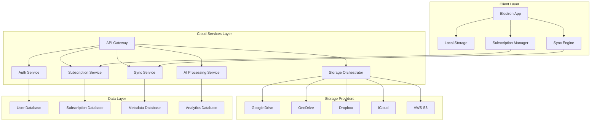

# Design Document

## Overview

This design document outlines the architecture for transforming Photasa from a desktop application into a cloud subscription service. The system will maintain its offline-first approach while adding cloud synchronization, multi-provider storage clustering, and subscription-based premium features.

The design leverages Photasa's existing Electron architecture and extends it with cloud services, maintaining backward compatibility while introducing new subscription tiers and cloud capabilities.

## Architecture

### High-Level Architecture



### System Components

1. **Client-Side Components**
    - Enhanced Electron application with cloud sync capabilities
    - Local caching and offline-first functionality
    - Subscription status management
    - Multi-provider storage client

2. **Cloud Services**
    - Microservices architecture for scalability
    - RESTful APIs with GraphQL for complex queries
    - Event-driven architecture for real-time sync
    - Serverless functions for AI processing

3. **Storage Layer**
    - Multi-cloud storage abstraction
    - Intelligent storage clustering
    - Cost optimization algorithms
    - Data redundancy management

## Components and Interfaces

### 1. Subscription Management Component

#### SubscriptionManager Class

```typescript
interface SubscriptionManager {
    // Subscription lifecycle
    checkSubscriptionStatus(): Promise<SubscriptionStatus>;
    upgradeSubscription(planId: string): Promise<PaymentResult>;
    cancelSubscription(): Promise<CancellationResult>;

    // Feature access control
    hasFeatureAccess(feature: PremiumFeature): boolean;
    getStorageQuota(): Promise<StorageQuota>;

    // Billing
    getBillingHistory(): Promise<BillingRecord[]>;
    updatePaymentMethod(paymentMethod: PaymentMethod): Promise<void>;
}

interface SubscriptionStatus {
    tier: "free" | "professional" | "enterprise";
    isActive: boolean;
    expiresAt: Date;
    features: PremiumFeature[];
    storageUsed: number;
    storageLimit: number;
}
```

#### API Endpoints

```typescript
// Subscription API
POST / api / v1 / subscriptions / create;
GET / api / v1 / subscriptions / status;
PUT / api / v1 / subscriptions / upgrade;
DELETE / api / v1 / subscriptions / cancel;
GET / api / v1 / subscriptions / billing - history;
```

### 2. Multi-Cloud Storage Integration

#### CloudStorageOrchestrator Class

```typescript
interface CloudStorageOrchestrator {
    // Provider management
    connectProvider(provider: StorageProvider, credentials: ProviderCredentials): Promise<void>;
    disconnectProvider(providerId: string): Promise<void>;
    getConnectedProviders(): Promise<ConnectedProvider[]>;

    // Storage operations
    uploadPhoto(photo: PhotoFile, strategy: StorageStrategy): Promise<StorageResult>;
    downloadPhoto(photoId: string): Promise<PhotoFile>;
    deletePhoto(photoId: string): Promise<void>;

    // Clustering and optimization
    optimizeStorage(): Promise<OptimizationResult>;
    migrateToOptimalStorage(photoIds: string[]): Promise<MigrationResult>;
}

interface StorageStrategy {
    primaryProvider: string;
    backupProviders: string[];
    costOptimization: boolean;
    accessFrequency: "hot" | "warm" | "cold";
}
```

#### Storage Provider Interface

```typescript
interface StorageProvider {
    id: string;
    name: string;
    type: "google_drive" | "onedrive" | "dropbox" | "icloud" | "s3";

    // Core operations
    upload(file: File, path: string): Promise<UploadResult>;
    download(path: string): Promise<File>;
    delete(path: string): Promise<void>;
    list(path: string): Promise<FileMetadata[]>;

    // Quota and limits
    getQuota(): Promise<StorageQuota>;
    getRateLimit(): Promise<RateLimit>;
}
```

### 3. Real-Time Synchronization

#### SyncEngine Class

```typescript
interface SyncEngine {
    // Sync operations
    startSync(): Promise<void>;
    pauseSync(): Promise<void>;
    forcSync(): Promise<SyncResult>;

    // Conflict resolution
    resolveConflict(conflictId: string, resolution: ConflictResolution): Promise<void>;
    getConflicts(): Promise<SyncConflict[]>;

    // Sync status
    getSyncStatus(): Promise<SyncStatus>;
    onSyncProgress(callback: (progress: SyncProgress) => void): void;
}

interface SyncStatus {
    isActive: boolean;
    lastSyncTime: Date;
    pendingUploads: number;
    pendingDownloads: number;
    conflicts: number;
    errors: SyncError[];
}
```

#### WebSocket Events

```typescript
// Real-time sync events
interface SyncEvents {
    "photo:uploaded": PhotoUploadedEvent;
    "photo:updated": PhotoUpdatedEvent;
    "photo:deleted": PhotoDeletedEvent;
    "sync:conflict": SyncConflictEvent;
    "sync:progress": SyncProgressEvent;
}
```

### 4. AI-Powered Photo Management

#### AIPhotoProcessor Class

```typescript
interface AIPhotoProcessor {
    // Content analysis
    analyzePhoto(photo: PhotoFile): Promise<PhotoAnalysis>;
    generateTags(photo: PhotoFile): Promise<string[]>;
    detectDuplicates(photos: PhotoFile[]): Promise<DuplicateGroup[]>;

    // Smart organization
    suggestAlbums(photos: PhotoFile[]): Promise<AlbumSuggestion[]>;
    searchByNaturalLanguage(query: string): Promise<SearchResult[]>;

    // Content moderation
    moderateContent(photo: PhotoFile): Promise<ModerationResult>;
}

interface PhotoAnalysis {
    objects: DetectedObject[];
    faces: DetectedFace[];
    scenes: DetectedScene[];
    colors: DominantColor[];
    quality: QualityScore;
    metadata: EnhancedMetadata;
}
```

### 5. Security and Privacy

#### EncryptionManager Class

```typescript
interface EncryptionManager {
    // Key management
    generateUserKeys(): Promise<KeyPair>;
    rotateKeys(): Promise<void>;

    // Encryption/Decryption
    encryptPhoto(photo: PhotoFile, publicKey: string): Promise<EncryptedPhoto>;
    decryptPhoto(encryptedPhoto: EncryptedPhoto, privateKey: string): Promise<PhotoFile>;

    // Secure sharing
    createShareLink(photoId: string, permissions: SharePermissions): Promise<ShareLink>;
    revokeShareLink(linkId: string): Promise<void>;
}

interface ShareLink {
    id: string;
    url: string;
    expiresAt: Date;
    permissions: SharePermissions;
    accessCount: number;
    maxAccess?: number;
}
```

## Data Models

### User and Subscription Models

```typescript
interface User {
    id: string;
    email: string;
    createdAt: Date;
    subscription: Subscription;
    preferences: UserPreferences;
    storageProviders: ConnectedProvider[];
}

interface Subscription {
    id: string;
    userId: string;
    tier: SubscriptionTier;
    status: "active" | "cancelled" | "expired" | "past_due";
    currentPeriodStart: Date;
    currentPeriodEnd: Date;
    cancelAtPeriodEnd: boolean;
    paymentMethod: PaymentMethod;
}

interface SubscriptionTier {
    id: string;
    name: string;
    price: number;
    currency: string;
    interval: "month" | "year";
    features: PremiumFeature[];
    storageLimit: number; // in bytes, -1 for unlimited
    apiRateLimit: number;
}
```

### Photo and Storage Models

```typescript
interface CloudPhoto extends Photo {
    id: string;
    userId: string;
    cloudPath: string;
    storageProviders: PhotoStorageLocation[];
    syncStatus: "synced" | "pending" | "conflict" | "error";
    encryptionKey: string;
    aiTags: string[];
    lastModified: Date;
    accessCount: number;
    lastAccessed: Date;
}

interface PhotoStorageLocation {
    providerId: string;
    path: string;
    tier: "hot" | "warm" | "cold";
    uploadedAt: Date;
    checksum: string;
}
```

## Error Handling

### Error Categories

1. **Network Errors**: Connection failures, timeouts
2. **Authentication Errors**: Invalid tokens, expired sessions
3. **Storage Errors**: Provider quota exceeded, upload failures
4. **Sync Conflicts**: Concurrent modifications
5. **Subscription Errors**: Payment failures, feature access denied

### Error Handling Strategy

```typescript
interface ErrorHandler {
    handleNetworkError(error: NetworkError): Promise<void>;
    handleAuthError(error: AuthError): Promise<void>;
    handleStorageError(error: StorageError): Promise<void>;
    handleSyncConflict(conflict: SyncConflict): Promise<void>;
    handleSubscriptionError(error: SubscriptionError): Promise<void>;
}

// Retry mechanism with exponential backoff
interface RetryConfig {
    maxRetries: number;
    baseDelay: number;
    maxDelay: number;
    backoffMultiplier: number;
}
```

### Graceful Degradation

- **Offline Mode**: Full functionality with local storage
- **Limited Connectivity**: Priority sync for recent photos
- **Storage Provider Outage**: Automatic failover to backup providers
- **Subscription Expired**: Graceful downgrade to free tier features

## Testing Strategy

### Unit Testing

- Component isolation testing
- Mock external dependencies
- Test subscription logic and feature access
- Encryption/decryption functionality

### Integration Testing

- End-to-end sync workflows
- Multi-provider storage operations
- Payment processing integration
- Real-time sync events

### Performance Testing

- Large photo collection sync
- Concurrent user load testing
- Storage provider failover scenarios
- AI processing performance

### Security Testing

- Encryption key management
- Secure sharing functionality
- Authentication and authorization
- Data privacy compliance

## Deployment and Infrastructure

### Cloud Infrastructure

- **Container Orchestration**: Kubernetes for microservices
- **API Gateway**: Kong or AWS API Gateway
- **Message Queue**: Redis for real-time sync
- **Database**: PostgreSQL for relational data, MongoDB for metadata
- **CDN**: CloudFlare for global photo delivery
- **Monitoring**: Prometheus + Grafana for observability

### CI/CD Pipeline

- **Source Control**: Git with feature branch workflow
- **Build**: Docker containers for consistent deployment
- **Testing**: Automated test suite with coverage requirements
- **Deployment**: Blue-green deployment for zero downtime
- **Rollback**: Automated rollback on deployment failures

### Scalability Considerations

- **Horizontal Scaling**: Microservices can scale independently
- **Database Sharding**: User-based sharding for photo metadata
- **Caching**: Redis for frequently accessed data
- **CDN**: Global photo delivery optimization
- **Load Balancing**: Distribute traffic across service instances
