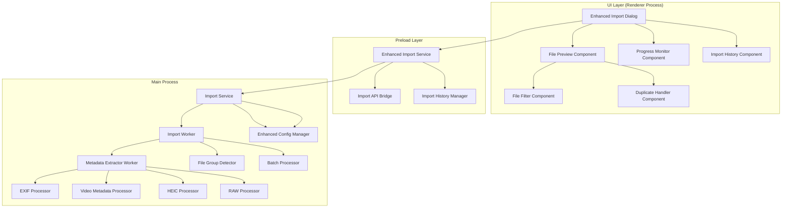
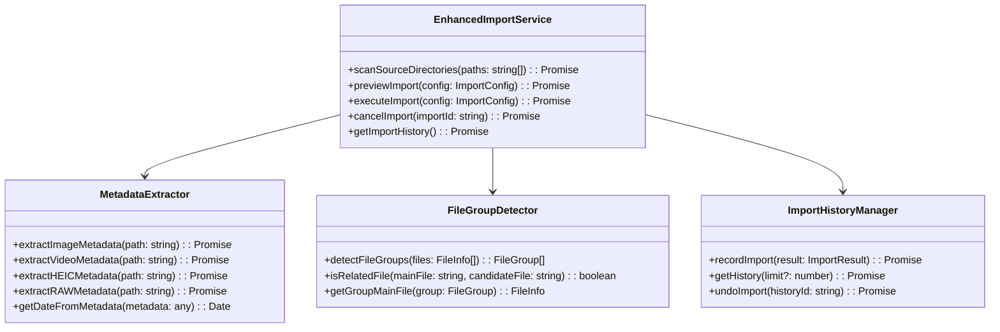

# 照片导入功能完善设计文档

## 概述

本设计文档基于需求文档，详细描述了Photasa照片导入功能完善的技术架构、组件设计和实现方案。设计遵循现有的系统架构，在保持向后兼容的同时，大幅提升用户体验和功能完整性。

## 架构设计

### 整体架构



### 核心组件关系



## 组件详细设计

### 1. 增强的导入对话框 (Enhanced Import Dialog)

#### 界面设计

**设计决策：** 基于需求1（改进导入用户体验），移除无关的Activity type和Resources选项，专注于核心导入功能，提供清晰直观的界面。

```typescript
interface ImportDialogState {
    // 基础配置
    sourcePaths: string[];
    targetPath: string;

    // 预览相关
    filePreview: FilePreviewState;
    showPreview: boolean;
    autoScanOnSelect: boolean; // 需求2：选择目录后自动扫描

    // 过滤选项
    filters: ImportFilters;
    activeFilters: Set<string>; // 跟踪当前激活的过滤器

    // 重复处理策略
    duplicateStrategy: DuplicateStrategy;
    duplicateFiles: DuplicateFileInfo[]; // 检测到的重复文件列表

    // 进度监控
    importProgress: ImportProgress;
    isImporting: boolean;
    canCancel: boolean;
    canPause: boolean; // 需求1：支持暂停操作

    // 批量导入支持
    batchProgress: BatchProgress; // 需求4：批量导入进度
    directoryProgress: Map<string, DirectoryProgress>; // 按目录分组的进度
}

interface FilePreviewState {
    files: FileGroup[];
    selectedFiles: Set<string>;
    totalSize: number;
    totalCount: number;
    statistics: FileStatistics;
    thumbnails: Map<string, string>; // 需求2：文件缩略图
    targetPaths: Map<string, string>; // 需求2：目标路径预览
}

interface ImportFilters {
    fileTypes: FileType[]; // 需求5：图片、视频、全部
    sizeRange: { min: number; max: number }; // 需求5：文件大小范围
    dateRange: { start: Date; end: Date }; // 需求5：修改日期范围
    includeSubfolders: boolean;
}

interface FileStatistics {
    totalFiles: number;
    imageFiles: number;
    videoFiles: number;
    otherFiles: number;
    totalSize: number;
    duplicateCount: number;
    groupCount: number; // 需求7：文件组统计
}

interface BatchProgress {
    totalDirectories: number;
    completedDirectories: number;
    currentDirectory: string;
    overallProgress: number;
}

interface DirectoryProgress {
    path: string;
    totalFiles: number;
    processedFiles: number;
    status: "pending" | "processing" | "completed" | "paused" | "error";
    canCancel: boolean;
}
```

#### 关键功能

**设计决策：** 基于需求分析，界面需要支持多种复杂交互，采用模块化设计便于维护和扩展。

1. **简化界面**：移除Activity type和Resources选项，专注核心导入功能（需求1）
2. **多目录选择**：支持同时选择多个源目录（需求4）
3. **实时预览**：选择目录后自动扫描并显示文件预览，包含缩略图和目标路径（需求2）
4. **智能过滤**：提供文件类型、大小、日期等多维度过滤选项（需求5）
5. **进度监控**：实时显示详细进度信息，包括当前文件、速度、预估时间（需求1）
6. **批量导入控制**：按目录分组显示进度，支持单独控制（需求4）
7. **重复文件处理**：可视化重复文件检测和处理选项（需求3）

### 2. 导入Worker架构 (Import Worker Architecture)

#### 参考现有Worker模式

基于现有的thumbnail-worker和scan-worker模式，创建import-worker来处理元数据提取和文件处理：

```typescript
// src/main/import/import-worker.ts
import { parentPort } from "worker_threads";
import { loggers } from "@common/logger";
import { createResponse } from "@common/worker-util";
import type { WorkerMessage } from "@common/types";
import type { ImportRequest, ImportResponse } from "@common/import-types";
import { extractMetadata, processFileGroup } from "./import-handler";

const logger = loggers.worker;

parentPort?.on("message", async (message: WorkerMessage<ImportRequest>) => {
    logger.debug(`[import-worker] 收到消息: ${JSON.stringify(message)}`);
    try {
        switch (message.action) {
            case "extract_metadata":
                const metadata = await extractMetadata(message.payload, logger);
                const response = createResponse<ImportRequest, ImportResponse>(message, {
                    success: true,
                    data: metadata,
                });
                parentPort?.postMessage(response);
                break;

            case "process_file_group":
                const result = await processFileGroup(message.payload, logger);
                const groupResponse = createResponse<ImportRequest, ImportResponse>(message, {
                    success: true,
                    data: result,
                });
                parentPort?.postMessage(groupResponse);
                break;

            default:
                logger.debug(`[import-worker] 未知操作: ${message.action}`);
                const errorResponse = createResponse<ImportRequest, ImportResponse>(message, {
                    success: false,
                    error: "Unknown action",
                });
                parentPort?.postMessage(errorResponse);
        }
    } catch (error) {
        const response = createResponse<ImportRequest, ImportResponse>(message, {
            success: false,
            error: error instanceof Error ? error.message : "Unknown error",
        });
        parentPort?.postMessage(response);
    }
});
```

#### 独立的HEIC元数据处理器（不复用thumbnail处理）

```typescript
// src/main/import/import-handler.ts - HEIC处理部分
class HEICMetadataProcessor {
    private static heifModule: any = null;

    static async initialize(): Promise<void> {
        if (!this.heifModule) {
            const wasmPath = path.join(__dirname, "../../resources/wasm_heif.wasm");
            const wasmBinary = await fs.readFile(wasmPath);
            this.heifModule = await createHeifModule({ wasmBinary });
        }
    }

    static async extractMetadata(filePath: string, logger: PhotasaLogger): Promise<ImageMetadata> {
        await this.initialize();

        try {
            const buffer = await fs.readFile(filePath);
            // 解码HEIC获取基本信息
            const decoded = this.heifModule.decode(buffer, buffer.byteLength, false);
            const { width, height } = this.heifModule.dimensions();

            // 尝试提取EXIF数据
            let exifData = null;
            try {
                const tags = ExifReader.load(buffer);
                exifData = tags;
            } catch (e) {
                logger.warn(`[HEIC] Failed to extract EXIF from ${filePath}: ${e}`);
            }

            return {
                width,
                height,
                dateTime: this.extractDateTime(exifData),
                gpsInfo: this.extractGPSInfo(exifData),
                cameraInfo: this.extractCameraInfo(exifData),
                format: "HEIC",
                dateSource: exifData ? "exif" : "file_created",
            };
        } catch (error) {
            logger.error(`[HEIC] Error processing ${filePath}: ${error}`);
            throw error;
        }
    }

    private parseExifData(exifData: ArrayBuffer): ImageMetadata {
        // 使用ExifReader解析EXIF数据
        const tags = ExifReader.load(exifData);
        return {
            dateTime: this.extractDateTime(tags),
            gpsInfo: this.extractGPSInfo(tags),
            cameraInfo: this.extractCameraInfo(tags),
            // ... 其他元数据
        };
    }
}
```

#### 视频元数据处理器

```typescript
// src/main/import/import-handler.ts - 视频处理部分
class VideoMetadataProcessor {
    static async extractMetadata(filePath: string, logger: PhotasaLogger): Promise<VideoMetadata> {
        return new Promise((resolve, reject) => {
            ffmpeg.ffprobe(filePath, (err, metadata) => {
                if (err) {
                    logger.error(`[Video] Error extracting metadata from ${filePath}: ${err}`);
                    reject(err);
                    return;
                }

                try {
                    const videoStream = metadata.streams.find((s) => s.codec_type === "video");
                    const creationTime = this.parseCreationTime(metadata);

                    resolve({
                        duration: metadata.format.duration || 0,
                        creationTime,
                        resolution: {
                            width: videoStream?.width || 0,
                            height: videoStream?.height || 0,
                        },
                        codec: videoStream?.codec_name || "unknown",
                        gpsInfo: this.extractGPSFromVideo(metadata),
                        format: path.extname(filePath).toLowerCase().slice(1),
                        dateSource: creationTime ? "video_metadata" : "file_created",
                    });
                } catch (error) {
                    logger.error(`[Video] Error parsing metadata for ${filePath}: ${error}`);
                    reject(error);
                }
            });
        });
    }

    private static parseCreationTime(metadata: any): Date | null {
        const timeFields = [
            "creation_time",
            "com.apple.quicktime.creationdate",
            "date",
            "com.apple.quicktime.make",
        ];

        // 检查format级别的tags
        for (const field of timeFields) {
            const time = metadata.format.tags?.[field];
            if (time && time !== "0000-00-00T00:00:00.000000Z") {
                try {
                    return new Date(time);
                } catch (e) {
                    continue;
                }
            }
        }

        // 检查stream级别的tags
        for (const stream of metadata.streams) {
            for (const field of timeFields) {
                const time = stream.tags?.[field];
                if (time && time !== "0000-00-00T00:00:00.000000Z") {
                    try {
                        return new Date(time);
                    } catch (e) {
                        continue;
                    }
                }
            }
        }

        return null;
    }

    private static extractGPSFromVideo(metadata: any): GPSInfo | null {
        // 尝试从视频元数据中提取GPS信息
        const locationFields = ["location", "com.apple.quicktime.location.ISO6709"];

        for (const stream of metadata.streams) {
            for (const field of locationFields) {
                const location = stream.tags?.[field];
                if (location) {
                    return this.parseGPSString(location);
                }
            }
        }

        return null;
    }
}

/**
 * 统一的元数据提取入口
 */
export async function extractMetadata(
    request: MetadataRequest,
    logger: PhotasaLogger,
): Promise<FileMetadata> {
    const { filePath } = request;
    const ext = path.extname(filePath).toLowerCase();

    try {
        // 获取基本文件信息
        const stats = await fs.stat(filePath);
        const baseMetadata = {
            path: filePath,
            name: path.basename(filePath),
            size: stats.size,
            modifiedTime: stats.mtime,
            createdTime: stats.birthtime,
        };

        // 根据文件类型提取特定元数据
        if (HeicExtensionRE.test(filePath)) {
            const heicMetadata = await HEICMetadataProcessor.extractMetadata(filePath, logger);
            return { ...baseMetadata, ...heicMetadata, type: "image" };
        } else if ([".mp4", ".mov", ".avi", ".mkv", ".wmv"].includes(ext)) {
            const videoMetadata = await VideoMetadataProcessor.extractMetadata(filePath, logger);
            return { ...baseMetadata, ...videoMetadata, type: "video" };
        } else if ([".cr2", ".nef", ".arw", ".dng", ".raf", ".orf", ".rw2"].includes(ext)) {
            const rawMetadata = await RAWMetadataProcessor.extractMetadata(filePath, logger);
            return { ...baseMetadata, ...rawMetadata, type: "image" };
        } else if ([".jpg", ".jpeg", ".png", ".tiff", ".bmp", ".gif"].includes(ext)) {
            // 处理常规图片格式
            const buffer = await fs.readFile(filePath);
            const tags = ExifReader.load(buffer);
            const dateTime = this.extractDateTimeFromExif(tags);

            return {
                ...baseMetadata,
                type: "image",
                dateTime,
                dateSource: dateTime ? "exif" : "file_created",
                format: ext.slice(1).toUpperCase(),
            };
        } else {
            // 其他文件类型
            return {
                ...baseMetadata,
                type: "other",
                dateTime: stats.birthtime,
                dateSource: "file_created",
            };
        }
    } catch (error) {
        logger.error(`[Metadata] Error extracting metadata from ${filePath}: ${error}`);
        throw error;
    }
}

/**
 * RAW格式元数据处理器
 */
class RAWMetadataProcessor {
    static async extractMetadata(filePath: string, logger: PhotasaLogger): Promise<ImageMetadata> {
        try {
            // 使用ExifReader处理RAW文件
            const buffer = await fs.readFile(filePath);
            const tags = ExifReader.load(buffer);

            const dateTime = this.extractDateTime(tags);
            const gpsInfo = this.extractGPSInfo(tags);
            const cameraInfo = this.extractCameraInfo(tags);

            return {
                dateTime,
                gpsInfo,
                cameraInfo,
                format: path.extname(filePath).slice(1).toUpperCase(),
                dateSource: dateTime ? "exif" : "file_created",
                width: tags.ImageWidth?.value || 0,
                height: tags.ImageLength?.value || 0,
            };
        } catch (error) {
            logger.error(`[RAW] Error processing ${filePath}: ${error}`);
            // 回退到基本文件信息
            const stats = await fs.stat(filePath);
            return {
                dateTime: stats.birthtime,
                dateSource: "file_created",
                format: path.extname(filePath).slice(1).toUpperCase(),
                width: 0,
                height: 0,
            };
        }
    }

    private static extractDateTime(tags: any): Date | null {
        const dateFields = ["DateTime", "DateTimeOriginal", "CreateDate"];

        for (const field of dateFields) {
            const dateValue = tags[field]?.description;
            if (dateValue) {
                try {
                    return new Date(dateValue);
                } catch (e) {
                    continue;
                }
            }
        }

        return null;
    }

    private static extractGPSInfo(tags: any): GPSInfo | null {
        if (!tags.GPSLatitude || !tags.GPSLongitude) return null;

        try {
            return {
                latitude: this.parseGPSCoordinate(
                    tags.GPSLatitude.description,
                    tags.GPSLatitudeRef?.description,
                ),
                longitude: this.parseGPSCoordinate(
                    tags.GPSLongitude.description,
                    tags.GPSLongitudeRef?.description,
                ),
                altitude: tags.GPSAltitude?.value || null,
            };
        } catch (error) {
            return null;
        }
    }

    private static extractCameraInfo(tags: any): CameraInfo | null {
        return {
            make: tags.Make?.description || null,
            model: tags.Model?.description || null,
            lens: tags.LensModel?.description || null,
            iso: tags.ISO?.value || null,
            focalLength: tags.FocalLength?.value || null,
            aperture: tags.FNumber?.value || null,
            shutterSpeed: tags.ExposureTime?.value || null,
        };
    }
}
```

#### 导入服务架构

```typescript
// src/main/import/import-service.ts
export default class ImportService {
    private ipc: IpcMain;
    private worker: Worker;
    private logger = getLogger("import");

    constructor(ipcMain: IpcMain) {
        this.ipc = ipcMain;
        this.worker = createWorker({ workerData: "worker" });

        // 处理worker消息
        this.worker.on("message", (message: WorkerResponse<ImportResponse>) => {
            onWorkerResponse<ImportResponse>(message);
        });

        // 注册IPC处理器
        this.setupIpcHandlers();
    }

    private setupIpcHandlers(): void {
        // 扫描源目录
        this.ipc.handle("import:scan-directories", async (_, paths: string[]) => {
            return await this.scanDirectories(paths);
        });

        // 预览导入
        this.ipc.handle("import:preview", async (_, config: ImportConfig) => {
            return await this.previewImport(config);
        });

        // 执行导入
        this.ipc.handle("import:execute", async (_, config: ImportConfig) => {
            return await this.executeImport(config);
        });

        // 取消导入
        this.ipc.handle("import:cancel", async (_, importId: string) => {
            return await this.cancelImport(importId);
        });

        // 暂停导入 - 需求1：支持暂停操作
        this.ipc.handle("import:pause", async (_, importId: string) => {
            return await this.pauseImport(importId);
        });

        // 恢复导入 - 需求9：从中断点恢复
        this.ipc.handle("import:resume", async (_, importId: string) => {
            return await this.resumeImport(importId);
        });

        // 获取导入历史 - 需求6：导入历史功能
        this.ipc.handle("import:get-history", async (_) => {
            return await this.getImportHistory();
        });

        // 撤销导入 - 需求6：撤销功能
        this.ipc.handle("import:undo", async (_, historyId: string) => {
            return await this.undoImport(historyId);
        });
    }

    private async scanDirectories(paths: string[]): Promise<FileGroup[]> {
        return sendWorkerTask<Worker, ScanDirectoriesRequest, FileGroup[]>(
            this.worker,
            "scan_directories",
            { paths },
        );
    }

    private async previewImport(config: ImportConfig): Promise<ImportPreview> {
        return sendWorkerTask<Worker, ImportConfig, ImportPreview>(
            this.worker,
            "preview_import",
            config,
        );
    }

    private async executeImport(config: ImportConfig): Promise<ImportResult> {
        return sendWorkerTask<Worker, ImportConfig, ImportResult>(
            this.worker,
            "execute_import",
            config,
        );
    }
}
```

### 3. 导入历史管理器 (Import History Manager)

#### 设计决策

基于需求6（导入历史和恢复功能），需要完整的历史记录管理和撤销功能支持。

```typescript
// src/preload/import-history.ts
class ImportHistoryManager {
    private readonly historyFile: string;
    private readonly maxHistoryEntries = 100;

    constructor() {
        this.historyFile = path.join(app.getPath("userData"), ".photasa", "import-history.json");
    }

    async recordImport(result: ImportResult): Promise<void> {
        const historyEntry: ImportHistory = {
            id: result.importId,
            timestamp: new Date(),
            sourcePaths: result.sourcePaths,
            targetPath: result.targetPath,
            result,
            canUndo: this.canUndoImport(result),
            fileList: result.importedFiles.map((f) => ({
                originalPath: f.sourcePath,
                targetPath: f.targetPath,
                size: f.size,
                checksum: f.checksum, // 用于验证文件完整性
            })),
        };

        const history = await this.loadHistory();
        history.unshift(historyEntry);

        // 保持历史记录数量限制
        if (history.length > this.maxHistoryEntries) {
            history.splice(this.maxHistoryEntries);
        }

        await this.saveHistory(history);
    }

    async getHistory(limit?: number): Promise<ImportHistory[]> {
        const history = await this.loadHistory();
        return limit ? history.slice(0, limit) : history;
    }

    async undoImport(historyId: string): Promise<UndoResult> {
        const history = await this.loadHistory();
        const entry = history.find((h) => h.id === historyId);

        if (!entry) {
            throw new Error("Import history entry not found");
        }

        if (!entry.canUndo) {
            throw new Error("This import cannot be undone");
        }

        const undoResult: UndoResult = {
            success: true,
            deletedFiles: [],
            errors: [],
            restoredDirectories: new Set(),
        };

        // 删除导入的文件
        for (const fileInfo of entry.fileList) {
            try {
                if (await fs.pathExists(fileInfo.targetPath)) {
                    // 验证文件完整性
                    const currentChecksum = await this.calculateChecksum(fileInfo.targetPath);
                    if (currentChecksum === fileInfo.checksum) {
                        await fs.remove(fileInfo.targetPath);
                        undoResult.deletedFiles.push(fileInfo.targetPath);

                        // 记录需要清理的空目录
                        undoResult.restoredDirectories.add(path.dirname(fileInfo.targetPath));
                    } else {
                        undoResult.errors.push({
                            file: fileInfo.targetPath,
                            error: "File has been modified since import",
                        });
                    }
                }
            } catch (error) {
                undoResult.errors.push({
                    file: fileInfo.targetPath,
                    error: error instanceof Error ? error.message : "Unknown error",
                });
            }
        }

        // 清理空目录
        await this.cleanupEmptyDirectories(Array.from(undoResult.restoredDirectories));

        // 更新历史记录状态
        entry.canUndo = false;
        entry.undoTimestamp = new Date();
        await this.saveHistory(history);

        return undoResult;
    }

    private canUndoImport(result: ImportResult): boolean {
        // 只有成功导入且没有覆盖文件的导入可以撤销
        return result.success && result.duplicateHandling.every((d) => d.action !== "overwrite");
    }

    private async cleanupEmptyDirectories(directories: string[]): Promise<void> {
        for (const dir of directories) {
            try {
                const entries = await fs.readdir(dir);
                if (entries.length === 0) {
                    await fs.rmdir(dir);
                    // 递归检查父目录
                    const parentDir = path.dirname(dir);
                    if (parentDir !== dir) {
                        await this.cleanupEmptyDirectories([parentDir]);
                    }
                }
            } catch (error) {
                // 忽略清理错误
            }
        }
    }

    private async calculateChecksum(filePath: string): Promise<string> {
        const hash = crypto.createHash("md5");
        const stream = fs.createReadStream(filePath);

        return new Promise((resolve, reject) => {
            stream.on("data", (data) => hash.update(data));
            stream.on("end", () => resolve(hash.digest("hex")));
            stream.on("error", reject);
        });
    }

    private async loadHistory(): Promise<ImportHistory[]> {
        try {
            if (await fs.pathExists(this.historyFile)) {
                const data = await fs.readJSON(this.historyFile);
                return data.map((entry) => ({
                    ...entry,
                    timestamp: new Date(entry.timestamp),
                    undoTimestamp: entry.undoTimestamp ? new Date(entry.undoTimestamp) : undefined,
                }));
            }
        } catch (error) {
            console.error("Failed to load import history:", error);
        }
        return [];
    }

    private async saveHistory(history: ImportHistory[]): Promise<void> {
        try {
            await fs.ensureDir(path.dirname(this.historyFile));
            await fs.writeJSON(this.historyFile, history, { spaces: 2 });
        } catch (error) {
            console.error("Failed to save import history:", error);
            throw error;
        }
    }
}
```

### 4. 导入恢复管理器 (Import Resume Manager)

#### 设计决策

基于需求9（性能优化和大文件处理），需要支持从中断点恢复导入，避免重新开始。

```typescript
// src/main/import/import-resume-manager.ts
class ImportResumeManager {
    private readonly resumeDataFile: string;
    private activeImports = new Map<string, ImportSession>();

    constructor() {
        this.resumeDataFile = path.join(app.getPath("userData"), ".photasa", "import-resume.json");
    }

    async saveImportSession(session: ImportSession): Promise<void> {
        this.activeImports.set(session.id, session);
        await this.persistResumeData();
    }

    async loadImportSession(importId: string): Promise<ImportSession | null> {
        if (this.activeImports.has(importId)) {
            return this.activeImports.get(importId)!;
        }

        const resumeData = await this.loadResumeData();
        const session = resumeData.sessions.find((s) => s.id === importId);

        if (session) {
            this.activeImports.set(importId, session);
            return session;
        }

        return null;
    }

    async resumeImport(importId: string): Promise<ImportResult> {
        const session = await this.loadImportSession(importId);

        if (!session) {
            throw new Error("Import session not found");
        }

        if (session.status === "completed") {
            throw new Error("Import already completed");
        }

        // 验证源文件是否仍然存在
        const validFiles = await this.validateSourceFiles(session.remainingFiles);
        session.remainingFiles = validFiles;

        // 更新会话状态
        session.status = "resuming";
        session.resumeCount = (session.resumeCount || 0) + 1;
        session.lastResumeTime = new Date();

        await this.saveImportSession(session);

        // 继续导入过程
        return await this.continueImport(session);
    }

    async pauseImport(importId: string): Promise<void> {
        const session = this.activeImports.get(importId);

        if (session) {
            session.status = "paused";
            session.pauseTime = new Date();
            await this.saveImportSession(session);
        }
    }

    async cancelImport(importId: string): Promise<void> {
        const session = this.activeImports.get(importId);

        if (session) {
            session.status = "cancelled";
            session.cancelTime = new Date();
            await this.saveImportSession(session);
        }

        // 清理恢复数据
        await this.cleanupSession(importId);
    }

    async completeImport(importId: string, result: ImportResult): Promise<void> {
        const session = this.activeImports.get(importId);

        if (session) {
            session.status = "completed";
            session.completionTime = new Date();
            session.finalResult = result;
            await this.saveImportSession(session);
        }

        // 清理恢复数据
        await this.cleanupSession(importId);
    }

    private async validateSourceFiles(files: FileGroup[]): Promise<FileGroup[]> {
        const validFiles: FileGroup[] = [];

        for (const group of files) {
            const validGroupFiles: FileInfo[] = [];

            for (const file of group.files) {
                try {
                    const stats = await fs.stat(file.path);
                    if (
                        stats.size === file.size &&
                        stats.mtime.getTime() === file.modifiedTime?.getTime()
                    ) {
                        validGroupFiles.push(file);
                    }
                } catch (error) {
                    // 文件不存在或无法访问，跳过
                }
            }

            if (validGroupFiles.length > 0) {
                validFiles.push({
                    ...group,
                    files: validGroupFiles,
                    mainFile:
                        validGroupFiles.find((f) => f.path === group.mainFile.path) ||
                        validGroupFiles[0],
                });
            }
        }

        return validFiles;
    }

    private async continueImport(session: ImportSession): Promise<ImportResult> {
        // 这里会调用实际的导入处理逻辑
        // 使用 session.remainingFiles 继续处理剩余文件
        const importService = new ImportService();
        return await importService.processFiles(session.remainingFiles, session.config);
    }

    private async cleanupSession(importId: string): Promise<void> {
        this.activeImports.delete(importId);

        const resumeData = await this.loadResumeData();
        resumeData.sessions = resumeData.sessions.filter((s) => s.id !== importId);

        await this.persistResumeData();
    }

    private async loadResumeData(): Promise<ResumeData> {
        try {
            if (await fs.pathExists(this.resumeDataFile)) {
                const data = await fs.readJSON(this.resumeDataFile);
                return {
                    sessions: data.sessions.map((session) => ({
                        ...session,
                        startTime: new Date(session.startTime),
                        pauseTime: session.pauseTime ? new Date(session.pauseTime) : undefined,
                        lastResumeTime: session.lastResumeTime
                            ? new Date(session.lastResumeTime)
                            : undefined,
                        completionTime: session.completionTime
                            ? new Date(session.completionTime)
                            : undefined,
                        cancelTime: session.cancelTime ? new Date(session.cancelTime) : undefined,
                    })),
                };
            }
        } catch (error) {
            console.error("Failed to load resume data:", error);
        }

        return { sessions: [] };
    }

    private async persistResumeData(): Promise<void> {
        const resumeData: ResumeData = {
            sessions: Array.from(this.activeImports.values()),
        };

        try {
            await fs.ensureDir(path.dirname(this.resumeDataFile));
            await fs.writeJSON(this.resumeDataFile, resumeData, { spaces: 2 });
        } catch (error) {
            console.error("Failed to persist resume data:", error);
        }
    }
}

interface ImportSession {
    id: string;
    config: ImportConfig;
    totalFiles: FileGroup[];
    remainingFiles: FileGroup[];
    processedFiles: FileGroup[];
    status: "active" | "paused" | "resuming" | "completed" | "cancelled" | "error";
    startTime: Date;
    pauseTime?: Date;
    lastResumeTime?: Date;
    completionTime?: Date;
    cancelTime?: Date;
    resumeCount?: number;
    finalResult?: ImportResult;
    errors: ImportError[];
}

interface ResumeData {
    sessions: ImportSession[];
}
```

### 5. 文件组检测器 (File Group Detector)

#### 关联文件检测逻辑

```typescript
class FileGroupDetector {
    private readonly RELATED_EXTENSIONS = {
        mp4: [".thm", ".lrv", ".srt"],
        mov: [".thm", ".lrv"],
        avi: [".thm", ".idx"],
        // ... 其他格式的关联文件
    };

    detectFileGroups(files: FileInfo[]): FileGroup[] {
        const groups: FileGroup[] = [];
        const processed = new Set<string>();

        for (const file of files) {
            if (processed.has(file.path)) continue;

            const group = this.findRelatedFiles(file, files);
            if (group.files.length > 1) {
                groups.push(group);
                group.files.forEach((f) => processed.add(f.path));
            } else {
                groups.push({ mainFile: file, files: [file], type: "single" });
                processed.add(file.path);
            }
        }

        return groups;
    }

    private findRelatedFiles(mainFile: FileInfo, allFiles: FileInfo[]): FileGroup {
        const baseName = path.parse(mainFile.path).name;
        const baseDir = path.dirname(mainFile.path);
        const mainExt = path.extname(mainFile.path).toLowerCase();

        const relatedExtensions = this.RELATED_EXTENSIONS[mainExt.slice(1)] || [];
        const relatedFiles = [mainFile];

        for (const ext of relatedExtensions) {
            const candidatePath = path.join(baseDir, baseName + ext);
            const relatedFile = allFiles.find((f) => f.path === candidatePath);
            if (relatedFile) {
                relatedFiles.push(relatedFile);
            }
        }

        return {
            mainFile,
            files: relatedFiles,
            type: relatedFiles.length > 1 ? "group" : "single",
        };
    }
}
```

### 4. 批处理和性能优化

#### 工作池设计

```typescript
class ImportWorkerPool {
    private workers: Worker[] = [];
    private taskQueue: ImportTask[] = [];
    private activeTasksCount = 0;
    private readonly maxConcurrency: number;

    constructor(maxConcurrency = 4) {
        this.maxConcurrency = maxConcurrency;
        this.initializeWorkers();
    }

    async processImport(config: ImportConfig): Promise<ImportResult> {
        const batches = this.createBatches(config.files, 50); // 每批50个文件
        const results: BatchResult[] = [];

        for (const batch of batches) {
            const batchResult = await this.processBatch(batch);
            results.push(batchResult);

            // 更新进度
            this.updateProgress(results.length, batches.length);
        }

        return this.consolidateResults(results);
    }

    private async processBatch(batch: FileGroup[]): Promise<BatchResult> {
        return new Promise((resolve) => {
            const worker = this.getAvailableWorker();
            worker.postMessage({
                type: "PROCESS_BATCH",
                payload: { batch, config: this.currentConfig },
            });

            worker.onmessage = (event) => {
                if (event.data.type === "BATCH_COMPLETE") {
                    resolve(event.data.payload);
                }
            };
        });
    }
}
```

### 5. 重复文件处理策略

#### 策略模式实现

```typescript
interface DuplicateHandler {
    handle(original: FileInfo, duplicate: FileInfo): Promise<DuplicateResult>;
}

class SkipDuplicateHandler implements DuplicateHandler {
    async handle(original: FileInfo, duplicate: FileInfo): Promise<DuplicateResult> {
        return {
            action: "skip",
            originalPath: original.path,
            message: `Skipped duplicate file: ${duplicate.name}`,
        };
    }
}

class RenameDuplicateHandler implements DuplicateHandler {
    async handle(original: FileInfo, duplicate: FileInfo): Promise<DuplicateResult> {
        const newName = this.generateUniqueName(duplicate.path);
        return {
            action: "rename",
            originalPath: original.path,
            newPath: newName,
            message: `Renamed to: ${path.basename(newName)}`,
        };
    }

    private generateUniqueName(filePath: string): string {
        const parsed = path.parse(filePath);
        let counter = 1;
        let newPath: string;

        do {
            newPath = path.join(parsed.dir, `${parsed.name}_${counter}${parsed.ext}`);
            counter++;
        } while (fs.existsSync(newPath));

        return newPath;
    }
}

class OverwriteDuplicateHandler implements DuplicateHandler {
    async handle(original: FileInfo, duplicate: FileInfo): Promise<DuplicateResult> {
        return {
            action: "overwrite",
            originalPath: original.path,
            message: `Overwritten: ${duplicate.name}`,
        };
    }
}

class KeepBothDuplicateHandler implements DuplicateHandler {
    async handle(original: FileInfo, duplicate: FileInfo): Promise<DuplicateResult> {
        const comparison = await this.compareFiles(original, duplicate);
        const newName = this.generateUniqueName(duplicate.path);

        return {
            action: "keep_both",
            originalPath: original.path,
            newPath: newName,
            comparison,
            message: `Kept both files`,
        };
    }

    private async compareFiles(file1: FileInfo, file2: FileInfo): Promise<FileComparison> {
        const [stat1, stat2] = await Promise.all([fs.stat(file1.path), fs.stat(file2.path)]);

        return {
            sizeDifference: stat1.size - stat2.size,
            timeDifference: stat1.mtime.getTime() - stat2.mtime.getTime(),
            recommendation: this.getRecommendation(stat1, stat2),
        };
    }
}
```

## 数据模型

### 核心数据结构

**设计决策：** 数据模型设计充分考虑了所有需求，特别是文件组管理（需求7）、元数据支持（需求8）和历史记录（需求6）。

```typescript
interface FileGroup {
    mainFile: FileInfo;
    files: FileInfo[];
    type: "single" | "group";
    totalSize: number;
    targetPath?: string;
    groupType?: "video_set" | "raw_set" | "burst_set"; // 需求7：文件组类型
}

interface FileInfo {
    path: string;
    name: string;
    size: number;
    type: "image" | "video" | "other";
    metadata?: ImageMetadata | VideoMetadata;
    dateTime?: Date;
    dateSource: "exif" | "video_metadata" | "file_created";
    modifiedTime?: Date;
    createdTime?: Date;
    checksum?: string; // 用于重复检测和撤销验证
    thumbnailPath?: string; // 需求2：缩略图路径
}

interface ImportConfig {
    sourcePaths: string[];
    targetPath: string;
    filters: ImportFilters;
    duplicateStrategy: DuplicateStrategy;
    fileGroups: FileGroup[];
    selectedFiles: Set<string>;
    batchMode: boolean; // 需求4：批量导入模式
    resumeFromSession?: string; // 需求9：恢复会话ID
}

interface ImportProgress {
    totalFiles: number;
    processedFiles: number;
    currentFile?: string;
    currentDirectory?: string; // 需求4：当前处理目录
    speed: number; // files per second
    estimatedTimeRemaining: number; // seconds
    errors: ImportError[];
    warnings: ImportWarning[];
    batchProgress?: BatchProgress; // 需求4：批量进度
    canPause: boolean; // 需求1：是否可暂停
    canCancel: boolean; // 需求1：是否可取消
}

interface ImportResult {
    success: boolean;
    totalFiles: number;
    importedFiles: number;
    skippedFiles: number;
    errorFiles: number;
    duplicateHandling: DuplicateResult[];
    errors: ImportError[];
    duration: number;
    importId: string;
    sourcePaths: string[]; // 需求6：历史记录需要
    targetPath: string; // 需求6：历史记录需要
    importedFileDetails: ImportedFileInfo[]; // 需求6：撤销功能需要
}

interface ImportHistory {
    id: string;
    timestamp: Date;
    sourcePaths: string[];
    targetPath: string;
    result: ImportResult;
    canUndo: boolean;
    undoTimestamp?: Date; // 撤销时间
    fileList: ImportedFileInfo[]; // 详细文件列表用于撤销
}

interface ImportedFileInfo {
    originalPath: string;
    targetPath: string;
    size: number;
    checksum: string;
    importTime: Date;
}

// 需求8：增强的元数据结构
interface ImageMetadata {
    width?: number;
    height?: number;
    dateTime?: Date;
    dateSource: "exif" | "file_created";
    format: string;
    gpsInfo?: GPSInfo;
    cameraInfo?: CameraInfo;
}

interface VideoMetadata {
    duration: number;
    creationTime?: Date;
    dateSource: "video_metadata" | "file_created";
    resolution: {
        width: number;
        height: number;
    };
    codec: string;
    format: string;
    gpsInfo?: GPSInfo;
}

interface GPSInfo {
    latitude: number;
    longitude: number;
    altitude?: number;
}

interface CameraInfo {
    make?: string;
    model?: string;
    lens?: string;
    iso?: number;
    focalLength?: number;
    aperture?: number;
    shutterSpeed?: number;
}

// 需求3：重复文件处理相关
interface DuplicateFileInfo {
    originalFile: FileInfo;
    duplicateFile: FileInfo;
    similarity: number; // 相似度评分
    recommendedAction: DuplicateAction;
    comparison: FileComparison;
}

interface DuplicateResult {
    action: DuplicateAction;
    originalPath: string;
    newPath?: string;
    message: string;
    comparison?: FileComparison;
}

interface FileComparison {
    sizeDifference: number;
    timeDifference: number;
    recommendation: "keep_original" | "keep_duplicate" | "keep_both";
    reasons: string[];
}

type DuplicateAction = "skip" | "rename" | "overwrite" | "keep_both";
type DuplicateStrategy = "ask_each" | "skip_all" | "rename_all" | "overwrite_all";

// 需求5：过滤相关
type FileType = "image" | "video" | "all";

// 需求6：撤销相关
interface UndoResult {
    success: boolean;
    deletedFiles: string[];
    errors: UndoError[];
    restoredDirectories: Set<string>;
}

interface UndoError {
    file: string;
    error: string;
}

// 需求9：恢复相关
interface ImportSession {
    id: string;
    config: ImportConfig;
    totalFiles: FileGroup[];
    remainingFiles: FileGroup[];
    processedFiles: FileGroup[];
    status: "active" | "paused" | "resuming" | "completed" | "cancelled" | "error";
    startTime: Date;
    pauseTime?: Date;
    lastResumeTime?: Date;
    completionTime?: Date;
    cancelTime?: Date;
    resumeCount?: number;
    finalResult?: ImportResult;
    errors: ImportError[];
}

interface ResumeData {
    sessions: ImportSession[];
}

// 错误处理相关
interface ImportError {
    file: string;
    error: string;
    type: ErrorType;
    recoverable: boolean;
    timestamp: Date;
}

interface ImportWarning {
    file: string;
    message: string;
    type: WarningType;
    timestamp: Date;
}

type ErrorType =
    | "PERMISSION_DENIED"
    | "FILE_NOT_FOUND"
    | "DISK_FULL"
    | "NETWORK_ERROR"
    | "METADATA_ERROR"
    | "UNKNOWN";
type WarningType = "METADATA_INCOMPLETE" | "FILE_MODIFIED" | "LARGE_FILE" | "UNSUPPORTED_FORMAT";

interface ErrorHandlingResult {
    action: "retry" | "skip" | "pause" | "abort";
    reason: string;
    recoverable?: boolean;
}
```

## 错误处理策略

### 分层错误处理

```typescript
class ImportErrorHandler {
    private readonly retryConfig = {
        maxAttempts: 3,
        baseDelay: 1000,
        backoffMultiplier: 2,
    };

    async handleFileError(
        error: Error,
        file: FileInfo,
        attempt: number,
    ): Promise<ErrorHandlingResult> {
        const errorType = this.classifyError(error);

        switch (errorType) {
            case "PERMISSION_DENIED":
                return { action: "skip", reason: "Permission denied", recoverable: false };

            case "FILE_NOT_FOUND":
                return { action: "skip", reason: "File not found", recoverable: false };

            case "DISK_FULL":
                return { action: "pause", reason: "Disk full", recoverable: true };

            case "NETWORK_ERROR":
                if (attempt < this.retryConfig.maxAttempts) {
                    await this.delay(
                        this.retryConfig.baseDelay *
                            Math.pow(this.retryConfig.backoffMultiplier, attempt),
                    );
                    return { action: "retry", reason: "Network error, retrying" };
                }
                return {
                    action: "skip",
                    reason: "Network error, max retries exceeded",
                    recoverable: false,
                };

            default:
                return { action: "skip", reason: error.message, recoverable: false };
        }
    }

    private classifyError(error: Error): ErrorType {
        if (error.message.includes("EACCES")) return "PERMISSION_DENIED";
        if (error.message.includes("ENOENT")) return "FILE_NOT_FOUND";
        if (error.message.includes("ENOSPC")) return "DISK_FULL";
        if (error.message.includes("ENETWORK")) return "NETWORK_ERROR";
        return "UNKNOWN";
    }
}
```

## 测试策略

### 单元测试覆盖

1. **元数据提取测试**
    - EXIF数据提取准确性
    - HEIC格式支持
    - 视频元数据提取
    - 错误情况处理

2. **文件组检测测试**
    - 关联文件识别
    - 边界情况处理
    - 性能测试

3. **重复文件处理测试**
    - 各种策略的正确性
    - 文件比较逻辑
    - 重命名逻辑

### 集成测试

1. **完整导入流程测试**
2. **大文件批量导入测试**
3. **错误恢复测试**
4. **取消操作测试**

### 性能测试

1. **大量文件处理性能**
2. **内存使用监控**
3. **并发处理效率**

## 部署和迁移策略

### 向后兼容性

- 保持现有API接口不变
- 渐进式功能启用
- 配置文件格式兼容

### 数据迁移

- 导入历史数据结构升级
- 配置文件格式迁移
- 缓存数据清理和重建

这个设计文档提供了完整的技术架构和实现方案，确保新功能的稳定性和可维护性，同时保持与现有系统的兼容性。
