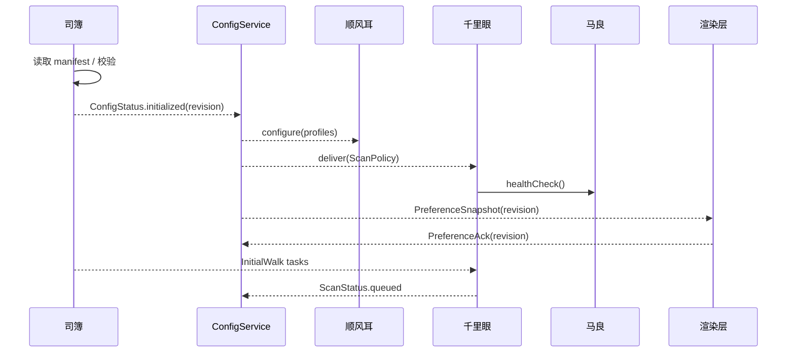
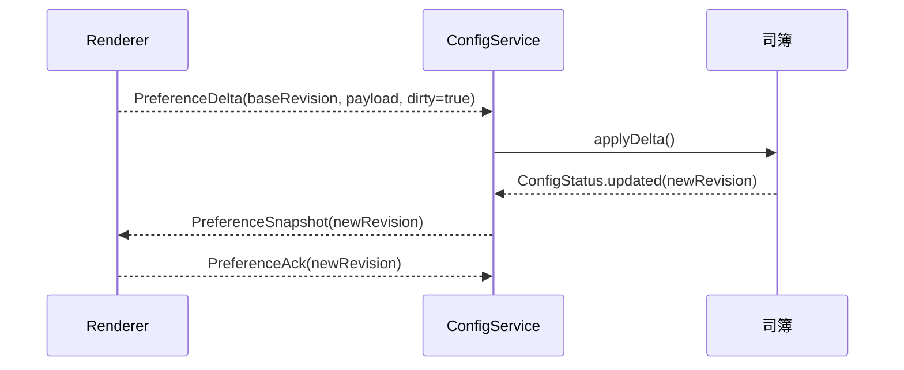
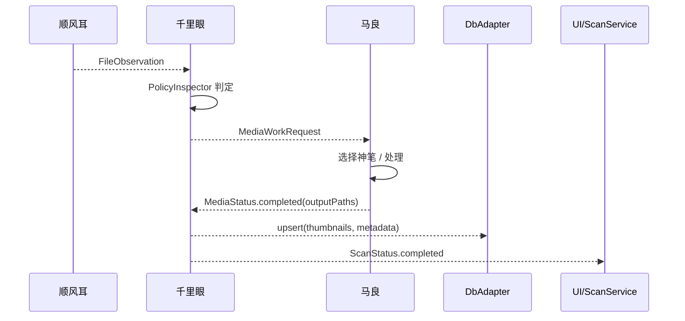

# RFC 0035: 天枢·顺风耳·千里眼·司簿·马良五引擎编排架构

- **RFC编号**: 0035
- **标题**: 天枢·顺风耳·千里眼·司簿·马良五引擎编排架构
- **作者**: 李鹏
- **开始日期**: 2024-06-07
- **状态**: ✅ **已完成**
- **完成日期**: 2024-06-07
- **类型**: 架构

## 摘要

在主进程建立五大核心引擎协同系统：天枢（Tianshu）编排引擎、顺风耳（Shunfenger）监听引擎、千里眼（Qianliyan）扫描引擎、司簿（Sibu）配置引擎、马良（MaLiang）图像处理引擎，通过太乙（Taiyi）服务层桥接和YAML工作流元数据驱动，实现用户意图到具体执行的完整链路。天枢作为决策大脑，理解用户意图并编排工作流；太乙层提供标准化服务接口，隔离引擎实现细节；四大引擎各司其职，保持环境无关。每个监控根目录维持独立的 `.photasa.json` 就地存储，由司簿按需加载并缓存。整个系统元数据驱动，高度可配置和可扩展。

## 动机

- 当前扫描与配置逻辑散落于 `ScanService`、`ConfigService`、`WatchService` 多处，数据契约不统一，导致监听-扫描-配置之间的职责边界模糊。
- **缺少决策大脑**：谁来决定什么时候调用哪个引擎？复杂的业务流程如何协调？用户操作需要调用多个服务才能完成。
- **UI耦合度高**：UI层需要了解底层引擎细节，直接调用多个服务完成一个用户操作，违背了关注点分离原则。
- **业务逻辑分散**：工作流逻辑散落在各个服务和UI组件中，难以维护和测试，缺少统一的错误处理和状态管理。
- RFC 0032、0033 将顺风耳与千里眼分别抽象为可重用引擎，但缺少跨引擎协作的整体设计与配置中心，难以保障后续扩展（智能复扫、可观察性、持久化策略等）。
- RFC 0031 引入马良统一图像处理引擎，目前扫描、预览与缩略图生成逻辑仍散落在千里眼及若干工具函数中，需要战略性整合以充分发挥马良的能力并保持纯粹的扫描调度职责。
- Watch 与 Scan 之间的命令、策略、缓存共享缺乏明确协议，导致重复扫描、冗余缩略图生成、数据库状态漂移等问题。
- 配置项存储在 `photasa.json`、`photasa-folder.json` 等多个 JSON，缺乏版本管理与互斥校验，影响用户体验和调试效率。
- 渲染进程的 `PreferenceStore` 仍保存 `scanningFolder` 状态并持久化于 IndexedDB，使得监控根目录配置存在双写与一致性问题，需要由司簿统一治理并向渲染层同步。

## 详细设计

### 完整架构层次

```
┌─────────────────────────────────────────┐
│         UI Layer (Renderer)             │
│         用户界面层                       │
└─────────────────────────────────────────┘
              ↕ IPC Contract (意图驱动)
┌─────────────────────────────────────────┐
│    🌟 天枢层 (Tianshu Engine)           │
│         决策编排层                       │
│    "北斗指引，统筹全局"                 │
├─────────────────────────────────────────┤
│    📜 太乙层 (Taiyi Services)       │
│         服务桥接层                       │
│    "承上启下，宣达指令"                 │
├─────────────────────────────────────────┤
│         引擎层 (Engines)                │
│  👂顺风耳 | 👁千里眼 | 📚司簿 | 🎨马良  │
│    "各司其职，精专其能"                 │
└─────────────────────────────────────────┘
```

### 层次职责一览

| 层次       | 名称     | 核心职责                                                     | 关键特性                                                                        |
| ---------- | -------- | ------------------------------------------------------------ | ------------------------------------------------------------------------------- |
| **天枢**   | 编排引擎 | 用户意图理解、工作流编排、决策调度、状态管理                 | YAML工作流驱动、统一错误处理、进度追踪                                          |
| **太乙**   | 服务桥接 | 服务包装、协议转换、标准化接口、错误包装                     | 统一服务接口、引擎解耦、指标收集                                                |
| **顺风耳** | 文件监听 | chokidar 生命周期管理、事件归一化、状态上报                  | `configure(profileSet)`, `pause(id)`, `resume(id)`，事件总线：`FileObservation` |
| **千里眼** | 文件扫描 | 扫描计划、任务调度、数据库同步、媒体任务编排                 | `enqueue(task)`, `planScan(observation)`，支持任务查询/取消                     |
| **司簿**   | 配置管理 | 配置加载、合并、校验、持久化、策略下发、PreferenceStore 同步 | `load()`, `save(patch)`, `resolveProfile(profileId)`，事件总线：`ConfigStatus`  |
| **马良**   | 图像处理 | 图像/视频格式检测、缩略图与预览生成、媒体转换                | `paint(request)`, `selectBrush(path)`, `registerBrush(brush)`                   |

**核心原则**：

- **引擎层**保持环境无关，仅依赖注入的适配器（日志、文件系统、数据库、缩略图/预览生成器、IPC 桥接器）
- **太乙层**提供标准化服务接口，隔离引擎实现细节
- **天枢层**元数据驱动，通过YAML工作流配置业务逻辑
- **UI层**只表达用户意图，不关心具体实现

### 模块布局

```
src/main/
  tianshu/               // 天枢编排引擎
    core/
      TianshuEngine.ts   // 主引擎类
      WorkflowLoader.ts  // 工作流加载器
    orchestration/
      WorkflowOrchestrator.ts  // 工作流编排器（依赖IStepExecutor接口）
      VariableResolver.ts      // 变量解析器
    scheduling/
      TaskScheduler.ts   // 任务调度器
      WorkerPool.ts      // 工作线程池
    types/
      workflow.ts        // 工作流类型定义
      command.ts         // 命令和响应类型
    workflows/           // YAML工作流定义目录
      folder/
        add-folder.yaml
        remove-folder.yaml
      photo/
        organize.yaml
        search.yaml
      system/
        settings.yaml
        maintenance.yaml

  taiyi/            // 太乙服务层
    core/
      TaiyiService.ts      // 服务基类
      TaiyiRegistry.ts     // 服务注册中心
    services/
      SibuTaiyi.ts         // 司簿太乙使
      ShunfengerTaiyi.ts   // 顺风耳太乙使
      QianliyanTaiyi.ts    // 千里眼太乙使
      MaliangTaiyi.ts      // 马良太乙使
    types/
      capability.ts            // 能力定义
      error.ts                 // 错误类型

src/engines/
  shunfenger/      // RFC 0033 已定义
  qianliyan/       // RFC 0032 已定义
  sibu/            // 配置引擎（已重新设计）
    core/
      SibuEngine.ts
    services/
      ManifestStore.ts
      StreamManifestReader.ts
      ManifestCache.ts
    support/
      manifest-normalizer.ts
    types/
      manifests.ts     // 新增：正确的数据契约
  maliang/         // RFC 0031 已定义，提供媒体处理能力
  common/          // 五引擎共享契约、样例与测试基架
    contracts.ts         // 统一的数据契约
    test-harness.ts      // 测试基架
    error-types.ts       // 通用错误类型
```

**架构特点**：

- **天枢层**：决策大脑，通过YAML配置驱动工作流
- **太乙层**：服务桥接，提供统一接口，隔离引擎细节
- **引擎层**：专业执行，环境无关，各司其职
- **工作流配置**：元数据驱动，易于维护和扩展

### 数据契约

#### UI与天枢通信契约

```typescript
// 用户意图命令
interface UICommand {
    id: string; // 命令唯一标识
    intent: UserIntent; // 用户意图
    context: Record<string, any>; // 意图上下文
    priority?: "low" | "normal" | "high";
    timestamp: number;
}

// 用户意图枚举
enum UserIntent {
    FOLDER_ADD = "folder.add",
    FOLDER_REMOVE = "folder.remove",
    FOLDER_REFRESH = "folder.refresh",
    PHOTO_VIEW = "photo.view",
    PHOTO_ORGANIZE = "photo.organize",
    PHOTO_SEARCH = "photo.search",
    SYSTEM_SETTINGS = "system.settings",
    MAINTENANCE_CLEAN = "maintenance.clean",
}

// 天枢响应
interface TianshuResponse {
    commandId: string;
    intent: UserIntent;
    status: "accepted" | "queued" | "processing" | "completed" | "failed" | "cancelled";
    result?: any;
    error?: TianshuError;
    metrics?: ExecutionMetrics;
}

// 进度推送
interface ProgressUpdate {
    commandId: string;
    stepId: string;
    stepName: string;
    progress: number; // 0-100
    message?: string;
    estimatedTime?: number;
}
```

#### 工作流定义契约

```typescript
// 工作流定义（对应YAML）
interface WorkflowDefinition {
    metadata: {
        name: string;
        version: string;
        description: string;
    };
    trigger: {
        intent: UserIntent;
    };
    inputs: InputDefinition[];
    steps: StepDefinition[];
    outputs?: OutputDefinition[];
    compensation?: CompensationDefinition[];
}

// 步骤定义
interface StepDefinition {
    id: string;
    name: string;
    service: string; // 太乙服务名称
    action: string; // 服务动作
    input: any; // 输入映射（支持变量引用）
    output?: string; // 输出变量名
    when?: string; // 执行条件
    parallel?: boolean; // 是否并行执行
    onError?: "fail" | "skip" | "retry";
}

// 太乙服务能力定义
interface ServiceCapability {
    action: string;
    description: string;
    params: ParameterDefinition[];
}
```

#### FileObservation（来自顺风耳）

沿用 RFC 0033 定义，新增 `profileRevision` 字段表示观测时使用的配置版本，用于 scan 和 config 对齐。

```ts
interface FileObservation {
    id: string;
    path: string;
    kind: "add" | "change" | "delete" | "addDir" | "deleteDir" | "move";
    isDirectory: boolean;
    isMediaFile: boolean;
    detectedAt: number;
    sourceProfileId: string;
    profileRevision: string;
    metadata?: {
        size?: number;
        mtimeMs?: number;
        pairedWith?: string;
        rawArgs?: any[];
    };
}
```

#### ScanTask（千里眼内部统一任务）

```ts
interface ScanTask {
    id: string; // 哈希(path + type + revision)
    type: "InitialWalk" | "IncrementalFolder" | "FileRefresh" | "DeleteCleanup" | "MoveRewrite";
    targetPath: string;
    profileId: string;
    profileRevision: string;
    requestedBy: "manual" | "watch" | "system";
    priority: "user" | "background";
    hints?: {
        forceRegenerate?: boolean;
        thumbnailSize?: number;
        skipDbTouch?: boolean;
    };
    createdAt: number;
}
```

#### ScanPolicy（由司簿下发）

```ts
interface ScanPolicy {
    id: string;
    version: string;
    smartRefresh: {
        mtimeToleranceMs: number;
        hashThreshold?: number;
        thumbnailTtlMs: number;
        previewTtlMs: number;
    };
    queue: {
        maxParallel: number;
        backlogSoftLimit: number;
        retryLimit: number;
        backoffMs: number;
    };
    moveHandling: {
        crossProfileAsDelete: boolean;
        relocateAssets: boolean;
    };
    persistence: {
        dbPath: string;
        assetRoot: string;
    };
}
```

#### MediaWorkRequest（天枢协调的媒体任务）

**重要修正**：MediaWorkRequest不应是千里眼直接委托马良，而应通过天枢工作流编排。

```ts
interface MediaWorkRequest {
    id: string; // 派生自工作流步骤ID
    sourcePath: string;
    outputKind: "thumbnail" | "preview" | "metadata" | "transcode";
    options?: {
        size?: { width: number; height: number };
        quality?: number;
        format?: string;
    };
    profileId: string;
    profileRevision: string;
    priority: "user" | "background";
    requestedBy: string; // 工作流ID而非引擎名称
    workflowContext?: any; // 工作流上下文数据
}
```

**正确的协调模式**：

```yaml
# 媒体处理工作流示例
steps:
    - id: "scan_media"
      engine: "qianliyan"
      operation: "scanFolder"

    - id: "process_media"
      engine: "maliang"
      operation: "batchProcess"
      dependencies: ["scan_media"] # 依赖千里眼扫描结果
      params:
          files: "${steps.scan_media.result.mediaFiles}"
          operations: ["thumbnail", "metadata"]
```

### 智能扫描决策机制

#### 基于photasa-folder状态的智能决策

天枢提供智能扫描工作流，基于文件夹manifest状态决定扫描策略：

```yaml
# workflows/folder/smart_scan.yml
name: "smart_scan"
description: "基于photasa-folder状态的智能扫描决策"
trigger: "SMART_SCAN_FOLDER"

steps:
    - id: "load_folder_state"
      engine: "sibu"
      operation: "loadFolderManifest"
      params:
          folderPath: "${payload.folderPath}"

    - id: "analyze_changes"
      engine: "qianliyan"
      operation: "analyzeFolderChanges"
      dependencies: ["load_folder_state"]
      params:
          folderPath: "${payload.folderPath}"
          lastScanTime: "${steps.load_folder_state.result.stats.lastFullScanAt}"
          knownFileCount: "${steps.load_folder_state.result.stats.fileCount}"

    - id: "decide_scan_strategy"
      engine: "tianshu"
      operation: "decideScanStrategy"
      dependencies: ["load_folder_state", "analyze_changes"]
      params:
          folderState: "${steps.load_folder_state.result}"
          changeIndicators: "${steps.analyze_changes.result}"

    - id: "execute_scan"
      engine: "qianliyan"
      operation: "executeScan"
      dependencies: ["decide_scan_strategy"]
      condition: "${steps.decide_scan_strategy.result.scanType != 'skip'}"
      params:
          scanType: "${steps.decide_scan_strategy.result.scanType}"
          folderPath: "${payload.folderPath}"
```

#### 智能决策类型定义

```typescript
interface SmartScanDecision {
    scanType: "full" | "incremental" | "skip";
    reason: string;
    confidence: number; // 0-1 决策置信度
    triggeredBy: string[];
    estimatedDuration?: number;
}

interface ChangeIndicator {
    type:
        | "folder_mtime_changed"
        | "file_count_changed"
        | "photasa_folder_changed"
        | "new_subfolders";
    confidence: number;
    details: any;
}
```

#### 天枢智能决策算法

```typescript
class TianshuScanDecisionEngine {
    async decideScanStrategy(params: {
        folderState: FolderManifest;
        changeIndicators: ChangeIndicator[];
    }): Promise<SmartScanDecision> {
        // 1. 检查强制全扫描条件
        const forceFullScan = this.checkForceFullScan(folderState);
        if (forceFullScan.required) {
            return {
                scanType: "full",
                reason: forceFullScan.reason,
                confidence: 1.0,
                triggeredBy: forceFullScan.triggers,
            };
        }

        // 2. 分析变更指标
        const changeAnalysis = this.analyzeChangeIndicators(changeIndicators);

        // 3. 智能决策
        if (changeAnalysis.totalChanges === 0) {
            return {
                scanType: "skip",
                reason: "无检测到变化",
                confidence: 0.95,
                triggeredBy: ["no_changes"],
            };
        }

        if (changeAnalysis.totalChanges <= 10) {
            return {
                scanType: "incremental",
                reason: `检测到${changeAnalysis.totalChanges}个文件变化，适合增量扫描`,
                confidence: changeAnalysis.confidenceScore,
                triggeredBy: Array.from(changeAnalysis.changeTypes.keys()),
            };
        }

        return {
            scanType: "full",
            reason: "检测到大量变化，建议全扫描",
            confidence: changeAnalysis.confidenceScore,
            triggeredBy: Array.from(changeAnalysis.changeTypes.keys()),
        };
    }
}
```

#### ConfigManifest（司簿持久化）

```ts
interface ConfigManifest {
    revision: string;
    updatedAt: number;
    profiles: WatchProfile[];
    scanPolicy: ScanPolicy;
    scanningFoldersSnapshot?: string[]; // renderer PreferenceStore mirror
    syncState?: {
        provider: "none" | "icloud" | "webdav" | "s3" | "custom";
        endpoint?: string;
        accountId?: string;
        lastSyncedAt?: number;
        lastRemoteRevision?: string;
        status: "idle" | "syncing" | "error";
        errorCode?: string;
    };
    overrides?: Record<string, any>; // feature flags, 实验字段
    history?: Array<{
        revision: string;
        actor: string;
        timestamp: number;
        summary: string;
    }>;
}
```

```ts
interface FolderManifestIndex {
    folderId: string; // 稳定 ID（可用路径 hash）
    rootPath: string; // 绝对路径
    manifestPath: string; // 对应 `<root>/.photasa.json`
    lastSeenRevision: string; // 最近一次同步的 folder manifest revision
    mediaStats?: {
        assetCount: number;
        lastScannedAt?: number;
    };
}
```

> 说明：`FolderManifestIndex` 为司簿运行期维护的内存视图，用于快速定位各根目录下的独立 manifest，默认不持久化到全局文件。

#### FolderManifest（监控根内局部状态）

每个监控根目录直接在根路径下存放 `.photasa.json`，记录该根的扫描数据库、缩略图索引等局部状态；当未来切换 protobuf 时，可在同级创建隐藏文件夹 `.photasa/` 存放 `.photasa.bin` 与其他缓存，保持 JSON 与二进制共存。

```ts
interface FolderManifest {
    folderId: string;
    revision: string;
    profileRevision: string;
    rootPath: string;
    mediaIndex: Array<{
        relativePath: string;
        checksum?: string;
        thumbnailPath?: string;
        previewPath?: string;
        lastModified: number;
        mediaType: "photo" | "video" | "other";
    }>;
    subfolders: string[];
    stats: {
        fileCount: number;
        folderCount: number;
        lastFullScanAt?: number;
    };
    version: number; // schema version for folder manifest
}
```

司簿只负责根据 watch profile 解析根路径、加载对应 `.photasa.json`（或未来 `.photasa/.photasa.bin`），并向千里眼/马良提供局部数据上下文；所有媒体索引与扫描结果都保存在各自目录中，无需集中写入主配置。

#### PreferenceSnapshot（渲染层镜像）

```ts
interface PreferenceSnapshot {
    revision: string; // 对齐司簿 revision
    scanningFolders: string[]; // UI 展示与选择用
    lastSyncedAt: number;
    dirty?: boolean; // 渲染层本地改动尚未上送
}
```

### 司簿远程同步与权限策略

**目标**

- 允许用户在多设备间共享监控目录、扫描策略与偏好配置。
- 提供一键备份/恢复能力，确保本地配置损坏时可回滚。
- 保持主进程离线可用，网络不可用时继续使用本地 manifest 并在恢复后增量同步。

**架构概览**

- 司簿新增可插拔 `SyncAdapter`，默认禁用 (`provider = "none"`)。
- 支持的 provider 通过依赖注入提供，包括 iCloud/CloudKit、WebDAV、S3 兼容存储、自建 HTTPS API 等。
- `SyncAdapter` 负责上传/下载 `ConfigManifest` 快照与差异增量，司簿只依赖抽象接口：
    ```ts
    interface SyncAdapter {
        push(manifest: ConfigManifest): Promise<SyncResult>;
        pull(sinceRevision?: string): Promise<SyncPayload | null>;
        resolveConflict(local: ConfigManifest, remote: ConfigManifest): Promise<ResolvedManifest>;
        getPermissions(): Promise<SyncPermissions>;
    }
    ```

**冲突处理**

1. 使用 `revision` + `lastRemoteRevision` 进行乐观锁：
    - `push` 时携带 `lastRemoteRevision`，若远端版本不同则进入冲突流程。
2. 冲突决策流程：
    - `SyncAdapter.resolveConflict` 默认策略：对 `profiles` 与 `scanningFoldersSnapshot` 做集合合并（并集），对策略字段取最新修改时间较晚者。
    - 产生冲突时司簿生成 `ConfigStatus.conflict`，包含差异摘要，交给 UI 选择「保留本地 / 采用远程 / 手动合并」。
    - UI 选择后将合并结果反馈司簿，生成新 revision 并再次 `push`。
3. 记录冲突历史：保留冲突 manifest（`conflicts/` 目录）以便追溯。

**权限与安全**

- `SyncAdapter.getPermissions()` 返回当前登录用户信息、授权范围（读/写/管理员）。
- 对于云服务需实现 OAuth/OIDC 或 API Token 流程；ConfigService 负责触发登录 UI，司簿仅保存 `accountId` 与 `refreshToken`（加密存储）。
- 所有远程数据以 AES-256 本地加密后再上传，密钥存于系统钥匙串或安全存储。
- 在多用户环境（共享设备）下，ConfigService 根据操作系统用户 ID 区分配置目录，避免越权访问。

**同步策略**

- 定时同步：默认每 10 分钟或配置变更后 5 秒内触发一次 `push`。
- 启动时执行 `pull`，将远程最新 manifest 合并到本地，再广播 `ConfigStatus.updated`。
- 网络中断时记录 `pendingPushes`，恢复后按顺序执行。
- Sync 状态写入 `syncState.status`，允许 UI 展示进度、错误码。

**审计与日志**

- 每次远程同步在 `history-log.ts` 中增加记录（`source = remote-sync`）。
- 关键事件（授权变更、冲突）通过 ConfigService 推送到 LogViewer，并可触发系统通知。

**禁用与降级**

- 用户可在设置中关闭远程同步，司簿将 `provider` 设为 `none` 并清理授权令牌。
- 若连续多次 `push`/`pull` 失败，自动降级为本地模式，并提示用户手动检查网络或凭据。

### 司簿本地持久化格式

**现状问题**

- Manifest 目前以 JSON 序列化，随着 profile、history、scanningFolders 数据增长会达到数 MB；写入为整文件替换，易阻塞主进程事件循环。
- JSON 缺乏结构约束，出现异常字段时需要额外校验逻辑；同时字段名冗长导致磁盘占用偏高。

**短期策略（引擎整合阶段）**

- 继续使用 JSON，确保司簿功能在现有存储基础上快速落地。
- 优化写入：采用临时文件 + 原子重命名、分段保存 history/metrics，减少长时间锁定。
- 利用现有 UI 的数据库详情页提供 manifest 查看/导出能力（无需额外 CLI）。

**后续优化计划（可选）**

- 评估引入 proto3/其它二进制格式：
    - 为 `FolderManifest`、`WatchProfile` 等定义 schema，并通过 `ts-proto`/`protobufjs` 生成访问器。
    - 在每个监控根目录下建立 `.photasa/` 文件夹存放 `.photasa.bin` 与增量缓存，先并行输出再逐步切换默认读取路径，保留根级 `.photasa.json` 作为回退。
    - 保留 JSON 导出命令与调试工具，确保可回退。
- 根据需要拆分历史日志为独立文件（如 `history.log.json` 或未来的二进制日志），减少主 manifest 大小。

此阶段重点：**先让四引擎协同工作**，再循序渐进升级存储格式，避免过早优化阻碍集成进度。

### 司簿引擎实现模式（参考马良）

- **引擎外观**：仅通过 `src/engines/sibu/index.ts` 暴露 `SibuEngine` 类及类型定义，对外接口包含 `loadManifest`, `loadManifestForTarget`, `writeManifest`, `clearCache`, `primeCache` 等，保持与马良一致的统一入口风格，并禁止外泄内部实现细节。
- **内部组件**：
    - `core/SibuEngine.ts`：Orchestrator，组合内部服务并管理缓存生命周期；
    - `services/ManifestStore.ts`：负责路径解析、读写与默认文件创建；
    - `services/ManifestCache.ts`：负责 TTL 缓存策略；
    - `services/StreamManifestReader.ts`：封装 stream-json 流式解析；
    - `support/manifest-normalizer.ts`：负责默认结构与字段补全；
    - 后续可增补 stats/metrics 子模块，对标马良的 `ErrorManager`、`FormatDetector` 等分层职责。
- **依赖注入**：构造时仅接受 cache/store 配置，不自动创建单例或耦合 worker；由托管层（ConfigService、worker 等）决定如何实例化/复用。
- **与服务交互**：服务层显式持有 `SibuEngine` 实例，通过事件/IPC 调用引擎；引擎不会内置 `getInstance` 等宿主逻辑，保持可测试、可替换。
- **测试策略**：公共契约与样例存于 `src/engines/common/`，Vitest 针对引擎方法与读取工具进行单元测试，保持与马良相同的模块划分与覆盖率要求。

> 目标是重用马良“引擎外观 + 内部组件 + 服务编排”模式，让司簿既保持独立可测试，又能被不同消费方式（主进程/worker/远程服务）复用。

### 太乙服务层详细设计（基于现有Service Registry）

#### 现有@Service装饰器已完备

**现状分析**：

- ✅ `src/main/services/decorators/service-decorators.ts` 已实现完整的@Service装饰器
- ✅ 支持优先级、依赖管理、重试机制、健康检查
- ✅ ServiceRegistry已实现自动发现和注册装饰器服务
- ✅ 支持生命周期管理（initialize/shutdown）

**太乙层定位**：

- 太乙层不是新的架构层，而是对现有Service Registry的语义解释
- 现有的@Service装饰器服务即为"太乙使"
- 司簿引擎通过ConfigService（司簿太乙使）暴露能力

#### 司簿太乙使实现策略

```typescript
// 现有ConfigService即为司簿太乙使
@Service({
    name: "config",
    priority: ServicePriority.Critical,
    dependencies: ["auto-migration"],
})
export class ConfigService implements IService {
    private sibuEngine: SibuEngine;

    // 太乙使职责：暴露司簿引擎能力
    async validatePath(path: string) {
        return await this.sibuEngine.validatePath(path);
    }

    async loadConfigManifest(configPath: string) {
        return await this.sibuEngine.loadConfigManifest(configPath, this.logger);
    }

    async loadFolderManifest(folderPath: string) {
        return await this.sibuEngine.loadFolderManifest(folderPath, this.logger);
    }

    // 现有IPC方法保持不变，内部使用司簿引擎
}
```

#### 原RFC太乙层设计的调整

**调整前（RFC设计）**：

- 创建新的太乙层架构
- 实现专门的@Service装饰器增强
- 创建独立的TaiyiService基类

**调整后（基于现实）**：

- 利用现有Service Registry架构
- 现有@Service装饰器已满足需求
- ConfigService等现有服务即为太乙使
- 无需创建新的架构层

#### 状态报告能力

现有ServiceRegistry已提供：

- `getStatus(name: string)` - 获取服务状态
- `getAllStatus()` - 获取所有服务状态
- `ServiceEvent` 事件系统 - 服务状态变更通知
- 健康检查机制（规划中）

**状态收集策略**：

```typescript
// 利用现有ServiceRegistry收集状态
class StatusReportingService {
    collectAllServiceStatus(): Map<string, ServiceStatus> {
        return this.serviceRegistry.getAllStatus();
    }

    // 推送状态到UI
    pushStatusToUI(status: Map<string, ServiceStatus>) {
        this.mainWindow.webContents.send("service:status-update", status);
    }
}
```

#### 太乙注册中心

```typescript
// src/main/taiyi/core/TaiyiRegistry.ts
export class TaiyiRegistry {
    private services = new Map<string, TaiyiService>();

    register(name: string, service: TaiyiService): void {
        this.services.set(name, service);
        console.log(`太乙使已注册: ${service.getName()} (${name})`);
    }

    // 供天枢调用的统一接口
    async execute(serviceName: string, action: string, params: any): Promise<any> {
        const service = this.services.get(serviceName);
        if (!service) {
            throw new Error(`未找到太乙使: ${serviceName}`);
        }
        return await service.execute(action, params);
    }

    // 获取所有服务能力
    getAllCapabilities(): Record<string, ServiceCapability[]> {
        const result: Record<string, ServiceCapability[]> = {};
        for (const [name, service] of this.services) {
            result[name] = service.getCapabilities();
        }
        return result;
    }
}
```

### 天枢与太乙的交互模式

```typescript
// 天枢通过太乙层调用引擎
class TianshuEngine {
    private taiyi: TaiyiRegistry;

    async executeWorkflowStep(step: WorkflowStep): Promise<any> {
        // 天枢不直接调用引擎，而是通过太乙层
        return await this.taiyi.execute(
            step.service, // 例如: 'sibu'
            step.action, // 例如: 'validatePath'
            step.input, // 参数
        );
    }
}
```

### 引擎间通信通道

- **Command Bus**（主进程内存队列）：
    - `WatchCommand`（司簿→顺风耳）：`configure`, `pause`, `resume`, `flush`, `stop`。
    - `ScanCommand`（司簿/顺风耳/服务层→千里眼）：封装为 `ScanTask` 或复用现有 API。
    - `MediaWorkRequest`（千里眼→马良）：通过轻量队列，支持优先级与取消。
- **Status Bus**（基于事件发射器/Observable）：
    - `WatcherStatus`（顺风耳→服务层/司簿）。
    - `ScanStatus`（千里眼→服务层/司簿/马良可选订阅，用于反馈依赖）。
    - `MediaStatus`（马良→千里眼/服务层）。
    - `ConfigStatus`（司簿→全员），包含 `initialized`、`updated`、`preferenceSynced`、`error`。
- **Preference Channel**（ConfigService ↔ Renderer）：
    - 主动推送：`ConfigService` 将最新 `PreferenceSnapshot` 以 IPC 消息发送至 Renderer。
    - 回执：Renderer 写入 IndexedDB 成功后回发 `PreferenceAck`，如有 UI 本地编辑则发送 `PreferenceDelta`（含 `dirty` 标记和 revision）。

所有通道必须带上 `revision` 与 `source` 字段以保证可追踪性。主进程内的事件总线统一采用 TypeScript 泛型约束，防止跨模块误用。

### 工作流使用规则

#### 何时使用工作流

**使用工作流的场景**：

- 需要协调多个引擎的操作
- 操作有明确的依赖关系和执行顺序
- 需要跨引擎的数据传递
- 复杂的业务流程需要编排

**不使用工作流的场景**：

- 单一引擎内部操作（如配置迁移、文件扫描等）
- 引擎的初始化和基础功能
- 简单的CRUD操作
- 不涉及引擎间协调的操作

#### 示例对比

**❌ 错误：为单引擎操作创建工作流**

```yaml
# 这是错误的 - 配置迁移只涉及司簿引擎
name: "config_migration"
steps:
    - id: "migrate"
      engine: "sibu"
      operation: "migrateConfig"
```

**✅ 正确：单引擎操作直接调用**

```typescript
// 配置迁移直接在司簿引擎内处理
const sibuEngine = new SibuEngine();
await sibuEngine.performAutoMigration();
```

**✅ 正确：多引擎协调使用工作流**

```yaml
# 添加文件夹需要协调多个引擎
name: "add_folder"
steps:
    - id: "validate_path"
      engine: "sibu"
      operation: "validatePath"
    - id: "start_watching"
      engine: "shunfenger"
      operation: "startWatcher"
      dependencies: ["validate_path"]
    - id: "initial_scan"
      engine: "qianliyan"
      operation: "scanFolder"
      dependencies: ["start_watching"]
    - id: "process_media"
      engine: "maliang"
      operation: "batchProcess"
      dependencies: ["initial_scan"]
```

### YAML工作流示例

#### 添加文件夹工作流

```yaml
# workflows/folder/add-folder.yaml
metadata:
    name: add_folder_workflow
    version: 1.0.0
    description: 添加文件夹到监控列表并执行初始扫描

trigger:
    intent: folder.add

inputs:
    - name: folderPath
      type: string
      required: true
    - name: recursive
      type: boolean
      default: true
    - name: autoOrganize
      type: boolean
      default: false

steps:
    # Step 1: 验证路径
    - id: validate_path
      name: 验证文件夹路径
      service: sibu
      action: validatePath
      input:
          path: ${inputs.folderPath}
      output: validationResult
      onError: fail

    # Step 2: 创建监控配置
    - id: create_profile
      name: 创建监控配置
      service: sibu
      action: createWatchProfile
      input:
          path: ${inputs.folderPath}
          recursive: ${inputs.recursive}
          enabled: true
      output: profile

    # Step 3: 启动文件监听
    - id: start_watching
      name: 启动监听
      service: shunfenger
      action: startWatcher
      input:
          profile: ${profile}
      output: watcherId

    # Step 4: 执行初始扫描（可并行）
    - id: initial_scan
      name: 初始扫描
      service: qianliyan
      action: scanFolder
      input:
          path: ${inputs.folderPath}
          profile: ${profile}
          deep: ${inputs.recursive}
      output: scanResult
      parallel: true

    # Step 5: 批量生成缩略图
    - id: generate_thumbnails
      name: 生成缩略图
      service: maliang
      action: batchProcess
      input:
          items: ${scanResult.mediaFiles}
          operation: thumbnail
          priority: background
      output: thumbnails
      when: ${scanResult.mediaFiles.length > 0}
      parallel: true

    # Step 6: 更新索引
    - id: update_index
      name: 更新索引
      service: sibu
      action: updateFolderManifest
      input:
          folderId: ${profile.id}
          mediaIndex: ${scanResult.mediaFiles}
          thumbnails: ${thumbnails}
      output: indexResult

outputs:
    folderId: ${profile.id}
    fileCount: ${scanResult.fileCount}
    mediaCount: ${scanResult.mediaFiles.length}
    thumbnailCount: ${thumbnails.length}

compensation:
    # 错误补偿流程
    - when: ${step.id == 'start_watching'}
      action:
          service: shunfenger
          method: stopWatcher
          input:
              watcherId: ${watcherId}

    - when: ${step.id == 'create_profile'}
      action:
          service: sibu
          method: deleteProfile
          input:
              profileId: ${profile.id}
```

### 核心工作流执行

下列流程以时序方式描述关键交互。每一步都要求记录事件日志（包含 revision、profileId、taskId）便于追踪。

1. **启动阶段**
    1. 司簿加载 manifest，执行 schema 校验与互斥检查：
        - 若校验失败，广播 `ConfigStatus.error`，阻断后续流程并提示用户修复。
        - 校验通过后生成新的 `ConfigRevision`（UUID+时间戳），持久化并发出 `ConfigStatus.initialized`。
    2. 顺风耳收到 `ConfigStatus.initialized`：
        - 调用 `configure(profiles)` 创建/恢复 watcher，保持 profileId→watcher 映射。
        - 对于 paused profile，记录状态但不立即启动。
    3. 千里眼拉取最新 `ScanPolicy` 与 profile 列表：
        - 初始化队列、策略缓存、重试计数器。
        - 调用健康检查验证马良引擎可用，并在需要时执行神笔预热（如 HEIF WASM 初始化）。
    4. ConfigService 将 `profiles` 与 `scanningFoldersSnapshot` 封装为 `PreferenceSnapshot` 通过 IPC 发送给渲染进程；Renderer 写入 IndexedDB 后回传 `PreferenceAck`。
    5. 司簿根据 manifest 中的 `autoStart` 标记及数据库状态，为千里眼投递 `InitialWalk` 任务（若 DB 缺失或 revision 变化），并记录初始化任务清单以支持故障恢复。

2. **新增/变更文件**
    1. 顺风耳捕获 `add/change`，将 chokidar payload 归一化为 `FileObservation`，附带 `profileRevision` 与源 profileId。
    2. 千里眼通过 `planScan(observation)` 进行策略判定：
        - `PolicyInspector` 查询数据库指纹、缩略图 TTL、正在执行的任务，决定是生成 `FileRefresh`、`IncrementalFolder` 还是直接跳过。
        - 若跳过，则标记 `ScanStatus.skipped` 并停止流程。
    3. 对于需要处理的文件，千里眼创建/更新 `ScanTask` 并推入队列，状态变更为 `pending`→`running`：
        - 执行前再次确认同一路径是否已有活跃任务，避免重复。
    4. 执行阶段：
        - 若任务包含媒体操作，千里眼生成 `MediaWorkRequest`，通过媒体队列发送给马良。
        - 马良选择合适神笔（`selectBrush`），生成缩略图/预览/元数据，期间上报 `MediaStatus.progress`。
        - 马良完成后返回输出文件路径、体积、耗时等指标；若失败，根据策略决定重试或降级（FallbackBrush）。
    5. 千里眼汇总结果：
        - 调用 `DbAdapter` 更新 `photasa.json`、`photasa-folder.json` 或未来数据库。
        - 将马良产物路径与指纹写入数据库及任务记录，发出 `ScanStatus.completed`。
        - 若发生错误，发出 `ScanStatus.failed`，并根据策略将任务回退至队列或提示 UI。

3. **新增目录**
    1. 顺风耳输出 `addDir` 的 `FileObservation`。
    2. 千里眼生成 `IncrementalFolder` 任务并进入目录遍历：
        - 先读取缓存中的目录指纹，决定是全量重扫还是部分增量。
        - 遍历时对每个子项执行与步骤 2 相同的策略判定。
    3. 对于需要批量生成缩略图的目录：
        - 千里眼将同批次文件合并为 `MediaWorkRequest` 列表，控制单批次大小与并行度。
        - 马良按序处理并通过流式回调减少磁盘抖动，完成后返回批次摘要供千里眼更新数据库。

4. **删除/移动**
    1. `delete` 事件：千里眼生成 `DeleteCleanup` 任务，步骤如下：
        - 清理数据库记录、索引与统计。
        - 通知马良删除对应缩略图/预览缓存（若存在批量，可集中处理）。
        - 若数据库中存在引用（收藏、专辑），交由上层服务触发后续清理。
    2. `move` 事件：
        - 顺风耳执行 rename 配对或直接提供 `move` observation，千里眼判断是否跨 profile。
        - 跨 profile 或移出监控范围 → 视为 delete + add。
        - 同 profile 移动：
            - 更新数据库路径，保留指纹。
            - 如果策略允许 `relocateAssets=true`，协同马良移动/重命名缩略图目录；否则标记旧缓存为脏并在下次访问时重建。

5. **配置变更**
    1. 用户在 UI 提交修改，渲染层生成 `PreferenceDelta`（携带 `dirty=true`、基线 revision）发送给 ConfigService。
    2. 司簿接收 delta，执行：
        - 合并 patch，重新校验 profile 冲突/路径合法性。
        - 写入 manifest，生成新 revision。
    3. 顺风耳比对新旧 profile：
        - 新增 profile → 创建 watcher 并在 ready 后发出 `WatcherStatus.ready`。
        - 删除 profile → 停止 watcher，并通知千里眼/马良清理残余任务。
        - 修改 profile → 执行 `pause`→`resume` 以应用 ignore/递归策略。
    4. 千里眼根据差异更新队列：
        - 为新增/修改目录投递 `InitialWalk` 或 `IncrementalFolder` 任务。
        - 对被移除目录取消待执行任务并标记数据库条目为 `inactive`。
    5. 司簿生成新的 `PreferenceSnapshot` 推送给渲染层；Renderer 写入后返回 `PreferenceAck` 并将 UI 本地 `dirty` 清零。

6. **健康与诊断**
    1. 四引擎定期上报指标：watch backlog、scan queue 深度、媒体渲染延迟、配置加载错误、最近 revision、Preference 同步延迟等。
    2. ConfigService 汇总指标并推送至日志系统/UI；遇到阈值超限时触发告警或自动回退策略（例如顺风耳陷入 `paused`，提示释放 inotify；马良失败率升高，自动降级为 FallbackBrush）。

### 天枢状态报告机制

#### 核心原则

**天枢统一收集，UI被动接收**：

- UI层不直接监控各引擎状态
- 天枢作为状态收集中心，主动收集所有引擎状态
- 通过顺风耳统一推送聚合状态到UI
- 只在状态有实质变化时推送，避免性能开销

#### 状态层次结构

```typescript
// 引擎级别状态
interface EngineStatus {
    engineId: string;
    status: "idle" | "busy" | "error" | "disabled";
    currentOperation?: string;
    progress?: number; // 0-100
    lastHeartbeat: number;
    errorMessage?: string;
}

// 工作流级别状态
interface WorkflowStatus {
    workflowId: string;
    status: "pending" | "running" | "completed" | "failed" | "cancelled";
    currentStep?: string;
    completedSteps: string[];
    totalSteps: number;
    startTime: number;
    estimatedCompletion?: number;
}

// 系统级别状态（UI接收的聚合状态）
interface SystemStatus {
    engines: EngineStatus[];
    activeWorkflows: WorkflowStatus[];
    queuedIntents: number;
    systemHealth: "healthy" | "degraded" | "critical";
    lastUpdate: number;
}
```

#### 天枢状态收集器

```typescript
class TianshuStatusCollector {
    private statusCache = new Map<string, EngineStatus>();
    private lastStatusHash: string = "";

    // 并行收集所有引擎状态
    async collectAllEngineStatus(): Promise<SystemStatus> {
        const statusPromises = Array.from(this.taiyiRegistry.entries()).map(
            async ([engineId, taiyi]) => {
                try {
                    const status = await taiyi.execute("getStatus", {});
                    return {
                        engineId,
                        status: status.status,
                        currentOperation: status.currentOperation,
                        progress: status.progress,
                        lastHeartbeat: Date.now(),
                    };
                } catch (error) {
                    return {
                        engineId,
                        status: "error",
                        lastHeartbeat: Date.now(),
                        errorMessage: error.message,
                    };
                }
            },
        );

        const engineStatuses = await Promise.all(statusPromises);

        const systemStatus = {
            engines: engineStatuses,
            activeWorkflows: this.getActiveWorkflows(),
            queuedIntents: this.intentQueue.size,
            systemHealth: this.calculateSystemHealth(engineStatuses),
            lastUpdate: Date.now(),
        };

        // 只在状态有实质变化时推送
        const currentHash = this.hashSystemStatus(systemStatus);
        if (currentHash !== this.lastStatusHash) {
            this.pushStatusToUI(systemStatus);
            this.lastStatusHash = currentHash;
        }

        return systemStatus;
    }

    // 通过顺风耳推送到UI
    private pushStatusToUI(systemStatus: SystemStatus) {
        this.taiyiRegistry.get("shunfenger")?.execute("broadcastToUI", {
            event: "system:status-update",
            data: systemStatus,
        });
    }
}
```

#### 状态推送策略

```yaml
# workflows/system/status_monitoring.yml
name: "status_monitoring"
trigger: "HEARTBEAT"
interval: 10000 # 10秒间隔，降低性能开销

steps:
    - id: "collect_all_status"
      engine: "tianshu"
      operation: "collectAllEngineStatus"

    - id: "evaluate_changes"
      engine: "tianshu"
      operation: "evaluateStatusChanges"
      dependencies: ["collect_all_status"]

    - id: "push_if_changed"
      engine: "shunfenger"
      operation: "broadcastToUI"
      dependencies: ["evaluate_changes"]
      condition: "${steps.evaluate_changes.result.hasSignificantChanges}"
      params:
          event: "system:status-update"
          data: "${steps.evaluate_changes.result.systemStatus}"
```

#### UI状态监听简化

```typescript
// UI只监听天枢推送的聚合状态
class StatusBar extends Component {
    componentDidMount() {
        // 只监听天枢推送的聚合状态
        ipcRenderer.on('system:status-update', this.handleSystemStatusUpdate);
        ipcRenderer.on('workflow:status-update', this.handleWorkflowStatusUpdate);

        // 请求当前状态
        ipcRenderer.invoke('tianshu:get-current-status')
            .then(this.handleSystemStatusUpdate);
    }

    handleSystemStatusUpdate = (systemStatus: SystemStatus) => {
        this.setState({ systemStatus });
    };

    render() {
        const { systemStatus } = this.state;
        return (
            <div className="status-bar">
                <SystemHealthBadge health={systemStatus.systemHealth} />
                <WorkflowProgressList workflows={systemStatus.activeWorkflows} />
                <QueueIndicator count={systemStatus.queuedIntents} />
                <EngineHealthOverview engines={systemStatus.engines} />
            </div>
        );
    }
}
```

#### 关键事件立即推送

```typescript
// 工作流状态变更时立即推送
tianshu.onWorkflowStatusChange((workflowId, stepId, status) => {
    const workflowStatus = tianshu.getWorkflowStatus(workflowId);
    shunfenger.broadcastToUI("workflow:status-update", workflowStatus);
});

// 引擎错误时立即推送
taiyi.onEngineError((engineId, error) => {
    const systemStatus = tianshu.collectAllEngineStatus();
    shunfenger.broadcastToUI("system:status-update", systemStatus);
});
```

### 时序图示

**启动流程**



**Preference 同步**



**媒体任务执行**



### PreferenceStore 同步流程

1. ConfigService 将 `PreferenceSnapshot`（revision、scanningFolders、lastSyncedAt）通过 IPC 发送给渲染进程。
2. Renderer 写入 IndexedDB：
    - 成功后回传 `PreferenceAck`（包含 revision、updatedKeys）。
    - 写入失败时返回 `PreferenceNack`，ConfigService 记录告警并按退避策略重试。
3. 当用户在 UI 新增/移除监控目录时：
    - Renderer 立即更新本地 IndexedDB 并将 `PreferenceDelta`（dirty=true、baseRevision、payload）发送回 ConfigService。
    - ConfigService/司簿完成合并→校验→生成新 revision→广播至顺风耳/千里眼/Renderer。
4. 若 Renderer 离线（窗口关闭/睡眠）：
    - ConfigService 将 delta 缓存至磁盘；待 Renderer 恢复并广播 `PreferenceHello` 时，回放待处理消息。
5. 优先处理冲突：若 `PreferenceDelta.baseRevision` 落后于当前 revision，则 ConfigService 返回 `PreferenceConflict`，UI 弹出冲突提示并提供“覆盖/合并”选项。

### PreferenceStore 迁移方案

**现状调研**

- Renderer IndexedDB 名称：`photasa-preferences`（待确认）；store `preferences` 保存 `scanningFolder` 等键。
- 渲染层写入路径：`src/renderer/stores/preference-store.ts`（预计）通过 `window.preferenceStore` IPC 与主进程交互。
- 数据结构：JSON 对象，包含 `scanningFolder: string[]`、`scanOptions` 等配置项。

**迁移步骤**

1. **导出旧数据**：在渲染层注入一次性脚本，将 IndexedDB 中 `preferences` store 内容序列化为 `preferences-backup.json` 并通过 IPC 发送给 ConfigService。
2. **司簿接管**：ConfigService 调用司簿 `importLegacyPreferences(data)`：
    - 校验路径合法性、过滤不存在目录。
    - 生成新的 manifest `scanningFoldersSnapshot`，记录来源 `legacyIndexedDB`。
3. **写回渲染层**：司簿发布 `PreferenceSnapshot`（revision=importRevision）到 Renderer，Renderer 覆盖 IndexedDB 并返回 `PreferenceAck`。
4. **清理旧逻辑**：渲染层移除对旧 `PreferenceStore` 的写入，仅保留读取镜像；主进程标记迁移完成。
5. **备份与回滚**：
    - 将 `preferences-backup.json` 与 importRevision manifest 保存至 `~/.photasa/migrate/<timestamp>/`。
    - 提供 CLI `photasa config restore <revision>` 以便回滚。

**迁移脚本原型**

```ts
// renderer/preference-migrate.ts
async function exportLegacyPreferences() {
    const db = await openIndexedDB("photasa-preferences");
    const tx = db.transaction("preferences", "readonly");
    const store = tx.objectStore("preferences");
    const entries = await store.getAll();
    return Object.fromEntries(entries.map(({ key, value }) => [key, value]));
}
const payload = await exportLegacyPreferences();
window.electron.ipcRenderer.invoke("preferences:migrate", payload);
```

主进程接收后写入临时文件，再调用司簿 `importLegacyPreferences`。

**验证策略**

- 迁移前后对比 `scanningFolder`、自动扫描状态，确保无丢失。
- 先执行 Dry-Run：司簿仅校验并输出变更计划，不写磁盘。
- 迁移完成后运行自动化测试：新增/删除监控目录、重启应用，确认 IndexedDB 中仅存镜像数据且 UI 行为一致。

### 千里眼任务生命周期

1. `pending`：任务刚入队，记录来源、profileId、优先级。
2. `running`：Worker 获取任务，千里眼登记开始时间、执行上下文。
3. `media-processing`（子状态）：若包含媒体需求，等待马良完成；千里眼跟踪 `MediaStatus`。
4. `db-sync`：马良完成后写入数据库与缓存。
5. `completed` / `skipped` / `failed`：
    - 成功：记录输出、耗时、指纹。
    - 跳过：基于策略（TTL/重复）标记并通知 UI。
    - 失败：记录错误原因、重试计数；超过阈值转入人工干预队列。
6. `archived`：任务及关联日志写入持久化存储，供调试与历史回放。

### 服务层与 IPC

- `WatchService` 订阅顺风耳事件，通过 IPC 将状态通知 UI（迁移期可双写旧通道）。
- `ScanService` 转发千里眼的 `ScanStatus` 与进度到渲染进程，同时负责在马良完成媒体任务后将输出路径、性能指标写入状态事件，并提供手动重扫、取消接口。
- `ConfigService` 提供 UI 配置 CRUD，依赖司簿完成校验与持久化；同时监听渲染层操作，生成 revision 日志。
- `ConfigService` 还负责 PreferenceStore 桥接：将最新 `PreferenceSnapshot` 推送给渲染层，接收渲染层的增量修改（带 `dirty=true`），并调用司簿完成合并/持久化后下发新的 revision。
- `MediaService`（可选）可订阅马良的 `MediaStatus` 或直接复用 `ScanStatus` 的媒体段，向调试工具暴露每支神笔的性能指标、错误率。
- 服务层之间通过共享事件总线协作，但不得越级直接调用其他引擎内部模块。

### 错误处理与恢复策略

- **顺风耳**：
    - chokidar 抛出 ENOSPC/EPERM 时自动进入 `paused` 状态，重复退避（1s→30s），并向 ConfigService 发送恢复建议。
    - 监听 `WatcherStatus.error` 将错误写入日志并提示 UI。
- **千里眼**：
    - 任务重试采用指数退避（默认上限 3 次），并在失败后生成 `ScanStatus.failed`，含错误类型（IO、Decode、DbConflict 等）。
    - 队列支持 `quarantine` 列，专门存放需要人工处理的任务。
- **马良**：
    - 神笔执行异常时记录刷子名称、输入文件、错误栈；若存在 FallbackBrush 则降级输出占位缩略图。
    - 对 GPU/CPU 占用进行限流，超过阈值暂停接收新 `MediaWorkRequest` 并通知千里眼降速。
- **司簿**：
    - Manifest 写入失败时保留旧版本并生成临时快照；若多次失败，切换到只读模式并提示用户手动修复。
    - Preference 同步冲突时提供自动合并策略（取并集）并允许用户选择手动覆盖。
- **跨引擎协调**：
    - ConfigService 维护 `RecoveryPlan`，记录需要重跑的 `InitialWalk`、媒体生成或配置同步任务。
    - 重启后按 `RecoveryPlan` 依次回放，确保状态一致。

### 迁移策略

1. **阶段 0：契约冻结**
    - 定义并实现 `FileObservation`、`ScanTask`、`ScanPolicy`、`MediaWorkRequest`、`ConfigManifest` TypeScript 接口与测试。
2. **阶段 1：司簿落地**
    - 将现有配置读写逻辑迁移到司簿；`ConfigService` 垫片调用司簿接口，确保 UI 功能不变。
    - 记录 revision 并为 watch/scan 下发首个配置版本。
    - 与渲染层协商 PreferenceStore：将 `scanningFolder` 源数据迁移至司簿，PreferenceStore 改为消费司簿广播的镜像数据；提供一次性迁移脚本将 IndexedDB 旧数据导出后写入司簿，再在 UI 侧标记 `dirty=false`。
3. **阶段 2：顺风耳、千里眼接入 Revision**
    - 更新两个引擎以消费 `profileRevision`、`ScanPolicy` 字段；引擎内产生的任务记录 revision。
    - Watch 与 Scan 服务移除旧配置耦合逻辑。
4. **阶段 3：千里眼委托马良**
    - 将缩略图、预览、元数据生成逻辑迁移到马良，千里眼仅负责打包 `MediaWorkRequest` 并跟踪结果。
    - 建立 `MediaStatus` 事件或在 `ScanStatus` 中扩展媒体段，保证服务层与 UI 可观测。
5. **阶段 4：策略增强**
    - 启用智能复扫、缩略图 TTL 等策略，确保由千里眼与司簿共同维护，并利用马良提供的性能数据做动态限流。
6. **阶段 5：历史与回滚**
    - 完成历史日志与一键回滚功能；UI 支持选择旧 revision 并重放。

### 实施进度跟踪

#### 阶段概览

| 阶段    | 范围                         | 当前状态  | 备注                        |
| ------- | ---------------------------- | --------- | --------------------------- |
| Phase 0 | 契约冻结、示例数据、测试基架 | 🟢 已完成 | 见下方任务清单              |
| Phase 1 | 司簿落地与 Preference 迁移   | ⬜ 未启动 | 依赖 Phase 0 完成后计划启动 |
| Phase 2 | 顺风耳/千里眼 接入 revision  | ⬜ 未启动 | 需等待司簿 API 稳定         |
| Phase 3 | 千里眼委托马良               | ⬜ 未启动 | 取决于媒体任务接口确定      |
| Phase 4 | 策略增强与限流               | ⬜ 未启动 | 需前置模块稳定              |
| Phase 5 | 历史与回滚                   | ⬜ 未启动 | 最终阶段，待前序完成        |

> 更新说明：每次阶段开始或完成时更新此表；如有跨阶段风险（阻塞、依赖）也可在备注中标记。

#### Phase 0 任务追踪（已完成）

| 编号 | 子任务                                                        | 负责人 | 预计完成   | 状态      | 相关输出                              |
| ---- | ------------------------------------------------------------- | ------ | ---------- | --------- | ------------------------------------- |
| 0.1  | 定义/校准 TypeScript 接口（ConfigManifest、FolderManifest等） | TBD    | 2024-06-07 | 🟢 已完成 | `src/engines/sibu/types/manifests.ts` |
| 0.2  | 司簿引擎基础实现（流式读取、缓存、规范化）                    | TBD    | 2024-12-20 | 🟢 已完成 | `src/engines/sibu/core/SibuEngine.ts` |
| 0.3  | 天枢状态报告机制设计                                          | TBD    | 2024-12-20 | 🟢 已完成 | RFC 0035 状态报告章节                 |
| 0.4  | @Service装饰器架构设计                                        | TBD    | 2024-12-20 | 🟢 已完成 | RFC 0035 太乙服务层设计               |
| 0.5  | 天枢-太乙Service-Engine架构                                   | TBD    | 2024-12-29 | 🟢 已完成 | Service薄包装+Engine纯业务架构        |

#### Phase 0.5 天枢-太乙Service-Engine架构实现完成

**架构设计原则**：

- ✅ **Service作为薄包装层**：处理IPC通信、依赖注入、接口适配
- ✅ **Engine作为纯业务层**：专注核心业务逻辑，不处理任何接口实现
- ✅ **清晰职责分离**：Service负责适配转发，Engine负责业务执行

**实现内容**：

- ✅ **IStepExecutor接口定义**：`src/engines/common/interfaces/step-executor.interface.ts`
- ✅ **太乙服务适配器模式**：`src/main/deity/taiyi-service.ts` 实现IStepExecutor，转发调用给TaiyiEngine
- ✅ **天枢服务集成太乙**：`src/main/deity/tianshu-service.ts` 通过依赖注入获取太乙服务
- ✅ **天枢引擎配置更新**：支持stepExecutor配置项，接收太乙服务作为步骤执行器
- ✅ **变量解析器共享**：天枢引擎和工作流编排器共享同一个VariableResolver实例
- ✅ **架构验证**：天枢引擎成功初始化，太乙服务正确作为步骤执行器工作

**Service-Engine分层架构流程**：

```
正向流程：UI命令 → TianshuService(IPC) → TianshuEngine(编排) → IStepExecutor(TaiyiService适配) → TaiyiEngine(业务) → 具体引擎
回报链：  具体引擎结果 → TaiyiEngine → TaiyiService.emit(事件) → TianshuEngine → TianshuService(IPC) → 渲染进程UI
```

**关键架构原则**：

- **TaiyiService**: 实现IStepExecutor接口，但只做路由转发，不包含业务逻辑
- **TaiyiEngine**: 纯业务实现，不实现任何外部接口
- **Interface Adapter Pattern**: Service层作为Engine的适配器

**回报链详细设计**：

- **执行结果传递**：工作流步骤执行结果通过Promise链返回到UI
- **事件广播**：天枢引擎监听太乙引擎事件，通过IPC推送给渲染进程
- **进度更新**：WorkflowOrchestrator发出progress事件，天枢服务转发给UI
- **错误处理**：各层错误统一包装后向上传递，最终到达UI层

**变量解析器架构**：

```typescript
// 天枢引擎初始化时创建共享的变量解析器
class TianshuEngine {
    constructor(config: TianshuEngineConfig) {
        // 1. 创建变量解析器实例
        this.variableResolver = new VariableResolver({
            globalVariables: this.config.globalVariables || {},
        });

        // 2. 将变量解析器传递给编排器
        this.orchestrator = new WorkflowOrchestrator({
            variableResolver: this.variableResolver, // 共享实例
            stepExecutor: this.config.stepExecutor,
            // ...其他配置
        });
    }
}

// 工作流编排器使用共享的变量解析器
class WorkflowOrchestrator {
    constructor(config: OrchestratorConfig) {
        // 使用传入的变量解析器或创建默认实例
        this.variableResolver =
            config.variableResolver || new VariableResolver({ globalVariables: {} });
    }
}
```

**当前状态**：基础架构已完成，工作流YAML格式已修正，变量解析器架构优化完成。

#### Phase 0.6 自动迁移机制设计

**目标**：应用启动时自动检测并转换旧格式配置，无需用户干预

**核心原则**：

- 启动时自动检测旧的PhotasaConfig格式
- 无缝转换为新的ConfigManifest格式
- 保留原始文件作为备份
- 一次性迁移，后续使用新格式

**迁移策略**：

```typescript
// 启动时自动迁移流程
interface AutoMigrationStrategy {
    // 1. 检测阶段
    detectLegacyConfig(): Promise<string[]>; // 返回需要迁移的配置文件路径

    // 2. 备份阶段
    backupLegacyConfig(configPath: string): Promise<string>; // 返回备份路径

    // 3. 转换阶段
    convertToNewFormat(legacyConfig: PhotasaConfig): ConfigManifest;

    // 4. 写入阶段
    writeNewConfig(configPath: string, newConfig: ConfigManifest): Promise<void>;

    // 5. 验证阶段
    validateMigration(configPath: string): Promise<boolean>;
}
```

**实施策略**（基于司簿引擎内部逻辑）：

```typescript
// ConfigService直接使用司簿引擎的自动迁移能力
@Service({
    name: "config",
    priority: ServicePriority.Critical,
    startupDelay: 0, // 最早启动
})
export class ConfigService implements IService {
    private sibuEngine: SibuEngine;

    async initialize(): Promise<void> {
        this.sibuEngine = new SibuEngine();

        // 司簿引擎在loadManifest时自动处理迁移
        await this.loadConfigManifest();
    }

    async loadConfigManifest(): Promise<void> {
        // 司簿引擎自动检测并迁移旧格式
        const result = await this.sibuEngine.loadUnifiedConfig(this.configPath, this.logger);

        // 如果发生了迁移，记录到日志
        if (result.isLegacy) {
            this.logger.info(`配置已自动从旧格式迁移: ${this.configPath}`);
        }
    }
}
```

**迁移时机**：应用启动时在ConfigService.initialize()中自动执行，无需用户干预。

#### Phase 1 任务追踪（重新规划 - 基于现有架构）

**核心目标**：利用现有Service Registry实现司簿引擎集成和自动迁移

| 编号 | 子任务                                | 负责人 | 预计完成   | 状态      | 依赖     |
| ---- | ------------------------------------- | ------ | ---------- | --------- | -------- |
| 1.1  | ✅ 现有@Service装饰器已完备           | TBD    | 已完成     | 🟢 已完成 | 现有实现 |
| 1.2  | 增强ConfigService集成司簿引擎自动迁移 | TBD    | YYYY-MM-DD | ⬜ 未启动 | 1.1      |
| 1.3  | 状态报告服务实现（无需天枢）          | TBD    | YYYY-MM-DD | ⬜ 未启动 | 1.2      |
| 1.4  | 集成测试和验证                        | TBD    | YYYY-MM-DD | ⬜ 未启动 | 1.2, 1.3 |

#### Phase 1.2 详细步骤（增强ConfigService集成司簿引擎自动迁移）

| 步骤  | 子任务                          | 描述                                    | 预计时间 | 状态      | 输出物                                        |
| ----- | ------------------------------- | --------------------------------------- | -------- | --------- | --------------------------------------------- |
| 1.2.1 | 修改ConfigService构造函数       | 在ConfigService中实例化SibuEngine       | 0.5天    | ⬜ 未启动 | `src/main/services/config/ConfigService.ts`   |
| 1.2.2 | 实现loadConfigWithAutoMigration | 调用司簿引擎的loadUnifiedConfig自动迁移 | 1天      | ⬜ 未启动 | ConfigService.loadConfigWithAutoMigration方法 |
| 1.2.3 | 更新ConfigService.initialize    | 将自动迁移集成到初始化流程              | 0.5天    | ⬜ 未启动 | ConfigService.initialize方法更新              |
| 1.2.4 | 添加迁移状态日志                | 记录迁移执行情况和结果                  | 0.5天    | ⬜ 未启动 | 日志记录功能                                  |
| 1.2.5 | 保持现有API兼容性               | 确保现有IPC方法继续正常工作             | 1天      | ⬜ 未启动 | 兼容性测试通过                                |

#### Phase 1.3 详细步骤（状态报告服务实现）

| 步骤  | 子任务                     | 描述                                 | 预计时间 | 状态      | 输出物                                                   |
| ----- | -------------------------- | ------------------------------------ | -------- | --------- | -------------------------------------------------------- |
| 1.3.1 | 创建StatusReportingService | 基于现有ServiceRegistry实现状态收集  | 1天      | ⬜ 未启动 | `src/main/services/monitoring/StatusReportingService.ts` |
| 1.3.2 | 实现服务状态收集           | 从ServiceRegistry获取所有服务状态    | 1天      | ⬜ 未启动 | collectAllServiceStatus方法                              |
| 1.3.3 | 实现状态推送到UI           | 通过IPC将聚合状态推送到渲染进程      | 1天      | ⬜ 未启动 | pushStatusToUI方法                                       |
| 1.3.4 | 添加状态变化检测           | 只在状态实际变化时推送，避免性能开销 | 0.5天    | ⬜ 未启动 | 状态哈希比较逻辑                                         |
| 1.3.5 | 集成到@Service装饰器       | 将状态报告服务注册到ServiceRegistry  | 0.5天    | ⬜ 未启动 | @Service装饰器配置                                       |

#### Phase 1.4 详细步骤（集成测试和验证）

| 步骤  | 子任务                  | 描述                           | 预计时间 | 状态      | 输出物           |
| ----- | ----------------------- | ------------------------------ | -------- | --------- | ---------------- |
| 1.4.1 | 自动迁移测试            | 验证旧格式配置自动转换为新格式 | 1天      | ⬜ 未启动 | 自动迁移测试用例 |
| 1.4.2 | ConfigService兼容性测试 | 确保现有功能不受影响           | 1天      | ⬜ 未启动 | 兼容性测试套件   |
| 1.4.3 | 状态报告功能测试        | 验证状态收集和推送功能正常     | 0.5天    | ⬜ 未启动 | 状态报告测试用例 |
| 1.4.4 | 端到端集成测试          | 验证完整启动流程和自动迁移     | 1天      | ⬜ 未启动 | E2E测试用例      |
| 1.4.5 | 性能基准测试            | 确保新架构不影响启动性能       | 0.5天    | ⬜ 未启动 | 性能基准报告     |

#### Phase 1 时间估算和里程碑

**总体时间估算**：

- Phase 1.2（ConfigService集成）：3.5天
- Phase 1.3（状态报告服务）：4天
- Phase 1.4（集成测试验证）：4天
- **Phase 1 总计**：11.5天（约2.3周）

**关键里程碑**：
| 里程碑 | 完成标准 | 预计完成时间 |
| ------ | -------- | ------------ |
| M1.1 | ConfigService成功集成司簿引擎，自动迁移功能可用 | Phase 1.2完成后 |
| M1.2 | 状态报告服务正常工作，可实时推送服务状态到UI | Phase 1.3完成后 |
| M1.3 | 所有测试通过，Phase 1功能完整可用 | Phase 1.4完成后 |

**风险和缓解措施**：

- **风险1**：现有ConfigService改动可能影响现有功能
    - 缓解：优先进行兼容性测试，保持现有API不变
- **风险2**：司簿引擎集成可能遇到配置格式兼容问题
    - 缓解：充分测试各种旧格式配置文件的迁移场景
- **风险3**：状态报告可能影响应用性能
    - 缓解：实现状态变化检测，避免不必要的推送

**验收标准**：

- ✅ 应用启动时自动检测并迁移旧格式配置，用户无感知
- ✅ ConfigService所有现有功能保持正常，IPC API不变
- ✅ 状态报告服务可正常收集并推送服务状态到UI
- ✅ 新架构启动性能不低于现有架构
- ✅ 所有自动化测试通过，覆盖率达到要求

#### Phase 1 详细实施方案（修正版）

**1.1 现有@Service装饰器已完备**

- ✅ `src/main/services/decorators/service-decorators.ts` 已实现完整的@Service装饰器
- ✅ 支持优先级、依赖管理、重试机制、状态管理
- ✅ ServiceRegistry已实现自动发现和注册装饰器服务

**1.2 增强ConfigService集成司簿引擎自动迁移**

```typescript
// 修改现有的ConfigService，内置司簿引擎和自动迁移
@Service({
    name: "config",
    priority: ServicePriority.Critical,
    startupDelay: 0,
})
export class ConfigService implements IService {
    private sibuEngine: SibuEngine;

    async initialize(): Promise<void> {
        this.sibuEngine = new SibuEngine();

        // 司簿引擎在首次加载时自动处理迁移
        await this.loadConfigWithAutoMigration();

        // 继续现有初始化逻辑
        await this.initializeExistingLogic();
    }

    private async loadConfigWithAutoMigration(): Promise<void> {
        // 司簿引擎自动检测并迁移旧格式配置
        const result = await this.sibuEngine.loadUnifiedConfig(this.configPath, this.logger);

        if (result.isLegacy) {
            this.logger.info(`配置已自动从旧格式迁移: ${this.configPath}`);
        }
    }
}
```

**1.3 状态报告服务（无需天枢）**

```typescript
// src/main/services/monitoring/StatusReportingService.ts
@Service({
    name: "status-reporting",
    priority: ServicePriority.Background,
    dependencies: ["config"],
})
export class StatusReportingService implements IService {
    // 直接基于ServiceRegistry收集状态，推送到UI
    // 无需依赖尚不存在的天枢引擎
}
```

**1.4 集成策略**

- 保持现有Service Registry架构不变
- 司簿引擎作为ConfigService的内部实现细节
- 自动迁移在司簿引擎内部透明执行，无需额外服务
- UI层完全无感知变化

#### Phase 1 成功指标（修正版）

- ✅ 自动迁移由司簿引擎内部处理，在应用启动时无缝执行
- ✅ 现有ConfigService功能完全保持兼容，API不变
- ✅ 司簿引擎可以正常加载、转换新旧格式配置
- ✅ 状态报告服务可以收集并推送服务状态到UI
- ✅ 无需创建额外的AutoMigrationService，简化架构

#### Phase 2 任务追踪

| 编号 | 子任务                                                    | 负责人 | 预计完成   | 状态      | 依赖     |
| ---- | --------------------------------------------------------- | ------ | ---------- | --------- | -------- |
| 2.1  | 顺风耳消费 `profileRevision` 并更新 watcher 生命周期      | TBD    | YYYY-MM-DD | ⬜ 未启动 | 1.1      |
| 2.2  | 千里眼记录 `profileRevision`、`ScanPolicy` 并更新队列状态 | TBD    | YYYY-MM-DD | ⬜ 未启动 | 1.1      |
| 2.3  | 服务层移除旧配置耦合逻辑，接入新事件                      | TBD    | YYYY-MM-DD | ⬜ 未启动 | 2.1, 2.2 |

#### Phase 3 任务追踪

| 编号 | 子任务                                       | 负责人 | 预计完成   | 状态      | 依赖 |
| ---- | -------------------------------------------- | ------ | ---------- | --------- | ---- |
| 3.1  | 定义 `MediaWorkRequest` 执行协议与队列优先级 | TBD    | YYYY-MM-DD | ⬜ 未启动 | 0.3  |
| 3.2  | 千里眼任务流中接入马良委托流程               | TBD    | YYYY-MM-DD | ⬜ 未启动 | 3.1  |
| 3.3  | 马良反馈 `MediaStatus` 并集成至 ScanStatus   | TBD    | YYYY-MM-DD | ⬜ 未启动 | 3.2  |

#### Phase 4 任务追踪

| 编号 | 子任务                            | 负责人 | 预计完成   | 状态      | 依赖     |
| ---- | --------------------------------- | ------ | ---------- | --------- | -------- |
| 4.1  | 启用智能复扫策略（基于 TTL/哈希） | TBD    | YYYY-MM-DD | ⬜ 未启动 | 2.x      |
| 4.2  | 建立马良限流与降级策略            | TBD    | YYYY-MM-DD | ⬜ 未启动 | 3.x      |
| 4.3  | Scan/Watch 动态节流联动           | TBD    | YYYY-MM-DD | ⬜ 未启动 | 4.1, 4.2 |

#### Phase 5 任务追踪

| 编号 | 子任务                   | 负责人 | 预计完成   | 状态      | 依赖     |
| ---- | ------------------------ | ------ | ---------- | --------- | -------- |
| 5.1  | 历史日志回放/查看工具    | TBD    | YYYY-MM-DD | ⬜ 未启动 | 1.x      |
| 5.2  | 一键回滚 UI/Service 流程 | TBD    | YYYY-MM-DD | ⬜ 未启动 | 5.1      |
| 5.3  | 最终文档与运维手册整理   | TBD    | YYYY-MM-DD | ⬜ 未启动 | 5.1, 5.2 |

### 监控与指标采集计划

**数据来源**

- 顺风耳：watch backlog、事件吞吐、错误码（ENOSPC、EPERM 等）。
- 千里眼：队列长度、任务状态分布、平均/95 分位处理时长、失败率、重试次数。
- 马良：媒体任务耗时、输入格式分布、Fallback 触发率、CPU/GPU 利用率（如可获得）。
- 司簿：配置加载耗时、Preference 同步延迟、冲突数量、manifest 写入失败次数。
- Preference 通道：Ack 延迟、Delta 频次、冲突处理结果。

**采集方式**

1. 在每个引擎中注入 `MetricsAdapter`，统一使用 `metrics.emit(metricId, value, tags)` API，并由主进程聚合。
2. 默认落地到本地 `~/.photasa/metrics.log`，可配置上传到云端监控（如 Prometheus 网关）。
3. 关键指标（Ack 延迟、马良失败率、队列长度）设置阈值触发事件，ConfigService 将其转化为 UI 告警或系统通知。

**仪表盘示例**

- Watch 面板：活跃 watcher 数、事件速率、暂停/错误状态。
- Scan 面板：队列长度随时间、任务成功率、耗时分布、待处理目录。
- Media 面板：缩略图耗时箱线图、Fallback 次数、神笔利用率排行榜。
- Config/Preference 面板：最新 revision、Ack 延迟、冲突数、IndexedDB 写入失败记录。

**采样频率与保留**

- 高频指标（耗时、队列长度）每 5 秒采集一次。
- 低频事件（配置更新、迁移）即时上报。
- 保留策略：本地保留 7 天滚动日志；可选压缩上传以供长期分析。

**验证计划**

- 上线前通过集成测试模拟文件添加/删除、配置变更，确保指标在日志中出现且数值合理。
- 验证阈值告警：人工注入马良失败或 PreferenceAck 超时，确认 UI 告警触发与恢复流程有效。

### 成功指标

#### 天枢编排层指标

- 用户意图到工作流启动的平均延迟 < 100ms
- 工作流执行成功率 > 98%
- 工作流步骤失败自动恢复率 > 95%
- 支持工作流可视化监控和调试
- 支持YAML配置热重载，配置变更无需重启

#### 太乙服务层指标

- 服务调用统一化率 100%（所有引擎通过太乙访问）
- 服务错误统一处理覆盖率 100%
- 太乙层性能开销 < 5%（相比直接调用引擎）

#### 原有引擎指标（保持）

- 对同一路径 10 分钟内的重复扫描请求减少 ≥90%
- 配置改动到 watcher 与扫描生效的平均延迟 < 1 秒
- 配置 manifest 校验失败率 < 0.1%，并可在 UI 中明确提示错误
- 系统崩溃后，重启 30 秒内恢复未完成扫描队列，配置 revision 不回退
- 马良处理同一批量请求时，缩略图生成 95 分位延迟 < 800ms，失败率 < 0.5%
- PreferenceStore 同步延迟（司簿广播到渲染层 ack）95 分位 < 300ms，双写冲突率 < 0.1%

#### 用户体验指标

- UI操作复杂度降低：单一用户操作触发的服务调用减少到1次（通过天枢统一处理）
- 错误提示友好度：90%的错误能够提供用户可理解的解决建议
- 功能扩展便利性：新增用户功能只需编写YAML工作流，无需修改代码

## 缺点

- **架构复杂度增加**：引入五个引擎和太乙层，增加了系统的整体复杂度，需要更多的初始化协调与监控。
- **学习成本提升**：开发者需要理解YAML工作流语法、太乙服务概念和天枢编排机制。
- **调试复杂性**：多层架构使得问题定位更加困难，需要完善的日志追踪和调试工具。
- **性能开销**：多层调用可能增加延迟，需要在关键路径进行性能优化。
- **过度设计风险**：对于简单操作，通过天枢编排可能显得过重，需要支持直通模式。

## 替代方案

1. **保持现有四引擎架构**：不引入天枢层，继续在服务层管理业务逻辑。
    - 优点：实现简单，学习成本低
    - 缺点：UI复杂度高，业务逻辑分散，难以维护和扩展

2. **使用外部工作流引擎**：如Temporal、Apache Airflow等成熟方案。
    - 优点：功能完善，社区支持
    - 缺点：依赖重，打包复杂，不易定制

3. **简化版事件驱动**：只使用事件总线，不引入工作流概念。
    - 优点：实现简单，性能好
    - 缺点：复杂业务流程难以管理，缺乏可视化

4. **微服务架构**：将各引擎拆分为独立进程。
    - 优点：隔离性好，可独立扩展
    - 缺点：桌面应用过重，IPC复杂度高

### 天枢-太乙双向通信架构详细设计

基于Service薄包装+Engine纯业务的分层架构，需要建立清晰的双向通信机制：

#### 双向通信架构概览

```
                                双向通信
UI ⟷ TianshuService(IPC) ⟷ TianshuEngine(编排) ⟷ IStepExecutor(TaiyiService适配) ⟷ TaiyiEngine(业务) ⟷ 具体引擎
    │                       │                    │                                  │
    │     IPC通信           │    事件转发         │    EventEmitter.on()监听        │
    └─────────────────────── 状态推送 ←──────────── 事件发送 ←─────────────────────────┘
```

#### 通信方向1：天枢 → 太乙 (命令下发) - 统一executeAction

```
用户操作 → TianshuService.IPC
  ↓
TianshuEngine.executeWorkflow()
  ↓
WorkflowOrchestrator.executeStep()
  ↓
【关键简化】：无论step.type是什么，都调用同一个方法
this.stepExecutor.executeAction(step, context)  // 第349行
  ↓ (太乙服务适配层)
TaiyiService.executeAction()
  ↓ 内部根据step.type分发
switch(step.type) {
  case "action": handleAction()
  case "condition": handleCondition()
  case "loop": handleLoop()
  // 在太乙内部处理，外部接口统一
}
  ↓
TaiyiEngine.callEngine() → 具体引擎执行
```

#### 通信方向2：太乙 → 天枢 (状态回报) - .on()事件监听

```
具体引擎执行过程
  ↓
【事件源头】：TaiyiEngine业务层产生状态变化
TaiyiEngine.emit('stepStarted')      // 引擎层事件发送
TaiyiEngine.emit('stepProgress')     // 引擎层进度更新
TaiyiEngine.emit('stepCompleted')    // 引擎层完成通知
TaiyiEngine.emit('stepFailed')       // 引擎层失败通知
  ↓ 【适配层委托】：TaiyiService.on()直接委托给TaiyiEngine.on()
TaiyiService.on() → TaiyiEngine.on() (直接hookup，无需转发)
  ↓ 【关键接收】：WorkflowOrchestrator.setupEventHandlers()
this.stepExecutor.on('stepStarted', (data) => {...})   // 第196行
this.stepExecutor.on('stepProgress', (data) => {...})  // 第208行
this.stepExecutor.on('stepCompleted', (data) => {...}) // 第200行
this.stepExecutor.on('stepFailed', (data) => {...})    // 第204行
  ↓ 事件转发到天枢引擎
this.emit('stepStarted', data)
  ↓
TianshuService监听 → IPC推送 → 渲染进程UI实时更新
```

#### 双向通信详细设计

**1. 命令下发机制 (天枢 → 太乙) - 简化统一接口**

- **接口**: `IStepExecutor.executeAction(step, context): Promise<StepExecutionResult>`
- **核心简化**: 无论step.type是什么，都使用同一个executeAction方法
- **设计优势**:
    - WorkflowOrchestrator不需要关心步骤类型细节
    - step参数包含所有必要信息（type, action, input, condition, loop等）
    - 太乙服务内部根据step.type自行分发处理
- **数据流**: WorkflowStep(包含type) + ExecutionContext → 太乙内部分发 → 标准化结果

**2. 状态回报机制 (太乙 → 天枢) - .on()方法监听**

- **核心机制**: IStepExecutor接口声明EventEmitter方法，支持.on()监听
- **关键代码**: WorkflowOrchestrator.setupEventHandlers() (第195-211行)

```typescript
this.stepExecutor.on("stepStarted", (data) => this.emit("stepStarted", data));
this.stepExecutor.on("stepCompleted", (data) => this.emit("stepCompleted", data));
this.stepExecutor.on("stepFailed", (data) => this.emit("stepFailed", data));
this.stepExecutor.on("stepProgress", (data) => this.emit("stepProgress", data));
```

- **事件类型**:
    - `stepStarted`: 步骤开始执行 - 立即通知UI开始状态
    - `stepProgress`: 执行进度更新 (0-100%) - 实时进度条更新
    - `stepCompleted`: 步骤执行完成 - 成功状态通知
    - `stepFailed`: 步骤执行失败 - 错误状态和消息
- **数据流**: TaiyiEngine.emit() → TaiyiService.on()委托 → WorkflowOrchestrator直接监听引擎 → TianshuEngine → IPC → UI

**3. 双向通信的关键设计**

- **接口纯粹性**: IStepExecutor只声明方法，不继承实现
- **Service作为代理**: TaiyiService实现IStepExecutor，将EventEmitter方法委托给TaiyiEngine
- **Engine是事件源头**: TaiyiEngine负责业务执行和状态变化，发出原始事件
- **直接事件链**: TaiyiEngine.emit() → TaiyiService.on()委托 → WorkflowOrchestrator直接监听 → IPC
- **分层职责**: Engine负责业务，Service负责适配，Orchestrator负责编排

#### 接口设计核心需求

**关键发现**: WorkflowOrchestrator需要监听IStepExecutor的事件
**代码证据**:

```typescript
// src/engines/tianshu/orchestration/WorkflowOrchestrator.ts:193-209
private setupEventHandlers(): void {
    this.stepExecutor.on("stepStarted", (data) => {
        this.emit("stepStarted", data);
    });
    this.stepExecutor.on("stepCompleted", (data) => {
        this.emit("stepCompleted", data);
    });
    this.stepExecutor.on("stepFailed", (data) => {
        this.emit("stepFailed", data);
    });
    this.stepExecutor.on("stepProgress", (data) => {
        this.emit("stepProgress", data);
    });
}
```

**设计结论**: IStepExecutor必须声明EventEmitter方法以支持.on()方法

**接口设计最佳实践**:

- ❌ **错误**: `interface IStepExecutor extends EventEmitter` (继承具体实现)
- ✅ **正确**: 在接口中声明需要的方法 (声明契约，不依赖实现)

#### 双向通信接口设计

```typescript
// IStepExecutor接口设计 - 简化双向通信
export interface IStepExecutor {
    /**
     * 统一命令执行接口 (天枢 → 太乙)
     *
     * 设计原则：
     * - 无论step.type是什么（action/condition/loop/parallel等），都使用这一个方法
     * - step参数包含所有执行信息：type, action, input, condition, loop等
     * - 太乙服务内部根据step.type进行分发处理
     * - WorkflowOrchestrator不需要了解执行细节
     */
    executeAction(step: WorkflowStep, context: ExecutionContext): Promise<StepExecutionResult>;

    /**
     * 双向通信事件接口 (太乙 → 天枢)
     *
     * 接口声明而非继承实现，支持WorkflowOrchestrator.setupEventHandlers():
     * this.stepExecutor.on('stepStarted', (data) => this.emit('stepStarted', data))
     * this.stepExecutor.on('stepProgress', (data) => this.emit('stepProgress', data))
     * this.stepExecutor.on('stepCompleted', (data) => this.emit('stepCompleted', data))
     * this.stepExecutor.on('stepFailed', (data) => this.emit('stepFailed', data))
     *
     * 事件流：TaiyiService.emit() → WorkflowOrchestrator.on() → TianshuEngine → UI
     */
    on(event: string, callback: (data: any) => void): void;
    off(event: string, callback: (data: any) => void): void;
    once(event: string, callback: (data: any) => void): this;
    emit(event: string, data: any): void;
    removeAllListeners(event?: string): void;
}

// WorkflowOrchestrator利用事件进行状态传递
// setupEventHandlers()将太乙的事件转发给天枢引擎
// 天枢引擎再通过IPC将状态发送给UI
```

// 标准化执行结果
export interface StepExecutionResult {
success: boolean;
data?: any;
error?: string;
metadata?: {
duration: number;
engineName?: string;
[key: string]: any;
};
}

// 进度回报结构
export interface StepProgressReport {
stepId: string;
progress: number; // 0-100
message?: string;
currentPhase?: string;
}

```

#### 完整双向通信时序图

```

用户操作 → TianshuService → TianshuEngine → WorkflowOrchestrator

━━━━━━━━━━━━━━━━━━━━━━━━━━━━━━━━━━━━━━━━━━━━━━━━━━━━━━━━━

1. 命令下发阶段 (天枢 → 太乙):
   ━━━━━━━━━━━━━━━━━━━━━━━━━━━━━━━━━━━━━━━━━━━━━━━━━━━━━━━━━

WorkflowOrchestrator.executeStep()
↓
stepExecutor.executeAction(step, context) ← IStepExecutor接口
↓
TaiyiService.executeAction() [适配层: 实现IStepExecutor接口]
↓
TaiyiEngine.callEngine() [业务层: 纯业务逻辑]
↓
具体引擎执行

━━━━━━━━━━━━━━━━━━━━━━━━━━━━━━━━━━━━━━━━━━━━━━━━━━━━━━━━━ 2. 状态回报阶段 (太乙 → 天枢):
━━━━━━━━━━━━━━━━━━━━━━━━━━━━━━━━━━━━━━━━━━━━━━━━━━━━━━━━━

TaiyiService.emit('stepStarted')
↓ [WorkflowOrchestrator.setupEventHandlers()]
stepExecutor.on('stepStarted') → this.emit('stepStarted')
↓
TianshuEngine监听并转发
↓
TianshuService.IPC → UI实时更新

// 同样的事件流适用于:
// stepProgress, stepCompleted, stepFailed, engineStatus

━━━━━━━━━━━━━━━━━━━━━━━━━━━━━━━━━━━━━━━━━━━━━━━━━━━━━━━━━ 3. 结果返回阶段 (同步):
━━━━━━━━━━━━━━━━━━━━━━━━━━━━━━━━━━━━━━━━━━━━━━━━━━━━━━━━━

Promise<StepExecutionResult> 同步返回
↓
WorkflowOrchestrator处理结果
↓
最终响应返回给UI

````

**关键设计要点**:
- **EventEmitter继承是必需的**: WorkflowOrchestrator.setupEventHandlers()依赖.on()方法
- **事件转发链**: TaiyiService.emit() → WorkflowOrchestrator.on() → TianshuEngine.emit() → UI
- **双通道通信**: Promise提供同步结果，EventEmitter提供异步状态更新

#### 回报机制类型

**1. 同步结果回报**（Promise链）：
```typescript
// UI发起命令请求
const response = await ipcRenderer.invoke('tianshu.command', {
    intent: 'preference_update',
    payload: { theme: 'dark' }
});

// 结果同步返回到UI
console.log(response); // { success: true, result: {...}, commandId: '...' }
````

**2. 异步事件回报**（EventEmitter + IPC）：

```typescript
// 天枢引擎发出进度事件
this.emit("progress", {
    commandId: "cmd-123",
    workflowId: "preference_update",
    stepId: "validate_input",
    progress: 25,
    message: "正在验证输入参数...",
});

// 天枢服务转发给渲染进程
this.mainWindow.webContents.send("tianshu.progress", progressData);

// UI接收进度更新
ipcRenderer.on("tianshu.progress", (progressData) => {
    updateProgressBar(progressData.progress);
});
```

**3. 状态变更回报**：

```typescript
// 引擎状态变化推送
this.emit("status", {
    engineName: "wenchang",
    status: "processing",
    timestamp: Date.now(),
    metadata: { activeWorkflows: 2 },
});
```

#### 错误处理回报链

```typescript
// 底层引擎错误
throw new WenChangError('偏好验证失败', { field: 'theme' });

// 太乙服务包装错误
catch (error) {
    throw new TaiyiExecutionError('步骤执行失败', {
        originalError: error,
        stepId: step.id,
        serviceName: step.service
    });
}

// 天枢引擎统一错误处理
catch (error) {
    this.emit('error', {
        commandId: command.id,
        workflowId: workflow.id,
        error: this.wrapError(error),
        timestamp: Date.now()
    });
}

// 渲染进程接收错误
ipcRenderer.on('tianshu.error', (errorData) => {
    showErrorNotification(errorData.error.message);
});
```

#### 回报链性能优化

- **批量回报**：将多个进度更新合并，避免频繁IPC调用
- **差异回报**：只推送状态变化，避免重复数据传输
- **分级回报**：重要事件立即推送，一般状态可延迟合并

## 未决问题

### 天枢编排层

- 是否支持工作流嵌套和复用？如何设计工作流模板机制？
- 如何处理长时间运行的工作流（如全盘扫描）的暂停和恢复？
- 是否需要支持工作流版本管理和灰度发布？
- 如何实现工作流的可视化编辑器？用户是否需要自定义工作流？
- 工作流执行失败后的补偿机制如何设计？是否支持手动干预？

### 太乙服务层

- 太乙层的性能开销如何控制？是否需要支持直通模式？
- 如何设计太乙服务的热替换机制？
- 太乙层的错误处理粒度如何把控？
- 是否需要支持太乙服务的自定义插件机制？

### 原有问题（保持）

- 远程同步首发支持哪些 provider（如 iCloud/WebDAV/S3），授权流程需要怎样的 UI/安全审查？
- 配置 manifest 的体量增长后是否引入分模块 schema（如 profile、policy 分离）？
- 缩略图/预览资产目录是否需要版本隔离（例如新策略生效前保留旧版本以便回滚）？
- 马良的 GPU/CPU 资源如何与千里眼队列协同限流，避免重负载时阻塞扫描主循环？
- 五引擎事件总线是否迁移到单一 Observable 框架（如 RxJS），或保持当前轻量实现？
- 渲染层离线（应用休眠）期间若 PreferenceStore 有本地修改，如何进行冲突解决与用户提示？

## 最近修复记录 (2025-09-29)

### 天枢-太乙双向通信架构完善

#### 1. 简化IStepExecutor接口设计

- **问题**：WorkflowOrchestrator过度设计，包含多个执行方法（executeCondition、executeLoop等）
- **解决**：统一为单一`executeAction`方法，通过step.type区分处理逻辑
- **影响**：简化了天枢-太乙通信接口，提高代码可维护性

#### 2. Service-Engine架构模式确立

- **设计原则**：Service作为薄包装层，Engine承载业务逻辑
- **TaiyiService**：实现EventEmitter方法委托给TaiyiEngine，不直接继承
- **事件流**：TaiyiEngine.emit() → TaiyiService委托 → WorkflowOrchestrator监听

#### 3. 两界连接实现（Renderer ↔ Main）

##### Preload层重构

- 天枢通信API独立为`src/preload/tianshu.ts`
- 直接暴露`window.tianshu`，提供完整双向通信能力
- 保持向后兼容的legacy API分离

##### 袁天罡-天枢通信链路

- **符箓转换**：房玄龄诏令 → 袁天罡符箓 → 天枢UICommand
- **意图映射**：使用ZOUZHE_MATTERS常量确保正确映射
- **参数构造**：针对偏好变更命令自动添加action和delta参数

#### 4. 关键Bug修复

##### WorkflowOrchestrator执行上下文键不匹配

- **问题**：存储使用`executionId`，检索使用`workflow.id`
- **修复**：统一使用`command.id`作为键，确保上下文正确检索
- **影响**：解决工作流执行失败的根本原因

##### 太乙服务YAML参数解析错误

- **问题**：YAML中`action: "callEngine"`，但代码将其作为方法名传递
- **修复**：正确解析`input.methodName`作为实际调用方法
- **示例**：
    ```yaml
    action: "callEngine"
    input:
        engineName: "wenchang"
        methodName: "getCurrentSnapshot" # 实际调用方法
    ```

#### 5. 架构验证

- **通信链路**：房玄龄 → 袁天罡 → 天枢 → 太乙 → 引擎 → 结果回传
- **事件回流**：引擎状态 → 太乙事件 → 天枢广播 → 渲染进程UI更新
- **错误处理**：完整的错误传播和状态管理机制

#### 6. TaiyiService路由逻辑修复

- **问题**：TaiyiService的executeAction方法路由逻辑错误，无法正确解析YAML工作流格式
- **根本原因**：
    - 错误地将`step.service`直接作为引擎名传递给`callEngine()`
    - 对于`service: "taiyi"`的路由模式，应该从`input.engineName`解析真实目标引擎
    - 三种路由模式（builtin、taiyi路由、直接引擎调用）混淆
- **解决方案**：实现正确的条件分支路由逻辑

    ```typescript
    // 修复前（错误）
    const engineName = step.service || "system"; // 直接使用step.service

    // 修复后（正确）
    if (step.service === "builtin") {
        // 内置操作路由
    } else if (step.service === "taiyi" && step.action === "callEngine") {
        // 太乙路由模式：从input解析真实目标
        const engineName = step.input?.engineName;
        const methodName = step.input?.methodName;
    } else {
        // 直接引擎调用模式
    }
    ```

- **YAML格式支持**：
    - **Builtin模式**：`service: "builtin", action: "return"`
    - **太乙路由模式**：`service: "taiyi", action: "callEngine", input: {engineName: "wenchang", methodName: "getCurrentSnapshot"}`
    - **直接引擎调用**：`service: "qianliyan", action: "validatePaths"`
- **技术改进**：
    - 添加路由决策日志便于调试（`routeInfo`字段）
    - 增强错误处理包含路由上下文信息
    - 元数据包含路由信息支持问题排查
- **影响**：修复了工作流执行失败的根本原因，确保天枢能正确调度各专业引擎

### 技术债务清理

- 移除不必要的`needsTianshuCommunication`判断逻辑
- 修复TypeScript类型错误和ESLint规范问题
- 统一使用常量避免硬编码字符串
