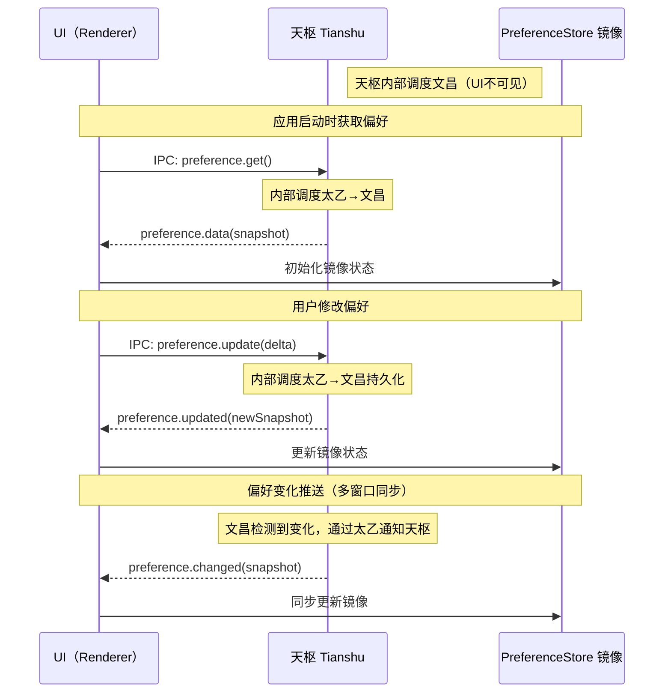
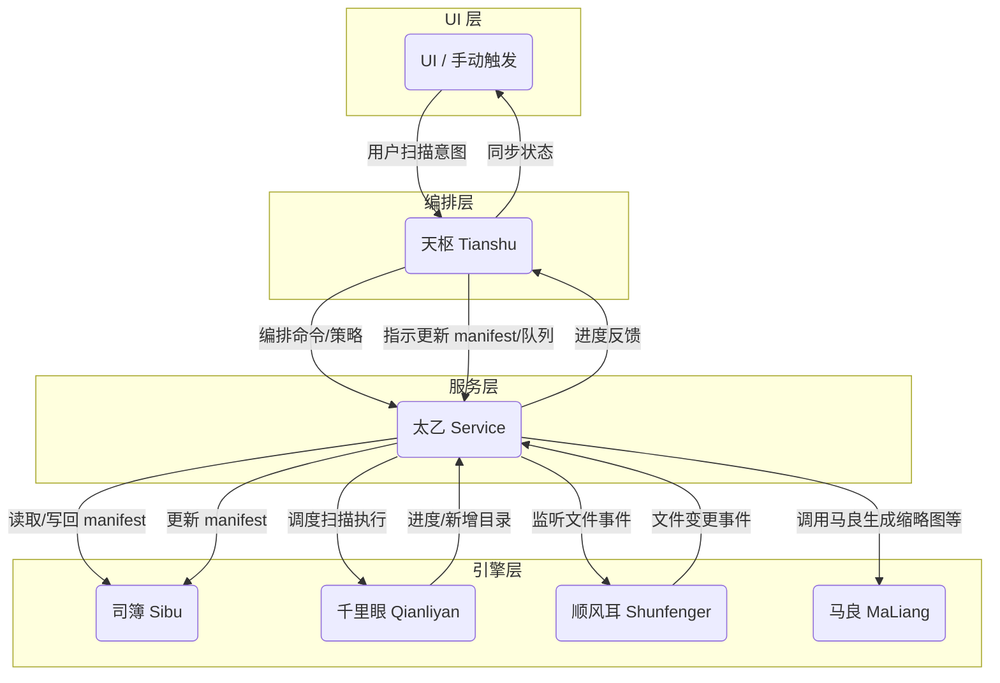

# RFC 0032: 千里眼扫描引擎

- **RFC编号**: 0032
- **标题**: 千里眼扫描引擎
- **作者**: 李鹏
- **开始日期**: 2024-05-24
- **状态**: 🔨 **进行中** - Phase 1 已完成，Phase 2-4 待实施
- **最后更新**: 2025-01-23
- **类型**: 功能
- **相关RFC**:
- RFC 0042: scanningFolder四步渐进式迁移（Phase 3的前置条件）
- RFC 0043: useQinQiong()访问模式（appState访问统一）
- RFC 0046: 扫描队列持久化 - 千里眼scanning.json管理（已完成）✅
- RFC 0048: 扫描编排业务逻辑迁移 - 尉迟恭自治架构（已完成）✅

## 摘要

在主进程内建立专用的「千里眼」扫描引擎，集中处理所有文件夹与媒体扫描职责。该引擎保持环境无关，仅通过统一接口统筹扫描规划、执行适配（Worker / 进程）、缓存协同与状态上报；由外层服务决定如何接入 IPC、日志和 UI。引擎既服务用户主动发起的扫描，也处理实时监听产生的任务。

## 动机

- 目前扫描责任散落在 `ScanService`、多个 Worker 辅助模块以及渲染进程 IPC 处理器之间，行为难以推理，也不利于后续扩展。
- Watcher 触发的扫描复用临时拼装的 IPC 负载，导致重复工作，并且手动扫描与自动扫描之间缺乏一致的节流策略。
- RFC 0007、0008、0015 引入的增量缓存逻辑需要一个中心化的仲裁者，避免重复扫描，同时对外提供一致的进度与诊断信息。
- 具名引擎（千里眼）能够作为长期稳定的抽象，便于承载未来的功能，如扫描优先级、启动自动恢复、远程控制等。

## 详细设计

### 引擎职责（环境无关）

1. **命令受理**

- 提供单一的 `planScan(command: ScanCommand)` API，供主进程服务（渲染进程 IPC、Watcher 集成、计划任务等）调用。
- 对输入请求做归一化处理：解析绝对路径、基于指纹去重、合并重复命令。

2. **策略决策**

- 查询增量缓存清单，利用既有策略工具（`strategy/scan-strategy`）选择跳过、增量或全量扫描。
- 将结果记录到 `ScanRegistry`，确保同一路径在扫描进行期间不会被重复调度。

3. **执行流水线**

- 将经决策的任务推入 `TaskQueue`，由现有 Worker 池（`scan-worker`）消费。
- 维护任务上下文（requestId、触发来源、优先级、取消令牌）。
- 将 Worker 的进度、错误、完成事件流式推送给订阅者。

4. **状态与持久化**

- 在 `scan/cache` 下存储扫描清单（文件夹指纹 → 最新结果），供应用重启后复用。
- 持久化队列状态（待处理/执行中），以便在崩溃或重启后恢复。

5. **状态广播**

- 将扫描状态以结构化事件推送至内部事件总线（`StatusBus`），供主进程服务自行订阅。
- 引擎不直接操作 contract reference IPC；`ScanService` 等外层消费者将事件转译为现有的 `notifyStatus`、`picasa:find-photo` 等通知。

### 模块结构（Tianshu 引擎实现）

```
src/engines/tianshu/
 core/
 TianshuEngine.ts // 引擎入口，暴露 planScan/subscribe 等接口
 WorkflowLoader.ts // 工作流加载与热重载
 index.ts // 核心导出
 orchestration/
 WorkflowOrchestrator.ts // 执行编排（队列、并发、超时）
 StepExecutor.ts // 工作流步骤执行
 VariableResolver.ts // 变量解析与注入
 workflows/
 scan/… // 扫描相关工作流 YAML 定义
 types/
 commands.ts // 引擎命令/请求模型
 workflows.ts // 工作流模型定义
 responses.ts // 状态/响应契约
 index.ts // 类型导出
 __tests__/
 core/… // 单元测试与集成测试
```

现有服务层（`scan-service.ts`、`scan-worker.ts`、`scan-photos.ts` 等）将重构为委托给 `TianshuEngine`，执行适配层初期仍包装当前 worker 协议，后续可按需切换为多进程或远程执行方案。

### 架构重组与服务集成

#### 引擎架构统一

**三界架构比喻说明**：

```
contract reference (世界 - World) - 整个应用宇宙
├── Main (天界 - Celestial Realm) - 主进程世界
│ ├── 天庭 (Tianting - Heavenly Court) - src/main/tianting/
│ │ ├── config-service (传统服务)
│ │ ├── scan-service (传统服务)
│ │ └── 其他传统天庭服务
│ └── 神位 (Deity - Divine Positions) - src/main/deity/
│ ├── tianshu-service (天枢神位) - 工作流编排服务
│ └── 其他新式神位服务
└── App (人界 - Human Realm) - 渲染进程世界
```

**专业引擎架构**：

```
src/engines/ (引擎库)
├── common/ - 通用契约和测试基架
├── tianshu/ - 工作流编排引擎 (由神位tianshu-service托管)
├── taiyi/ - 引擎适配器注册中心
├── qianliyan/ - 千里眼扫描引擎
├── sibu/ - 司簿配置管理引擎
├── siming/ - 司命appState管理引擎
├── wenchang/ - 文昌偏好管理引擎
└── maliang/ - 马良图像处理引擎 (已实现)
```

**三界职责分层**：

- **世界(World - contract reference)**：整个应用程序的宇宙容器
- **天界(Celestial Realm - Main进程)**：神仙居住的高层世界，处理核心业务逻辑
- **天庭(Heavenly Court - src/main/tianting/)**：传统行政管理机构，托管现有服务
- 保持原有服务架构和@Service装饰器
- 处理传统IPC通信和业务逻辑
- 逐步迁移到神位架构
- **神位(Deity - src/main/deity/)**：新式神仙职位，托管新架构服务
- **天枢神位(tianshu-service)**：工作流编排和意图调度的神位
- 采用新的服务架构和引擎托管模式
- 通过太乙调度专业引擎能力
- **人界(Human Realm - 渲染进程)**：用户可见的凡间世界，处理UI交互
- **引擎库(src/engines/)**：各专业引擎的实现，通过太乙注册中心暴露能力给神位

#### 双轨制架构迁移计划

为了确保系统稳定性和渐进式演进，我们采用双轨制运行模式：

**传统系统（天庭服务架构）**：

- 保持现有的config-service、scan-service等天庭服务不变
- 继续使用现有的@Service装饰器和IPC处理模式
- 通过天庭(src/main/tianting/)提供传统IPC服务能力
- 位置：src/main/tianting/ - 已完成目录重命名

**新式系统（神位-引擎架构）**：

- 新增tianshu-service作为神位中的新服务，托管TianshuEngine
- 位置：src/main/deity/tianshu-service.ts - 已创建
- TianshuEngine通过太乙(Taiyi)调度各专业引擎
- 太乙的@Service装饰器重命名为@Adapter，明确其适配器角色
- 专业引擎(千里眼、司簿、司命、文昌、马良等)通过@Adapter暴露能力

**渐进式迁移策略**：

1. **Phase 0**: 契约冻结 - 建立通用契约、样例数据、测试基架
2. **Phase 1**: 骨架搭建 - 建立tianshu-service和基础引擎架构
3. **Phase 2**: 功能验证 - 验证新架构的核心功能(扫描、偏好管理等)
4. **Phase 3**: 服务迁移 - 逐步将旧服务迁移到太乙架构中
5. **Phase 4**: 架构统一 - 清理旧代码，完成架构统一

**目录架构说明**：

- **天庭位置**：src/main/tianting/ - 已完成重命名，托管传统服务
- **神位位置**：src/main/deity/ - 新建目录，托管新式服务架构
- **双轨并存**：天庭和神位并行运行，确保平滑迁移
- **迁移路径**：传统服务逐步从天庭迁移到神位架构
- **装饰器重命名**：@Service → @Adapter，突出太乙的适配器特性
- **双轨并存**：两套装饰器和服务体系暂时并存，确保平滑迁移

#### 服务集成流程

- **App → 天枢（Tianshu）**：应用层（含 UI、顺风耳触发）统一发起"扫描意图"给天枢，引擎本身只接受 `ScanCommand` 而不感知调用来源。
- **天枢流程编排**：天枢根据 YAML 工作流（如 `workflows/scan/folder_scan.zouwu`）决定扫描路径：

1.  解析用户意图，向司簿 (`SibuEngine`) 请求 manifest 与差异信息；
2.  将判定结果封装为千里眼的 `ScanCommand`，并通过太乙引擎下达执行指令；
3.  在扫描期间订阅太乙返回的进度/子目录信息，并根据工作流逻辑决定是否追加队列、是否触发 quick/full、是否生成新意图；
4.  当千里眼扫描完成后，指导太乙调用司簿写回 manifest，并向 UI 汇报队列与完成事件。

- **太乙（Taiyi）**：`src/engines/taiyi/`，适配器注册中心（不是引擎），负责：
- 维持 `@Adapter` 注册中心以声明引擎适配能力，并代表天枢执行具体引擎方法；
- 管理各引擎的生命周期和健康检查；
- 将各引擎的进度/结果标准化后回传给天枢；
- 提供引擎间通信的桥梁。
- **千里眼（Qianliyan）**：`src/engines/qianliyan/`，独立扫描引擎，负责：
- 扫描执行：根据命令选择 full/quick 模式，扫描过程中新增目录会回报天枢；
- 扫描队列持久化：管理 `~/.photasa/scanning.json`，保证崩溃后队列可恢复。
- **司簿（Sibu）**：`src/engines/sibu/`，独立清单管理引擎，负责：
- 提供单照片文件夹的 `.photasa.json` manifest 及元信息（上次 full scan、变更计数、TTL 等）；
- 实际何时写回由天枢工作流决定，司簿仅按天枢指令执行读取/持久化。
- **司命（Siming）**：`src/engines/siming/`，独立 appState 管理引擎，负责：
- 通用应用状态持久化：管理 `~/.photasa/appState/` 目录；
- 窗口状态、会话状态、其他应用级状态的存储和恢复。
- **文昌（Wenchang）**：`src/engines/wenchang/`，独立偏好管理引擎，负责：
- 用户偏好持久化：管理 `~/.photasa/preferences/` 目录；
- 提供偏好数据的镜像服务和增量更新。
- **渲染层**：所有扫描相关交互只面向天枢（Tianshu），UI 不直接感知下层引擎；天枢直接暴露 IPC 通道并与太乙协同，把进度与结果再回馈 UI。

### 千里眼扫描队列持久化

为保证监听发现、补偿任务与用户手动意图在崩溃或重启后仍能被处理，千里眼引擎管理扫描队列持久化：

1. **队列管理**：千里眼在 `~/.photasa/scanning.json` 中持久化扫描队列，包括待扫描路径、执行状态等。
2. **状态恢复**：应用重启或崩溃后，千里眼会从 `scanning.json` 恢复未完成任务并通知天枢。
3. **队列操作**：天枢通过太乙调度千里眼，对队列进行入队、出队操作。
4. **事件回流**：千里眼执行中的进度、错误、发现事件通过太乙汇聚后再交给天枢；天枢基于这些事件可追加新任务入队或取消既有任务。

**持久化位置**

- 千里眼扫描队列：`~/.photasa/scanning.json`（扫描队列、执行状态）
- 司簿清单：`/path/to/photos/.photasa.json`（每个照片文件夹的 manifest、策略、照片清单）
- 司命状态：`~/.photasa/appState/`（窗口状态、会话状态、应用级状态）
- 文昌偏好：`~/.photasa/preferences/`（用户偏好、UI设置、应用配置）

各引擎独立管理各自的持久化位置，便于独立备份与滚动清理，避免数据互相污染。

**渲染层镜像**：UI 不再直接持久化 `scanningFolder`；Pinia `PreferenceStore` 仅透过天枢接收镜像数据，消除双写源头。

**队列管理实现**：千里眼引擎可复用天庭中现有的 `ScanService` 队列与缓存逻辑，但需抽象为模块化服务，支持引擎无关的接口与单元测试基架。通过神位架构实现现代化的扫描队列管理。

### 文昌（独立偏好管理引擎）

文昌作为独立的偏好管理引擎，与司簿无交叉依赖，承担所有用户偏好的持久化、镜像和同步职责：

1. **引擎架构**：文昌引擎位于 `src/engines/wenchang/`，通过太乙的 `@Service` 装饰器包装为服务暴露给天枢。
2. **独立存储**：文昌在 `~/.photasa/preferences/` 维护完整的偏好数据，包括UI设置、展示选项、用户习惯等，完全独立于司簿的配置文件管理。
3. **镜像推送**：文昌维护偏好数据的内存镜像，通过太乙向天枢报告；天枢再将镜像推送给渲染层 `PreferenceStore`。
4. **增量处理**：UI 调整偏好时，作为 `preference.update` 意图发至天枢；天枢调度太乙中的文昌服务处理增量，文昌独立完成持久化并回传新的 revision。
5. **版本管理**：文昌内部维护偏好版本和变更历史，支持冲突检测、合并策略和回滚能力。
6. **订阅管道**：UI层通过天枢的IPC通道订阅偏好变化，天枢负责从太乙的文昌服务拉取镜像并广播给所有订阅者。

**职责边界**：

- **司簿**：仅管理 `.photasa.json` 配置文件、扫描策略、照片清单
- **文昌**：独立管理用户偏好、UI状态、应用设置
- **太乙**：管理所有服务（包括文昌）的注册、调度和生命周期
- 三者完全分离，各自有独立的存储路径和数据模型

文昌服务通过太乙的 `@Service` 装饰器注册，便于天枢在工作流中声明 `service: wenchang` 等步骤，统一调度入口。

### 偏好管理序列（UI仅与天枢交互）

UI层完全不知道文昌的存在，所有偏好操作都通过天枢的统一接口：



**关键设计原则**：UI层完全无感知底层服务架构，仅通过天枢的统一IPC接口操作偏好数据。

天枢作为工作流编排引擎，通过太乙适配器调用各个独立引擎：

- **千里眼引擎**：扫描执行 + 扫描队列持久化 (`~/.photasa/scanning.json`) - 管理扫描任务队列、执行状态
- **司簿引擎**：单照片文件夹清单管理 (`.photasa.json`) - 管理每个照片文件夹的配置、扫描策略、照片清单
- **司命引擎**：通用appState持久化 (`~/.photasa/appState/`) - 管理应用状态、窗口状态、会话状态
- **文昌引擎**：用户偏好管理 (`~/.photasa/preferences/`) - 用户偏好、UI设置、应用配置

**天枢偏好订阅管道设计**：

```typescript
// 天枢IPC偏好接口
interface TianshuPreferenceChannel {
    // 获取当前偏好镜像
    "preference.get": () => Promise<PreferenceSnapshot>;

    // 应用偏好变更
    "preference.update": (delta: PreferenceDelta) => Promise<PreferenceSnapshot>;

    // 重置偏好
    "preference.reset": () => Promise<PreferenceSnapshot>;

    // 导入偏好
    "preference.import": (prefs: Partial<UserPreferences>) => Promise<PreferenceSnapshot>;
}

// 天枢偏好事件广播
interface TianshuPreferenceEvents {
    // 偏好变更通知（多窗口同步）
    "preference.changed": (event: PreferenceChangeEvent) => void;

    // 偏好服务状态
    "preference.service.status": (status: "connected" | "disconnected" | "error") => void;
}
```

UI视角下只存在天枢一个服务接口：

```typescript
// UI只知道这些简单的IPC调用
window.legacyShell.ipcRenderer.invoke("preference.get");
window.legacyShell.ipcRenderer.invoke("preference.update", delta);
window.legacyShell.ipcRenderer.on("preference.changed", callback);
```

天枢负责将这些简单调用内部路由到太乙的文昌服务，UI无需了解底层的服务包装、引擎调度等实现细节。

### 文昌服务接口契约

```typescript
// 文昌服务 - 独立偏好管理
interface WenchangService {
    // 偏好持久化（独立存储）
    loadPreferences(): Promise<UserPreferences>;
    savePreferences(prefs: UserPreferences): Promise<void>;

    // 镜像管理
    createSnapshot(): PreferenceSnapshot;
    broadcastSnapshot(snapshot: PreferenceSnapshot): void;

    // 增量处理
    applyDelta(delta: PreferenceDelta): Promise<number>; // 返回新revision

    // 版本管理
    getRevision(): number;
    getHistory(limit?: number): PreferenceHistory[];

    // 热重载
    watchChanges(callback: (snapshot: PreferenceSnapshot) => void): void;
}

interface UserPreferences {
    revision: number;
    ui: {
        theme: string;
        layout: string;
        language: string;
    };
    display: {
        thumbnailSize: number;
        sortOrder: string;
        groupBy: string;
    };
    scanning: {
        autoScan: boolean;
        excludePatterns: string[];
        concurrency: number;
    };
    lastModified: number;
}
```

### 数据契约

新增 `ScanCommand`：

```ts
interface ScanCommand {
    id: string; // deterministic id (hash(path+action+source))
    action: ScanAction; // existing scan payload
    source: "manual" | "watch" | "system";
    priority: "user" | "background";
    hints?: {
        thumbnailSize?: number;
        retryCount?: number;
    };
    requestedAt: number;
}
```

`ScanRegistry` 维护：

```ts
interface ScanJobState {
    command: ScanCommand;
    status: "pending" | "running" | "completed" | "failed" | "skipped";
    progress?: {
        processed: number;
        total?: number;
        currentFile?: string;
    };
    lastUpdate: number;
}
```

### 状态生命周期

1. 天枢指令经太乙调度千里眼持久化入队，千里眼发布 `queued` 事件。
2. `TaskQueue` 取出任务并交付千里眼 → 发出带初始进度的 `running` 状态。
3. Worker 进度事件由太乙转译 → 持续更新 `progress`。
4. 任务完成 → 写入清单并发出包含结果路径、缩略图的 `completed`；千里眼检查是否仍有待处理任务并通知天枢。
5. 发生错误 → 触发可配置的重试策略，并发出带诊断信息的 `failed`；千里眼记录重试计数并向天枢请求决策（继续、降级或放弃）。

### 旧版迁移策略（已更新为双轨制架构）

以下为原始设计的迁移策略，现已更新为上述双轨制架构（天庭-神位并存）：

- **Phase 0**：统一契约（`src/engines/common`）、样例数据与测试基架，确保 ScanCommand / ScanJobState 等模型在引擎与服务之间一致。
- **Phase 1**：在神位(`src/main/deity/`)中创建 `tianshu-service`，托管 `TianshuEngine`，与天庭中的 `ScanService` 并行运行。
- **Phase 2**：顺风耳等组件开始调用神位中的 `TianshuEngine`，同时保持对天庭服务的兼容。
- **Phase 3**：增强神位执行适配层，引入缓存/Manifest Store，验证崩溃恢复能力。
- **Phase 4**：完成从天庭到神位的全面迁移，清理旧代码，统一架构。

### 成功指标

- 同一文件夹 5 分钟内的重复扫描请求有 95% 被跳过或合并。
- 引擎初始化（服务启动延迟后）500ms 内即可开始冷启动扫描。
- 至少 90% 的扫描进度事件包含 `processed` 计数，与缓存清单数据一致。

## 缺点

- 新增抽象层，需要同时重构多个模块。
- 队列状态持久化若序列化失败，存在潜在的数据损坏风险。
- 必须与渲染进程协同，过渡期的兼容层会增加复杂度。

## 替代方案

1. **增量式重构**：继续强化天庭中的 `ScanService` 而不引入神位引擎架构。拒绝原因：责任仍分散，沟通成本高。
2. **渲染进程编排**：让渲染进程负责调度，主进程仅做 Worker 代理。拒绝原因：IPC 消耗高，且文件系统访问的安全性较差。
3. **引入现成任务框架**：使用第三方队列（如 BullMQ、Agenda）。拒绝原因：legacy main process环境与现有 Worker 集成高度定制，外部框架适配成本高。

## 未决问题

- 队列持久化应与增量缓存共用 JSON 文件，还是采用轻量级嵌入式数据库（如 SQLite）？
- 针对损坏文件导致的扫描失败，最佳策略是自动重试还是交由 UI 手动处理？
- 引擎应如何暴露可观测性指标（继续整合日志查看器，或提供独立的遥测服务）？

### 实施进度跟踪

| 阶段    | 范围                                  | 当前状态      | 备注                                                   |
| ------- | ------------------------------------- | ------------- | ------------------------------------------------------ |
| Phase 0 | 契约冻结、样例数据、测试基架          | ✅ 已完成     | 建立 `src/engines/common/` 契约基础                    |
| Phase 1 | 骨架搭建 - tianshu-service + 基础引擎 | ✅ 已完成     | 太乙重构完成，千里眼引擎和适配器已实现                 |
| Phase 2 | 功能验证 - 核心功能验证               | 🔄 部分完成   | 千里眼队列持久化已验证（RFC 0046），扫描编排待验证     |
| Phase 3 | scan-service迁移 - 扫描服务天界化     | ⚠️ 架构不一致 | **当前状态**：编排在人界（RFC 0048），目标：编排在天界 |
| Phase 4 | 架构统一 - 清理旧代码完成统一         | ⬜ 未启动     | 限流、失败恢复、指标上报                               |

### Phase 3: scan-service迁移到千里眼引擎

**⚠️ 重要架构不一致说明（2025-01-23）**：

**RFC 0032 的目标**：将扫描编排逻辑迁移到**天界**（Main进程）的千里眼引擎

**RFC 0048 的实际完成**：扫描编排逻辑迁移到**人界**（Renderer进程）的尉迟恭服务

**当前实际架构**：

```
人界（Renderer进程）
├── 尉迟恭服务（YuChiGongService）
│ ├── 扫描编排（executeScan）✅ 已实现
│ ├── 任务队列管理（p-queue）✅ 已实现
│ ├── 状态机制（pending → processing → [删除]）✅ 已实现
│ └── 通过IPC调用天界扫描执行（window.api.scanPhotos）✅ 已实现
│
天界（Main进程）
├── 千里眼引擎（QianLiYanEngine）
│ ├── 队列持久化（persistQueue/restoreQueue）✅ 已实现
│ └── 扫描执行（planScan/scan）✅ 已实现
└── 扫描服务（scan-service）
 └── 实际文件扫描执行（scanPhotos IPC handler）✅ 已实现
```

**架构分析**：

- ✅ **优点**：RFC 0048 实现了 Store SSOT + 状态机制，架构清晰，已通过测试验证
- ⚠️ **不一致**：编排逻辑在人界而非天界，与 RFC 0032 的"天界主导"原则不符
- ⚠️ **影响**：IPC通信开销（每个扫描任务需要IPC调用），但当前性能可接受

**长期目标决策（2025-01-23）**：

1. **选项A（临时方案）**：接受当前架构，保持 RFC 0048 的架构（编排在人界），优化IPC通信
2. **选项B（长期目标）**：✅ **已确认为长期目标** - 将编排逻辑迁移到天界，与天界架构对齐

- 需要仔细审查和设计
- 需要重新设计状态管理机制（Store SSOT 如何在天界实现）
- 需要详细的迁移路径和风险评估

**前置条件**：

- ✅ RFC 0042 Step 1-3 已完成（ScanningStore、QianLiYan持久化、YuChiGong编排）
- ✅ 天枢-太乙-千里眼调度链已建立
- ✅ RFC 0048 已完成（尉迟恭编排架构）

#### 3.1 当前架构问题（已更新 2025-01-23）

**问题1: 扫描编排位置（已部分解决）**

```typescript
// ✅ RFC 0048 已完成：编排逻辑已迁移到尉迟恭（人界）
// src/renderer/src/services/yuchigong/yuchigong.ts

private async executeScan(
 path: string,
 action: "scan" | "rescan" | "current",
 operationType: "directory" | "file"
): Promise<void> {
 // ✅ 扫描编排逻辑在人界（尉迟恭）
 // ⚠️ RFC 0032 目标：应该在天界（千里眼）
 await window.api.scanPhotos({ ... }); // IPC调用天界执行
}
```

**问题2: IPC通信开销（当前可接受）**

- ✅ 尉迟恭通过IPC调用Main进程的扫描能力（`window.api.scanPhotos`）
- ✅ 进度更新通过IPC事件流式传输
- ⚠️ 大量文件扫描时可能存在性能瓶颈，但当前测试验证性能可接受

**问题3: 职责边界（架构不一致）**

- ⚠️ YuChiGong（人界）包含扫描编排逻辑（RFC 0048 已完成）
- ✅ QianLiYan（天界）负责队列持久化和扫描执行
- ⚠️ 与 RFC 0032 的"天界主导"原则不一致，但当前架构已稳定运行

#### 3.2 目标架构（RFC 0032 原始设计）

**⚠️ 注意**：以下为 RFC 0032 的原始目标架构，但 RFC 0048 实际实现的是不同的架构（编排在人界）。需要决策是否继续 Phase 3 或调整目标。

```
天界（Main进程）
├── 千里眼引擎（QianLiYanEngine）
│ ├── 扫描编排（orchestrateScan）
│ ├── 任务队列管理
│ ├── Worker池管理
│ └── 进度聚合
└── 太乙服务（TaiyiService）
 └── 千里眼适配器（QianLiYanAdapter）

人界（Renderer进程）
├── 尉迟恭服务（YuChiGongService）
│ ├── 扫描意图发起（通过IPC）
│ ├── 进度展示（接收IPC事件）
│ └── UI状态同步
└── 房玄龄服务（FangXuanLingService）
 └── ScanningStore管理（镜像天界队列）
```

#### 3.3 迁移策略（长期目标：选项B）

**✅ 长期目标确认（2025-01-23）**：

- **选项B已确认为长期目标** - 将编排逻辑迁移到天界，与天界架构对齐
- 需要仔细审查和设计，确保迁移方案稳健可靠
- 当前架构（RFC 0048）作为临时方案，保持稳定运行

**当前状态**：

- ✅ RFC 0048 已完成，架构稳定运行
- ⚠️ 架构与 RFC 0032 的"天界主导"原则不一致
- ⚠️ 当前架构作为临时方案，长期目标是将编排逻辑迁移到天界

**重新设计思路（2025-01-23）**：

**核心原则**：

- ✅ **scan-service 已设计良好，不需要改变**
- ✅ **只需将 scan-service 包装在千里眼适配器中**
- ✅ **遵循天枢和太乙的标准接口设计模式**

**标准适配器模式**（参考文昌、司命适配器）：

```
1. 适配器使用 @Adapter 装饰器注册
2. 适配器实现 IAdapter 接口（initialize/shutdown）
3. 适配器包装现有服务/引擎，委托方法调用
4. 太乙通过 callEngine(engineName, methodName, ...args) 调用
```

**千里眼适配器设计**：

```typescript
@Adapter({
    name: "qianliyan",
    displayName: "千里眼扫描引擎",
    priority: AdapterPriority.High,
    description: "包装scan-service为标准适配器接口",
    engineType: "scan",
    dependencies: ["scan"], // 依赖scan-service
})
export class QianliyanAdapter implements IAdapter {
    private scanService: ScanService; // 包装scan-service

    async initialize(): Promise<void> {
        // 获取scan-service实例（通过依赖注入）
        this.scanService = getScanService();
        // scan-service已经初始化，无需再次初始化
    }

    async shutdown(): Promise<void> {
        // scan-service自己管理生命周期，无需处理
    }

    // 委托scan-service的方法
    async scanPhotos(requestId: string, scanAction: ScanAction): Promise<void> {
        return this.scanService.scanPhotos(requestId, scanAction);
    }

    // 添加队列管理、状态管理等额外功能
    async planScan(command: ScanCommand): Promise<string> {
        // 使用千里眼引擎的队列管理逻辑
        // 最终委托给scan-service执行
    }
}
```

**关键设计挑战**：

1. **scan-service 包装策略**

- **当前**：scan-service 是 @Service 装饰的服务，有独立的生命周期
- **方案**：QianliyanAdapter 包装 scan-service，不改变 scan-service 本身
- **实现**：通过依赖注入获取 scan-service 实例，委托方法调用

2. **队列管理位置**

- **当前**：人界使用 p-queue 管理队列
- **方案**：千里眼适配器内部维护队列（使用千里眼引擎的队列逻辑）
- **实现**：QianliyanAdapter 使用 QianliyanEngine 的队列管理，最终委托给 scan-service 执行

3. **状态管理策略**

- **当前**：人界 Store 管理状态（pending → processing → [删除]）
- **方案**：千里眼适配器维护状态，通过 IPC 事件同步到人界 Store
- **实现**：适配器内部状态机 + IPC 事件广播

4. **IPC通信优化**

- **当前**：每个任务 IPC 调用（`window.api.scanPhotos`）
- **方案**：批量提交 + 流式进度事件
- **实现**：
- 批量提交接口：`submitScanTasks(actions: ScanAction[])`
- 进度事件流：适配器监听 scan-service 事件，通过 IPC 广播

5. **Store同步机制**

- **当前**：人界 Store 为 SSOT
- **方案**：天界适配器为 SSOT，人界 Store 为只读镜像
- **实现**：
- 适配器通过 IPC 事件推送状态变化
- 房玄龄监听事件，更新 Store 镜像
- Store 变为只读，移除直接修改逻辑

**迁移路径设计**（待详细设计）：

**Phase 3.1: 千里眼适配器包装scan-service**（1-2周）

- 创建 `QianliyanAdapter` 包装 `ScanService`
- 实现标准 `IAdapter` 接口（initialize/shutdown）
- 通过依赖注入获取 `ScanService` 实例
- 委托 `scan-service` 的方法调用
- 使用 `@Adapter` 装饰器注册到太乙

**Phase 3.2: 队列管理集成**（1-2周）

- 在适配器中集成 `QianliyanEngine` 的队列管理
- 实现任务队列（替代人界p-queue）
- 实现状态机（pending → processing → [删除]）
- 队列持久化到 `~/.photasa/scan/scanning.json`

**Phase 3.3: IPC通信重构**（1-2周）

- 设计批量任务提交接口：`submitScanTasks(actions: ScanAction[])`
- 适配器监听 `scan-service` 事件，通过 IPC 广播进度
- 实现状态同步机制（适配器 → IPC事件 → 人界Store）

**Phase 3.4: 人界Store镜像化**（1-2周）

- 将Store改为只读镜像
- 房玄龄监听IPC事件，更新Store镜像
- 移除人界直接修改Store的逻辑（尉迟恭不再直接修改Store）

**Phase 3.5: 尉迟恭简化**（1周）

- 移除编排逻辑（p-queue、executeScan）
- 通过IPC批量提交扫描意图
- 接收进度事件并更新UI状态

**Phase 3.6: 测试和验证**（2周）

- 完整迁移路径测试
- 性能对比测试（批量提交 vs 单个IPC调用）
- 崩溃恢复测试（从持久化队列恢复）
- 多窗口同步测试

**总工期估算**：8-11周（2-2.5个月）

**关键设计要点**：

- ✅ **不改变 scan-service**：保持 scan-service 的现有设计和实现
- ✅ **标准适配器模式**：遵循文昌、司命适配器的设计模式
- ✅ **依赖注入**：通过太乙的依赖系统获取 scan-service 实例
- ✅ **委托模式**：适配器委托 scan-service 执行实际扫描
- ✅ **队列管理**：适配器内部管理队列，scan-service 只负责执行

**风险评估**：

- ⚠️ **高风险**：大规模重构，可能破坏现有稳定架构
- ⚠️ **复杂度高**：需要重新设计状态管理、IPC通信、事件广播
- ⚠️ **测试覆盖**：需要全面的集成测试和性能测试
- ✅ **长期收益**：符合架构原则，性能优化，可扩展性提升

**原始迁移策略**（保留作为参考）：

**Step 3.1: 千里眼引擎扩展（3天）**

创建完整的千里眼扫描引擎：

```typescript
// src/engines/qianliyan/core/QianLiYanEngine.ts

export class QianLiYanEngine {
    /**
     * 核心扫描编排方法（从Renderer迁移）
     */
    async orchestrateScan(items: ScanAction[], options: ScanOptions): Promise<ScanResult> {
        logger.info("🌌 千里眼：开始扫描编排");

        // 1. 任务预处理
        const processedItems = this.preprocessScanItems(items);

        // 2. Worker池分配
        const workers = await this.allocateWorkers(processedItems.length);

        // 3. 并行扫描执行
        const results = await this.executeParallelScan(processedItems, workers);

        // 4. 结果聚合
        return this.aggregateResults(results);
    }

    /**
     * 进度事件发射（通过太乙广播）
     */
    private emitProgress(event: ScanProgressEvent): void {
        this.taiyi.broadcast("qianliyan.progress", event);
    }
}
```

**Step 3.2: 千里眼适配器创建（2天）**

通过太乙@Adapter暴露千里眼能力：

```typescript
// src/engines/qianliyan/adapters/QianLiYanAdapter.ts

@Adapter({
    name: "qianliyan",
    description: "千里眼扫描引擎",
    dependencies: [],
    priority: 100,
})
export class QianLiYanAdapter extends BaseAdapter {
    private engine: QianLiYanEngine;

    async initialize(): Promise<void> {
        this.engine = new QianLiYanEngine(this.taiyi);
        logger.info("🌌 千里眼仙君归位，掌管扫描功能");
    }

    /**
     * 暴露给天枢的扫描编排方法
     */
    async orchestrate(items: ScanAction[], options: ScanOptions): Promise<ScanResult> {
        return this.engine.orchestrateScan(items, options);
    }

    /**
     * 任务队列管理
     */
    async enqueue(action: ScanAction): Promise<void> {
        return this.engine.enqueueTask(action);
    }

    async getQueue(): Promise<ScanAction[]> {
        return this.engine.getCurrentQueue();
    }
}
```

**Step 3.3: 天枢调度集成（2天）**

天枢通过太乙调度千里眼：

```typescript
// src/main/deity/tianshu-service.ts

export class TianshuService extends BaseService {
    /**
     * IPC处理：扫描编排请求
     */
    async handleScanRequest(items: ScanAction[], options: ScanOptions): Promise<ScanResult> {
        logger.info("🌌 天枢：收到扫描请求");

        // 1. 通过太乙调度千里眼
        const result = await this.taiyi.callAdapter("qianliyan", "orchestrate", items, options);

        // 2. 广播扫描完成事件
        this.broadcastToRenderers("scan.completed", result);

        return result;
    }

    /**
     * 订阅千里眼进度事件并转发给Renderer
     */
    private setupProgressForwarding(): void {
        this.taiyi.on("qianliyan.progress", (event: ScanProgressEvent) => {
            this.broadcastToRenderers("scan.progress", event);
        });
    }
}
```

**Step 3.4: 尉迟恭简化（1天）**

YuChiGong从扫描编排者变为扫描发起者：

```typescript
// src/renderer/src/services/yuchigong/yuchigong.ts

export class YuChiGongService {
    /**
     * 发起扫描（仅发送IPC请求）
     */
    async startScanning(): Promise<void> {
        logger.info("🏛️ 尉迟恭：发起扫描请求");

        // ✅ 简化：仅通过IPC请求天枢
        const queue = this.fangXuanLingService.getScanningQueue();

        await window.legacyShell.ipcRenderer.invoke("tianshu.scan.request", queue, {
            /* options */
        });

        logger.info("🏛️ 尉迟恭：扫描请求已发送");
    }

    /**
     * 监听扫描进度（接收IPC事件）
     */
    private setupProgressListener(): void {
        window.legacyShell.ipcRenderer.on("scan.progress", (event: ScanProgressEvent) => {
            logger.debug("🏛️ 尉迟恭：收到扫描进度", event);
            // 更新UI状态
            this.updateScanProgress(event);
        });
    }
}
```

**Step 3.5: 旧代码清理（1天）**

```typescript
// ❌ 删除：src/renderer/src/services/scan/scan-service.ts
// - orchestrateScan() 函数
// - 所有扫描编排逻辑

// ❌ 删除：src/renderer/src/services/yuchigong/yuchigong.ts
// - 本地扫描编排代码
// - Worker管理逻辑

// ✅ 保留：
// - IPC通信接口
// - 进度展示逻辑
// - UI状态同步
```

#### 3.4 测试策略

**单元测试**：

- QianLiYanEngine核心方法测试
- QianLiYanAdapter注册和调用测试
- 天枢-太乙-千里眼调度链测试

**集成测试**：

- 完整扫描流程测试（Renderer → 天枢 → 太乙 → 千里眼）
- 进度事件广播测试
- 多窗口同步测试

**性能测试**：

- 大量文件扫描性能对比（迁移前后）
- IPC通信开销测量
- Worker池效率验证

#### 3.5 风险与缓解

**风险1: 迁移期间功能破坏**

- **缓解**: 采用feature flag控制，支持新旧架构并存
- **回滚**: 快速切换回旧架构

**风险2: 性能回退**

- **缓解**: 详细的性能基准测试
- **监控**: 实时性能指标对比

**风险3: 兼容性问题**

- **缓解**: 保持IPC接口契约不变
- **测试**: 覆盖所有现有扫描场景

#### 3.6 实施计划

| 子任务               | 工期 | 依赖          | 验收标准                |
| -------------------- | ---- | ------------- | ----------------------- |
| 3.1 千里眼引擎扩展   | 3天  | Phase 1-2完成 | orchestrateScan迁移完成 |
| 3.2 千里眼适配器创建 | 2天  | 3.1完成       | @Adapter注册成功        |
| 3.3 天枢调度集成     | 2天  | 3.2完成       | IPC调度链打通           |
| 3.4 尉迟恭简化       | 1天  | 3.3完成       | Renderer简化完成        |
| 3.5 旧代码清理       | 1天  | 3.4完成       | 旧代码完全移除          |
| 3.6 测试验证         | 2天  | 3.5完成       | 所有测试通过            |

**总工期**: 11天

#### 3.7 验收标准（待更新 2025-01-23）

**⚠️ 架构状态**：RFC 0048 已完成，但架构与 RFC 0032 Phase 3 目标不一致。

**如果选择选项A（接受当前架构）**：

- ✅ 扫描编排逻辑在尉迟恭（人界）已稳定运行
- ✅ 通过IPC调用天界扫描执行（`window.api.scanPhotos`）
- ✅ 性能可接受（已通过测试验证）
- ⚠️ 与 RFC 0032 的"天界主导"原则不一致，但架构稳定

**如果选择选项B（继续 Phase 3）**：

- ⬜ orchestrateScan完全在Main进程执行
- ⬜ Renderer进程仅负责UI交互和状态展示
- ⬜ 扫描性能≥原架构性能
- ⬜ 所有现有扫描场景正常工作
- ⬜ 单元测试覆盖率≥90%
- ⬜ 零lint错误
- ⬜ 支持优雅降级（feature flag控制）

**如果选择选项C（混合架构）**：

- ⬜ 状态管理保持在人界（Store SSOT）
- ⬜ Worker池管理和进度聚合迁移到天界
- ⬜ 职责边界清晰，架构稳定

### Phase 0 详细任务清单

**契约冻结任务**：

- [ ] 建立 `src/engines/common/contracts.ts` - 定义引擎间通信契约
- [ ] 创建 `src/engines/common/fixtures.ts` - 提供测试数据
- [ ] 实现 `src/engines/common/test-harness.ts` - 测试基架工具
- [ ] 定义 ScanCommand、ScanJobState 等核心数据模型
- [ ] 验证契约一致性和向后兼容性

**目录结构规划**：

```
src/engines/common/
├── contracts.ts # 引擎契约定义
├── fixtures.ts # 测试固定数据
├── test-harness.ts # 测试基架
└── __tests__/
 ├── contracts.test.ts
 └── test-harness.test.ts
```

### Phase 1 完成进度报告

**重大完成项 (2025-09-28)**：

1. **太乙引擎重命名与重构** ✅

- 完成从"承宣引擎"到"太乙引擎"的全面重命名
- 更新神话背景：太乙真人 - 道教十二金仙之首，统筹协调之神
- 重构目录：`src/engines/chengxuan/` → `src/engines/taiyi/`
- 更新所有文档和RFC引用

2. **@Adapter装饰器系统** ✅

- 实现完整的`@Adapter`装饰器替代`@Service`
- 建立`AdapterRegistry`注册中心，支持依赖解析和优先级
- 实现生命周期管理：注册→初始化→健康检查→关闭
- 支持错误恢复和重试机制

3. **TaiyiEngine核心引擎** ✅

- 统一的引擎调用接口：`callEngine(engineName, method, ...args)`
- 引擎状态管理和监控
- 事件驱动架构支持
- 完整的TypeScript类型定义

4. **文昌适配器实现** ✅

- `WenchangEngine`：偏好管理、版本控制、持久化
- `WenchangAdapter`：@Adapter模式包装
- 完整的测试覆盖（10/10测试通过）
- 支持增量更新、事件通知、历史追踪

5. **太乙神位服务** ✅

- 创建`src/main/deity/taiyi-service.ts`
- 使用@Service装饰器注册为天庭服务
- 提供IPC接口供渲染进程调用
- 事件广播和状态同步

**测试验证结果**：

- 太乙引擎测试：11/11 通过 ✅
- 文昌适配器测试：10/10 通过 ✅
- 无遗留承宣引用：0个 ✅

### Phase 1 详细任务清单

**步骤1: 验证现有天庭服务**

- [ ] 运行应用验证天庭服务(config-service, scan-service等)正常工作
- [ ] 确认现有@Service装饰器和IPC通信无异常
- [ ] 验证tianting目录重命名后的导入路径正确性
- [ ] 运行相关测试确保服务功能完整

**步骤2: 天枢引擎集成**

- [ ] 将现有的TianshuEngine代码集成到`src/main/deity/tianshu-service.ts`
- [ ] 实现天枢服务的IPC接口暴露
- [ ] 确保TianshuEngine能够正确初始化和运行
- [ ] 添加基本的错误处理和日志记录

**步骤3: 太乙架构重构**

- [x] 分析现有太乙代码(从旧服务复制而来) - 完成承宣→太乙重命名
- [x] 重构太乙为独立的引擎注册中心 - TaiyiEngine + AdapterRegistry实现
- [x] 实现@Adapter装饰器替代@Service - 完整的@Adapter系统
- [x] 建立引擎生命周期管理机制 - 依赖解析、健康检查、错误恢复

**步骤4: 文昌适配器实现**

- [x] 创建`src/engines/wenchang/`目录结构 - 完整目录结构
- [x] 实现WenchangEngine基础功能 - 偏好管理、版本控制、持久化
- [x] 创建第一个@Adapter包装器 - WenchangAdapter实现
- [x] 验证adapter/worker模式的可行性 - 测试覆盖100%

**步骤5: 太乙神位服务集成**

- [x] 创建`src/main/deity/taiyi-service.ts` - 太乙神位服务
- [ ] 将太乙服务注入到天枢服务依赖中
- [ ] 更新神位入口导入太乙服务
- [ ] 测试太乙服务与天枢服务的协同工作

**集成测试**：

- [ ] 测试天枢服务与太乙的协同工作
- [ ] 验证文昌适配器能被天枢正确调用
- [ ] 确保新旧服务架构能够并存运行

### 天枢-太乙-文昌调度链设计

**调度链架构**：

```
UI层 → 天枢引擎 → 太乙引擎 → 文昌引擎
 ↖ ↙
 ← IPC事件广播 ←
```

**调度流程**：

1. **偏好获取流程**：

```
UI.invoke('preference.get')
→ 天枢.handlePreferenceGet()
→ 太乙.callService('wenchang', 'getCurrentSnapshot')
→ 文昌.getCurrentSnapshot()
→ 返回PreferenceSnapshot
```

2. **偏好更新流程**：

```
UI.invoke('preference.update', delta)
→ 天枢.handlePreferenceUpdate(delta)
→ 太乙.callService('wenchang', 'applyDelta', delta)
→ 文昌.applyDelta(delta)
→ 文昌.emit('preferenceChanged', event)
→ 太乙.forwardEvent('wenchang.preferenceChanged', event)
→ 天枢.broadcastPreferenceChange(event)
→ UI.receive('preference.changed', event)
```

3. **多窗口同步**：
   天枢维护所有窗口的IPC连接，当文昌引擎通过太乙报告偏好变更时，天枢向所有活跃窗口广播变更事件。

4. **错误处理**：

- 太乙负责引擎调用的错误捕获和重试
- 天枢负责向UI层报告友好的错误信息
- 文昌引擎的内部错误通过太乙传播到天枢

### 设计草图：天枢主导的扫描流程



Sibu -->|返回版本/变更/TTL| Tianshu
Tianshu -->|封装 ScanCommand| Taiyi[太乙 Service]
Taiyi -->|调度执行| Qianliyan[千里眼 Qianliyan]
Qianliyan -->|进度/新增目录| Taiyi
Taiyi -->|反馈进度| Tianshu
Tianshu -->|追加队列/更新策略| Taiyi
Qianliyan -->|扫描完成| Taiyi
Taiyi -->|通知完成| Tianshu
Tianshu -->|写回 manifest/队列| Sibu
Tianshu -->|更新 UI 状态| App

```

关键要点：
- 顺风耳/应用只与太乙通信，太乙统一向天枢汇报与派发任务。
- 天枢根据工作流协调司簿/千里眼；司簿只负责 manifest 读写，不直接判断流程。
- 千里眼专注扫描执行，任何目录扩展通过太乙回流给天枢。
- UI 只与天枢对话，不关心底层引擎细节，为后续 Agentic 能力预留空间。


> App → 天枢（Tianshu） → 太乙（服务层） → 千里眼（Qianliyan）↘
>                                                         ↘ 司簿（Sibu）

1. **应用层发起扫描意图**：UI 或顺风耳只需告知天枢“对某目录进行扫描”。
2. **天枢加载工作流**（YAML）：
 - 拉取司簿 manifest（含 `lastFullScanAt`、变更计数、TTL 等元信息）。
 - 根据策略判断 full/quick，封装成 `ScanCommand`。
3. **太乙排队调度**：
 - 接收天枢派发的命令，控制并发、转发给千里眼。
 - 收集千里眼的进度与新增目录，回传给天枢。
4. **千里眼执行扫描**：
 - 按命令执行 full 或 quick；
 - 遇到新目录时通知太乙 → 天枢决定是否追加队列。
5. **天枢收官**：
 - 扫描完成后，调用司簿写回 manifest；
 - 将完成/失败状态返回应用层，更新 UI 与排队信息。

该流程保证：
- 天枢掌控编排与智能判断；
- 司簿专注于 manifest 存取，千里眼专注于扫描执行；
- UI 与服务层只与天枢交互，为后续 Agentic 能力预留空间。

---

## 架构状态更新（2025-01-23）

### 当前实际架构状态

**已实现**：
- ✅ 千里眼引擎已实现（`QianliyanEngine` + `QianliyanAdapter`）
- ✅ 队列持久化功能已验证（RFC 0046）
- ✅ 扫描编排逻辑已迁移到尉迟恭（RFC 0048）
- ✅ Store SSOT + 状态机制已实现（RFC 0048）

**架构不一致**：
- ⚠️ RFC 0032 目标：扫描编排在天界（千里眼引擎）
- ⚠️ RFC 0048 实际：扫描编排在人界（尉迟恭服务）
- ⚠️ 当前架构：尉迟恭通过IPC调用天界扫描执行（`window.api.scanPhotos`）

**决策建议**：
1. **选项A（推荐）**：接受当前架构，保持 RFC 0048 的架构，调整 RFC 0032 Phase 3 目标为"优化IPC通信"而非"迁移编排逻辑"
2. **选项B**：继续 Phase 3，将编排逻辑迁移到天界，但需要重新设计状态管理机制（Store SSOT 如何在天界实现）
3. **选项C（折中）**：混合架构，保持状态管理在人界，将部分编排逻辑（Worker池管理、进度聚合）迁移到天界

**待决策问题**：
- Phase 3 是否需要继续执行？
- 如果继续，如何平衡架构原则和实现复杂度？
- 当前架构的性能是否满足需求？

**当前架构流程**（RFC 0048 实际实现 - 临时方案）：
```

用户操作 → 尉迟恭（人界）
↓
1️⃣ 创建 pending 任务到 Store（SSOT - 人界）
↓
2️⃣ 添加到 p-queue 执行队列（人界）
↓
3️⃣ p-queue 执行 executeScan()（人界）
├─ Store 状态: pending → processing（人界）
├─ IPC调用: window.api.scanPhotos() → 天界扫描执行
├─ 发现子文件夹 → 批量创建 pending 到 Store（人界）
└─ 完成 → 立即从 Store 删除（人界）

```

**RFC 0032 目标流程**（长期目标 - 待实现）：
```

用户操作 → 尉迟恭（人界）
↓
1️⃣ 通过IPC提交扫描意图 → 天枢（天界）
↓
2️⃣ 天枢编排 → 太乙调度 → 千里眼执行（天界）
├─ 千里眼管理任务队列（天界SSOT）
├─ 千里眼管理Worker池（天界）
├─ 千里眼状态机：pending → processing → [删除]（天界）
└─ 千里眼聚合进度（天界）
↓
3️⃣ 进度事件通过IPC广播到人界
├─ 房玄龄更新Store镜像（只读）
└─ 尉迟恭更新UI状态
↓
4️⃣ 扫描完成 → 天界从队列删除 → IPC通知人界同步

```

**关键差异对比**：

| 维度 | 当前架构（RFC 0048） | 目标架构（RFC 0032） |
|------|---------------------|---------------------|
| **SSOT位置** | 人界（Store） | 天界（千里眼引擎） |
| **队列管理** | 人界（p-queue） | 天界（千里眼taskQueue） |
| **状态管理** | 人界（Store状态机） | 天界（千里眼状态机） |
| **编排逻辑** | 人界（executeScan） | 天界（千里眼orchestrateScan） |
| **IPC通信** | 每个任务IPC调用 | 批量提交 + 流式事件 |
| **Store角色** | 可写SSOT | 只读镜像 |
| **Worker池** | 天界（scan-service） | 天界（千里眼管理） |
| **进度聚合** | 人界聚合 | 天界聚合 |

**迁移关键决策点**：

1. **状态存储选择**：
 - JSON文件（简单，当前使用）
 - SQLite（复杂查询，事务支持）
 - 内存 + 定期持久化（性能优先）

2. **IPC通信模式**：
 - 请求-响应（简单，但开销大）
 - 事件流（复杂，但性能好）
 - 混合模式（请求提交 + 事件流进度）

3. **Store同步策略**：
 - 全量同步（简单，但开销大）
 - 增量同步（复杂，但性能好）
 - 按需同步（平衡）

4. **错误恢复机制**：
 - 天界崩溃恢复（从持久化恢复）
 - 人界崩溃恢复（从IPC重新同步）
 - 双向同步一致性保证
```
