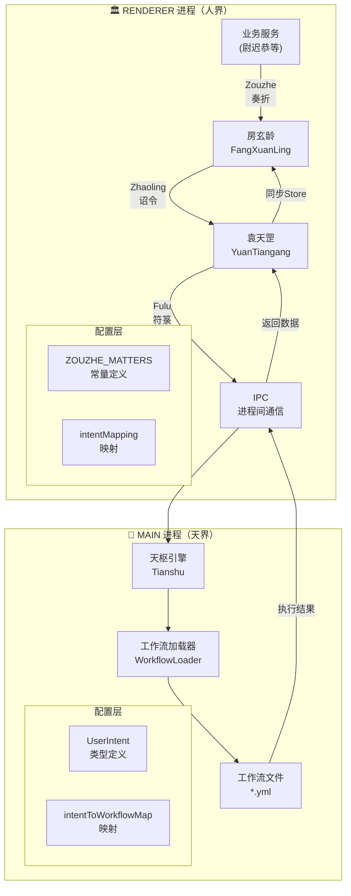
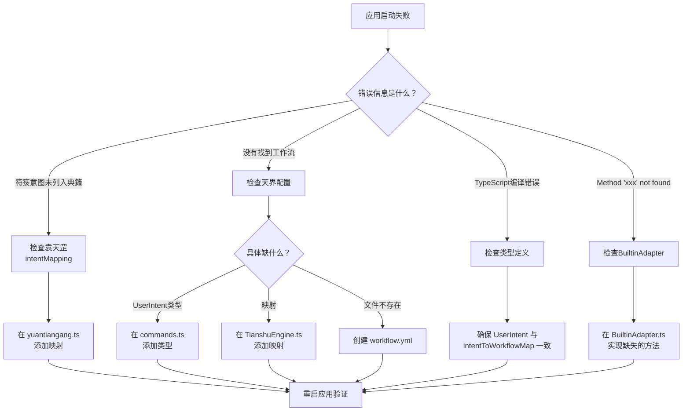

# Zouzhe/Zhaoling 工作流开发指南

> **版本**: 1.0
> **创建日期**: 2025-11-27
> **基于教训**: RFC 0048 v3 连续踩坑3次的惨痛经历

---

## 概述

Zouzhe（奏折）系统是项目中用于**内政事务处理和持久化**的核心通信机制。它跨越 Renderer 进程（人界）和 Main 进程（天界），涉及 **8个必须同步更新的组件**。

本指南将手把手教你如何正确添加一个新的 Zouzhe 工作流。

---

## 架构图

### 整体数据流



### 8步实现流程

```mermaid
flowchart LR
    subgraph Step1["步骤1"]
        S1["ZOUZHE_MATTERS<br/>常量"]
    end

    subgraph Step2["步骤2"]
        S2["袁天罡<br/>intentMapping"]
    end

    subgraph Step3["步骤3"]
        S3["房玄龄<br/>Accessor"]
    end

    subgraph Step4["步骤4"]
        S4["matter-sync.yml<br/>配置"]
    end

    subgraph Step5["步骤5"]
        S5["UserIntent<br/>类型"]
    end

    subgraph Step6["步骤6"]
        S6["intentToWorkflowMap<br/>映射"]
    end

    subgraph Step7["步骤7"]
        S7["工作流文件<br/>*.yml"]
    end

    subgraph Step8["步骤8"]
        S8["验证Builtin<br/>Actions"]
    end

    S1 --> S2 --> S3 --> S4 --> S5 --> S6 --> S7 --> S8

    style Step1 fill:#e1f5fe
    style Step2 fill:#fff3e0
    style Step3 fill:#e1f5fe
    style Step4 fill:#e1f5fe
    style Step5 fill:#f3e5f5
    style Step6 fill:#fff3e0
    style Step7 fill:#f3e5f5
    style Step8 fill:#ffcdd2
```



### 错误排查流程



---

## 8步完整流程

### 步骤1: 定义 ZOUZHE_MATTERS 常量

**文件**: `src/renderer/src/interfaces/fang-xuan-ling.interface.ts`

```typescript
export const ZOUZHE_MATTERS = {
    // ... 现有常量 ...

    // ✅ 添加新常量（使用大写下划线命名）
    YOUR_NEW_MATTER: "your_new_matter", // 描述这个matter的用途
} as const;
```

**命名规范**:

- 常量名：`UPPER_SNAKE_CASE`（如 `UPDATE_SCAN_ACTION_STATUS`）
- 值：`lower_snake_case`（如 `"update_scan_action_status"`）

---

### 步骤2: 添加袁天罡 intentMapping 映射

**文件**: `src/renderer/src/services/yuantiangang/yuantiangang.ts`

在 `convertFuluToUICommand()` 方法中找到 `intentMapping` 对象：

```typescript
private convertFuluToUICommand(fulu: Fulu): any {
    const intentMapping: Record<string, string> = {
        // ... 现有映射 ...

        // ✅ 添加新映射
        [ZOUZHE_MATTERS.YOUR_NEW_MATTER]: "your_new_matter",
    };
    // ...
}
```

**注意**: 映射的值必须与天界的 `UserIntent` 和 `intentToWorkflowMap` 一致！

---

### 步骤3: 添加房玄龄处理逻辑（如需要）

**文件**: `src/renderer/src/services/fangxuanling/accessors/<your-accessor>.ts`

如果需要在发送到天界之前进行业务逻辑处理：

```typescript
export class YourAccessor implements ZouzheAccessor {
    async process(zouzhe: Zouzhe): Promise<Zhaoling> {
        // 业务逻辑处理
        const processedContent = this.processContent(zouzhe.content);

        // 构造诏令
        return {
            command: ZOUZHE_MATTERS.YOUR_NEW_MATTER,
            content: processedContent,
            urgency: zouzhe.urgency || "normal",
        };
    }
}
```

---

### 步骤4: 配置 matter-sync.yml（如需自动同步Store）

**文件**: `src/renderer/src/services/fangxuanling/store-automation/matter-sync.yml`

如果天界返回的数据需要自动同步到 Pinia Store：

```yaml
your_new_matter:
    autoSync: true
    targetStore: "yourStore"
    syncStrategy: "merge" # 或 "replace"
    propertyPath: "yourProperty"
```

---

### 步骤5: 添加 UserIntent 类型

**文件**: `src/engines/tianshu/types/commands.ts`

```typescript
export type UserIntent =
    | "scan_folder"
    | "scan_file"
    // ... 现有类型 ...

    // ✅ 添加新类型
    | "your_new_matter"; // 描述用途
```

**重要**: 类型值必须与袁天罡 `intentMapping` 的映射值一致！

---

### 步骤6: 添加 intentToWorkflowMap 映射

**文件**: `src/engines/tianshu/core/TianshuEngine.ts`

```typescript
const intentToWorkflowMap: Record<UserIntent, string> = {
    scan_folder: "scan/folder_scan",
    // ... 现有映射 ...

    // ✅ 添加新映射
    your_new_matter: "domain/your_new_matter", // 指向工作流路径
};
```

**路径格式**: `domain/workflow_name`

- `domain`: 工作流所属领域（如 `scan`, `preference`, `appstate`）
- `workflow_name`: 工作流文件名（不含 `.yml` 后缀）

---

### 步骤7: 创建天界工作流文件

**文件**: `src/engines/tianshu/workflows/<domain>/<workflow_name>.yml`

```yaml
# 工作流描述
# RFC XXXX: 相关RFC引用

version: "1.0"
id: "your_new_matter"
name: "工作流中文名称"
description: "工作流详细描述"

inputs:
    param1:
        type: "string"
        required: true
        description: "参数1描述"
    param2:
        type: "object"
        required: false
        description: "参数2描述"

steps:
    - id: "step_1"
      name: "步骤1名称"
      type: "action"
      service: "taiyi"
      action: "callEngine"
      input:
          engineName: "qianliyan"
          methodName: "yourMethod"
      output_schema:
          type: object
          description: "输出描述"

    - id: "step_2"
      name: "返回结果"
      type: "builtin"
      action: "return"
      input:
          success: true
          data: "{{steps.step_1}}"
      dependsOn: ["step_1"]

outputs:
    data:
        description: "返回数据描述"
        type: "object"
        path: "data"
```

---

### 步骤8: 验证 Builtin Actions（关键！）

**文件**: `src/engines/adapters/BuiltinAdapter.ts`

检查工作流文件中使用的所有 `type: "builtin"` 步骤，确保对应的 action 在 BuiltinAdapter 中有实现。

**已实现的 builtin actions**：

| Action        | 用途           | 返回值                           |
| ------------- | -------------- | -------------------------------- |
| `return`      | 返回工作流结果 | 任意数据                         |
| `setVariable` | 设置工作流变量 | `{ success, message }`           |
| `log`         | 记录日志       | `{ success, timestamp }`         |
| `delay`       | 延迟执行       | `{ success, actualDelay }`       |
| `noop`        | 空操作         | `{ success, message }`           |
| `throwError`  | 抛出错误       | 永不返回                         |
| `branch`      | 条件分支       | `{ success, result, branch }`    |
| `transform`   | 数据转换       | `{ success, result, operation }` |
| `arrayAppend` | 数组追加       | 新数组                           |
| `arrayConcat` | 数组连接       | 新数组                           |
| `arrayCount`  | 数组计数       | 数字                             |
| `arrayFilter` | 数组过滤       | 新数组                           |
| `arrayFind`   | 数组查找       | 元素或索引                       |
| `arrayGet`    | 数组取值       | 元素                             |
| `arraySet`    | 数组设值       | 新数组                           |
| `conditional` | 条件判断       | onTrue或onFalse的值              |
| `objectMerge` | 对象合并       | 合并后的对象                     |

**验证方法**：

```bash
# 1. 提取工作流中使用的 builtin actions
grep -h "action:" src/engines/tianshu/workflows/**/*.yml | grep -v "callEngine" | sort -u

# 2. 检查 BuiltinAdapter 中是否有对应方法
grep "async " src/engines/adapters/BuiltinAdapter.ts | grep -v private
```

**如果发现缺失的 action**，需要在 `BuiltinAdapter.ts` 中实现相应方法。

---

## 验证清单

在提交代码前，运行以下验证命令：

```bash
# 1. 检查 ZOUZHE_MATTERS 是否都有对应的袁天罡 intentMapping
grep -o "ZOUZHE_MATTERS\.[A-Z_]*" src/renderer/src/interfaces/fang-xuan-ling.interface.ts | sort -u > /tmp/matters.txt
grep -o "\[ZOUZHE_MATTERS\.[A-Z_]*\]" src/renderer/src/services/yuantiangang/yuantiangang.ts | sort -u > /tmp/mappings.txt
diff /tmp/matters.txt /tmp/mappings.txt

# 2. 检查天界 UserIntent 类型
grep '"[a-z_]*"' src/engines/tianshu/types/commands.ts | sort -u

# 3. 检查天界 intentToWorkflowMap
grep '[a-z_]*:' src/engines/tianshu/core/TianshuEngine.ts | head -20

# 4. 检查工作流文件是否存在
ls -la src/engines/tianshu/workflows/<domain>/

# 5. TypeScript 编译检查
npm run typecheck

# 6. Lint 检查
npm run lint
```

---

## 完整示例：添加 UPDATE_SCAN_ACTION_STATUS

以下是 RFC 0048 v3 中 `UPDATE_SCAN_ACTION_STATUS` 的完整实现：

### 1. ZOUZHE_MATTERS 常量

```typescript
// src/renderer/src/interfaces/fang-xuan-ling.interface.ts
export const ZOUZHE_MATTERS = {
    // ...
    UPDATE_SCAN_ACTION_STATUS: "update_scan_action_status",
} as const;
```

### 2. 袁天罡 intentMapping

```typescript
// src/renderer/src/services/yuantiangang/yuantiangang.ts
const intentMapping: Record<string, string> = {
    // ...
    [ZOUZHE_MATTERS.UPDATE_SCAN_ACTION_STATUS]: "update_scan_action_status",
};
```

### 3. UserIntent 类型

```typescript
// src/engines/tianshu/types/commands.ts
export type UserIntent =
    // ...
    "update_scan_action_status";
```

### 4. intentToWorkflowMap 映射

```typescript
// src/engines/tianshu/core/TianshuEngine.ts
const intentToWorkflowMap: Record<UserIntent, string> = {
    // ...
    update_scan_action_status: "scan/update_scan_action_status",
};
```

### 5. 工作流文件

```yaml
# src/engines/tianshu/workflows/scan/update_scan_action_status.zouwu
version: "1.0"
id: "update_scan_action_status"
name: "更新扫描任务状态"
description: "支持pending→processing→failed状态转换"

inputs:
    path:
        type: "string"
        required: true
    status:
        type: "string"
        required: true
        enum: ["pending", "processing", "failed"]
    updates:
        type: "object"
        required: false

steps:
    - id: "restore_queue"
      name: "千里眼：恢复当前队列"
      type: "action"
      service: "taiyi"
      action: "callEngine"
      input:
          engineName: "qianliyan"
          methodName: "restoreQueue"

    # ... 更多步骤 ...

outputs:
    task:
        description: "更新后的任务对象"
        type: "object"
        path: "task"
```

---

## 常见错误和解决方案

### 错误1: "符箓意图未列入典籍"

**原因**: 袁天罡 `intentMapping` 缺少映射

**解决**: 在 `yuantiangang.ts` 的 `intentMapping` 中添加映射

### 错误2: "没有找到工作流: xxx"

**原因**: 天界缺少 `UserIntent` 类型或 `intentToWorkflowMap` 映射

**解决**:

1. 检查 `commands.ts` 中是否添加了 `UserIntent` 类型
2. 检查 `TianshuEngine.ts` 中是否添加了 `intentToWorkflowMap` 映射
3. 检查工作流文件是否存在且路径正确

### 错误3: TypeScript 编译错误

**原因**: `UserIntent` 类型与 `intentToWorkflowMap` 不匹配

**解决**: 确保两边的类型值完全一致

### 错误4: "Method 'xxx' not found in engine 'builtin'"

**原因**: 工作流文件使用了 BuiltinAdapter 中未实现的 action

**解决**:

1. 检查 `BuiltinAdapter.ts` 中是否有对应的方法
2. 如果缺失，在 `BuiltinAdapter.ts` 中实现该方法
3. 参考步骤8中的已实现 actions 列表

---

## 最佳实践

1. **先定义再实现**: 先完成所有8个步骤的定义，再编写业务逻辑
2. **保持命名一致**: 所有位置使用相同的命名
3. **添加注释**: 每个新增项都添加 RFC 引用注释
4. **运行验证**: 提交前运行所有验证命令
5. **更新文档**: 如果是重要功能，更新 RFC 文档

---

## 参考资料

- [RFC 0048: 扫描编排业务逻辑完全下沉](../rfc/0048-scan-orchestration-business-logic-migration.md)
- [CLAUDE.md: Zouzhe/Zhaoling 实现检查清单](../../CLAUDE.md)
- [RFC 0042: scanningFolder四步渐进式迁移](../rfc/0042-*.md)

---

**作为 Linus Torvalds，我要说：遵循这个指南，你就不会踩到我们踩过的坑！记住，跨进程通信的复杂性不是借口，而是更需要严格检查的理由！**
