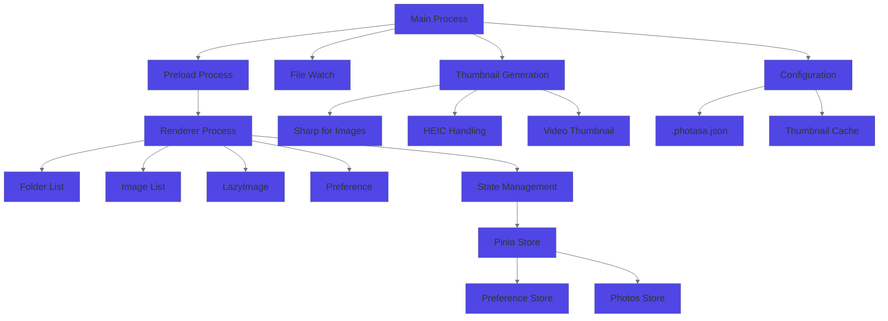
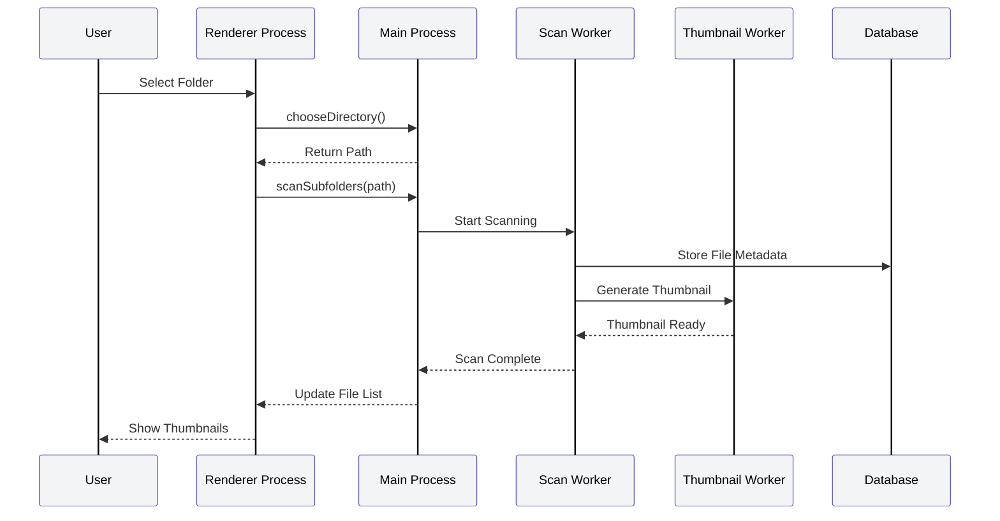
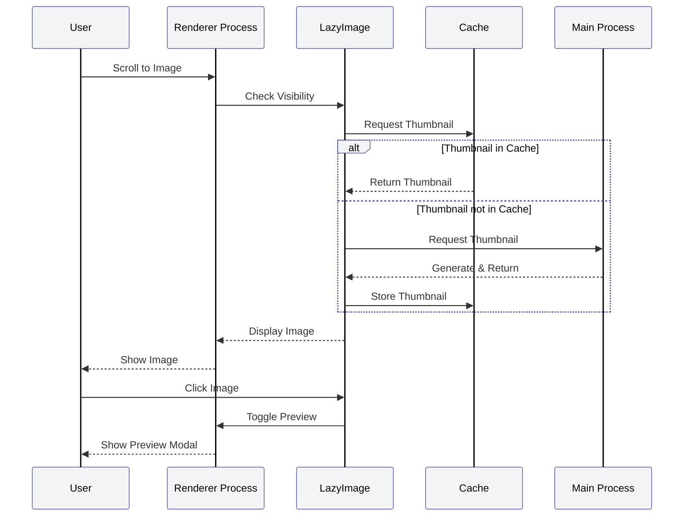
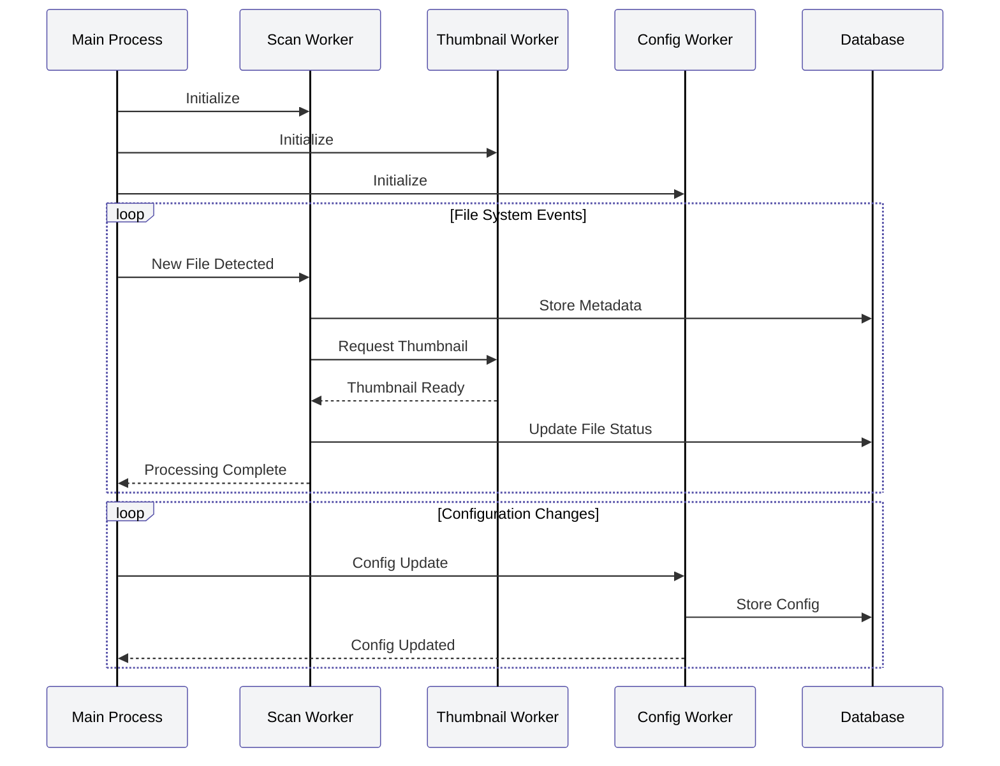
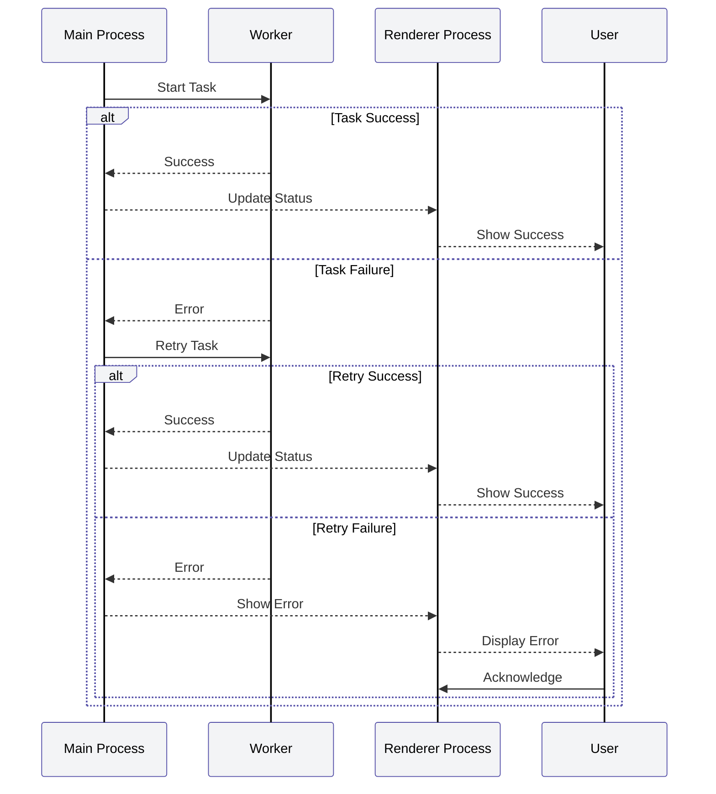
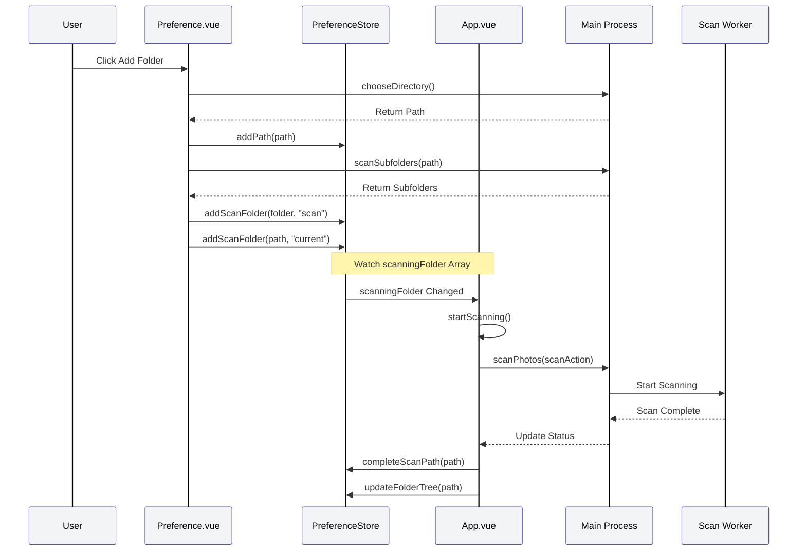

# Photasa Design

## Overview

Photasa is an Electron-based desktop application designed to scan selected folders, generate thumbnails for quick preview, and manage file metadata. The app uses worker processes for asynchronous tasks, Pinia for state management, and Ant Design Vue for the UI.

## 1. Folder Selection & Preference Storage

**Design:**
The user selects folders to scan, and these paths are stored in preferences (using localStorage).

**Code:**

- [`src/renderer/src/components/Preference.vue`](src/renderer/src/components/Preference.vue)
    - UI for folder selection (`chooseDirectory`, `scanSubfolders`).
    - Uses `usePreferenceStore` to manage paths.
- [`src/renderer/src/stores/preference.ts`](src/renderer/src/stores/preference.ts)
    - Pinia store for preferences.
    - `paths` array holds watched folders.
    - `persist: true` enables localStorage persistence.
    - `addPath`, `removePath`, `addScanFolder` manage folder list.

## 2. File Scanning & Database

**Design:**
The app scans selected folders for files and stores file information in a database for quick access.

**Code:**

- [`src/renderer/src/App.vue`](src/renderer/src/App.vue)
    - Calls `scanSubfolders`, `scanPhotosTask.perform` to scan folders.
    - Updates Pinia store and triggers file watching.
- [`src/renderer/src/utils/scan-folder.ts`](src/renderer/src/utils/scan-folder.ts)
    - `scanPhotosTask` and `processScannedFileTask` handle scanning and thumbnail creation.
- [`src/renderer/src/stores/photos.ts`](src/renderer/src/stores/photos.ts)
    - Pinia store for scanned files and their metadata.

## 3. Thumbnail Generation

**Design:**
Thumbnails are generated for each file to enable fast previews in the UI.

**Code:**

- [`src/renderer/src/utils/scan-folder.ts`](src/renderer/src/utils/scan-folder.ts)
    - Uses `createThumbnailTask` to generate thumbnails.
- [`src/renderer/src/utils/api.ts`](src/renderer/src/utils/api.ts)
    - Exposes `createThumbnailTask` and related helpers.
- [`src/renderer/src/components/ImageList.vue`](src/renderer/src/components/ImageList.vue)
    - Displays thumbnails using the `LazyImage` component.

## 4. Worker Processes & Async

**Design:**
Scanning and thumbnail generation are offloaded to worker processes to keep the UI responsive.

**Code:**

- [`src/main/index.ts`](src/main/index.ts)
    - Sets up Electron main process, initializes services:
        - `ThumbnailService`, `ScanService`, `ConfigService`.
- [`src/renderer/src/utils/scan-folder.ts`](src/renderer/src/utils/scan-folder.ts)
    - Uses `vue-concurrency` for async tasks.
- [`src/renderer/src/utils/file-handler.ts`](src/renderer/src/utils/file-handler.ts)
    - Handles file watching and async updates.

## 5. Quick View & Preview

**Design:**
The UI displays thumbnails for fast browsing; clicking a thumbnail shows a preview or opens the file.

**Code:**

- [`src/renderer/src/components/ImageList.vue`](src/renderer/src/components/ImageList.vue)
    - Renders thumbnails and handles preview logic.
- [`src/renderer/src/components/LazyImage.vue`](src/renderer/src/components/LazyImage.vue)
    - Handles lazy loading, preview, and video/image distinction.

## 6. Database & Metadata

**Design:**
File metadata is stored for quick access and management.

**Code:**

- [`src/renderer/src/stores/photos.ts`](src/renderer/src/stores/photos.ts)
    - Manages file metadata in Pinia store.
- [`src/renderer/src/components/FolderList.vue`](src/renderer/src/components/FolderList.vue)
    - UI for browsing folder tree and configs.

## 7. State Management & UI

**Design:**
Uses Pinia for state management and Ant Design Vue for the UI.

**Code:**

- [`src/renderer/src/stores/preference.ts`](src/renderer/src/stores/preference.ts)
    - Pinia for preferences.
- [`src/renderer/src/stores/photos.ts`](src/renderer/src/stores/photos.ts)
    - Pinia for photo metadata.
- Ant Design Vue components used throughout UI files.

## 8. Electron Architecture

**Design:**

- **Main Process:** Handles OS-level tasks, file dialogs, and services.
- **Preload Process:** Exposes safe APIs to the renderer.
- **Renderer Process:** Vue app, UI, and state.

**Code:**

- [`src/main/index.ts`](src/main/index.ts)
    - Main process, sets up Electron window, IPC, and services.
- [`src/preload/index.ts`](src/preload/index.ts)
    - Exposes APIs to renderer via `contextBridge`.
- [`src/renderer/src/App.vue`](src/renderer/src/App.vue)
    - Main Vue entry, orchestrates scanning, state, and UI.

## 9. Documentation

- [`docs/DESIGN.md`](docs/DESIGN.md)
    - Contains high-level design notes and code mappings.

## 10. Architecture Diagram

## 11. Main Process Details

### File Watch System

- Based on the `klaw` package for efficient file system traversal
- Watches multiple directories simultaneously
- Handles file system events (create, modify, delete)
- Maintains a persistent watch state across app restarts

### Worker Processes

1. **Thumbnail Worker**
    - Handles image processing in a separate process
    - Uses Sharp for image manipulation
    - Supports various image formats (JPEG, PNG, WebP)
    - Generates optimized thumbnails for quick loading

2. **Scan Worker**
    - Manages file system scanning
    - Processes new and modified files
    - Updates database with file metadata
    - Triggers thumbnail generation

3. **Config Worker**
    - Manages application configuration
    - Handles persistence of settings
    - Synchronizes config across processes

### Image Processing Pipeline

1. **Image Detection**
    - Identifies supported image formats
    - Extracts metadata (EXIF, dimensions)
    - Determines if thumbnail generation is needed

2. **Thumbnail Generation**
    - Resizes images while maintaining aspect ratio
    - Optimizes for web display
    - Caches results for quick access
    - Handles different image formats appropriately

3. **HEIC Support**
    - Special handling for HEIC images
    - Converts to JPEG for compatibility
    - Preserves original quality
    - Maintains metadata

4. **Video Thumbnails**
    - Extracts frames from video files
    - Generates preview images
    - Supports common video formats
    - Optimizes for quick loading

## 12. Configuration System

### Storage

- `.photasa.json` configuration file
- Stores watched folders
- Maintains application settings
- Persists user preferences

### Cache Management

- Thumbnail cache under `photasaoriginals`
- Efficient storage structure
- Automatic cleanup of unused thumbnails
- Version control for cache format

### State Persistence

- Pinia stores with persistence
- Local storage for preferences
- File system for thumbnails
- Database for file metadata

## 13. Performance Considerations

### Lazy Loading

- Images load only when visible
- Progressive loading of thumbnails
- Efficient memory management
- Background processing of large files

### Caching Strategy

- Multi-level cache system
- Memory cache for active files
- Disk cache for thumbnails
- Metadata cache for quick access

### Worker Process Management

- Efficient process allocation
- Resource usage monitoring
- Automatic cleanup of unused resources
- Error recovery and retry mechanisms

## 14. Security Considerations

### File System Access

- Controlled access to file system
- Validation of file paths
- Safe file operations
- Error handling for permissions

### Data Protection

- Secure storage of preferences
- Safe handling of file metadata
- Protection of user data
- Secure communication between processes

## 15. Error Handling

### Process Management

- Worker process error recovery
- Automatic restart of failed processes
- Error logging and reporting
- User notification system

### File System Errors

- Handling of missing files
- Recovery from file system errors
- Validation of file operations
- Backup of critical data

## 16. Future Considerations

### Scalability

- Support for large photo libraries
- Efficient handling of growing datasets
- Performance optimization for large collections
- Resource management for extended use

### Feature Extensions

- Additional image format support
- Enhanced video processing
- Advanced search capabilities
- Integration with cloud services

## 17. Sequence Diagrams

### File Scanning and Thumbnail Generation

### Image Loading and Preview

### Worker Process Communication

### Error Recovery Flow

## 18. Folder Addition and Scanning Process

### Sequence Diagram

### Troubleshooting Guide

#### Folder Scanning Not Starting

If the scanning process doesn't start after adding a new folder, check the following:

1. **Preference Store State**
    - Verify `scanningFolder` array is properly updated
    - Check if `paths` array contains the new folder
    - Ensure `folderTree` is updated

2. **Watch Triggers**
    - Confirm `watchArray` on `scanningFolder` is working
    - Verify `scanPhotosTask.isIdle` is true
    - Check if `startScanning()` is being called

3. **Worker Process**
    - Ensure Scan Worker is properly initialized
    - Check for any IPC communication errors
    - Verify file system permissions

4. **Common Issues**
    - Duplicate paths in `scanningFolder`
    - Incorrect action type ("scan" vs "current")
    - Missing thumbnail size in scan action
    - File system access permissions

#### Debug Steps

1. Check the console for any errors
2. Verify the `scanningFolder` array in the store
3. Confirm the scan action is properly formatted
4. Ensure the worker process is running
5. Check file system permissions
