## Configuration Storage System Overview

### Core Components
1. **Cache System**
   - In-memory cache with TTL (5 seconds)
   - Cache invalidation on writes
   - Cache clearing functions
   - Directory-level caching

2. **Config Parser**
   - JSON parsing and validation
   - Config normalization
   - Default value handling
   - Error recovery

3. **Error Handler**
   - Graceful error recovery
   - Error logging
   - Queue error handling
   - Batch operation error handling

### File Operations
- `readConfig`: Reads .photasa.json files with caching
- `writeConfig`: Writes to .photasa.json files with batching
- `ensureConfig`: Ensures config file exists
- `parseConfig`: Parses and normalizes config data

### Batch System
- `batchedRead`: Combines multiple reads (50ms interval)
- `batchedWrite`: Combines multiple writes (100ms interval)
- `writeBatch`: Manages write batching (max 50 files)
- `readBatch`: Manages read batching (max 100 files)
- `Batch Manager`: Coordinates batch operations

### Queue System
- `initializeQueue`: Sets up queue with concurrency
- `setupQueueEvents`: Configures queue events
- `addTaskToQueue`: Adds tasks with priority
- `cleanupQueueForFolder`: Cleans up queue
- `Queue Manager`: Manages queue operations

### Public API
- `addToPhotoList`: Adds photos to config
- `removeFromPhotoList`: Removes photos from config
- `getPhotasaConfig`: Gets config for folder
- `resetPhotasaConfig`: Resets config
- `fixPhotasaConfig`: Fixes config paths
- `addToPhotasaConfig`: Adds to config with queue

### Key Features
1. **Performance Optimizations**
   - Batched operations with configurable intervals
   - In-memory caching with TTL
   - Parallel processing for directory operations
   - Queue management with priority

2. **Error Handling**
   - Graceful error recovery
   - Comprehensive error logging
   - Queue error handling
   - Batch operation error handling

3. **Concurrency Control**
   - Queue concurrency limits (10 concurrent tasks)
   - Batch size limits (50 writes, 100 reads)
   - Timeout handling (60 seconds)
   - Priority-based task scheduling

## 序列图

```mermaid
graph TD
    %% Main Module
    A[config-storage.ts] --> B[Core Components]
    A --> C[File Operations]
    A --> D[Batch System]
    A --> E[Queue System]
    A --> F[Public API]

    %% Core Components
    subgraph B[Core Components]
        B1[Cache System]
        B2[Config Parser]
        B3[Error Handler]
    end

    %% File Operations
    subgraph C[File Operations]
        C1[readConfig]
        C2[writeConfig]
        C3[ensureConfig]
        C4[parseConfig]
    end

    %% Batch System
    subgraph D[Batch System]
        D1[batchedRead]
        D2[batchedWrite]
        D3[writeBatch]
        D4[readBatch]
        D5[Batch Manager]
    end

    %% Queue System
    subgraph E[Queue System]
        E1[initializeQueue]
        E2[setupQueueEvents]
        E3[addTaskToQueue]
        E4[cleanupQueueForFolder]
        E5[Queue Manager]
    end

    %% Public API
    subgraph F[Public API]
        F1[addToPhotoList]
        F2[removeFromPhotoList]
        F3[getPhotasaConfig]
        F4[resetPhotasaConfig]
        F5[fixPhotasaConfig]
        F6[addToPhotasaConfig]
    end

    %% Cache System Relationships
    B1 --> C1
    B1 --> C2
    B1 --> D1
    B1 --> D2

    %% File Operation Relationships
    C1 --> C3
    C2 --> C3
    C1 --> C4
    C2 --> C4

    %% Batch System Relationships
    D1 --> D4
    D2 --> D3
    D5 --> D1
    D5 --> D2
    D5 --> D3
    D5 --> D4

    %% Queue System Relationships
    E5 --> E1
    E5 --> E2
    E5 --> E3
    E5 --> E4

    %% Public API Relationships
    F1 --> C1
    F1 --> C2
    F2 --> C1
    F2 --> C2
    F3 --> C1
    F4 --> C1
    F4 --> C2
    F5 --> C1
    F5 --> C2
    F6 --> E5

    %% Data Flow
    C1 -.-> B1
    C2 -.-> B1
    D1 -.-> B1
    D2 -.-> B1
    F6 -.-> E5

    %% Styling
    classDef module fill:#f9f,stroke:#333,stroke-width:4px
    classDef core fill:#f9f,stroke:#333,stroke-width:2px
    classDef file fill:#bbf,stroke:#333,stroke-width:2px
    classDef batch fill:#bfb,stroke:#333,stroke-width:2px
    classDef queue fill:#fbf,stroke:#333,stroke-width:2px
    classDef api fill:#fbb,stroke:#333,stroke-width:2px

    class A module
    class B1,B2,B3 core
    class C1,C2,C3,C4 file
    class D1,D2,D3,D4,D5 batch
    class E1,E2,E3,E4,E5 queue
    class F1,F2,F3,F4,F5,F6 api
```

