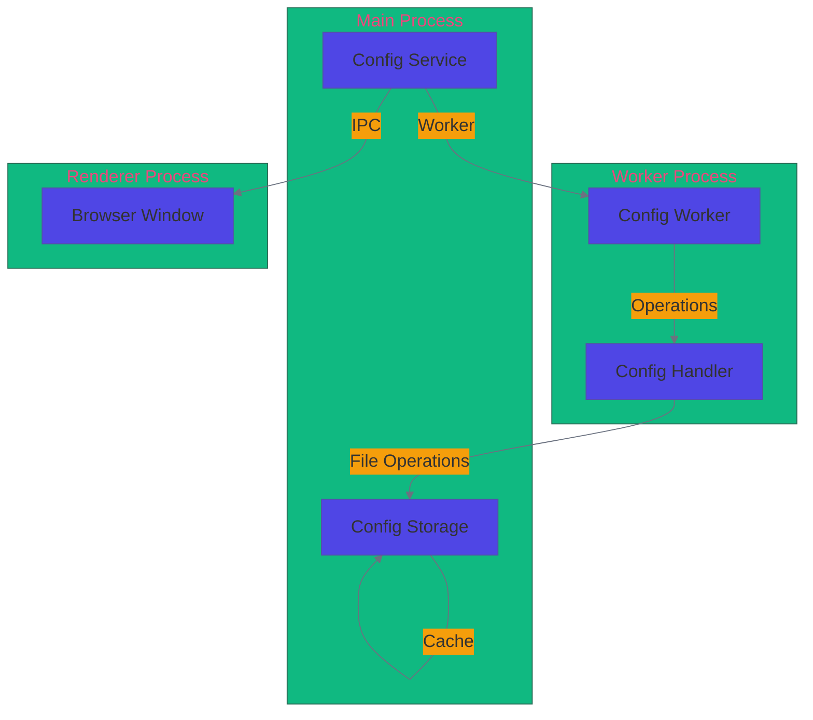

# Configuration System Documentation

## Overview

The configuration system manages `.photasa.json` files for photo and video management. It consists of four main components:

1. **Config Storage** (`config-storage.ts`): Core file operations and caching
2. **Config Handler** (`config-handler.ts`): High-level operations and event handling
3. **Config Service** (`config-service.ts`): IPC and window communication
4. **Config Worker** (`config-worker.ts`): Background processing

## Architecture Diagram



## Component Details

### 1. Config Storage (`config-storage.ts`)

Core module for file operations and caching.

#### Key Features

- **Caching System**
    - TTL-based cache (5 seconds)
    - Directory-level caching
    - Automatic cache invalidation

- **Batch Operations**
    - Write batching (100ms interval, max 50 files)
    - Read batching (50ms interval, max 100 files)
    - Directory-level grouping

- **Queue System**
    - Concurrency control (10 concurrent tasks)
    - Priority-based scheduling
    - Timeout handling (60 seconds)

#### Main Functions

```typescript
// File Operations
readConfig(photo: string, isFile: boolean): Promise<ConfigMetadata>
writeConfig(configPath: string, photoConfig: PhotasaConfig): Promise<void>
ensureConfig(photo: string, isFile: boolean): Promise<string>

// Batch Operations
batchAddToPhotoList(photos: string[]): Promise<PhotasaConfigResult>
batchedRead(path: string): Promise<ConfigMetadata>
batchedWrite(): Promise<void>

// Public API
addToPhotoList(photoPath: string): Promise<PhotasaConfigResult>
removeFromPhotoList(photoPath: string): Promise<PhotasaConfigResult>
getPhotasaConfig(folder: string): Promise<PhotasaConfig>
```

### 1. Config Storage Features

#### Storage Key Features

- **Caching System**
    - TTL-based cache (5 seconds)
    - Directory-level caching
    - Automatic cache invalidation

- **Batch Operations**
    - Write batching (100ms interval, max 50 files)
    - Read batching (50ms interval, max 100 files)
    - Directory-level grouping

- **Queue System**
    - Concurrency control (10 concurrent tasks)
    - Priority-based scheduling
    - Timeout handling (60 seconds)

### 2. Config Handler (`config-handler.ts`)

Handles high-level operations and event management.

#### Key Features

- **Glob Pattern Matching**
    - Recursive directory scanning
    - Pattern: `**/*.photasa.json`

- **Buffer Management**
    - Buffer size: 30 items
    - Automatic buffer flushing

#### Main Functions

```typescript
globPhotasaConfigFromFolders(folder: string): Observable<string>
addConfig(result: any, postMessage: Function, logger: Logger): void
queryConfig(result: { paths: string[] }, postMessage: Function, logger: Logger): void
removeConfig(request: { queueId: number; paths: string[] }, postMessage: Function, logger: Logger): void
```

### 2. Config Handler Features

#### Handler Key Features

- **Glob Pattern Matching**
    - Recursive directory scanning
    - Pattern: `**/*.photasa.json`

- **Buffer Management**
    - Buffer size: 30 items
    - Automatic buffer flushing

### 3. Config Service (`config-service.ts`)

Manages IPC communication and window interactions.

#### Key Features

- **Worker Management**
    - Worker creation and lifecycle
    - Message handling
    - Promise resolution

- **IPC Communication**
    - Event handling
    - Message routing
    - Window communication

#### Main Functions

```typescript
class ConfigService {
    queryConfigs(paths: string[]): void;
    addConfig(paths: string[]): Promise<void>;
}
```

### 3. Config Service Features

#### Service Key Features

- **Worker Management**
    - Worker creation and lifecycle
    - Message handling
    - Promise resolution

- **IPC Communication**
    - Event handling
    - Message routing
    - Window communication

### 4. Config Worker (`config-worker.ts`)

Handles background processing and worker thread operations.

#### Key Features

- **Message Handling**
    - Action routing
    - Error handling
    - Logging

- **Worker Communication**
    - Parent port communication
    - Message parsing
    - Response handling

#### Main Functions

```typescript
// Message Handler
const handler = {
    query: queryConfig,
    add: addConfig,
    remove: removeConfig,
};
```

### 4. Config Worker Features

#### Worker Key Features

- **Message Handling**
    - Action routing
    - Error handling
    - Logging

- **Worker Communication**
    - Parent port communication
    - Message parsing
    - Response handling

## Performance Optimizations

### 1. Caching

- In-memory cache with 5-second TTL
- Directory-level caching
- Automatic cache invalidation

### 2. Batch Processing

- Write batching (100ms interval)
- Read batching (50ms interval)
- Directory-level grouping

### 3. Queue Management

- Concurrency control (10 tasks)
- Priority-based scheduling
- Timeout handling

### 4. Buffer Management

- Configurable buffer sizes
- Automatic buffer flushing
- Memory usage optimization

## Error Handling

### 1. File Operations

- Graceful error recovery
- Automatic retries
- Error logging

### 2. Queue Operations

- Error propagation
- Queue recovery
- Timeout handling

### 3. Worker Operations

- Error isolation
- Process recovery
- Logging

## Usage Examples

### 1. Adding Photos

```typescript
// Add single photo
await addToPhotoList(photoPath);

// Batch add photos
await batchAddToPhotoList(photos, onProgress, onError);
```

### 2. Querying Config

```typescript
// Get config for folder
const config = await getPhotasaConfig(folder);

// Query multiple paths
queryConfig({ paths: folders }, postMessage, logger);
```

### 3. Removing Photos

```typescript
// Remove single photo
await removeFromPhotoList(photoPath);

// Batch remove photos
removeConfig({ queueId: 1, paths: photos }, postMessage, logger);
```

## Configuration Constants

```typescript
const CACHE_TTL = 5000; // 5 seconds
const QUEUE_CONCURRENCY = 10; // Concurrent tasks
const QUEUE_BREAK_THRESHOLD = 200; // Queue size threshold
const DEBOUNCE_DELAY = 30; // 30ms debounce
const QUEUE_TIMEOUT = 60000; // 1 minute timeout
const QUEUE_INTERVAL = 100; // 100ms interval
const QUEUE_INTERVAL_CAP = 100; // Max tasks per interval
const WRITE_BATCH_INTERVAL = 100; // 100ms write batch
const WRITE_BATCH_MAX_SIZE = 50; // Max files per write batch
const READ_BATCH_INTERVAL = 50; // 50ms read batch
const READ_BATCH_MAX_SIZE = 100; // Max files per read batch
```
