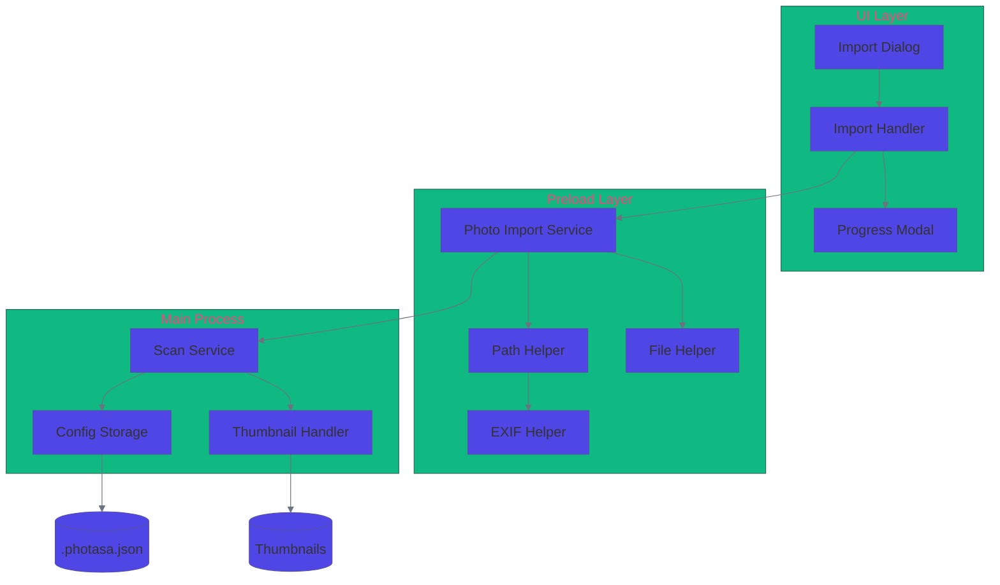
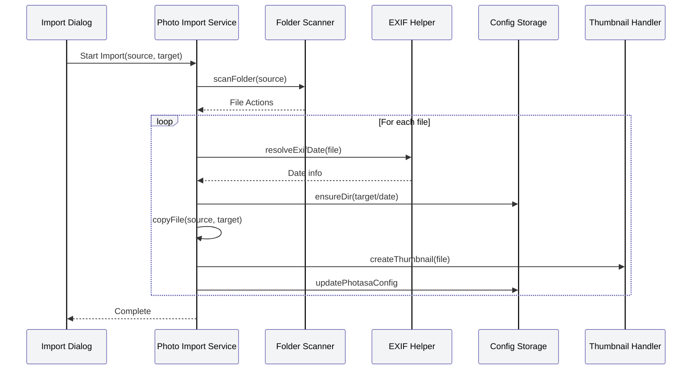
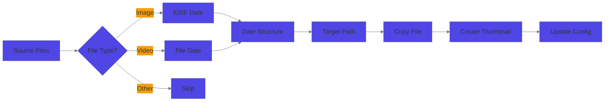
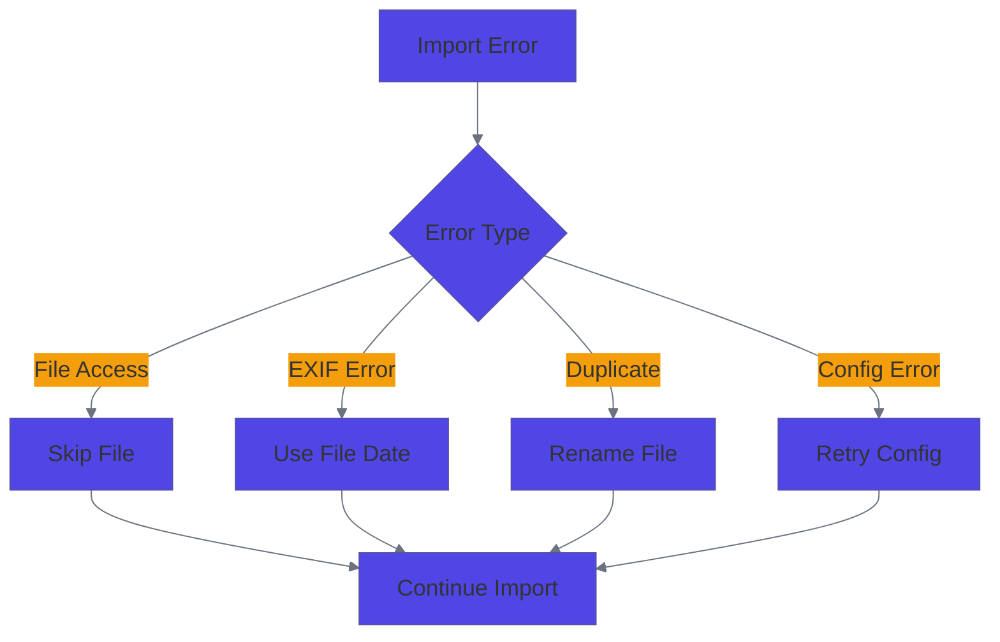
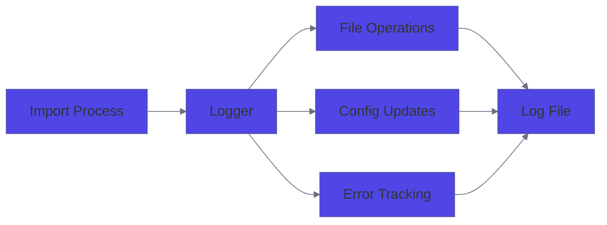

# Photasa Photo Import System Design

## Related Files

### UI Components
- `src/renderer/src/components/ImportPhotos.vue` - Main import dialog component
- `src/renderer/src/App.vue` - App component with import trigger

### Preload Layer
- `src/preload/photo-import.ts` - Main photo import service
- `src/preload/path-helper.ts` - Path and directory management
- `src/preload/exif-helper.ts` - EXIF data extraction
- `src/preload/file-helper.ts` - File operations
- `src/preload/types.ts` - Type definitions

### Main Process
- `src/main/scan-photos.ts` - Photo scanning service
- `src/main/config-storage.ts` - Configuration management
- `src/main/thumbnail-handler.ts` - Thumbnail generation
- `src/main/config-handler.ts` - Configuration operations

### Common
- `src/common/types.d.ts` - Shared type definitions
- `src/common/index.ts` - Common utilities

### Tests
- `src/preload/__tests__/path-helper-scanFolder.spec.ts` - Path helper tests
- `src/preload/__tests__/exif-helper.spec.ts` - EXIF helper tests

### Configuration
- `src/renderer/src/stores/preference.ts` - User preferences store
- `src/renderer/src/utils/api.ts` - API utilities

## Identified Issues and Improvements

### 1. Performance Optimizations
- **Batch Processing**
  - Implement chunked file processing for large directories
  - Add rate limiting for file system operations
  - Use worker threads for thumbnail generation

- **Memory Management**
  - Implement thumbnail cleanup for unused files
  - Add pagination for large photo lists
  - Optimize file watching to prevent memory leaks

### 2. Error Handling
- **Robust Error Recovery**
  - Add retry mechanism for failed operations
  - Implement proper cleanup on errors
  - Standardize error reporting across processes

- **Validation**
  - Add input validation for file paths
  - Validate file types before processing
  - Check disk space before operations

### 3. Code Organization
- **Refactoring Opportunities**
  - Consolidate duplicate scanning logic
  - Centralize configuration management
  - Standardize logging patterns

- **Type Safety**
  - Add strict type checking
  - Improve interface definitions
  - Add runtime type validation

### 4. User Experience
- **Progress Feedback**
  - Add detailed progress reporting
  - Implement cancellation support
  - Show estimated time remaining

- **Recovery Options**
  - Add ability to resume failed imports
  - Implement undo/redo for operations
  - Add backup/restore functionality

## Implementation Plan

### Phase 1: Performance Optimization (2 weeks)

#### 1.1 Batch Processing Implementation
```typescript
// New interface for batch processing
interface BatchConfig {
  chunkSize: number;
  maxConcurrent: number;
  rateLimit: number;
}

// Example implementation in scan-photos.ts
async function processBatch(files: string[], config: BatchConfig) {
  const chunks = chunkArray(files, config.chunkSize);
  for (const chunk of chunks) {
    await Promise.all(
      chunk.map(file => processFile(file))
    );
    await delay(config.rateLimit);
  }
}
```

#### 1.2 Worker Thread Integration
```typescript
// New worker implementation for thumbnails
// src/main/workers/thumbnail-worker.ts
import { parentPort } from 'worker_threads';
import sharp from 'sharp';

parentPort?.on('message', async (data) => {
  const { file, size } = data;
  try {
    await sharp(file)
      .resize(size, size)
      .toFile(generateThumbnailPath(file));
    parentPort?.postMessage({ success: true, file });
  } catch (error) {
    parentPort?.postMessage({ success: false, file, error });
  }
});
```

#### 1.3 Memory Management
- Implement LRU cache for thumbnails
- Add periodic cleanup of unused thumbnails
- Implement pagination for photo lists

### Phase 2: Error Handling (1 week)

#### 2.1 Retry Mechanism
```typescript
// New retry utility
interface RetryConfig {
  maxAttempts: number;
  delay: number;
  backoff: number;
}

async function withRetry<T>(
  operation: () => Promise<T>,
  config: RetryConfig
): Promise<T> {
  let lastError: Error;
  for (let attempt = 1; attempt <= config.maxAttempts; attempt++) {
    try {
      return await operation();
    } catch (error) {
      lastError = error as Error;
      await delay(config.delay * Math.pow(config.backoff, attempt - 1));
    }
  }
  throw lastError!;
}
```

#### 2.2 Error Recovery
- Implement transaction-like operations
- Add rollback capabilities
- Create error recovery queue

### Phase 3: Code Organization (2 weeks)

#### 3.1 Consolidate Scanning Logic
```typescript
// New unified scanning service
class PhotoScanner {
  private config: ScannerConfig;
  private workerPool: WorkerPool;

  async scanDirectory(path: string): Promise<ScanResult> {
    const files = await this.listFiles(path);
    const batches = this.createBatches(files);
    return this.processBatches(batches);
  }
}
```

#### 3.2 Configuration Management
- Create centralized config service
- Implement config validation
- Add config migration support

### Phase 4: User Experience (1 week)

#### 4.1 Progress Reporting
```typescript
// New progress tracking interface
interface ProgressTracker {
  total: number;
  completed: number;
  failed: number;
  currentOperation: string;
  estimatedTimeRemaining: number;
}

// Implementation in scan service
class ScanProgress {
  private startTime: number;
  private tracker: ProgressTracker;

  updateProgress(completed: number, failed: number) {
    this.tracker.completed = completed;
    this.tracker.failed = failed;
    this.tracker.estimatedTimeRemaining = this.calculateETA();
    this.notifyProgress();
  }
}
```

#### 4.2 Recovery Options
- Implement operation history
- Add undo/redo functionality
- Create backup system

### Implementation Timeline

1. **Week 1-2**: Performance Optimization
   - Day 1-3: Batch processing implementation
   - Day 4-7: Worker thread integration
   - Day 8-10: Memory management improvements
   - Day 11-14: Testing and optimization

2. **Week 3**: Error Handling
   - Day 1-2: Retry mechanism implementation
   - Day 3-4: Error recovery system
   - Day 5: Testing and documentation

3. **Week 4-5**: Code Organization
   - Day 1-3: Scanning logic consolidation
   - Day 4-6: Configuration management
   - Day 7-10: Testing and refactoring

4. **Week 6**: User Experience
   - Day 1-2: Progress reporting implementation
   - Day 3-4: Recovery options
   - Day 5: Testing and final polish

### Testing Strategy

1. **Unit Tests**
   - Test each new component in isolation
   - Verify error handling
   - Check performance metrics

2. **Integration Tests**
   - Test component interactions
   - Verify data flow
   - Check system stability

3. **Performance Tests**
   - Measure memory usage
   - Check processing speed
   - Verify scalability

4. **User Acceptance Tests**
   - Verify progress reporting
   - Test recovery options
   - Check error messages

## Overview
The photo import system in Photasa is designed to efficiently scan, organize, and import photos and videos from source directories into a structured target directory. The system uses a date-based organization pattern and maintains metadata in `.photasa.json` configuration files.

## System Architecture



## Directory Structure
```
TargetDirectory/
├── .photasa.json           # Configuration file
├── 2024/
│   ├── 20240315/          # YYYY/YYYYMMDD format
│   │   ├── photo1.jpg
│   │   └── photo2.jpg
│   └── 20240316/
│       └── photo3.jpg
└── 2023/
    └── 20231225/
        └── photo4.jpg
```

## Import Process Sequence



## Data Flow



## Component Details

### 1. Import Dialog (UI)
- Source directory selection
- Target directory selection
- Duplicate handling options
- Progress monitoring

### 2. Photo Import Service
```typescript
interface ImportCallback {
    type: 'next' | 'error' | 'complete';
    action?: {
        targetFileName: string;
    };
    error?: {
        message: string;
    };
}

function importPhotos(
    folders: string[],
    target: string,
    callback: ImportCallback
): void
```

### 3. File Organization
- Date-based structure: YYYY/YYYYMMDD
- EXIF date extraction for images
- File creation date fallback
- Duplicate handling with renaming

### 4. Configuration Storage
```json
{
    "version": "1.0",
    "photoList": [
        {
            "path": "2024/20240315/photo1.jpg",
            "thumbnail": "thumbnails/photo1.jpg",
            "isVideo": false,
            "history": []
        }
    ]
}
```

## Error Handling



## Performance Considerations

1. **Batch Processing**
   - Files are processed in batches
   - Thumbnail generation is queued
   - Config updates are batched

2. **Memory Management**
   - Stream-based file reading
   - EXIF data cleanup
   - Temporary file cleanup

3. **Concurrency**
   - Parallel file processing
   - Thumbnail generation queue
   - Config update queue

## Security Considerations

1. **File Access**
   - Permission checks
   - Path validation
   - Safe file operations

2. **Data Integrity**
   - Config file validation
   - Backup before updates
   - Atomic operations

## Future Enhancements

1. **Planned Features**
   - Custom organization patterns
   - Advanced duplicate detection
   - Batch metadata editing

2. **Potential Improvements**
   - Distributed processing
   - Cloud storage integration
   - AI-based organization

## Monitoring and Logging



## Testing Strategy

1. **Unit Tests**
   - File operations
   - Date extraction
   - Config management

2. **Integration Tests**
   - Full import process
   - Error handling
   - Performance metrics

3. **End-to-End Tests**
   - UI workflows
   - System integration
   - User scenarios
