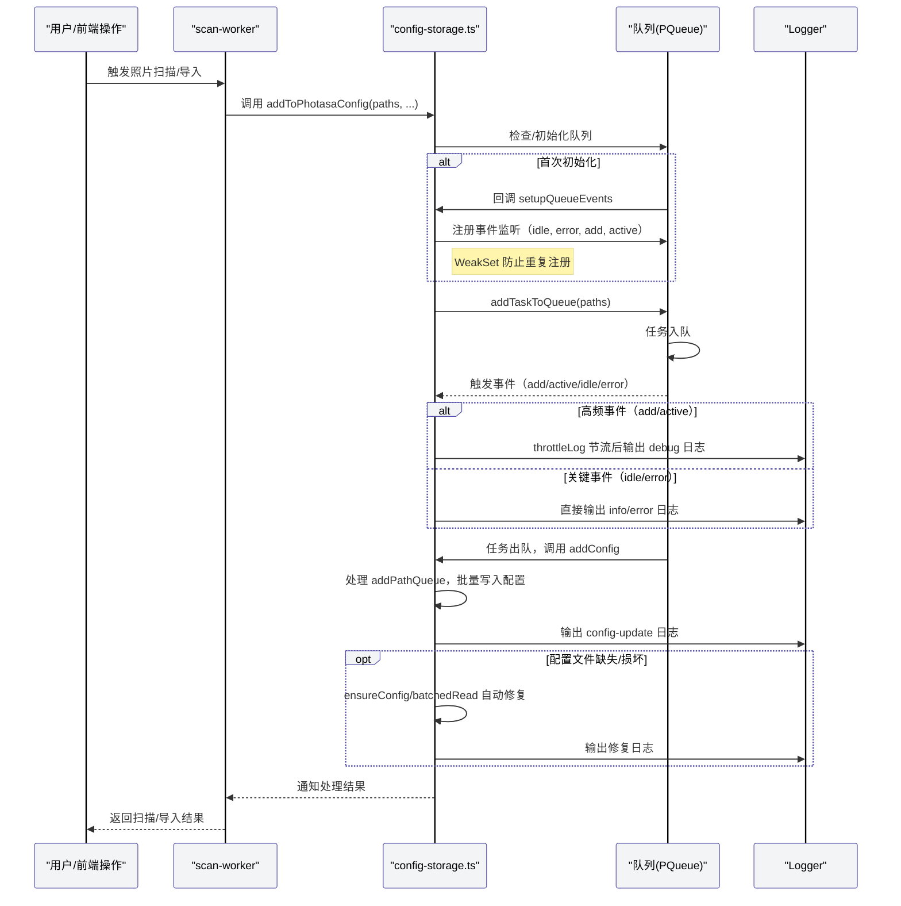

# Photasa 队列日志优化与配置健壮性增强

- 文件名：20240625-队列日志优化与配置健壮性增强.md
- 日期：2025-06-25
- 关联协议：RIPER-5 + 多维 + 代理协议 + AI开发规范

## 背景

在 Photasa 项目开发与调试过程中，发现如下问题：
1. 队列相关高频事件日志（如 active、add）重复、密集，影响日志可读性。
2. setupQueueEvents 可能被重复注册，导致同一事件多次输出。
3. 配置文件（.photasa.json）读取异常、损坏时，健壮性与自动修复能力需增强。
4. 日志环境区分逻辑分散，需统一由 logger 层自动处理。

## 目标

- 避免高频 routine 日志重复输出，提升日志质量。
- 保证队列事件监听不重复注册。
- 配置文件异常时自动修复，增强健壮性。
- 日志环境区分由 logger 层统一控制，业务代码更简洁。

## 主要修改点

1. **队列事件日志节流与合并**
   - 对 active、add 等高频事件日志增加节流（每 1000ms 最多输出一次）。
   - 仅保留 error、idle、waiting 等关键事件日志。
2. **setupQueueEvents 防重复注册**
   - 使用 WeakSet 记录已注册队列，防止重复注册事件监听。
3. **配置文件健壮性增强**
   - ensureConfig 检测到配置文件缺失时自动创建空配置，并输出日志。
   - batchedRead 检测到配置文件损坏/解析失败时自动重建默认配置，并输出日志。
   - 自动修复逻辑保证数据安全，仅在确实无法读取/解析时才重建。
4. **日志环境区分统一**
   - 移除业务代码中的 process.env.NODE_ENV 判断，所有日志直接调用 logger.debug/info/warn/error，由 logger 层根据全局级别自动控制。

## 关键实现

- 节流工具函数 throttleLog，确保高频事件日志每 key 每 interval 只输出一次。
- setupQueueEvents 增加 WeakSet 防止重复注册。
- 详细日志用 debug，普通流程用 info，异常用 warn/error。
- 业务代码更简洁，环境区分完全交由 logger 层处理。

## 效果与注意事项

- 日志输出更聚焦，极大减少重复与无效信息。
- 队列事件监听安全，避免多次注册导致的重复日志。
- 配置文件异常时自动修复，提升系统健壮性。
- 日志分级与环境区分统一，便于维护和扩展。
- 若需调整 routine 日志输出频率，可修改 throttleLog 的 interval 参数。

## 操作序列图

---

本轮修改已全部完成，主流程开发与调试体验大幅提升。
