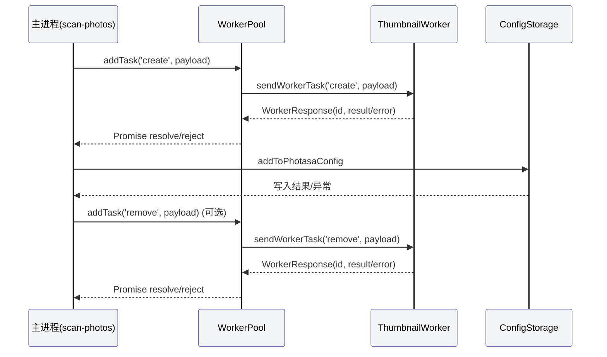
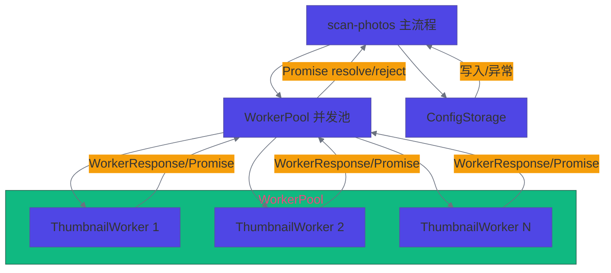

# scan-photos 设计文档

## 1. 设计目标与背景

- 实现高效、类型安全的批量照片扫描与缩略图生成。
- 支持大规模并发处理，主进程与 worker 端通信协议统一。
- 兼容 WorkerPool 并发池架构，提升资源利用率与健壮性。
- 所有异步任务、worker 调用、响应处理均有详细注释与适度日志。

## 2. 主流程说明

1. 主进程遍历目标目录，筛选出需处理的图片/视频文件。
2. 对每个待处理文件，通过 WorkerPool.addTask(action, payload) 分发任务。
3. WorkerPool 自动分配空闲 worker，采用 sendWorkerTask 协议与 worker 通信。
4. worker 端处理任务，完成后回传 WorkerResponse（含唯一 id、结果/错误）。
5. WorkerPool 收到响应后 resolve/reject Promise，主进程继续后续流程。
6. 主进程将处理结果写入配置（addToPhotasaConfig），并记录日志。

## 3. 核心类型与协议

- WorkerMessage<T>: { id: string; action: string; payload: T }
- WorkerResponse<R>: { id: string; result?: R; error?: string }
- WorkerPool.addTask(action: string, payload: T): Promise<R>
- Worker<T, R>: { on, postMessage, terminate }
- ThumbnailRequest, ThumbnailResponse, PhotoFileRequest, ScanAction 等

## 4. 时序图

## 5. 逻辑关系图

## 6. 关键实现要点

- WorkerPool 负责 worker 实例池、任务队列、并发调度。
- 每个任务分发到 worker 时，使用 sendWorkerTask(worker, action, payload) 发送，自动生成唯一 ID、Promise Map、监听响应。
- WorkerPool 的 addTask 返回 sendWorkerTask 的 Promise，任务完成/失败由 worker 响应唯一 ID 触发。
- WorkerPool 只负责分配空闲 worker，所有 worker 端协议与 thumbnail-service 完全一致。
- 主进程与 worker 端类型、结构、调用方式完全统一，类型安全。
- 详细注释与适度日志，便于维护与排查。
