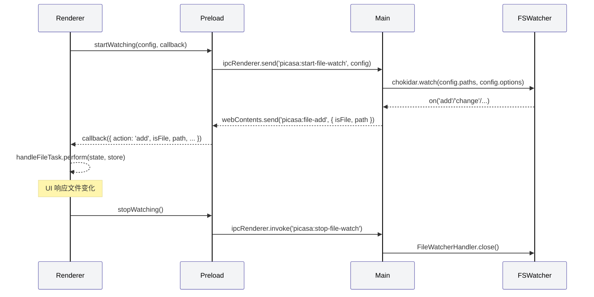

# 目录监听（watching）时序图

本文件描述了 Picasa 项目中目录监听（watching）功能的全链路时序。

```mermaid
%%{init: {'theme':'base', 'themeVariables': { 'fontSize': '24px', 'primaryTextColor': '#000', 'primaryColor': '#2563eb', 'lineColor': '#374151', 'actorBkg': '#f3f4f6', 'actorTextColor': '#000', 'actorLineColor': '#000', 'messageTextColor': '#000', 'messageLineColor': '#000', 'labelTextColor': '#000', 'labelBackground': '#f9fafb', 'labelBorder': '#d1d5db', 'sectionBkgColor': '#f8fafc', 'altSectionBkgColor': '#f1f5f9', 'gridColor': '#e5e7eb', 'secondaryColor': '#f59e0b', 'tertiaryColor': '#10b981'}}}%%
%%{init: {'theme':'base', 'themeVariables': { 'fontSize': '18px', 'primaryTextColor': '#333', 'primaryColor': '#4f46e5', 'lineColor': '#6b7280'}}}%%
sequenceDiagram
    participant Renderer
    participant Preload
    participant Main
    participant FSWatcher

    Renderer->>Preload: startWatching(config, callback)
    Preload->>Main: ipcRenderer.send('picasa:start-file-watch', config)
    Main->>FSWatcher: chokidar.watch(config.paths, config.options)
    FSWatcher-->>Main: on('add'/'change'/...)
    Main-->>Preload: webContents.send('picasa:file-add', { isFile, path })
    Preload-->>Renderer: callback({ action: 'add', isFile, path, ... })
    Renderer-->>Renderer: handleFileTask.perform(state, store)
    Note over Renderer: UI 响应文件变化

    Renderer->>Preload: stopWatching()
    Preload->>Main: ipcRenderer.invoke('picasa:stop-file-watch')
    Main->>FSWatcher: FileWatcherHandler.close()
```

## 说明
- Renderer 通过 Preload 层发起监听请求，主进程用 chokidar 监听目录。
- 文件变化事件通过 IPC 逐层传递，最终驱动前端 UI 自动刷新。
- 支持随时关闭监听，资源及时释放。
