# Photasa 系统架构设计文档

> **历史文档（historical）**：路径与进程模型以 `legacy-api contract` 为准。当前实现为 **Tauri**（`apps/photasa` + `crates/photasa-*`）。请参阅 [ROADMAP.md](../../ROADMAP.md) 与 `docs/DEV_GUIDE.md`。

> **版本**: 2.0.0
> **创建日期**: 2025-01-23
> **最后更新**: 2025-01-23
> **基于**: RFC 0035, 0038, 0042, 0046, 0047, 0048

---

## 📚 目录

- [架构概览](#架构概览)
- [三界分层架构](#三界分层架构)
- [天界引擎系统](#天界引擎系统)
- [人界服务系统](#人界服务系统)
- [通信系统](#通信系统)
- [数据流架构](#数据流架构)
- [Store架构](#store架构)
- [持久化架构](#持久化架构)
- [关键业务流程](#关键业务流程)
- [架构原则](#架构原则)

---

## 架构概览

Photasa 采用基于中国古代神话主题的三界分层架构，通过双通信系统（启奏-圣旨 + 奏折-诏令）实现天界（Main进程）和人界（Renderer进程）的协调工作。

### 核心设计理念

1. **三界分层**：天界（Main进程）负责核心业务逻辑，人界（Renderer进程）负责UI交互
2. **引擎专业化**：每个引擎专注单一职责，通过太乙适配器统一调度
3. **工作流驱动**：天枢引擎通过YAML工作流编排复杂业务流程
4. **双通信系统**：启奏-圣旨用于跨部门协调，奏折-诏令用于内政事务和持久化
5. **Store SSOT**：Store作为单一真相源，状态机制驱动执行

### 整体架构图

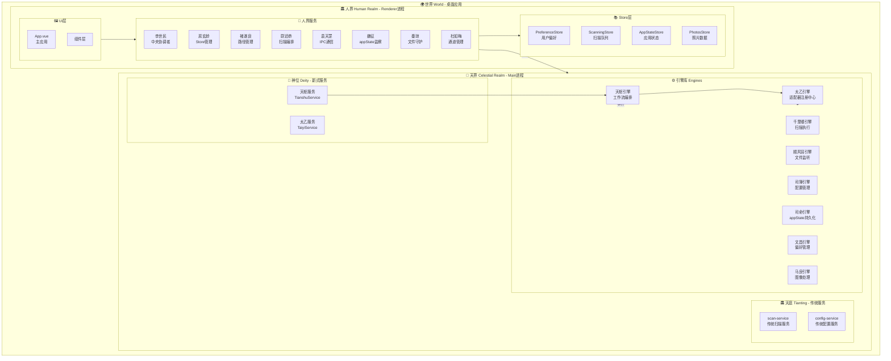
```mermaid
graph TB
 subgraph World["🌍 世界 World - 桌面应用"]
 subgraph Main["🌌 天界 Celestial Realm - Main进程"]
 subgraph Tianting["🏛️ 天庭 Tianting - 传统服务"]
 ScanService[scan-service<br/>传统扫描服务]
 ConfigService[config-service<br/>传统配置服务]
 end

 subgraph Deity["👑 神位 Deity - 新式服务"]
 TianshuService[天枢服务<br/>TianshuService]
 TaiyiService[太乙服务<br/>TaiyiService]
 end

 subgraph Engines["⚙️ 引擎库 Engines"]
 Tianshu[天枢引擎<br/>工作流编排]
 Taiyi[太乙引擎<br/>适配器注册中心]
 Qianliyan[千里眼引擎<br/>扫描执行]
 Shunfenger[顺风耳引擎<br/>文件监听]
 Sibu[司簿引擎<br/>配置管理]
 Siming[司命引擎<br/>appState持久化]
 Wenchang[文昌引擎<br/>偏好管理]
 Maliang[马良引擎<br/>图像处理]
 end
 end

 subgraph Renderer["🏛️ 人界 Human Realm - Renderer进程"]
 subgraph Services["👥 人界服务"]
 Lishimin[李世民<br/>中央协调者]
 FangXuanLing[房玄龄<br/>Store管理]
 ChuSuiLiang[褚遂良<br/>路径管理]
 YuChiGong[尉迟恭<br/>扫描编排]
 YuanTianGang[袁天罡<br/>IPC通信]
 WeiZheng[魏征<br/>appState监察]
 QinQiong[秦琼<br/>文件守护]
 DuRuHui[杜如晦<br/>通道管理]
 end

 subgraph Stores["📚 Store层"]
 PreferenceStore[PreferenceStore<br/>用户偏好]
 ScanningStore[ScanningStore<br/>扫描队列]
 AppStateStore[AppStateStore<br/>应用状态]
 PhotosStore[PhotosStore<br/>照片数据]
 end

 subgraph UI["🖼️ UI层"]
 App[App.vue<br/>主应用]
 Components[组件层]
 end
 end
 end

 UI --> Services
 Services --> Stores
 Services -->|IPC| Main
 TianshuService --> Tianshu
 Tianshu --> Taiyi
 Taiyi --> Engines
 Engines -->|事件| Main
```

---

## 三界分层架构

### 三界职责划分

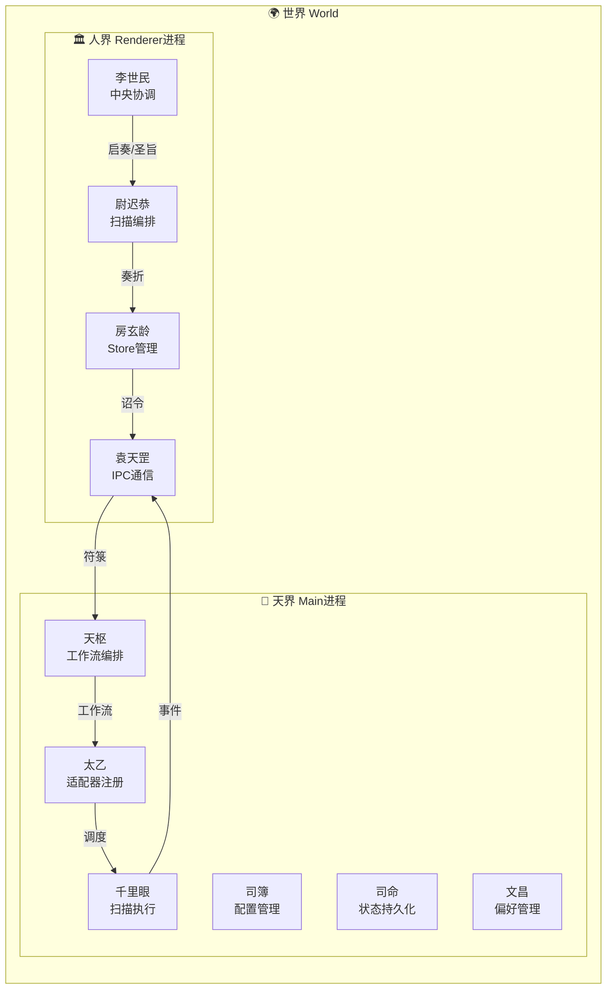
```mermaid
graph LR
 subgraph World["🌍 世界 World"]
 subgraph Main["🌌 天界 Main进程"]
 A1[天枢<br/>工作流编排]
 A2[太乙<br/>适配器注册]
 A3[千里眼<br/>扫描执行]
 A4[司簿<br/>配置管理]
 A5[司命<br/>状态持久化]
 A6[文昌<br/>偏好管理]
 end

 subgraph Renderer["🏛️ 人界 Renderer进程"]
 R1[李世民<br/>中央协调]
 R2[房玄龄<br/>Store管理]
 R3[尉迟恭<br/>扫描编排]
 R4[袁天罡<br/>IPC通信]
 end
 end

 R1 -->|启奏/圣旨| R3
 R3 -->|奏折| R2
 R2 -->|诏令| R4
 R4 -->|符箓| A1
 A1 -->|工作流| A2
 A2 -->|调度| A3
 A3 -->|事件| R4
```

### 三界详细说明

| 层级       | 进程         | 职责                               | 关键组件                                                   |
| ---------- | ------------ | ---------------------------------- | ---------------------------------------------------------- |
| **天界**   | Main进程     | 核心业务逻辑、数据持久化、引擎调度 | 天枢、太乙、千里眼、司簿、司命、文昌、马良                 |
| **人界**   | Renderer进程 | UI交互、状态管理、用户操作         | 李世民、房玄龄、尉迟恭、袁天罡、魏征、褚遂良、秦琼、杜如晦 |
| **引擎库** | 共享         | 专业引擎实现，环境无关             | `src/engines/` 目录下所有引擎                              |

---

## 天界引擎系统

### 引擎架构总览

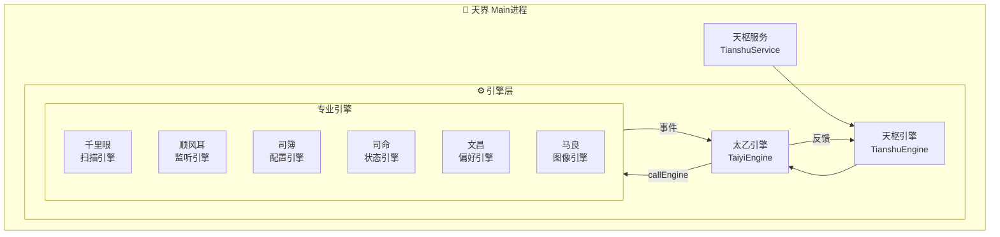
```mermaid
graph TB
 subgraph Main["🌌 天界 Main进程"]
 TianshuService[天枢服务<br/>TianshuService]

 subgraph Engines["⚙️ 引擎层"]
 Tianshu[天枢引擎<br/>TianshuEngine]
 Taiyi[太乙引擎<br/>TaiyiEngine]

 subgraph Specialized["专业引擎"]
 Qianliyan[千里眼<br/>扫描引擎]
 Shunfenger[顺风耳<br/>监听引擎]
 Sibu[司簿<br/>配置引擎]
 Siming[司命<br/>状态引擎]
 Wenchang[文昌<br/>偏好引擎]
 Maliang[马良<br/>图像引擎]
 end
 end
 end

 TianshuService --> Tianshu
 Tianshu --> Taiyi
 Taiyi -->|callEngine| Specialized
 Specialized -->|事件| Taiyi
 Taiyi -->|反馈| Tianshu
```

### 1. 天枢引擎 (Tianshu Engine)

**神话背景**: 北斗七星第一星，掌管天地秩序

**职责**:

- 📋 工作流编排 - 执行 YAML 工作流定义
- 🎯 用户意图解析 - 将用户意图转换为工作流
- 🔄 引擎协调 - 通过太乙调度各专业引擎
- 📊 进度汇总 - 收集并汇报工作流执行状态

**核心能力**:

```typescript
// 工作流执行
processCommand(uiCommand: UICommand): Promise<WorkflowResult>
selectWorkflow(intent: UserIntent): WorkflowDefinition
executeWorkflow(workflow: WorkflowDefinition): Promise<void>
```

**工作流执行流程**:

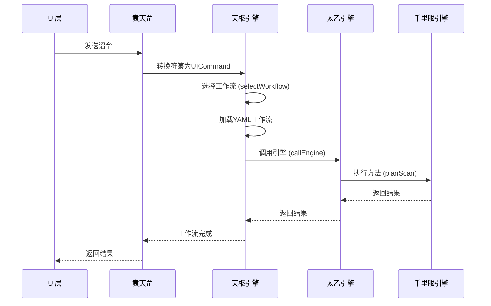
```mermaid
sequenceDiagram
 participant UI as UI层
 participant YTG as 袁天罡
 participant TS as 天枢引擎
 participant TY as 太乙引擎
 participant QLY as 千里眼引擎

 UI->>YTG: 发送诏令
 YTG->>TS: 转换符箓为UICommand
 TS->>TS: 选择工作流 (selectWorkflow)
 TS->>TS: 加载YAML工作流
 TS->>TY: 调用引擎 (callEngine)
 TY->>QLY: 执行方法 (planScan)
 QLY-->>TY: 返回结果
 TY-->>TS: 返回结果
 TS-->>YTG: 工作流完成
 YTG-->>UI: 返回结果
```

**位置**: `src/engines/tianshu/`
**托管**: `src/main/deity/tianshu-service.ts`
**持久化**: 不涉及持久化

---

### 2. 太乙引擎 (Taiyi Engine)

**神话背景**: 太乙真人，道教神仙，掌管万物调度

**职责**:

- 🔌 适配器注册 - 管理 `@Adapter` 装饰器注册系统
- 📞 引擎调度 - 代理天枢对各引擎的调用
- 🔗 接口适配 - 标准化引擎调用接口
- 🔄 生命周期管理 - 引擎初始化、健康检查、关闭

**适配器注册机制**:

```mermaid
graph LR
 A[引擎实现] -->|@Adapter装饰器| B[AdapterRegistry]
 B -->|注册| C[适配器实例]
 C -->|initialize| D[引擎初始化]
 D -->|ready| E[可调用]

 F[天枢调用] -->|callEngine| G[太乙引擎]
 G -->|查找适配器| C
 C -->|调用方法| A
 A -->|返回结果| G
 G -->|返回| F
```

**核心能力**:

```typescript
// 引擎调度
callEngine<T>(engineName: string, methodName: string, ...args: any[]): Promise<EngineCallResult<T>>

// 适配器注册
@Adapter({
 name: "qianliyan",
 priority: AdapterPriority.High,
 engineType: "scan"
})
class QianliyanAdapter implements IAdapter { ... }
```

**位置**: `src/engines/taiyi/`
**持久化**: 不涉及持久化

---

### 3. 千里眼引擎 (Qianliyan Engine)

**神话背景**: 千里眼，能看千里之外的神仙

**职责**:

- 🔍 扫描执行 - 遍历文件系统，识别照片/视频
- 📝 扫描队列管理 - 管理扫描任务队列
- 💾 队列持久化 - 保存/恢复扫描队列到 `scanning.json`
- 📊 进度报告 - 实时报告扫描进度

**队列管理机制**:

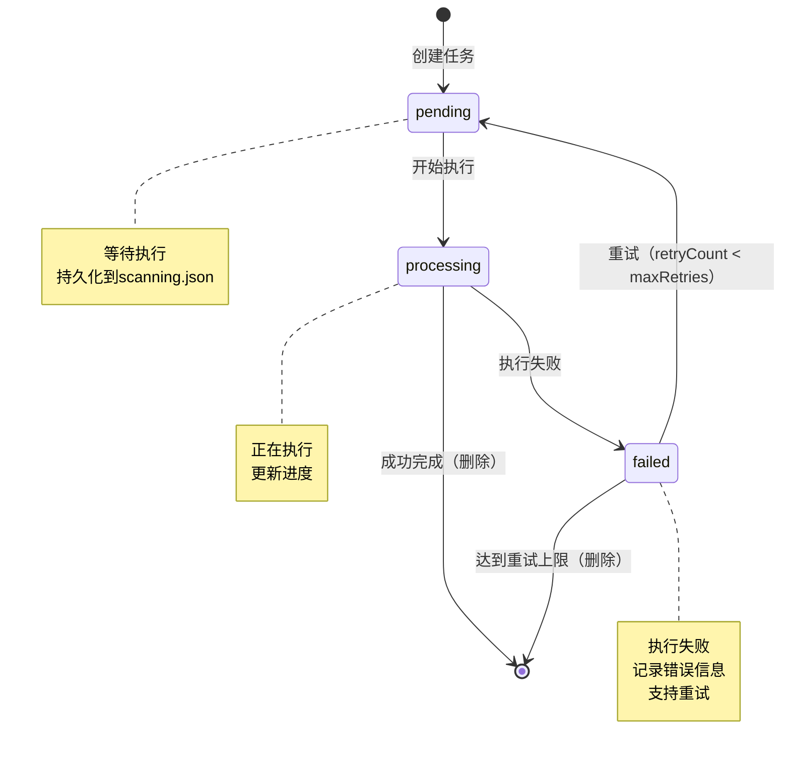
```mermaid
stateDiagram-v2
 [*] --> pending: 创建任务
 pending --> processing: 开始执行
 processing --> [*]: 成功完成（删除）
 processing --> failed: 执行失败
 failed --> pending: 重试（retryCount < maxRetries）
 failed --> [*]: 达到重试上限（删除）

 note right of pending
 等待执行
 持久化到scanning.json
 end note

 note right of processing
 正在执行
 更新进度
 end note

 note right of failed
 执行失败
 记录错误信息
 支持重试
 end note
```

**核心能力**:

```typescript
// 扫描执行
planScan(command: ScanCommand): Promise<string>
scan(command: ScanCommand): Promise<ScanResult>

// 队列管理
persistQueue(queue: ScanCommand[]): Promise<void>
restoreQueue(): Promise<ScanCommand[]>
clearQueue(): Promise<void>

// 进度报告
reportProgress(progress: ScanProgress): void
reportResult(result: ScanResult): void
```

**位置**: `src/engines/qianliyan/`
**持久化**: `~/.photasa/scan/scanning.json`

**与scan-service的关系**:

- scan-service 已设计良好，不需要改变
- 千里眼适配器将包装 scan-service
- 遵循标准适配器模式（参考文昌、司命适配器）

---

### 4. 顺风耳引擎 (Shunfenger Engine)

**神话背景**: 顺风耳，千里眼的好友，拥有超凡的听力

**职责**:

- 👂 文件系统监听 - 监听文件夹的创建、修改、删除事件
- 📋 监听配置管理 - 管理多个监听 Profile
- 🔄 事件归一化 - 将 chokidar 事件转换为标准 FileObservation
- ⚡ 事件缓冲 - 高效的事件去重、批处理和动态节流

**监听流程**:

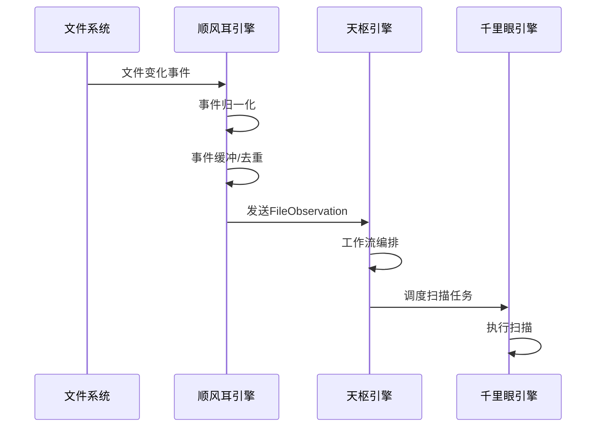
```mermaid
sequenceDiagram
 participant FS as 文件系统
 participant SF as 顺风耳引擎
 participant TS as 天枢引擎
 participant QLY as 千里眼引擎

 FS->>SF: 文件变化事件
 SF->>SF: 事件归一化
 SF->>SF: 事件缓冲/去重
 SF->>TS: 发送FileObservation
 TS->>TS: 工作流编排
 TS->>QLY: 调度扫描任务
 QLY->>QLY: 执行扫描
```

**位置**: `src/engines/shunfenger/`
**持久化**: `~/.photasa/watch/profiles.json`

---

### 5. 司簿引擎 (Sibu Engine)

**神话背景**: 司簿，掌管文书档案的官职

**职责**:

- 📄 照片文件夹 manifest 管理 - 每个照片文件夹的 `.photasa.json`
- 📊 扫描元信息管理 - lastFullScanAt, 变更计数, TTL
- 📋 照片清单管理 - 文件夹内照片列表

**Manifest结构**:

```json
{
    "folderId": "hash-of-path",
    "lastFullScanAt": "2025-01-23T10:30:00Z",
    "photos": ["IMG_001.jpg", "IMG_002.jpg"],
    "changeCount": 0,
    "scanStrategy": "smart",
    "ttl": 86400,
    "version": "1.0"
}
```

**位置**: `src/engines/sibu/`
**持久化**: 每个照片文件夹内的 `.photasa.json`

---

### 6. 司命引擎 (Siming Engine)

**神话背景**: 司命，掌管生死簿的神祇

**职责**:

- 📦 通用 appState 持久化 - 管理应用级运行时状态
- 💾 状态恢复 - 应用启动时恢复状态
- 🔧 状态管理 - 增删改查应用状态

**核心能力**:

```typescript
// appState 持久化
persistAppState(key: string, value: unknown): Promise<void>
restoreAppState<T>(key: string): Promise<T | null>
clearAppState(key: string): Promise<void>
listAppStateKeys(): Promise<string[]>
```

**位置**: `src/engines/siming/`
**持久化**: `~/.photasa/appState/{key}.json`

---

### 7. 文昌引擎 (Wenchang Engine)

**神话背景**: 文昌帝君，掌管文章和学问的神祇

**职责**:

- ⚙️ 用户偏好管理 - 主题、语言、UI设置
- 🔄 偏好同步 - 天界持久化，人界镜像
- 📡 变更推送 - 推送偏好更新到 UI

**核心能力**:

```typescript
// 偏好管理
getCurrentSnapshot(): PreferenceSnapshot
applyDelta(delta: PreferenceDelta): Promise<number>
resetToDefaults(): Promise<PreferenceSnapshot>
getRevision(): number
```

**位置**: `src/engines/wenchang/`
**持久化**: `~/.photasa/preferences/`

---

### 8. 马良引擎 (MaLiang Engine)

**神话背景**: 马良神笔，能画出真实物体的神笔

**职责**:

- 🖼️ 图像处理 - 格式转换、缩略图生成
- 🎨 图像编辑 - 裁剪、旋转、滤镜
- 📐 格式支持 - HEIC/JPEG/PNG/WebP/TIFF/GIF/AVIF

**神笔架构（Brush Pattern）**:

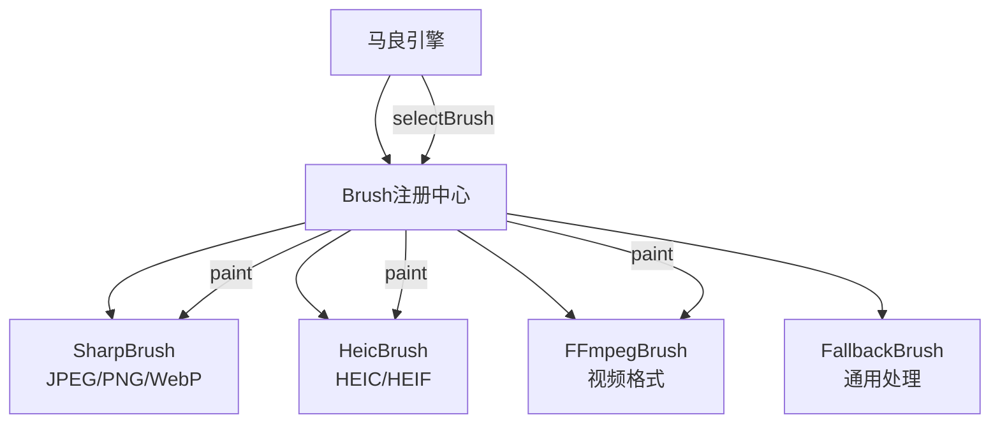
```mermaid
graph TB
 ML[马良引擎] --> BR[Brush注册中心]
 BR --> SB[SharpBrush<br/>JPEG/PNG/WebP]
 BR --> HB[HeicBrush<br/>HEIC/HEIF]
 BR --> FB[FFmpegBrush<br/>视频格式]
 BR --> FB2[FallbackBrush<br/>通用处理]

 ML -->|selectBrush| BR
 BR -->|paint| SB
 BR -->|paint| HB
 BR -->|paint| FB
```

**位置**: `src/engines/maliang/`
**持久化**: 不涉及持久化（处理图像，不存储状态）

---

## 人界服务系统

### 服务架构总览

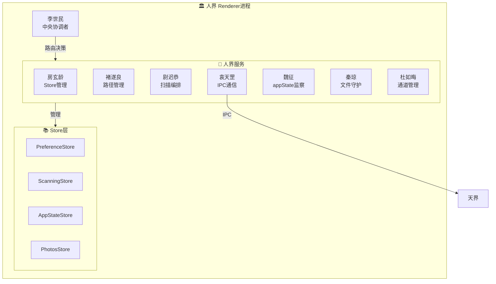
```mermaid
graph TB
 subgraph Renderer["🏛️ 人界 Renderer进程"]
 LSM[李世民<br/>中央协调者]

 subgraph Services["👥 人界服务"]
 FXL[房玄龄<br/>Store管理]
 CSL[褚遂良<br/>路径管理]
 YCG[尉迟恭<br/>扫描编排]
 YTG[袁天罡<br/>IPC通信]
 WZ[魏征<br/>appState监察]
 QQ[秦琼<br/>文件守护]
 DRH[杜如晦<br/>通道管理]
 end

 subgraph Stores["📚 Store层"]
 PS[PreferenceStore]
 SS[ScanningStore]
 AS[AppStateStore]
 PHS[PhotosStore]
 end
 end

 LSM -->|路由决策| Services
 Services -->|管理| Stores
 YTG -->|IPC| Main[天界]
```

### 1. 李世民 (LiShimin) - 中央协调者

**神话背景**: 唐太宗李世民，大唐朝廷总管

**职责**:

- 👑 统筹朝廷百官就任（服务初始化与依赖注入）
- 🔀 建立启奏-圣旨系统（qizou-shengzhi架构）
- 📋 开启贞观之治（应用生命周期管理）
- 🎯 中央路由决策（根据event-routing.yml路由启奏）

**启奏-圣旨系统架构**:

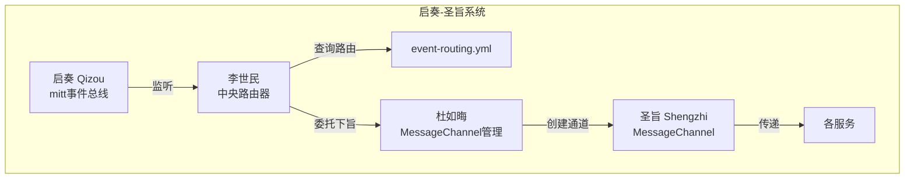
```mermaid
graph TB
 subgraph System["启奏-圣旨系统"]
 QZ[启奏 Qizou<br/>mitt事件总线]
 LSM[李世民<br/>中央路由器]
 DRH[杜如晦<br/>MessageChannel管理]
 SZ[圣旨 Shengzhi<br/>MessageChannel]

 QZ -->|监听| LSM
 LSM -->|查询路由| ER[event-routing.yml]
 LSM -->|委托下旨| DRH
 DRH -->|创建通道| SZ
 SZ -->|传递| Service[各服务]
 end
```

**核心能力**:

```typescript
// 服务初始化
startZhengguan(): Promise<void>

// 启奏路由
routeQizou(qizou: Qizou): void

// 下旨
issueShengzhi(serviceName: string, shengzhi: Shengzhi): void
```

**位置**: `src/renderer/src/services/lishimin/`
**关键文件**:

- `lishimin.ts` - 主服务类
- `router.ts` - 启奏路由器

---

### 2. 房玄龄 (FangXuanLing) - Store管理

**神话背景**: 房玄龄，唐朝名相，以勤政爱民、善于统筹著称

**职责**:

- 📚 统一管理所有Store（PreferenceStore、ScanningStore、AppStateStore等）
- 📝 处理奏折（Zouzhe）并转换为诏令（Zhaoling）
- 🔄 Store自动化同步（通过matter-sync.yml配置）
- 🚫 禁止服务直接访问Store（必须通过房玄龄）

**Store管理架构**:

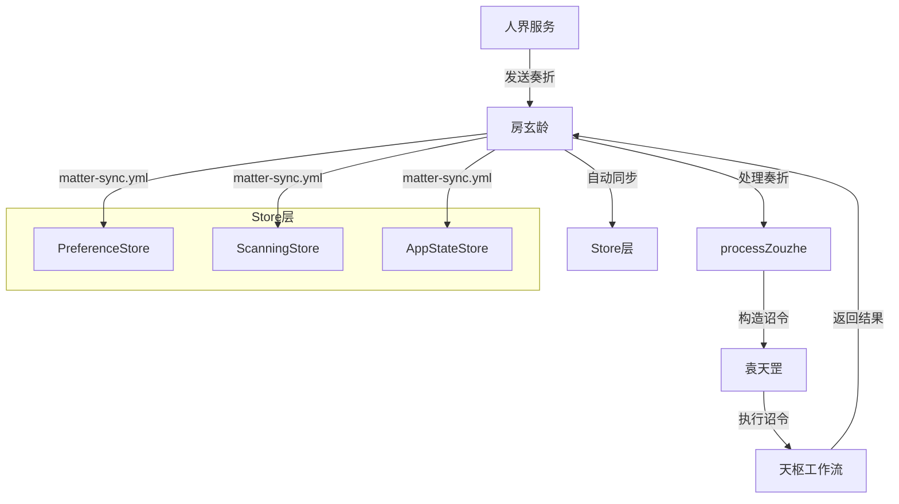
```mermaid
graph TB
 Service[人界服务] -->|发送奏折| FXL[房玄龄]
 FXL -->|处理奏折| Process[processZouzhe]
 Process -->|构造诏令| YTG[袁天罡]
 YTG -->|执行诏令| TS[天枢工作流]
 TS -->|返回结果| FXL
 FXL -->|自动同步| Store[Store层]

 subgraph Stores["Store层"]
 PS[PreferenceStore]
 SS[ScanningStore]
 AS[AppStateStore]
 end

 FXL -->|matter-sync.yml| PS
 FXL -->|matter-sync.yml| SS
 FXL -->|matter-sync.yml| AS
```

**核心能力**:

```typescript
// 奏折处理
processZouzhe(zouzhe: Zouzhe): Promise<ZouzheResponse>

// Store访问器
get scanning(): IScanning
get preference(): IPreference
get appState(): IAppState

// Store自动化同步
syncStoreWithSnapshot(matter: string, snapshot: unknown): void
```

**位置**: `src/renderer/src/services/fangxuanling/`
**关键文件**:

- `fangxuanling.ts` - 主服务类
- `stores/scanning-store.ts` - ScanningStore定义

---

### 3. 褚遂良 (ChuSuiLiang) - 路径管理

**神话背景**: 褚遂良，唐朝名臣，以书法和政务能力著称

**职责**:

- 📁 路径添加/删除管理
- ✅ 路径验证和去重
- 📤 启奏路径操作完成

**核心能力**:

```typescript
// 路径管理
handleAddPath(shengzhi: Shengzhi): Promise<void>
handleRemovePath(shengzhi: Shengzhi): Promise<void>

// 启奏
emitQizou(matter: string, content: unknown): void
```

**位置**: `src/renderer/src/services/chusuiliang/`

---

### 4. 尉迟恭 (YuChiGong) - 扫描编排

**神话背景**: 尉迟恭，唐朝名将，以勇猛和忠诚著称

**职责**:

- 🛡️ 接收扫描任务圣旨（add_scan_task / remove_scan_task）
- ⚙️ 主动控制扫描任务执行（使用 p-queue）
- 📝 创建ScanAction对象并发送ADD_SCAN_ACTION奏折
- 📤 通过qizou启奏向李世民汇报任务结果

**扫描编排架构（RFC 0048 v3）**:

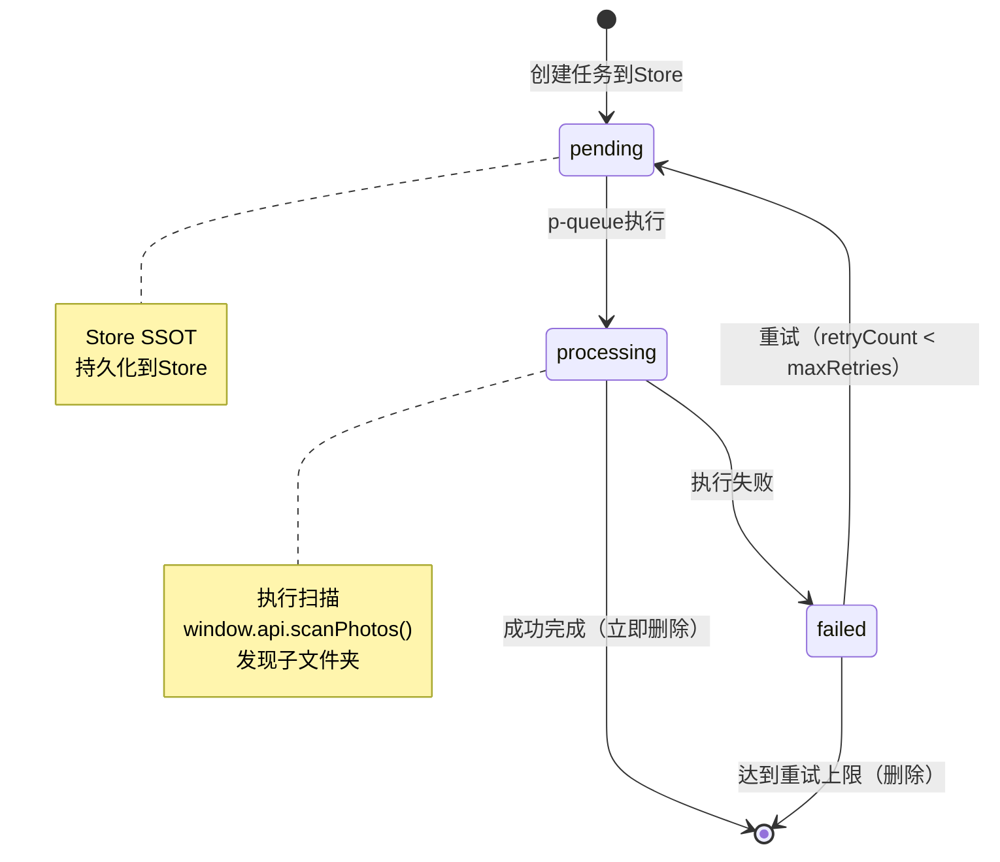
```mermaid
stateDiagram-v2
 [*] --> pending: 创建任务到Store
 pending --> processing: p-queue执行
 processing --> [*]: 成功完成（立即删除）
 processing --> failed: 执行失败
 failed --> pending: 重试（retryCount < maxRetries）
 failed --> [*]: 达到重试上限（删除）

 note right of pending
 Store SSOT
 持久化到Store
 end note

 note right of processing
 执行扫描
 window.api.scanPhotos()
 发现子文件夹
 end note
```

**核心能力**:

```typescript
// 扫描编排
handleAddScanTask(shengzhi: Shengzhi): Promise<void>
handleRemoveScanTask(shengzhi: Shengzhi): Promise<void>

// 执行扫描
private async executeScan(
 path: string,
 action: "scan" | "rescan" | "current",
 operationType: "directory" | "file"
): Promise<void>

// 状态管理
private async updateTaskStatus(
 path: string,
 status: "pending" | "processing" | "failed",
 updates: Partial<ScanQueueItem>
): Promise<void>
```

**位置**: `src/renderer/src/services/yuchigong/`
**关键文件**: `yuchigong.ts`

---

### 5. 袁天罡 (YuanTianGang) - IPC通信

**神话背景**: 袁天罡，唐朝著名相士和天文学家

**职责**:

- 🔮 监听天界IPC事件
- 📜 转换诏令（Zhaoling）为符箓（Fulu）
- 🎯 转换符箓为UICommand并调用天枢
- 📡 处理天界事件映射（event-mapping.yml）

**IPC通信流程**:

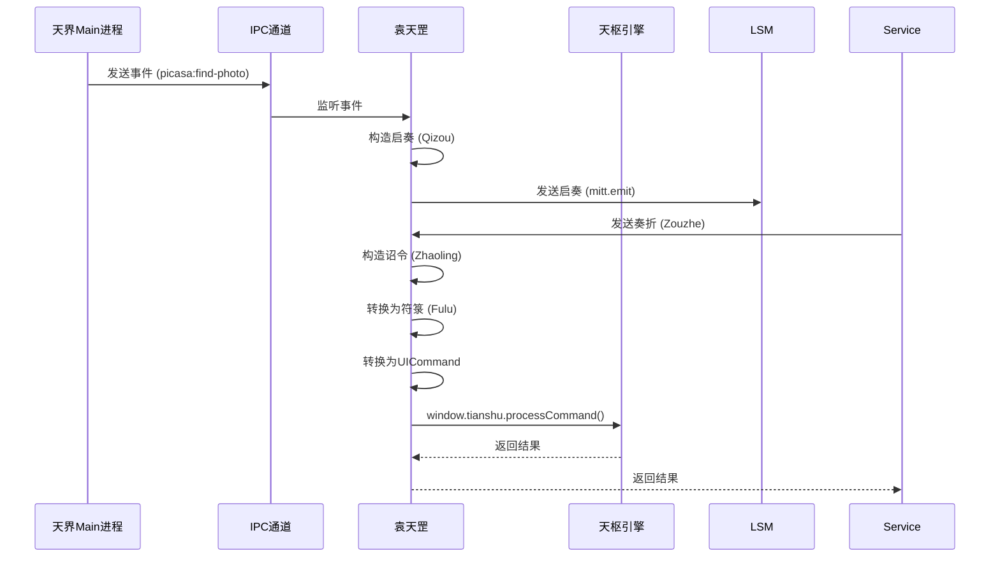
```mermaid
sequenceDiagram
 participant Main as 天界Main进程
 participant IPC as IPC通道
 participant YTG as 袁天罡
 participant TS as 天枢引擎

 Main->>IPC: 发送事件 (picasa:find-photo)
 IPC->>YTG: 监听事件
 YTG->>YTG: 构造启奏 (Qizou)
 YTG->>LSM: 发送启奏 (mitt.emit)

 Service->>YTG: 发送奏折 (Zouzhe)
 YTG->>YTG: 构造诏令 (Zhaoling)
 YTG->>YTG: 转换为符箓 (Fulu)
 YTG->>YTG: 转换为UICommand
 YTG->>TS: window.tianshu.processCommand()
 TS-->>YTG: 返回结果
 YTG-->>Service: 返回结果
```

**核心能力**:

```typescript
// IPC事件监听
setupQianliyanEventListening(): void

// 诏令执行
executeZhaoling(zhaoling: Zhaoling): Promise<ZhaolingResponse>

// 符箓转换
convertFuluToUICommand(fulu: Fulu): UICommand
```

**位置**: `src/renderer/src/services/yuantiangang/`
**关键文件**: `yuantiangang.ts`

---

### 6. 魏征 (WeiZheng) - appState监察

**神话背景**: 魏征，唐朝名臣，以直言敢谏著称

**职责**:

- 🏛️ 管理folderTree业务逻辑
- 📋 处理UPDATE_FOLDER_TREE奏折
- 🔍 智能路径检查（根节点/子节点判断）
- 📤 发送UPDATE_FOLDER_TREE奏折给房玄龄

**三条数据流汇聚点**:

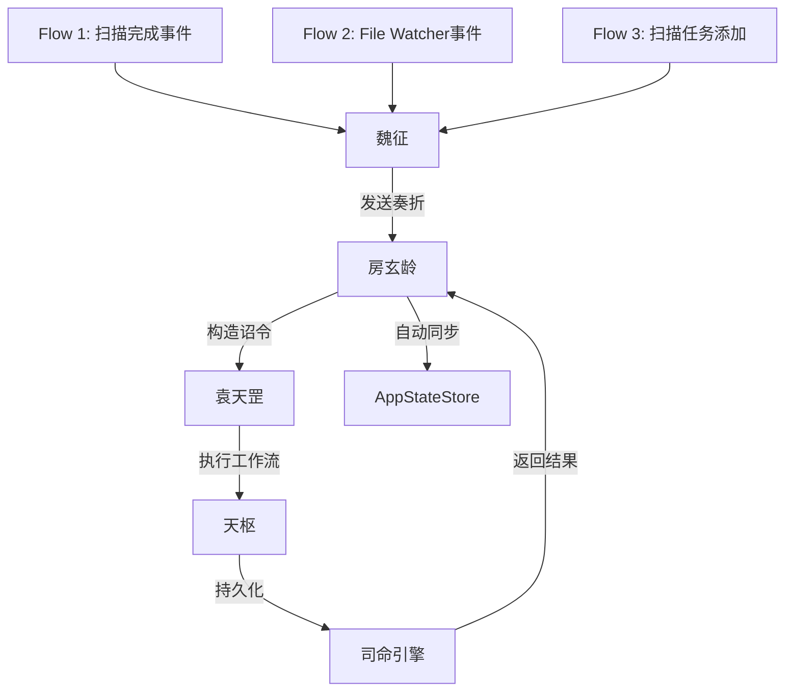
```mermaid
graph TB
 Flow1[Flow 1: 扫描完成事件] --> WZ[魏征]
 Flow2[Flow 2: File Watcher事件] --> WZ
 Flow3[Flow 3: 扫描任务添加] --> WZ

 WZ -->|发送奏折| FXL[房玄龄]
 FXL -->|构造诏令| YTG[袁天罡]
 YTG -->|执行工作流| TS[天枢]
 TS -->|持久化| SM[司命引擎]
 SM -->|返回结果| FXL
 FXL -->|自动同步| AS[AppStateStore]
```

**核心能力**:

```typescript
// folderTree管理
handleUpdateFolderTree(shengzhi: Shengzhi): Promise<void>
handleAddRoot(shengzhi: Shengzhi): Promise<void>
handleCheckAndAddPath(shengzhi: Shengzhi): Promise<void>

// 智能路径检查
private isRootPath(folderPath: string): boolean
private findRootPathForPath(folderPath: string): string | null
```

**位置**: `src/renderer/src/services/weizheng/`
**关键文件**: `weizheng.ts`

---

### 7. 秦琼 (QinQiong) - 文件守护

**神话背景**: 秦琼，唐朝开国名将，以守门神身份著称

**职责**:

- 🛡️ 守护文件系统边界
- 👂 监听文件系统事件
- 📤 通过启奏向李世民汇报文件变化

**位置**: `src/renderer/src/services/qinqiong/`
**状态**: 🚧 规划中（依赖RFC 0043）

---

### 8. 杜如晦 (DuRuHui) - 通道管理

**神话背景**: 杜如晦，唐朝名相，以政务能力著称

**职责**:

- 📋 MessageChannel管理器
- 🔗 为每个服务创建专属MessageChannel通道
- 📜 持有所有通道的port1端（李世民端）
- 📤 提供统一的下旨接口（issueShengzhi）

**MessageChannel架构**:

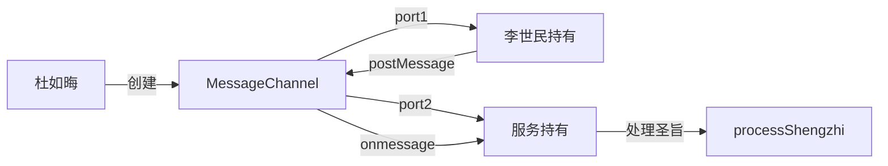
```mermaid
graph LR
 DRH[杜如晦] -->|创建| MC[MessageChannel]
 MC -->|port1| LSM[李世民持有]
 MC -->|port2| Service[服务持有]

 LSM -->|postMessage| MC
 MC -->|onmessage| Service
 Service -->|处理圣旨| Process[processShengzhi]
```

**核心能力**:

```typescript
// 连接服务
connect(service: IService): void

// 下发圣旨
issueShengzhi(serviceName: string, shengzhi: Shengzhi): void
```

**位置**: `src/renderer/src/services/duruhui/`
**关键文件**: `duruhui.ts`

---

## 通信系统

### 双通信系统概览

Photasa 采用双通信系统实现天界和人界的协调工作：

1. **启奏-圣旨系统**：用于跨部门协调事务
2. **奏折-诏令系统**：用于内政事务处理和持久化

### 1. 启奏-圣旨系统 (Qizou-Shengzhi)

**用途**: 跨部门协调事务

**完整流程**:

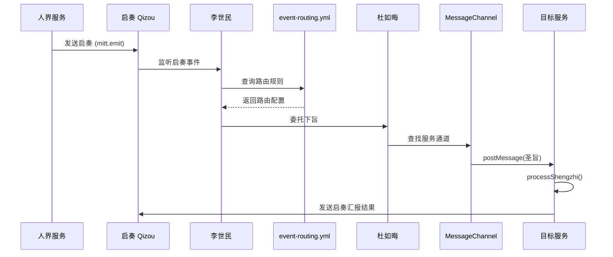
```mermaid
sequenceDiagram
 participant Service as 人界服务
 participant QZ as 启奏 Qizou
 participant LSM as 李世民
 participant ER as event-routing.yml
 participant DRH as 杜如晦
 participant MC as MessageChannel
 participant Target as 目标服务

 Service->>QZ: 发送启奏 (mitt.emit)
 QZ->>LSM: 监听启奏事件
 LSM->>ER: 查询路由规则
 ER-->>LSM: 返回路由配置
 LSM->>DRH: 委托下旨
 DRH->>MC: 查找服务通道
 MC->>Target: postMessage(圣旨)
 Target->>Target: processShengzhi()
 Target->>QZ: 发送启奏汇报结果
```

**关键组件**:

- **启奏（Qizou）**: mitt事件总线，服务 → 李世民
- **李世民**: 中央路由决策，查询event-routing.yml
- **杜如晦**: MessageChannel管理器
- **圣旨（Shengzhi）**: MessageChannel传递，李世民 → 服务

**event-routing.yml示例**:

```yaml
scan_completed:
 - when:
 from: "袁天罡"
 matter: "scan_completed"
 then:
 service: "魏征"
 shengzhi:
 command: "update_folder_tree"
 content:
 paths: "{{qizou.content.paths}}"
```

---

### 2. 奏折-诏令系统 (Zouzhe-Zhaoling)

**用途**: 内政事务处理和持久化

**完整流程**:

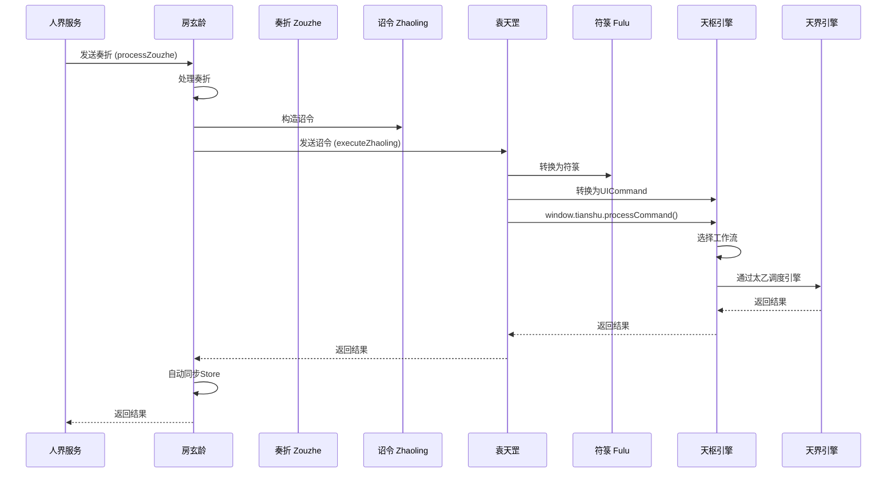
```mermaid
sequenceDiagram
 participant Service as 人界服务
 participant FXL as 房玄龄
 participant ZZ as 奏折 Zouzhe
 participant ZL as 诏令 Zhaoling
 participant YTG as 袁天罡
 participant FL as 符箓 Fulu
 participant TS as 天枢引擎
 participant Engine as 天界引擎

 Service->>FXL: 发送奏折 (processZouzhe)
 FXL->>FXL: 处理奏折
 FXL->>ZL: 构造诏令
 FXL->>YTG: 发送诏令 (executeZhaoling)
 YTG->>FL: 转换为符箓
 YTG->>TS: 转换为UICommand
 YTG->>TS: window.tianshu.processCommand()
 TS->>TS: 选择工作流
 TS->>Engine: 通过太乙调度引擎
 Engine-->>TS: 返回结果
 TS-->>YTG: 返回结果
 YTG-->>FXL: 返回结果
 FXL->>FXL: 自动同步Store
 FXL-->>Service: 返回结果
```

**关键组件**:

- **奏折（Zouzhe）**: 服务 → 房玄龄
- **房玄龄**: 处理奏折，构造诏令
- **诏令（Zhaoling）**: 房玄龄 → 袁天罡
- **符箓（Fulu）**: 袁天罡内部转换
- **UICommand**: 袁天罡 → 天枢引擎

**matter-sync.yml示例**:

```yaml
add_scan_action:
    propertyPath: "queue"
    syncStrategy: "replace"
    store: "scanning"
```

---

## 数据流架构

### 完整数据流图

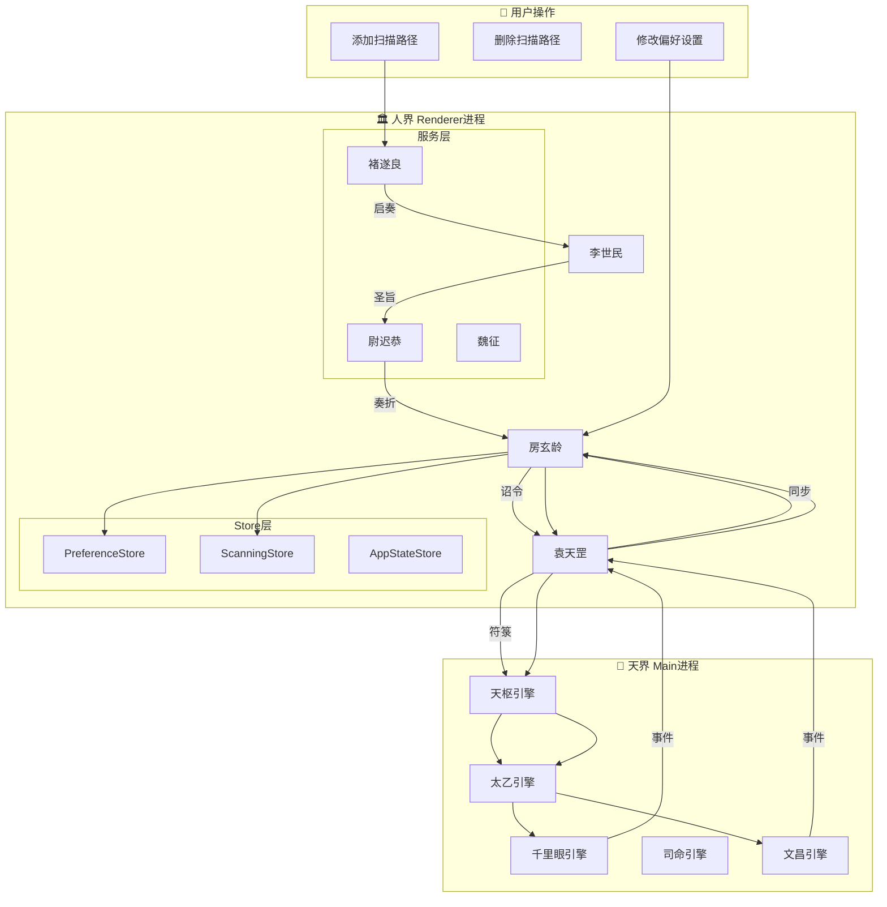
```mermaid
graph TB
 subgraph User["👤 用户操作"]
 U1[添加扫描路径]
 U2[删除扫描路径]
 U3[修改偏好设置]
 end

 subgraph Renderer["🏛️ 人界 Renderer进程"]
 subgraph Services["服务层"]
 CSL[褚遂良]
 YCG[尉迟恭]
 WZ[魏征]
 end

 FXL[房玄龄]
 YTG[袁天罡]
 LSM[李世民]

 subgraph Stores["Store层"]
 PS[PreferenceStore]
 SS[ScanningStore]
 AS[AppStateStore]
 end
 end

 subgraph Main["🌌 天界 Main进程"]
 TS[天枢引擎]
 TY[太乙引擎]
 QLY[千里眼引擎]
 SM[司命引擎]
 WC[文昌引擎]
 end

 U1 --> CSL
 CSL -->|启奏| LSM
 LSM -->|圣旨| YCG
 YCG -->|奏折| FXL
 FXL -->|诏令| YTG
 YTG -->|符箓| TS
 TS --> TY
 TY --> QLY
 QLY -->|事件| YTG
 YTG -->|同步| FXL
 FXL --> SS

 U3 --> FXL
 FXL --> YTG
 YTG --> TS
 TS --> TY
 TY --> WC
 WC -->|事件| YTG
 YTG --> FXL
 FXL --> PS
```

### 关键数据流场景

#### 场景1: 添加扫描任务

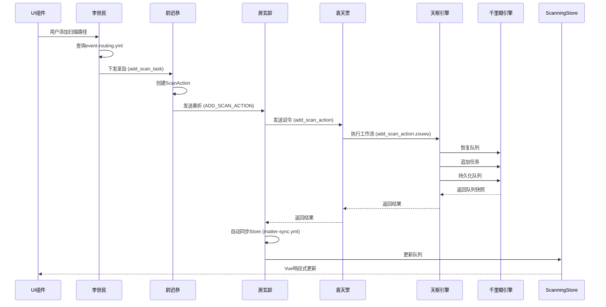
```mermaid
sequenceDiagram
 participant UI as UI组件
 participant LSM as 李世民
 participant YCG as 尉迟恭
 participant FXL as 房玄龄
 participant YTG as 袁天罡
 participant TS as 天枢引擎
 participant QLY as 千里眼引擎
 participant SS as ScanningStore

 UI->>LSM: 用户添加扫描路径
 LSM->>LSM: 查询event-routing.yml
 LSM->>YCG: 下发圣旨 (add_scan_task)
 YCG->>YCG: 创建ScanAction
 YCG->>FXL: 发送奏折 (ADD_SCAN_ACTION)
 FXL->>YTG: 发送诏令 (add_scan_action)
 YTG->>TS: 执行工作流 (add_scan_action.zouwu)
 TS->>QLY: 恢复队列
 TS->>QLY: 追加任务
 TS->>QLY: 持久化队列
 QLY-->>TS: 返回队列快照
 TS-->>YTG: 返回结果
 YTG-->>FXL: 返回结果
 FXL->>FXL: 自动同步Store (matter-sync.yml)
 FXL->>SS: 更新队列
 SS-->>UI: Vue响应式更新
```

#### 场景2: 扫描执行流程

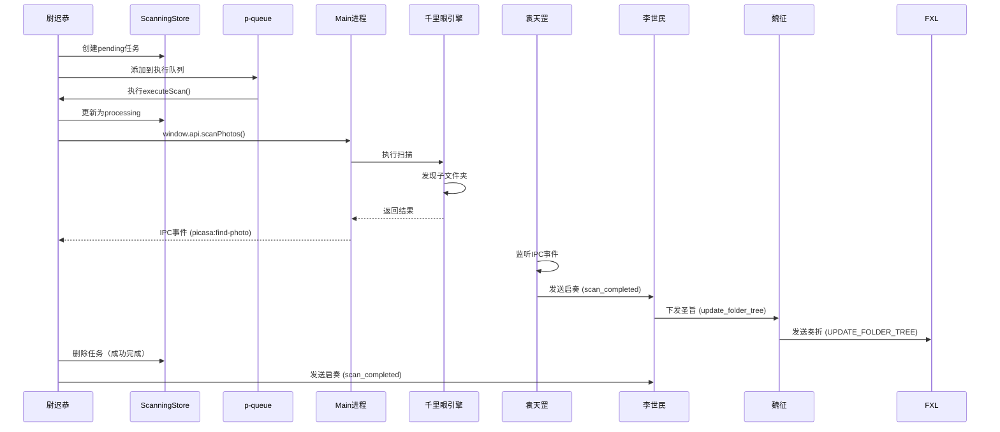
```mermaid
sequenceDiagram
 participant YCG as 尉迟恭
 participant SS as ScanningStore
 participant PQ as p-queue
 participant Main as Main进程
 participant QLY as 千里眼引擎
 participant YTG as 袁天罡
 participant LSM as 李世民
 participant WZ as 魏征

 YCG->>SS: 创建pending任务
 YCG->>PQ: 添加到执行队列
 PQ->>YCG: 执行executeScan()
 YCG->>SS: 更新为processing
 YCG->>Main: window.api.scanPhotos()
 Main->>QLY: 执行扫描
 QLY->>QLY: 发现子文件夹
 QLY-->>Main: 返回结果
 Main-->>YCG: IPC事件 (picasa:find-photo)
 YTG->>YTG: 监听IPC事件
 YTG->>LSM: 发送启奏 (scan_completed)
 LSM->>WZ: 下发圣旨 (update_folder_tree)
 WZ->>FXL: 发送奏折 (UPDATE_FOLDER_TREE)
 YCG->>SS: 删除任务（成功完成）
 YCG->>LSM: 发送启奏 (scan_completed)
```

#### 场景3: 偏好设置更新

```mermaid
sequenceDiagram
 participant UI as UI组件
 participant FXL as 房玄龄
 participant YTG as 袁天罡
 participant TS as 天枢引擎
 participant TY as 太乙引擎
 participant WC as 文昌引擎
 participant PS as PreferenceStore

 UI->>FXL: 发送奏折 (UPDATE_PREFERENCE)
 FXL->>YTG: 发送诏令 (update_preference)
 YTG->>TS: 执行工作流 (update_preference.yml)
 TS->>TY: 调用引擎 (wenchang)
 TY->>WC: applyDelta()
 WC->>WC: 持久化偏好
 WC-->>TY: 返回新快照
 TY-->>TS: 返回结果
 TS-->>YTG: 返回结果
 YTG-->>FXL: 返回结果
 FXL->>FXL: 自动同步Store
 FXL->>PS: 更新偏好
 PS-->>UI: Vue响应式更新
```

---

## Store架构

### Store层次结构

```mermaid
graph TB
 subgraph Stores["📚 Store层"]
 PS[PreferenceStore<br/>用户偏好]
 SS[ScanningStore<br/>扫描队列]
 AS[AppStateStore<br/>应用状态]
 PHS[PhotosStore<br/>照片数据]
 SBS[StatusBarStore<br/>状态栏]
 NS[NotificationStore<br/>通知]
 US[UpdateStore<br/>更新状态]
 end

 FXL[房玄龄] -->|统一管理| Stores
 Services[人界服务] -->|通过房玄龄| FXL
 FXL -->|自动同步| Stores
```

### Store职责划分

| Store                 | 职责                                    | 持久化                | 访问方式         |
| --------------------- | --------------------------------------- | --------------------- | ---------------- |
| **PreferenceStore**   | 用户偏好设置（主题、语言、路径等）      | ✅ 持久化             | 通过房玄龄访问器 |
| **ScanningStore**     | 扫描队列（pending/processing/failed）   | ❌ 运行时状态         | 通过房玄龄访问器 |
| **AppStateStore**     | 应用状态（folderTree、currentFolder等） | ✅ 持久化（司命引擎） | 通过房玄龄访问器 |
| **PhotosStore**       | 照片数据（文件列表、元数据）            | ❌ 运行时状态         | 通过房玄龄访问器 |
| **StatusBarStore**    | 状态栏信息（当前任务、进度）            | ❌ 运行时状态         | 直接访问         |
| **NotificationStore** | 通知消息                                | ❌ 运行时状态         | 直接访问         |
| **UpdateStore**       | 更新状态                                | ❌ 运行时状态         | 直接访问         |

### Store SSOT原则（RFC 0048 v3）

**核心原则**: Store 是唯一真相源（Single Source of Truth）

```mermaid
stateDiagram-v2
 [*] --> pending: 创建任务到Store
 pending --> processing: p-queue执行
 processing --> [*]: 成功完成（立即删除）
 processing --> failed: 执行失败
 failed --> pending: 重试
 failed --> [*]: 达到重试上限（删除）

 note right of [*]
 Store SSOT
 状态机制驱动
 立即清理
 end note
```

**状态转换规则**:

1. **创建任务**: `pending` 状态，`createdAt: now`, `retryCount: 0`
2. **开始执行**: `pending → processing`, `startedAt: now`
3. **执行成功**: `processing → [删除]`（不保留completed状态）
4. **执行失败**: `processing → failed`, `error: message`, `retryCount++`
5. **重试**: `failed → pending`（如果`retryCount < maxRetries`）
6. **删除**: 达到重试上限或超过24小时

---

## 持久化架构

### 持久化位置总览

```mermaid
graph TB
 subgraph Persistence["💾 持久化架构"]
 subgraph Main["🌌 天界持久化"]
 QLY[千里眼引擎<br/>~/.photasa/scan/scanning.json]
 SM[司命引擎<br/>~/.photasa/appState/]
 WC[文昌引擎<br/>~/.photasa/preferences/]
 SB[司簿引擎<br/>/path/to/photos/.photasa.json]
 end

 subgraph Renderer["🏛️ 人界持久化"]
 PS[PreferenceStore<br/>localStorage<br/>仅偏好设置]
 end
 end
```

### 持久化职责划分

| 引擎/服务           | 持久化内容               | 位置                               | 格式 |
| ------------------- | ------------------------ | ---------------------------------- | ---- |
| **千里眼引擎**      | 扫描队列                 | `~/.photasa/scan/scanning.json`    | JSON |
| **司命引擎**        | appState（folderTree等） | `~/.photasa/appState/photasa.json` | JSON |
| **文昌引擎**        | 用户偏好                 | `~/.photasa/preferences/`          | JSON |
| **司簿引擎**        | 照片文件夹manifest       | `/path/to/photos/.photasa.json`    | JSON |
| **PreferenceStore** | 用户偏好镜像             | `localStorage`                     | JSON |

### 持久化数据流

```mermaid
sequenceDiagram
 participant Service as 人界服务
 participant FXL as 房玄龄
 participant YTG as 袁天罡
 participant TS as 天枢引擎
 participant Engine as 天界引擎
 participant FS as 文件系统

 Service->>FXL: 发送奏折
 FXL->>YTG: 发送诏令
 YTG->>TS: 执行工作流
 TS->>Engine: 调用引擎方法
 Engine->>FS: 持久化数据
 FS-->>Engine: 确认
 Engine-->>TS: 返回结果
 TS-->>YTG: 返回结果
 YTG-->>FXL: 返回结果
 FXL->>FXL: 自动同步Store
```

---

## 关键业务流程

### 流程1: 添加扫描路径完整流程

```mermaid
sequenceDiagram
 participant User as 用户
 participant UI as UI组件
 participant CSL as 褚遂良
 participant LSM as 李世民
 participant YCG as 尉迟恭
 participant FXL as 房玄龄
 participant YTG as 袁天罡
 participant TS as 天枢引擎
 participant QLY as 千里眼引擎
 participant SS as ScanningStore

 User->>UI: 点击添加路径
 UI->>CSL: 调用addPath()
 CSL->>CSL: 验证路径
 CSL->>LSM: 发送启奏 (add_path_completed)
 LSM->>LSM: 查询event-routing.yml
 LSM->>YCG: 下发圣旨 (add_scan_task)
 YCG->>YCG: 创建ScanAction
 YCG->>FXL: 发送奏折 (ADD_SCAN_ACTION)
 FXL->>YTG: 发送诏令 (add_scan_action)
 YTG->>TS: 执行工作流
 TS->>QLY: restoreQueue()
 TS->>QLY: 追加任务
 TS->>QLY: persistQueue()
 QLY-->>TS: 返回队列快照
 TS-->>YTG: 返回结果
 YTG-->>FXL: 返回结果
 FXL->>SS: 自动同步队列
 SS-->>UI: Vue响应式更新
 YCG->>YCG: 添加到p-queue
 YCG->>YCG: 执行扫描
```

### 流程2: 扫描执行完整流程

```mermaid
sequenceDiagram
 participant YCG as 尉迟恭
 participant SS as ScanningStore
 participant PQ as p-queue
 participant Main as Main进程scan-service
 participant Worker as scan-worker
 participant YTG as 袁天罡
 participant LSM as 李世民
 participant WZ as 魏征
 participant FXL as 房玄龄
 participant TS as 天枢引擎
 participant SM as 司命引擎
 participant AS as AppStateStore

 YCG->>SS: 创建pending任务
 YCG->>PQ: 添加到执行队列
 PQ->>YCG: 执行executeScan()
 YCG->>SS: 更新为processing
 YCG->>Main: window.api.scanPhotos()
 Main->>Worker: 创建worker线程
 Worker->>Worker: 扫描文件系统
 Worker->>Main: 发送进度事件
 Main-->>YCG: IPC事件 (picasa:find-photo)
 Worker->>Main: 扫描完成
 Main-->>YCG: IPC事件 (complete)
 YTG->>YTG: 监听IPC事件
 YTG->>LSM: 发送启奏 (scan_completed)
 LSM->>WZ: 下发圣旨 (update_folder_tree)
 WZ->>FXL: 发送奏折 (UPDATE_FOLDER_TREE)
 FXL->>YTG: 发送诏令
 YTG->>TS: 执行工作流
 TS->>SM: persistFolderTree()
 SM-->>TS: 返回结果
 TS-->>YTG: 返回结果
 YTG-->>FXL: 返回结果
 FXL->>AS: 自动同步folderTree
 YCG->>SS: 删除任务（成功完成）
```

### 流程3: 偏好设置更新完整流程

```mermaid
sequenceDiagram
 participant User as 用户
 participant UI as UI组件
 participant FXL as 房玄龄
 participant YTG as 袁天罡
 participant TS as 天枢引擎
 participant TY as 太乙引擎
 participant WC as 文昌引擎
 participant PS as PreferenceStore

 User->>UI: 修改偏好设置
 UI->>FXL: 发送奏折 (UPDATE_PREFERENCE)
 FXL->>YTG: 发送诏令 (update_preference)
 YTG->>TS: 执行工作流 (update_preference.yml)
 TS->>TY: 调用引擎 (wenchang)
 TY->>WC: applyDelta(delta)
 WC->>WC: 持久化偏好
 WC->>WC: 更新版本号
 WC-->>TY: 返回新快照
 TY-->>TS: 返回结果
 TS-->>YTG: 返回结果
 YTG-->>FXL: 返回结果
 FXL->>FXL: 自动同步Store
 FXL->>PS: 更新偏好
 PS-->>UI: Vue响应式更新
 WC->>WC: 广播偏好变更事件
 WC-->>UI: IPC事件 (preference.changed)
```

---

## 架构原则

### 1. 三界职责分离

- **天界（Main进程）**: 核心业务逻辑、数据持久化、引擎调度
- **人界（Renderer进程）**: UI交互、状态管理、用户操作
- **引擎库**: 专业引擎实现，环境无关，通过太乙统一调度

### 2. 双通信系统

- **启奏-圣旨系统**: 跨部门协调事务（服务 → 李世民 → 服务）
- **奏折-诏令系统**: 内政事务处理和持久化（服务 → 房玄龄 → 袁天罡 → 天枢）

### 3. Store SSOT原则

- Store 是唯一真相源（Single Source of Truth）
- 状态机制驱动执行（pending → processing → [删除]）
- 立即清理（成功即删除，不保留completed状态）

### 4. 工作流驱动

- 天枢引擎通过YAML工作流编排复杂业务流程
- 工作流定义业务逻辑，易于维护和扩展
- 支持条件执行、并行执行、错误处理

### 5. 适配器模式

- 太乙引擎通过`@Adapter`装饰器注册引擎适配器
- 统一接口，隔离实现细节
- 支持依赖注入、生命周期管理、健康检查

### 6. 职责清晰

- 每个服务/引擎专注单一职责
- 禁止跨层直接访问（必须通过标准流程）
- 禁止服务直接访问Store（必须通过房玄龄）

---

## 技术栈

### 前端技术栈

- **Vue 3**: UI框架，Composition API
- **Pinia**: 状态管理，Store SSOT
- **TypeScript**: 类型安全
- **Vite**: 构建工具

### 后端技术栈

- **contract reference**: 桌面应用框架
- **Node.js**: 主进程运行时
- **Worker Threads**: 异步任务处理
- **YAML**: 工作流配置

### 通信技术

- **IPC**: 进程间通信
- **MessageChannel**: 浏览器原生API，圣旨传递
- **mitt**: 轻量级事件总线，启奏机制

### 持久化技术

- **JSON文件**: 配置和状态持久化
- **localStorage**: 用户偏好镜像（临时）
- **文件系统**: 照片文件夹manifest

---

## 目录结构

### 引擎库结构

```
src/engines/
├── common/ # 通用契约和测试基架
│ ├── contracts.ts # 统一数据契约
│ ├── fixtures.ts # 测试数据
│ └── test-harness.ts # 测试基架
├── tianshu/ # 天枢引擎（工作流编排）
│ ├── core/
│ │ ├── TianshuEngine.ts
│ │ └── WorkflowLoader.ts
│ ├── orchestration/
│ │ ├── WorkflowOrchestrator.ts
│ │ └── VariableResolver.ts
│ └── workflows/ # YAML工作流定义
├── taiyi/ # 太乙引擎（适配器注册中心）
│ ├── core/
│ │ ├── TaiyiEngine.ts
│ │ ├── AdapterRegistry.ts
│ │ └── adapter-decorators.ts
│ └── __tests__/
├── qianliyan/ # 千里眼引擎（扫描执行）
│ ├── core/
│ │ └── QianliyanEngine.ts
│ └── adapters/
│ └── QianliyanAdapter.ts
├── shunfenger/ # 顺风耳引擎（文件监听）
├── sibu/ # 司簿引擎（配置管理）
├── siming/ # 司命引擎（appState持久化）
├── wenchang/ # 文昌引擎（偏好管理）
└── maliang/ # 马良引擎（图像处理）
```

### 人界服务结构

```
src/renderer/src/services/
├── lishimin/ # 李世民（中央协调者）
│ ├── lishimin.ts
│ └── router.ts # 启奏路由器
├── fangxuanling/ # 房玄龄（Store管理）
│ ├── fangxuanling.ts
│ └── stores/ # Store定义
├── yuchigong/ # 尉迟恭（扫描编排）
│ └── yuchigong.ts
├── yuantiangang/ # 袁天罡（IPC通信）
│ └── yuantiangang.ts
├── weizheng/ # 魏征（appState监察）
│ └── weizheng.ts
├── chusuiliang/ # 褚遂良（路径管理）
│ └── chusuiliang.ts
├── qinqiong/ # 秦琼（文件守护）
│ └── qinqiong.ts
└── duruhui/ # 杜如晦（通道管理）
 └── duruhui.ts
```

### Store结构

```
src/renderer/src/stores/
├── preference.ts # PreferenceStore
├── scanning-types.ts # ScanningStore类型定义
├── scanning-store.ts # ScanningStore（通过房玄龄）
├── appstate-store.ts # AppStateStore（通过房玄龄）
├── photos.ts # PhotosStore
├── statusBar.ts # StatusBarStore
├── notification.ts # NotificationStore
└── update.ts # UpdateStore
```

---

## 关键设计决策

### 1. 为什么使用双通信系统？

**启奏-圣旨系统**用于跨部门协调，支持异步、解耦的服务协作。**奏折-诏令系统**用于内政事务和持久化，确保数据一致性和可靠性。

### 2. 为什么Store是SSOT？

Store作为单一真相源，消除了p-queue与Store的双真相源问题。状态机制驱动执行，简单清晰，性能优异。

### 3. 为什么使用工作流驱动？

工作流通过YAML配置描述业务逻辑，易于维护和扩展。支持条件执行、并行执行、错误处理，为未来AI集成提供基础。

### 4. 为什么使用适配器模式？

适配器模式统一了引擎接口，隔离了实现细节。支持依赖注入、生命周期管理、健康检查，便于测试和维护。

### 5. 为什么天界和人界分离？

天界负责核心业务逻辑和数据持久化，人界负责UI交互。职责清晰，易于维护和扩展。

---

## 未来扩展方向

### 1. Phase 3: scan-service迁移到千里眼引擎

**目标**: 将扫描编排逻辑迁移到天界，与天界架构对齐

**策略**:

- 不改变scan-service，仅包装在千里眼适配器中
- 遵循标准适配器模式（参考文昌、司命适配器）
- 通过依赖注入获取scan-service实例
- 适配器内部管理队列，scan-service只负责执行

**详细设计**: 参见 [RFC 0032 Phase 3](../rfc/0032-qianliyan-scan-engine.md#phase-3-scan-service迁移到千里眼引擎)

### 2. 代码质量改进

**目标**: 改进尉迟恭代码质量（RFC 0056）

**改进点**:

- 提取`enqueueTask()`私有方法，消除代码重复
- 提取时间计算常量，消除魔法数字
- 简化条件分支逻辑，减少嵌套
- 增强错误恢复机制

**详细设计**: 参见 [RFC 0056](../rfc/0056-yuchigong-code-quality-improvements.md)

---

## 参考文档

- [RFC 0035: 五引擎编排架构](../rfc/completed/0035-five-engine-orchestration-architecture.md)
- [RFC 0038: 偏好设置工作流集成](../rfc/completed/0038-preference-workflow-integration.md)
- [RFC 0042: scanningFolder迁移](../rfc/completed/0042-scanning-folder-migration.md)
- [RFC 0046: 扫描队列持久化](../rfc/completed/0046-scanning-queue-persistence.md)
- [RFC 0047: folderTree持久化](../rfc/completed/0047-foldertree-persistence-initialization.md)
- [RFC 0048: 扫描编排业务逻辑迁移](../rfc/completed/0048-scan-orchestration-business-logic-migration.md)
- [RFC 0032: 千里眼扫描引擎](../rfc/0032-qianliyan-scan-engine.md)
- [神话架构说明](../architecture/MYTHOLOGY.md)
- [Zouzhe工作流开发指南](../architecture/zouzhe-workflow-guide.md)

---

**文档版本**: 2.0.0
**最后更新**: 2025-01-23
**维护者**: AI Architect
