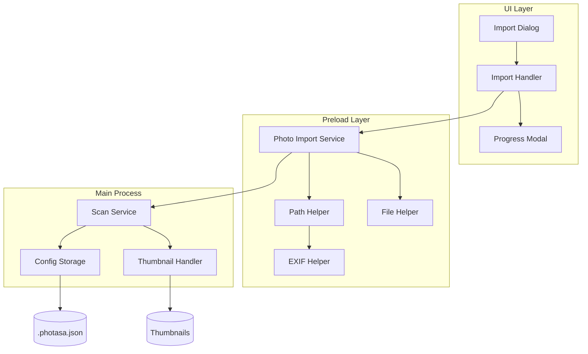
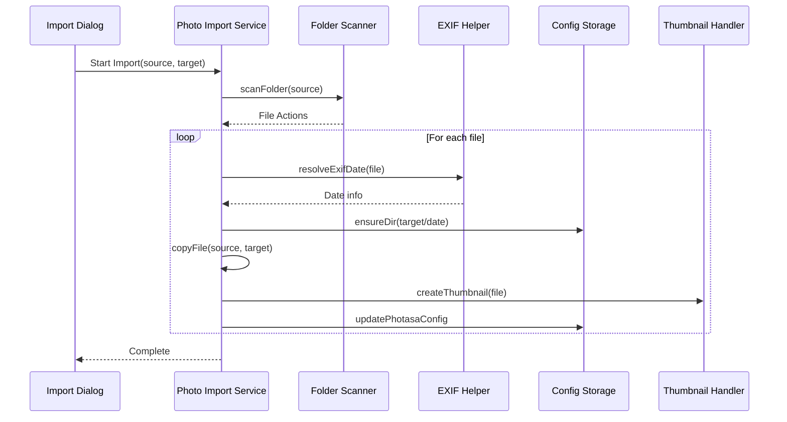
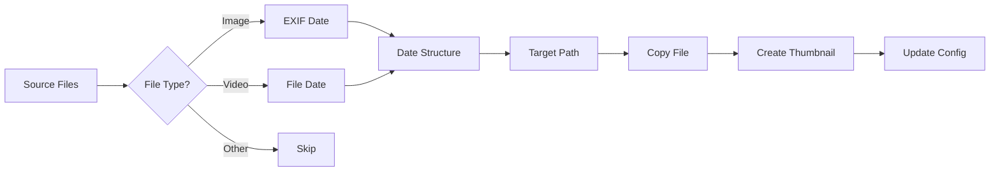
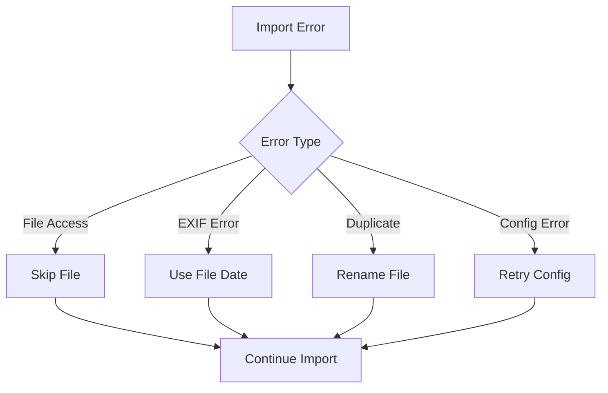
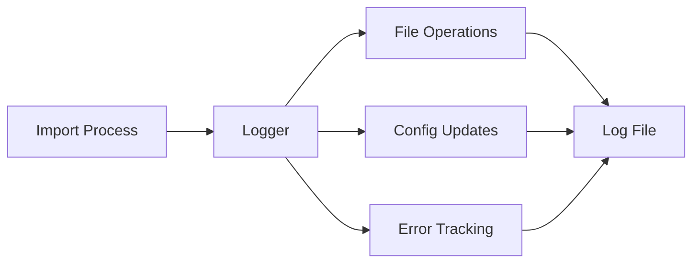

# Photasa Photo Import System Design

## Overview
The photo import system in Photasa is designed to efficiently scan, organize, and import photos and videos from source directories into a structured target directory. The system uses a date-based organization pattern and maintains metadata in `.photasa.json` configuration files.

## System Architecture



## Directory Structure
```
TargetDirectory/
├── .photasa.json           # Configuration file
├── 2024/
│   ├── 20240315/          # YYYY/YYYYMMDD format
│   │   ├── photo1.jpg
│   │   └── photo2.jpg
│   └── 20240316/
│       └── photo3.jpg
└── 2023/
    └── 20231225/
        └── photo4.jpg
```

## Import Process Sequence



## Data Flow



## Component Details

### 1. Import Dialog (UI)
- Source directory selection
- Target directory selection
- Duplicate handling options
- Progress monitoring

### 2. Photo Import Service
```typescript
interface ImportCallback {
    type: 'next' | 'error' | 'complete';
    action?: {
        targetFileName: string;
    };
    error?: {
        message: string;
    };
}

function importPhotos(
    folders: string[],
    target: string,
    callback: ImportCallback
): void
```

### 3. File Organization
- Date-based structure: YYYY/YYYYMMDD
- EXIF date extraction for images
- File creation date fallback
- Duplicate handling with renaming

### 4. Configuration Storage
```json
{
    "version": "1.0",
    "photoList": [
        {
            "path": "2024/20240315/photo1.jpg",
            "thumbnail": "thumbnails/photo1.jpg",
            "isVideo": false,
            "history": []
        }
    ]
}
```

## Error Handling



## Performance Considerations

1. **Batch Processing**
   - Files are processed in batches
   - Thumbnail generation is queued
   - Config updates are batched

2. **Memory Management**
   - Stream-based file reading
   - EXIF data cleanup
   - Temporary file cleanup

3. **Concurrency**
   - Parallel file processing
   - Thumbnail generation queue
   - Config update queue

## Security Considerations

1. **File Access**
   - Permission checks
   - Path validation
   - Safe file operations

2. **Data Integrity**
   - Config file validation
   - Backup before updates
   - Atomic operations

## Future Enhancements

1. **Planned Features**
   - Custom organization patterns
   - Advanced duplicate detection
   - Batch metadata editing

2. **Potential Improvements**
   - Distributed processing
   - Cloud storage integration
   - AI-based organization

## Monitoring and Logging



## Testing Strategy

1. **Unit Tests**
   - File operations
   - Date extraction
   - Config management

2. **Integration Tests**
   - Full import process
   - Error handling
   - Performance metrics

3. **End-to-End Tests**
   - UI workflows
   - System integration
   - User scenarios
