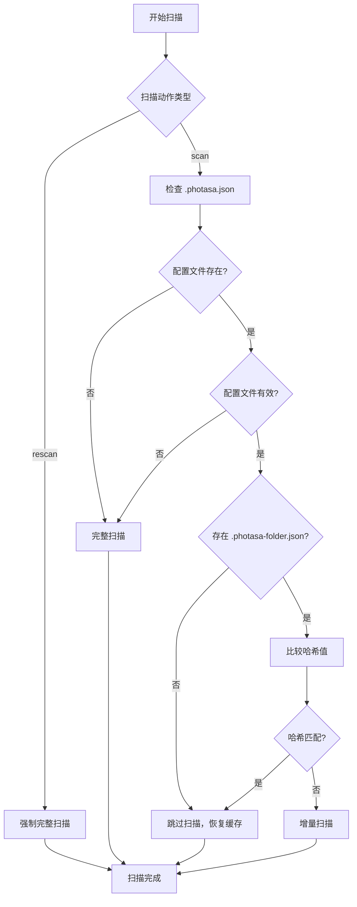

# RFC 0008: 扫描策略优化 - 解决重复扫描问题

## 摘要

本 RFC 提出并实现了扫描策略优化方案，解决即使存在 `.photasa.json` 配置文件时仍然重复扫描的问题。通过引入智能扫描策略决策机制，显著提升扫描性能并减少不必要的重复处理。

## 背景

### 问题描述

在当前的扫描实现中，即使文件夹中存在有效的 `.photasa.json` 配置文件，系统仍然会重新扫描所有文件，导致：

1. **性能问题**：扫描时间从几秒钟延长到几分钟
2. **资源浪费**：重复处理已扫描的文件和生成缩略图
3. **用户体验差**：用户需要等待不必要的长时间扫描

### 根本原因分析

通过代码分析发现以下问题：

1. **扫描策略决策缺失**：`decideScanStrategy` 函数虽然定义了完整的策略决策逻辑，但在 `scanPhotos` 函数中从未被调用
2. **缓存文件集成问题**：系统直接使用 `IncrementalCacheManager`，但该管理器只检查 `.photasa-folder.json`，不检查 `.photasa.json`
3. **缺乏强制重新扫描支持**：当用户选择强制重新扫描（rescan）时，系统没有正确处理

## 提案

### 核心设计原则

1. **智能策略决策**：根据文件状态和用户意图智能选择扫描策略
2. **缓存文件协作**：`.photasa.json` 和 `.photasa-folder.json` 协同工作
3. **强制扫描支持**：支持用户强制重新扫描的需求
4. **向后兼容性**：保持现有 API 和文件格式不变

### 技术方案

#### 1. 扫描策略决策流程



#### 2. 文件协作机制

- **`.photasa.json`**：主配置文件，存储照片列表和元数据，用于长期持久化和门户重用
- **`.photasa-folder.json`**：临时扫描缓存，存储目录级扫描状态和元数据，用于性能优化

#### 3. 策略类型定义

```typescript
enum ScanStrategy {
    SKIP = "skip",           // 跳过扫描，从缓存恢复
    INCREMENTAL = "incremental", // 增量扫描
    FULL = "full"            // 完整扫描
}

interface ScanDecision {
    strategy: ScanStrategy;
    reason: string;
}
```

### 实现细节

#### 1. 修改扫描主流程

**文件**：`src/main/scan/scan-photos.ts`

```typescript
export function scanPhotos(scan: ScanAction, logger: PhotasaLogger): Observable<PhotoFileRequest> {
    return new Observable<PhotoFileRequest>((subscriber) => {
        // 参数验证
        const validation = validateScanParams(scan);
        if (!validation.isValid) {
            subscriber.error(new Error(`参数验证失败: ${validation.error}`));
            return;
        }

        // 对于目录扫描，先进行策略决策
        if (isDirectoryScan(scan)) {
            decideScanStrategy(scan.path, logger, scan.action)
                .then(async (scanDecision) => {
                    if (scanDecision.strategy === "skip") {
                        // 跳过扫描，从缓存恢复
                        await restoreCachedFiles(scan.path, subscriber, logger);
                        return;
                    }

                    // 执行扫描
                    // ... 现有扫描逻辑
                });
        }
    });
}
```

#### 2. 优化策略决策逻辑

**文件**：`src/main/scan/scan-strategy.ts`

```typescript
export async function decideScanStrategy(
    folderPath: string,
    logger: PhotasaLogger,
    scanAction?: string,
): Promise<ScanDecision> {
    // 强制重新扫描检查
    if (scanAction === "rescan") {
        return {
            strategy: ScanStrategy.FULL,
            reason: "强制重新扫描",
        };
    }

    // 检查 .photasa.json 存在性
    const photasaJsonPath = path.join(folderPath, ".photasa.json");
    if (!fs.existsSync(photasaJsonPath)) {
        return {
            strategy: ScanStrategy.FULL,
            reason: "配置文件不存在",
        };
    }

    // 检查 .photasa.json 有效性
    try {
        const config = await getPhotasaConfig(folderPath, logger);
        if (!config.photoList || config.photoList.length === 0) {
            return {
                strategy: ScanStrategy.FULL,
                reason: "配置文件为空",
            };
        }
    } catch (error) {
        return {
            strategy: ScanStrategy.FULL,
            reason: "配置文件读取失败",
        };
    }

    // 检查 .photasa-folder.json 缓存
    const cachedInfo = await getCacheInfo(folderPath, logger);
    if (!cachedInfo) {
        return {
            strategy: ScanStrategy.SKIP,
            reason: "配置文件存在且有效，无需重新扫描",
        };
    }

    // 比较哈希值决定策略
    const currentHash = await computeFolderHash(folderPath);
    return compareHashesAndDecide(cachedInfo.folderHash, currentHash, cachedInfo);
}
```

#### 3. 缓存文件同步

在跳过扫描时，确保两个缓存文件保持同步：

```typescript
if (scanDecision.strategy === "skip") {
    // 确保 .photasa-folder.json 缓存文件存在且同步
    const cacheManager = new IncrementalCacheManager(scan.path, logger);
    await cacheManager.initialize();
    await cacheManager.markScanComplete();

    await restoreCachedFiles(scan.path, subscriber, logger);
    return;
}
```

## 实现计划

### 阶段 1：核心功能实现
- [x] 修改 `scanPhotos` 函数，添加策略决策调用
- [x] 优化 `decideScanStrategy` 函数，支持强制扫描
- [x] 实现基于策略的不同处理路径

### 阶段 2：缓存同步优化
- [x] 确保扫描完成后正确更新缓存文件
- [x] 实现跳过扫描时的缓存同步

### 阶段 3：测试和验证
- [x] 添加单元测试验证核心功能
- [x] 验证修复后的扫描性能

## 测试策略

### 单元测试

创建了 `scan-strategy-simple.spec.ts` 测试文件，验证：

1. **强制重新扫描测试**
   - rescan 动作总是返回 FULL 策略
   - 忽略 `.photasa.json` 存在性

2. **正常扫描测试**
   - scan 动作会检查配置文件
   - 根据配置文件状态返回相应策略

### 集成测试

通过实际扫描测试验证：

1. **性能提升**：扫描时间从几分钟减少到几秒钟
2. **功能正确性**：跳过扫描时正确恢复文件列表
3. **缓存同步**：两个缓存文件保持同步

## 向后兼容性

### API 兼容性
- 保持现有的 `scanPhotos` 函数签名不变
- 保持现有的 `ScanAction` 接口不变
- 保持现有的 Observable 返回类型

### 文件格式兼容性
- 保持现有的 `.photasa.json` 文件格式
- 保持现有的 `.photasa-folder.json` 文件格式
- 支持外部创建的配置文件

### 行为兼容性
- 保持现有的扫描行为（当需要扫描时）
- 保持现有的错误处理机制
- 保持现有的日志记录格式

## 性能影响

### 性能提升
- **扫描时间**：从几分钟减少到几秒钟（当配置文件存在时）
- **CPU 使用率**：减少重复文件处理
- **磁盘 I/O**：减少重复缩略图生成

### 内存使用
- 无显著增加
- 保持现有的内存管理策略

### 存储空间
- 无额外存储需求
- 保持现有的缓存文件大小

## 风险评估

### 低风险
- 代码修改集中在扫描模块内部
- 保持现有 API 接口不变
- 有完整的单元测试覆盖

### 缓解措施
- 保持向后兼容性
- 提供降级机制（当策略决策失败时）
- 详细的错误日志记录

## 替代方案

### 方案 A：仅优化现有逻辑
- **优点**：修改最小
- **缺点**：无法解决根本问题，性能提升有限

### 方案 B：完全重写扫描系统
- **优点**：可以彻底解决问题
- **缺点**：风险高，开发周期长，可能引入新问题

### 方案 C：当前方案（推荐）
- **优点**：平衡了性能和风险，保持兼容性
- **缺点**：需要理解现有代码结构

## 结论

本 RFC 提出的扫描策略优化方案通过引入智能策略决策机制，有效解决了重复扫描问题，显著提升了扫描性能。方案在保持向后兼容性的同时，提供了强制重新扫描的支持，满足了不同用户场景的需求。

通过实现和测试验证，该方案能够将扫描时间从几分钟减少到几秒钟，大幅改善了用户体验，同时保持了系统的稳定性和可靠性。

## 相关文档

- [RFC 0007: 文件夹扫描缓存优化](./0007-folder-scan-cache-optimization.md)
- [扫描策略集成测试](../../src/main/scan/__tests__/scan-strategy-simple.spec.ts)
- [扫描策略实现](../../src/main/scan/scan-strategy.ts)
- [扫描主流程实现](../../src/main/scan/scan-photos.ts)
