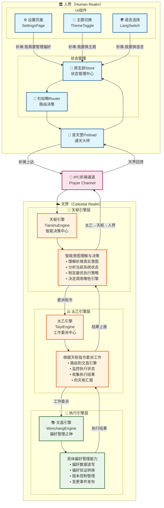
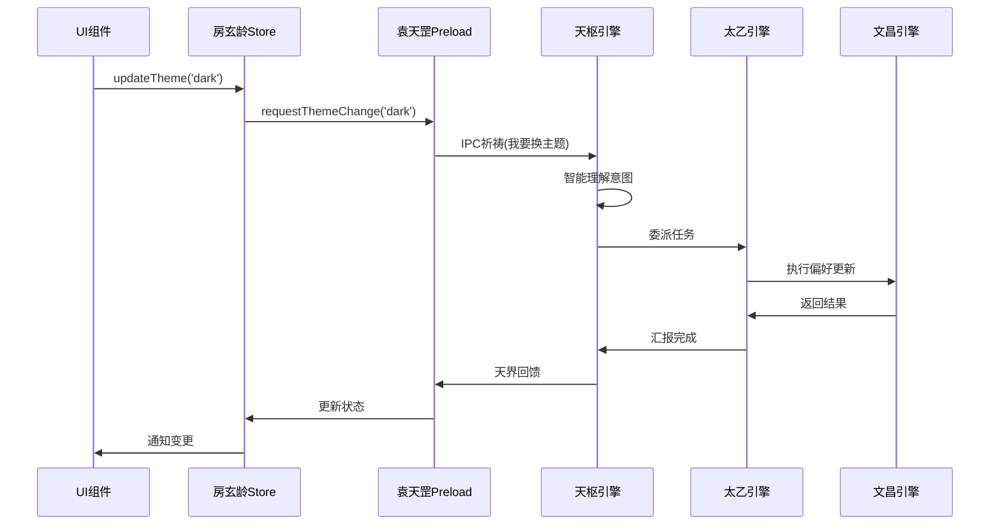
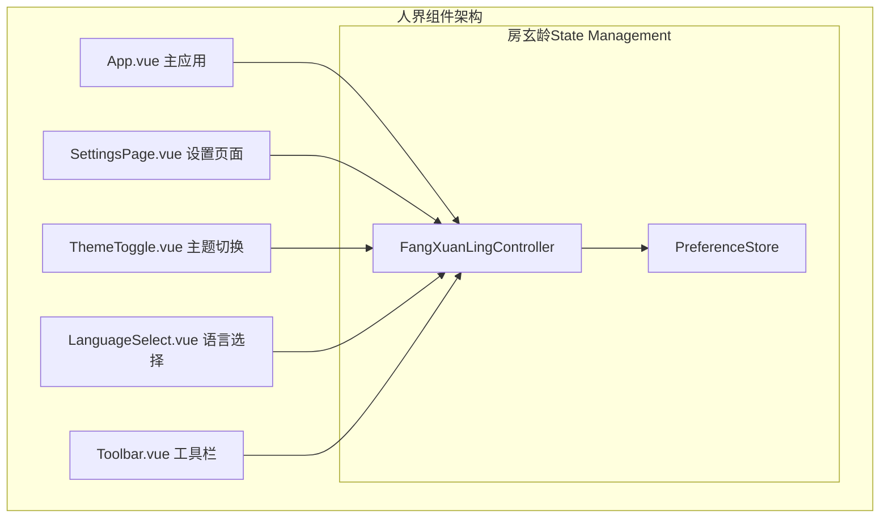

# RFC 0036: 文昌引擎偏好管理集成验证

## 1. 概述

### 1.1 背景
文昌引擎（WenchangEngine）已实现为偏好管理专用引擎，需要验证其能否与现有人界组件正常协作。

### 1.2 验证目标
验证文昌引擎通过天枢-太乙架构为人界提供偏好管理服务：
```
人界之人（UI组件）→ 祈祷（高层意图）→ 天界天枢（智能决策）
                                         ↓
                                  安排工作计划
                                         ↓
                              太乙（工作委派）→ 文昌（偏好之神）
                                         ↓
                              执行结果 ← 文昌完成工作
                                         ↓
                              太乙收集 → 天枢汇总决策
                                         ↓
                              天界回馈 → 人界获得结果
```

### 1.3 验证重点
- **智能编排**：天枢能否智能理解偏好管理意图并做出决策
- **工作委派**：太乙能否有效委派工作给文昌引擎
- **双向通信**：完整的请求-响应循环是否畅通
- **人界集成**：UI组件能否通过"祈祷"方式获得偏好服务

### 1.4 非验证范围
- 具体的UI实现细节
- ConfigService（应用配置，与偏好设置是独立系统）
- 性能优化和生产环境部署

## 2. 天人合一双向通信架构

### 2.1 核心理念架构



### 2.2 数据流序列图



### 2.3 核心组件

#### 2.3.1 袁天罡通天接口（Preload核心通信）
**职责**：袁天罡作为通天大师，负责人界与天界之间的神秘通信，定义具体的祈祷方式
```typescript
// src/preload/index.ts
export const YuanTianGang = {
    preference: {
        // 祈祷："我需要管理偏好"
        requestManagement: async (context?: any) => {
            return await ipcRenderer.invoke('celestial:pray', {
                intent: '我需要管理偏好',
                context,
                timestamp: Date.now()
            });
        },

        // 祈祷："我要换主题"
        requestThemeChange: async (newTheme: string) => {
            return await ipcRenderer.invoke('celestial:pray', {
                intent: '我要换主题',
                context: { newTheme },
                timestamp: Date.now()
            });
        },

        // 祈祷："我要换语言"
        requestLanguageChange: async (newLanguage: string) => {
            return await ipcRenderer.invoke('celestial:pray', {
                intent: '我要换语言',
                context: { newLanguage },
                timestamp: Date.now()
            });
        },

        // 监听天界回馈
        onTianshuResponse: (callback: (response: any) => void) => {
            ipcRenderer.on('celestial:blessing', (_, response) => {
                callback(response);
            });
        }
    }
};

// 祈祷数据结构
interface Fulu {
    intent: string;    // 高层意图，如"我需要管理偏好"
    context?: any;     // 上下文信息
    timestamp: number; // 祈祷时间
}
```

#### 2.3.2 房玄龄Service接口契约（Service Injection最佳实践）
```typescript
// src/renderer/services/interfaces/fang-xuan-ling.interface.ts

/**
 * 房玄龄宰相服务接口契约
 * 定义统一Store API的标准接口，避免直接依赖具体实现
 */
export interface IPreferenceManager {
    readonly currentTheme: string;
    updateTheme(themeId: string): Promise<void>;
    readonly currentLanguage: string;
    updateLanguage(locale: string): Promise<void>;
    readonly isDarkMode: boolean;
    toggleDarkMode(): void;
    readonly thumbnailSize: number;
    setThumbnailSize(size: number): void;
    readonly state: any;
}

export interface INotificationManager {
    show(notification: any): void;
    hide(id: string): void;
    clear(): void;
    readonly notifications: any[];
}

export interface ICelestialCommunication {
    prayToHeaven(intent: string, context?: any): Promise<{
        success: boolean;
        intent: string;
        context?: any;
        timestamp: number;
        response?: any;
    }>;
}

/**
 * 房玄龄宰相服务主接口 - 统一Store API管理
 */
export interface IFangXuanLingService extends ICelestialCommunication {
    readonly preference: IPreferenceManager;
    readonly notification: INotificationManager;
    readonly photos: IPhotosManager;

    getGlobalState(): {
        preference: any;
        notification: any;
        photos: any;
    };

    resetAll(): void;
}

// Vue注入令牌
export const FANG_XUAN_LING_TOKEN = Symbol('FangXuanLing');
```

#### 2.3.3 房玄龄Service实现
```typescript
// src/renderer/services/fang-xuan-ling.service.ts
import type { IFangXuanLingService, IPreferenceManager } from './interfaces/fang-xuan-ling.interface';
import { usePreferenceStore } from '../stores/preference';
import { useNotificationStore } from '../stores/notification';
import { getLogger } from '@common/logger';

const logger = getLogger('FangXuanLingService');

/**
 * 房玄龄宰相服务实现
 * 唐朝宰相统筹所有政务部门，为UI组件提供统一接口
 */
export class FangXuanLingService implements IFangXuanLingService {
    private _preference: IPreferenceManager;
    private _notification: INotificationManager;
    private _photos: IPhotosManager;

    constructor() {
        logger.info('房玄龄宰相就任，开始统筹政务');

        // 初始化各部门管理器
        this._preference = this.createPreferenceManager();
        this._notification = this.createNotificationManager();
        this._photos = this.createPhotosManager();
    }

    get preference(): IPreferenceManager {
        return this._preference;
    }

    get notification(): INotificationManager {
        return this._notification;
    }

    get photos(): IPhotosManager {
        return this._photos;
    }

    async prayToHeaven(intent: string, context?: any) {
        logger.info(`房玄龄转达祈祷给袁天罡: ${intent}`);

        try {
            // TODO: 实际调用袁天罡通天接口
            // return await window.YuanTianGang.pray({ intent, context, timestamp: Date.now() });

            // 临时模拟
            await new Promise(resolve => setTimeout(resolve, 100));
            logger.info(`袁天罡回馈天界响应: ${intent}`);
            return {
                success: true,
                intent,
                context,
                timestamp: Date.now()
            };
        } catch (error) {
            logger.error(`天界通信失败: ${intent}`, error);
            throw error;
        }
    }

    getGlobalState() {
        return {
            preference: this._preference.state,
            notification: this._notification,
            photos: this._photos,
        };
    }

    resetAll() {
        logger.warn('房玄龄执行全局重置');
        // 实现全局重置逻辑
    }

    private createPreferenceManager(): IPreferenceManager {
        const store = usePreferenceStore();

        return {
            get currentTheme() { return store.themeId; },
            async updateTheme(themeId: string) {
                logger.info(`房玄龄协调更换主题: ${themeId}`);
                store.setThemeId(themeId);
                // 通知天界
                await this.prayToHeaven('主题变更', { themeId });
            },

            get currentLanguage() { return store.locale; },
            async updateLanguage(locale: string) {
                logger.info(`房玄龄协调更换语言: ${locale}`);
                store.setLocale(locale);
                await this.prayToHeaven('语言变更', { locale });
            },

            get isDarkMode() { return store.darkMode; },
            toggleDarkMode() {
                const newMode = !store.darkMode;
                logger.info(`房玄龄协调切换暗色模式: ${newMode}`);
                store.darkMode = newMode;
            },

            get thumbnailSize() { return store.thumbnailSize; },
            setThumbnailSize(size: number) {
                logger.info(`房玄龄协调设置缩略图大小: ${size}`);
                store.thumbnailSize = size;
            },

            get state() { return store.$state; }
        };
    }

    // 其他管理器的创建方法...
}
```

**注意**：采用Service Injection模式，通过接口契约确保类型安全和依赖解耦。

## 3. 人界组件使用方式

### 3.1 UI组件层级与使用模式



### 3.2 具体使用示例

#### 3.2.1 设置页面组件使用
```vue
<!-- src/renderer/components/SettingsPage.vue -->
<template>
  <div class="settings-page">
    <h2>偏好设置</h2>

    <!-- 主题设置 -->
    <div class="theme-section">
      <h3>主题设置</h3>
      <p>当前主题: {{ currentTheme }}</p>
      <button @click="handleThemeChange" :disabled="isLoading">
        切换到{{ nextTheme }}主题
      </button>
    </div>

    <!-- 语言设置 -->
    <div class="language-section">
      <h3>语言设置</h3>
      <select :value="currentLanguage" @change="handleLanguageChange">
        <option value="zh-CN">简体中文</option>
        <option value="en-US">English</option>
      </select>
    </div>

    <!-- 错误提示 -->
    <div v-if="error" class="error-message">
      {{ error }}
    </div>
  </div>
</template>

<script setup lang="ts">
import { computed } from 'vue';
import { useFangXuanLing } from '@/stores/use-fang-xuan-ling';

// Vue 3 Composition API - 使用房玄龄Controller
const {
  preferences,
  isLoading,
  error,
  updateTheme,
  updateLanguage
} = useFangXuanLing();

// 计算属性
const currentTheme = computed(() => preferences.value?.ui?.theme || 'light');
const currentLanguage = computed(() => preferences.value?.ui?.language || 'zh-CN');
const nextTheme = computed(() => currentTheme.value === 'dark' ? 'light' : 'dark');

// 事件处理方法
const handleThemeChange = async () => {
  await updateTheme(nextTheme.value);
};

const handleLanguageChange = async (event: Event) => {
  const target = event.target as HTMLSelectElement;
  await updateLanguage(target.value);
};
</script>
```

#### 3.2.2 主题切换组件使用
```vue
<!-- src/renderer/components/ThemeToggle.vue -->
<template>
  <button
    @click="toggleTheme"
    :disabled="isLoading"
    class="theme-toggle"
    :title="themeTip"
  >
    {{ themeIcon }}
  </button>
</template>

<script setup lang="ts">
import { computed } from 'vue';
import { useFangXuanLing } from '@/stores/use-fang-xuan-ling';

// Vue 3 Composition API
const { preferences, isLoading, updateTheme } = useFangXuanLing();

// 计算属性
const currentTheme = computed(() => preferences.value?.ui?.theme || 'light');
const themeIcon = computed(() => currentTheme.value === 'dark' ? '🌙' : '☀️');
const themeTip = computed(() => `切换到${currentTheme.value === 'dark' ? '明亮' : '暗黑'}主题`);

// 方法
const toggleTheme = async () => {
  const newTheme = currentTheme.value === 'dark' ? 'light' : 'dark';
  await updateTheme(newTheme);
};
</script>

<style scoped>
.theme-toggle {
  padding: 8px;
  border: none;
  border-radius: 4px;
  cursor: pointer;
  font-size: 20px;
  background: transparent;
  transition: transform 0.2s;
}

.theme-toggle:hover:not(:disabled) {
  transform: scale(1.1);
}

.theme-toggle:disabled {
  cursor: not-allowed;
  opacity: 0.5;
}
</style>
```

#### 3.2.3 App.vue中的Service Injection配置
```vue
<!-- src/renderer/src/App.vue -->
<template>
  <div id="app">
    <!-- 应用主体内容 -->
    <router-view />

    <!-- 设置模态框 -->
    <SettingsModal v-if="showSettings" />
  </div>
</template>

<script setup lang="ts">
import { provide } from 'vue';
import { FangXuanLingService } from '@/services/fang-xuan-ling.service';
import { FANG_XUAN_LING_TOKEN } from '@/services/interfaces/fang-xuan-ling.interface';
import { getLogger } from '@common/logger';

const logger = getLogger('App');

// 创建房玄龄宰相实例（全局单例）
const fangXuanLing = new FangXuanLingService();

// 在应用根部provide，所有子组件都可以使用
provide(FANG_XUAN_LING_TOKEN, fangXuanLing);

logger.info('房玄龄宰相已在应用中就任，开始统筹政务');
</script>
```

#### 3.2.4 组件中使用Service Injection
```vue
<!-- src/renderer/components/SettingsModal.vue -->
<template>
  <div class="settings-modal">
    <h2>偏好设置</h2>

    <!-- 主题设置 -->
    <div class="theme-section">
      <label>主题</label>
      <select :value="currentTheme" @change="handleThemeChange">
        <option value="light">明亮</option>
        <option value="dark">暗黑</option>
        <option value="solarized-dark">Solarized Dark</option>
      </select>
    </div>

    <!-- 语言设置 -->
    <div class="language-section">
      <label>语言</label>
      <select :value="currentLanguage" @change="handleLanguageChange">
        <option value="zh-CN">简体中文</option>
        <option value="en-US">English</option>
      </select>
    </div>
  </div>
</template>

<script setup lang="ts">
import { inject, computed } from 'vue';
import type { IFangXuanLingService } from '@/services/interfaces/fang-xuan-ling.interface';
import { FANG_XUAN_LING_TOKEN } from '@/services/interfaces/fang-xuan-ling.interface';

// 注入房玄龄宰相服务 - 全局唯一实例
const fangXuanLing = inject<IFangXuanLingService>(FANG_XUAN_LING_TOKEN)!;

// 响应式状态获取
const currentTheme = computed(() => fangXuanLing.preference.currentTheme);
const currentLanguage = computed(() => fangXuanLing.preference.currentLanguage);

// 事件处理
const handleThemeChange = async (event: Event) => {
  const target = event.target as HTMLSelectElement;
  await fangXuanLing.preference.updateTheme(target.value);

  // 可选：通过袁天罡向天界报告变更
  await fangXuanLing.prayToHeaven('用户更换主题', {
    oldTheme: currentTheme.value,
    newTheme: target.value
  });
};

const handleLanguageChange = async (event: Event) => {
  const target = event.target as HTMLSelectElement;
  await fangXuanLing.preference.updateLanguage(target.value);
};
</script>
```

### 3.3 使用规则
1. **UI组件**：只能通过`useFangXuanLing()`使用Controller
2. **禁止直接访问**：不得直接调用`window.YuanTianGang`
3. **状态只读**：UI组件只能读取state，不能直接修改
4. **事件驱动**：所有操作通过actions方法触发

## 4. 数据迁移策略

### 4.1 现有偏好数据分析
**现状**：
- 用户偏好可能存储在IndexedDB中
- localStorage可能有临时的偏好缓存
- 需要保留用户的所有现有偏好设置
- ConfigService是独立的应用配置系统，不涉及用户偏好

### 4.2 自动迁移流程
```typescript
// src/renderer/stores/preference-migrator.ts
export class PreferenceMigrator {
    async migrate(): Promise<void> {
        // 1. 检测是否需要迁移
        if (await this.needsMigration()) {
            // 2. 备份现有数据
            await this.backupExistingData();

            // 3. 从现有系统读取偏好
            const legacyPrefs = await this.readLegacyPreferences();

            // 4. 转换为文昌引擎格式
            const wenchangPrefs = this.transformToWenchangFormat(legacyPrefs);

            // 5. 通过Controller保存到新系统
            await this.saveToNewSystem(wenchangPrefs);

            // 6. 标记迁移完成
            await this.markMigrationComplete();
        }
    }

    private async readLegacyPreferences(): Promise<any> {
        // 从IndexedDB和localStorage读取现有偏好数据
        const indexedData = await this.readFromIndexedDB();
        const localData = await this.readFromLocalStorage();
        return this.mergePreferences(indexedData, localData);
    }
}
```

### 4.3 迁移时机
- **首次启动**：检测到新系统但没有数据时自动迁移
- **用户触发**：提供手动迁移选项
- **渐进式**：可以按模块逐步迁移

## 5. 分步实施计划

### 5.1 Step 1: 创建房玄龄Controller基础架构
**目标**：建立Controller的基础结构和类型定义

**实施内容**：
- [ ] 创建 `src/renderer/stores/preference-types.ts` - 定义状态和事件类型
- [ ] 创建 `src/renderer/stores/preference-controller.ts` - 房玄龄Controller基础类
- [ ] 定义Controller接口和基本方法签名
- [ ] 创建状态变更事件系统

**预期产出**：
```typescript
// 基础Controller结构
export class FangXuanLingController {
    private state: PreferenceState;
    private listeners: StateChangeListener[];

    constructor() { /* ... */ }
    getState(): PreferenceState { /* ... */ }
    onStateChange(listener: StateChangeListener): void { /* ... */ }
}
```

### 5.2 Step 2: 创建Pinia偏好Store
**目标**：使用Vue 3 + Pinia最佳实践创建状态管理

**实施内容**：
- [ ] 创建 `src/renderer/stores/preference-store.ts` - Pinia defineStore实现
- [ ] 使用Composition API风格（ref, computed, actions）
- [ ] 实现乐观更新和错误回滚机制
- [ ] 添加logger替代console.log

**预期产出**：
```typescript
// Pinia Store定义
export const useFangXuanLingStore = defineStore('fangXuanLing', () => {
    // 状态使用ref
    const preferences = ref<PreferenceSnapshot | null>(null);
    const isLoading = ref(false);
    const error = ref<string | null>(null);

    // 计算属性使用computed
    const currentTheme = computed(() => preferences.value?.data?.ui?.theme || 'light');

    // Actions直接定义为函数
    const updateTheme = async (theme: string): Promise<boolean> => {
        // 乐观更新 + API调用 + 错误处理
    };

    return {
        preferences,
        isLoading,
        error,
        currentTheme,
        updateTheme
    };
});
```

### 5.3 Step 3: 实现useFangXuanLing Composable
**目标**：创建Vue组件的统一访问接口

**实施内容**：
- [ ] 创建 `src/renderer/stores/use-fang-xuan-ling.ts` - Vue Composable
- [ ] 包装Pinia store提供便捷接口
- [ ] 添加自动初始化逻辑
- [ ] 确保响应式状态只读访问

**预期产出**：
```typescript
// Vue Composable（简化版）
export function useFangXuanLing() {
    const store = useFangXuanLingStore();

    // 自动初始化
    onMounted(async () => {
        if (!store.isInitialized) {
            await store.initialize();
        }
    });

    return {
        preferences: store.preferences,
        currentTheme: store.currentTheme,
        updateTheme: store.updateTheme,
        updateLanguage: store.updateLanguage
    };
}
```

### 5.4 Step 4: 更新袁天罡Preload接口
**目标**：确保Preload API与Controller协作

**实施内容**：
- [ ] 更新 `src/preload/index.ts` - 添加YuanTianGang接口
- [ ] 实现preference相关IPC调用
- [ ] 添加错误处理和超时机制
- [ ] 创建类型安全的API调用

**预期产出**：
```typescript
// Preload API
export const YuanTianGang = {
    preference: {
        get: async (key?: string) => PreferenceSnapshot,
        update: async (delta: PreferenceDelta) => PreferenceSnapshot,
        reset: async (scope?: string) => PreferenceSnapshot
    }
};
```

### 5.5 Step 5: 创建简单测试UI组件验证
**目标**：验证完整的数据流和架构

**实施内容**：
- [ ] 创建 `src/renderer/components/test/PreferenceTestPage.vue` - 测试页面
- [ ] 实现基本的主题切换功能
- [ ] 添加状态显示和错误处理
- [ ] 验证UI不直接访问preload API

**预期产出**：
```vue
<!-- 测试组件 -->
<template>
  <div class="preference-test">
    <h3>偏好设置测试</h3>
    <p>当前主题: {{ currentTheme }}</p>
    <p>加载状态: {{ isLoading ? '加载中...' : '就绪' }}</p>

    <button @click="toggleTheme" :disabled="isLoading">
      切换主题
    </button>

    <button @click="testGetPreferences" :disabled="isLoading">
      获取偏好设置
    </button>

    <div v-if="error" class="error">
      错误: {{ error }}
    </div>

    <pre v-if="preferences">{{ JSON.stringify(preferences, null, 2) }}</pre>
  </div>
</template>

<script setup lang="ts">
import { computed, onMounted } from 'vue';
import { useFangXuanLing } from '@/stores/use-fang-xuan-ling';

// Vue 3 Composition API - 只使用Controller，不访问preload
const {
  preferences,
  isLoading,
  error,
  updateTheme,
  getPreferences
} = useFangXuanLing();

const currentTheme = computed(() => preferences.value?.ui?.theme || 'light');

const toggleTheme = async () => {
  const newTheme = currentTheme.value === 'dark' ? 'light' : 'dark';
  await updateTheme(newTheme);
};

const testGetPreferences = async () => {
  await getPreferences();
};

// 组件挂载时加载偏好
onMounted(async () => {
  await getPreferences();
});
</script>

<style scoped>
.preference-test {
  padding: 20px;
}

.error {
  color: red;
  margin-top: 10px;
}

pre {
  background: #f5f5f5;
  padding: 10px;
  border-radius: 4px;
  margin-top: 10px;
}

button {
  margin-right: 10px;
  margin-top: 10px;
}
</style>
```

### 5.6 Step 6: 实现数据迁移
**目标**：从现有系统迁移偏好数据

**实施内容**：
- [ ] 创建 `src/renderer/stores/preference-migrator.ts` - 迁移工具
- [ ] 实现ConfigService数据读取
- [ ] 实现IndexedDB数据读取
- [ ] 创建数据格式转换逻辑
- [ ] 添加迁移状态标记

**预期产出**：
```typescript
// 迁移工具
export class PreferenceMigrator {
    async needsMigration(): Promise<boolean>;
    async migrate(): Promise<void>;
    private transformToWenchangFormat(legacy: any): UserPreferences;
}
```

### 5.7 验证成功标准
每个步骤完成后需要验证：
- [ ] **类型安全**：所有接口都有完整的TypeScript类型定义
- [ ] **单向数据流**：UI → Pinia Store Actions → State → UI（响应式更新）
- [ ] **API隔离**：UI组件不直接调用`window.YuanTianGang`
- [ ] **错误处理**：所有异步操作都有适当的错误处理
- [ ] **状态一致性**：乐观更新与服务端状态保持同步

### 5.8 渐进式升级策略
- **独立系统**：偏好管理与ConfigService是独立的两个系统
- **逐步迁移**：一次迁移一个UI组件到新架构
- **AB测试**：可以通过特性开关控制是否使用新架构
- **回滚机制**：出现问题时可以快速回到原有系统
