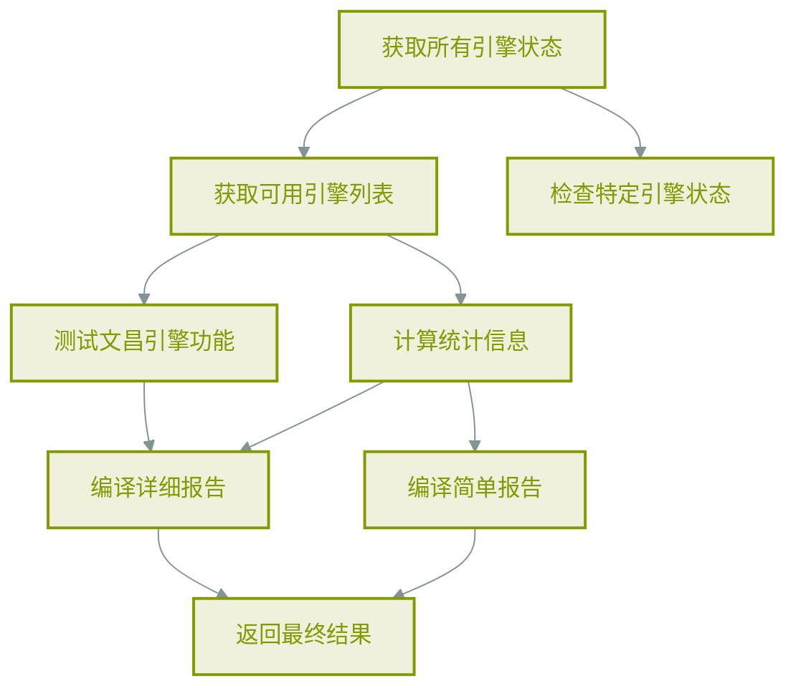
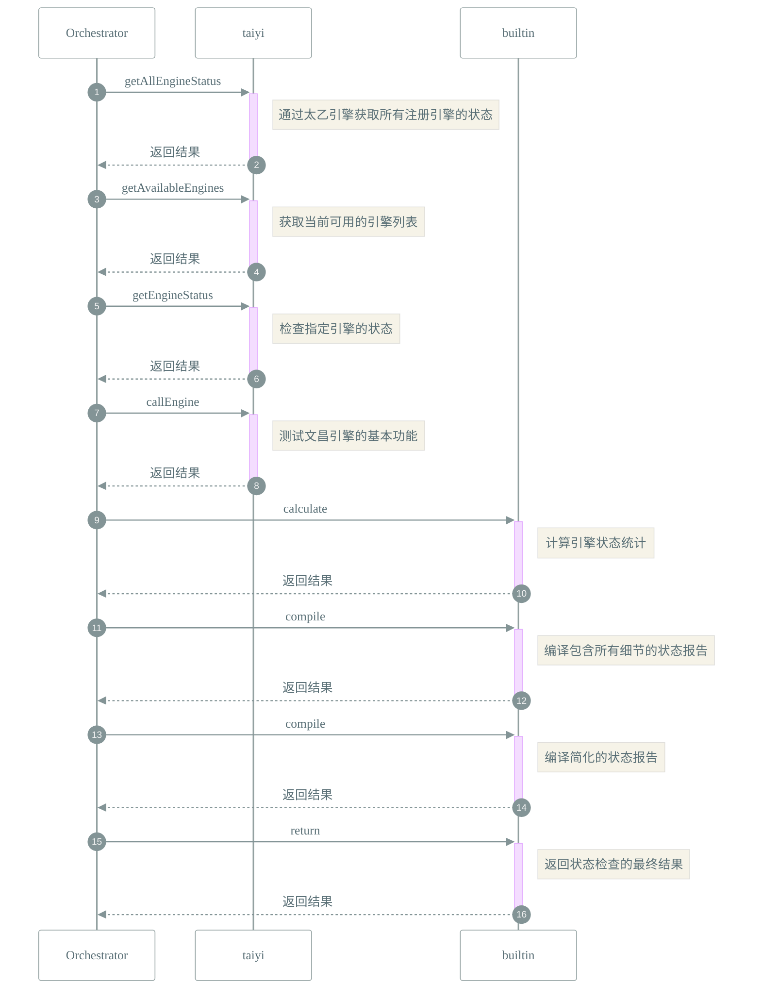

# 📜 工作流: 引擎状态检查工作流
> 通过太乙引擎检查所有注册引擎的状态

## 📑 基本信息
- **标识 (ID)**: `engine_status_check`
- **版本 (Version)**: `1.0.0`
- **作者 (Author)**: Tianshu Engine

## 📥 输入参数 (Inputs)
*无定义输入参数*

## 📤 输出规范 (Outputs)
*该工作流无显式返回定义*

## 📊 流程执行图 (Flowchart)

## 🔄 服务交互时序 (Sequence Diagram)

