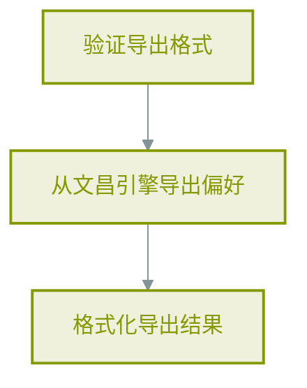
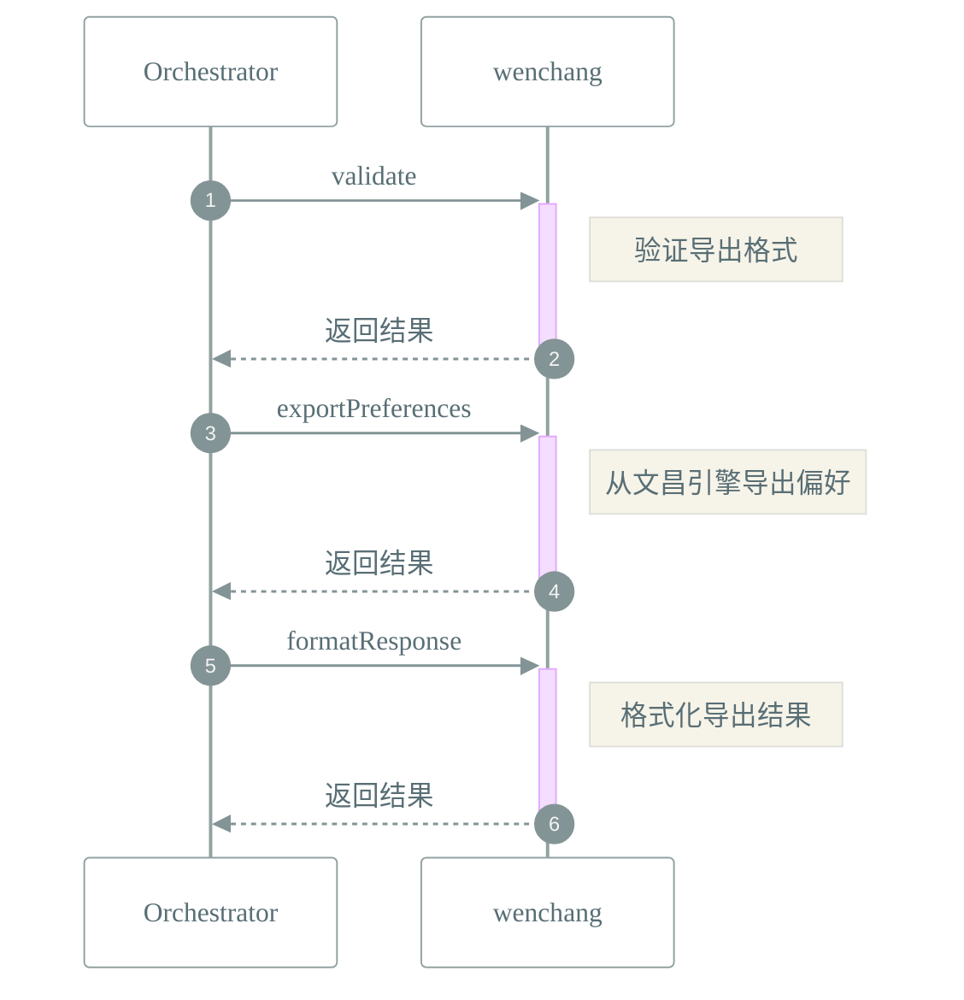

# 📜 工作流: 导出用户偏好设置
> 导出用户偏好设置为JSON格式

## 📑 基本信息
- **标识 (ID)**: `export_preferences`
- **版本 (Version)**: `1.0.0`
- **作者 (Author)**: Tianshu Engine

## 📥 输入参数 (Inputs)
| 参数名 | 类型 | 必填 | 描述 |
| :--- | :--- | :--- | :--- |
| `format` | `string` | ❌ | 导出格式，目前支持json |

## 📤 输出规范 (Outputs)
定义输出：
```json
{
  "data": {
    "description": "导出的偏好设置数据",
    "type": "string"
  },
  "success": {
    "description": "导出是否成功",
    "type": "boolean"
  }
}
```

## 📊 流程执行图 (Flowchart)



## 🔄 服务交互时序 (Sequence Diagram)

