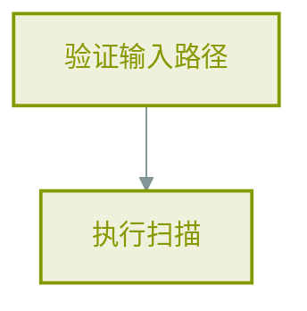
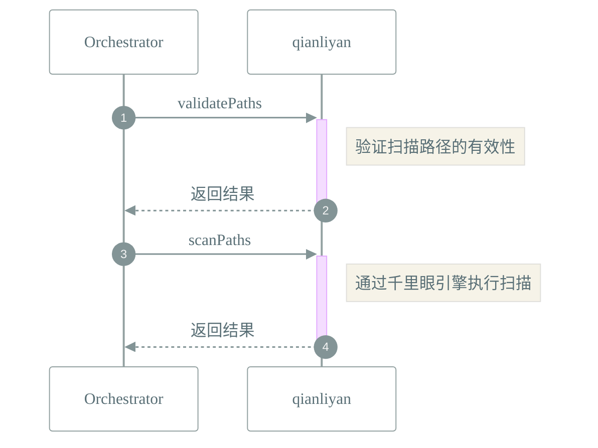

# 📜 工作流: 文件夹扫描工作流

> 通过千里眼引擎执行文件夹扫描任务

## 📑 基本信息

- **标识 (ID)**: `folder_scan`
- **版本 (Version)**: `1.0.0`
- **作者 (Author)**: Tianshu Engine

## 📥 输入参数 (Inputs)

_无定义输入参数_

## 📤 输出规范 (Outputs)

_该工作流无显式返回定义_

## 📊 流程执行图 (Flowchart)

## 🔄 服务交互时序 (Sequence Diagram)

