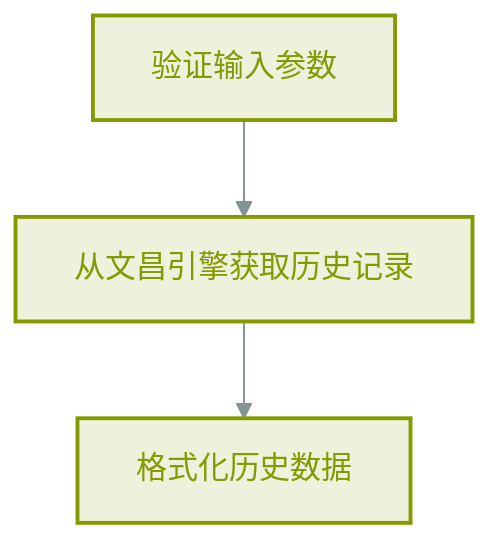
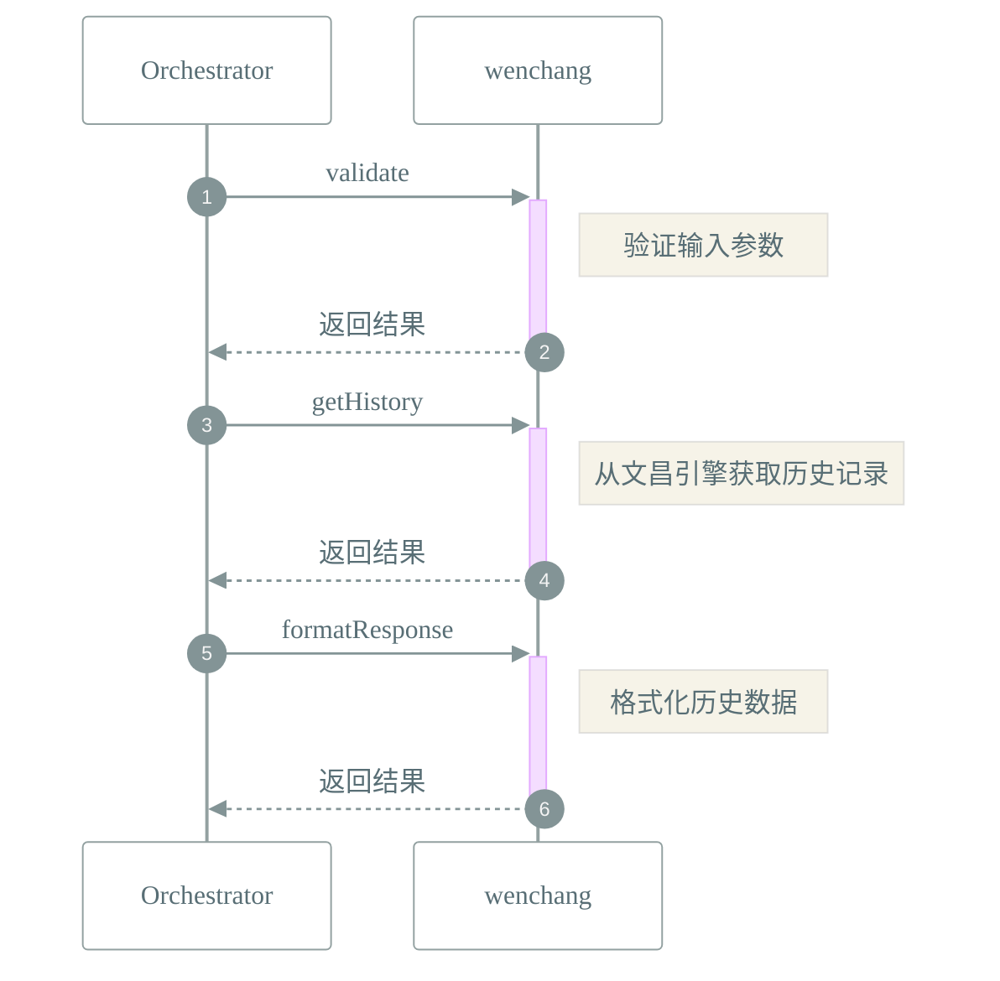

# 📜 工作流: 获取偏好设置变更历史

> 获取偏好设置变更历史

## 📑 基本信息

- **标识 (ID)**: `get_preference_history`
- **版本 (Version)**: `1.0.0`
- **作者 (Author)**: Tianshu Engine

## 📥 输入参数 (Inputs)

| 参数名   | 类型     | 必填 | 描述                   |
| :------- | :------- | :--- | :--------------------- |
| `limit`  | `number` | ❌   | 返回的历史记录数量限制 |
| `offset` | `number` | ❌   | 历史记录的偏移量       |

## 📤 输出规范 (Outputs)

定义输出：

```json
{
    "data": {
        "description": "偏好设置历史记录",
        "type": "array"
    },
    "count": {
        "description": "返回的记录数量",
        "type": "number"
    },
    "success": {
        "description": "获取是否成功",
        "type": "boolean"
    }
}
```

## 📊 流程执行图 (Flowchart)



## 🔄 服务交互时序 (Sequence Diagram)


