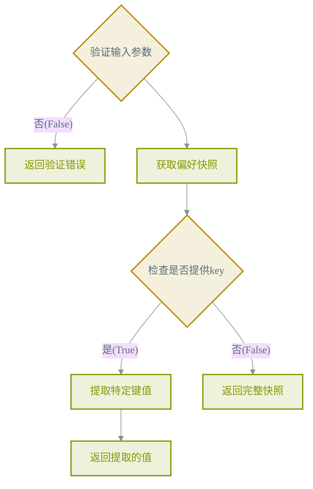
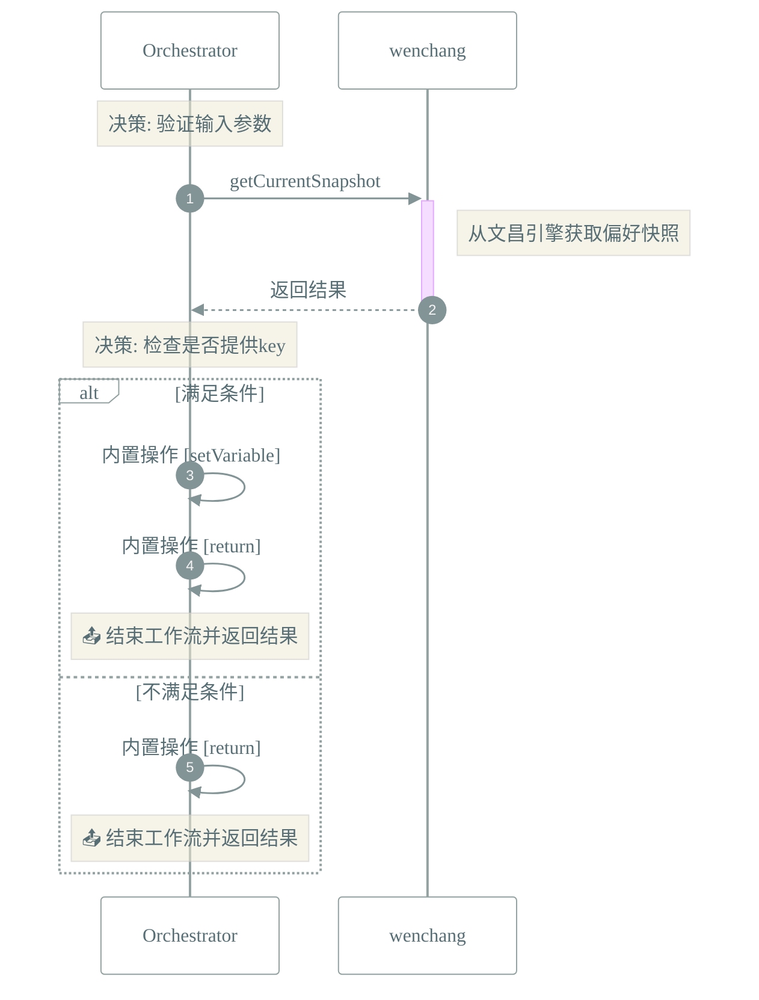

# 📜 工作流: 获取用户偏好设置
> 获取当前用户偏好设置

## 📑 基本信息
- **标识 (ID)**: `get_preferences`
- **版本 (Version)**: `1.0.0`
- **作者 (Author)**: Tianshu Engine

## 📥 输入参数 (Inputs)
| 参数名 | 类型 | 必填 | 描述 |
| :--- | :--- | :--- | :--- |
| `key` | `string` | ❌ | 可选的偏好键路径，如'ui.theme'，为空则返回全部 |

## 📤 输出规范 (Outputs)
定义输出：
```json
{
  "preferences": {
    "description": "偏好设置数据",
    "type": "object"
  },
  "success": {
    "description": "操作是否成功",
    "type": "boolean"
  }
}
```

## 📊 流程执行图 (Flowchart)



## 🔄 服务交互时序 (Sequence Diagram)

