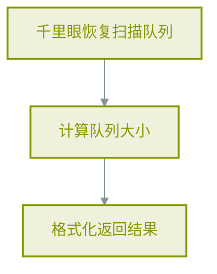
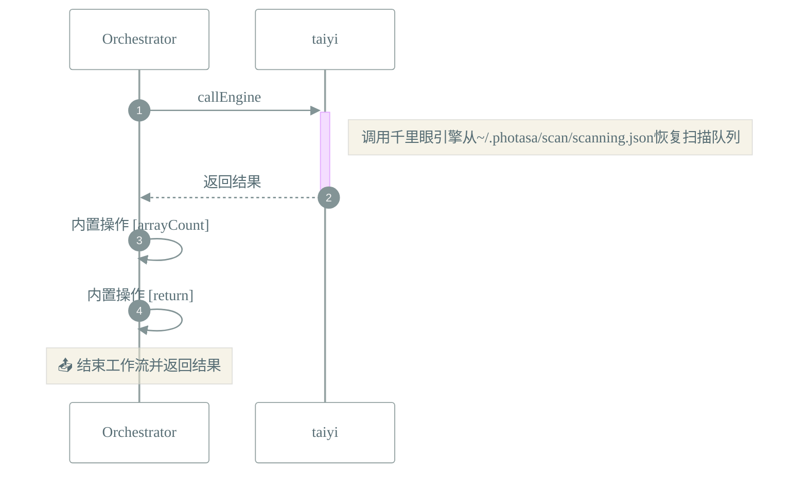

# 📜 工作流: 获取扫描队列

> 从千里眼引擎管理的存储中恢复扫描队列

## 📑 基本信息

- **标识 (ID)**: `get_scanning_queue`
- **版本 (Version)**: `1.0.0`
- **作者 (Author)**: Tianshu Engine

## 📥 输入参数 (Inputs)

| 参数名   | 类型     | 必填 | 描述                                   |
| :------- | :------- | :--- | :------------------------------------- |
| `source` | `string` | ❌   | 获取来源标识（startup/manual/refresh） |

## 📤 输出规范 (Outputs)

工作流执行完成后返回如下结构：

```json
{
    "success": true,
    "queue": "{{steps.restore_queue}}",
    "queueSize": "{{steps.calculate_size}}",
    "source": "{{inputs.source}}",
    "timestamp": "{{now()}}"
}
```

## 📊 流程执行图 (Flowchart)



## 🔄 服务交互时序 (Sequence Diagram)


