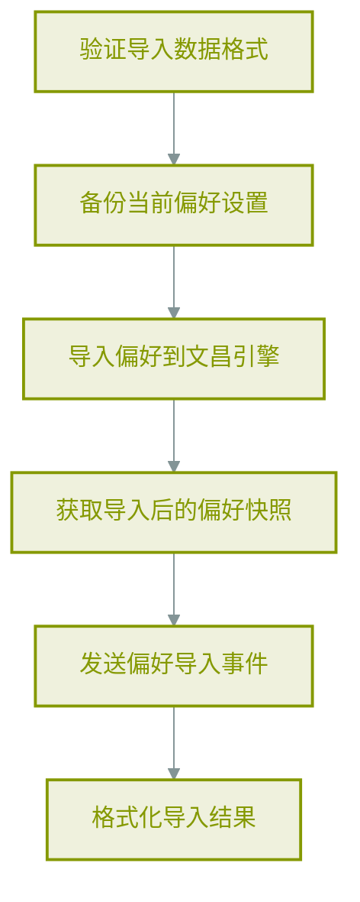
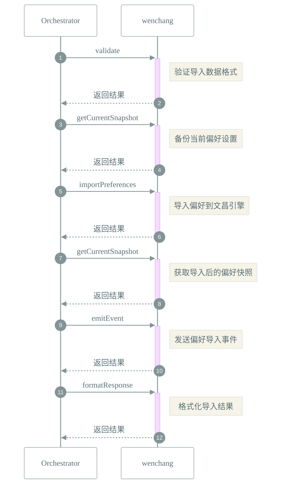

# 📜 工作流: 导入用户偏好设置
> 导入用户偏好设置

## 📑 基本信息
- **标识 (ID)**: `import_preferences`
- **版本 (Version)**: `1.0.0`
- **作者 (Author)**: Tianshu Engine

## 📥 输入参数 (Inputs)
| 参数名 | 类型 | 必填 | 描述 |
| :--- | :--- | :--- | :--- |
| `data` | `string` | ✅ | 要导入的偏好设置JSON数据 |
| `backup` | `boolean` | ❌ | 是否在导入前备份当前设置 |

## 📤 输出规范 (Outputs)
定义输出：
```json
{
  "success": {
    "description": "导入是否成功",
    "type": "boolean"
  },
  "snapshot": {
    "description": "导入后的偏好快照",
    "type": "object"
  },
  "backup": {
    "description": "导入前的备份快照",
    "type": "object"
  }
}
```

## 📊 流程执行图 (Flowchart)



## 🔄 服务交互时序 (Sequence Diagram)

