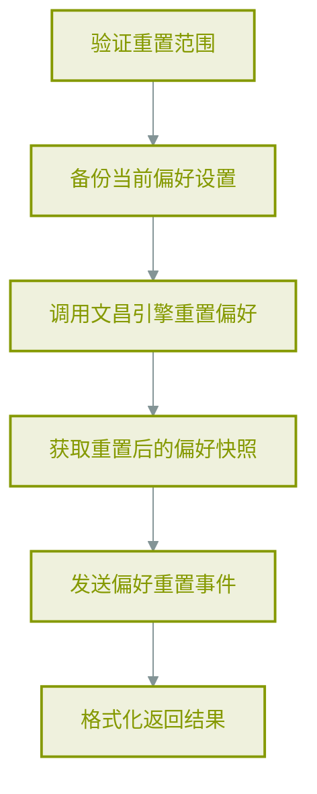
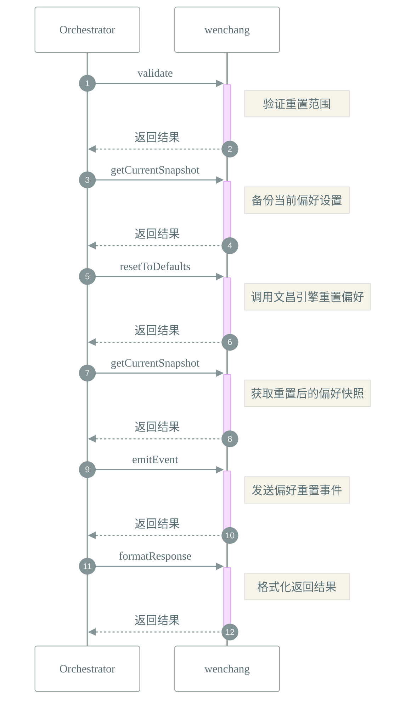

# 📜 工作流: 重置用户偏好设置到默认值

> 重置用户偏好设置到默认值

## 📑 基本信息

- **标识 (ID)**: `reset_preferences`
- **版本 (Version)**: `1.0.0`
- **作者 (Author)**: Tianshu Engine

## 📥 输入参数 (Inputs)

| 参数名         | 类型     | 必填 | 描述                     |
| :------------- | :------- | :--- | :----------------------- | --- | ------- | ---- | ----------- |
| `scope`        | `string` | ❌   | 重置范围：all            | ui  | display | scan | performance |
| `confirmToken` | `string` | ❌   | 确认令牌，用于防止误操作 |

## 📤 输出规范 (Outputs)

定义输出：

```json
{
    "success": {
        "description": "重置是否成功",
        "type": "boolean"
    },
    "snapshot": {
        "description": "重置后的偏好快照",
        "type": "object"
    },
    "backup": {
        "description": "重置前的备份快照",
        "type": "object"
    }
}
```

## 📊 流程执行图 (Flowchart)



## 🔄 服务交互时序 (Sequence Diagram)


