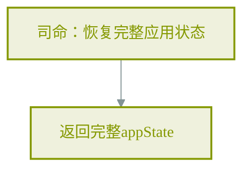
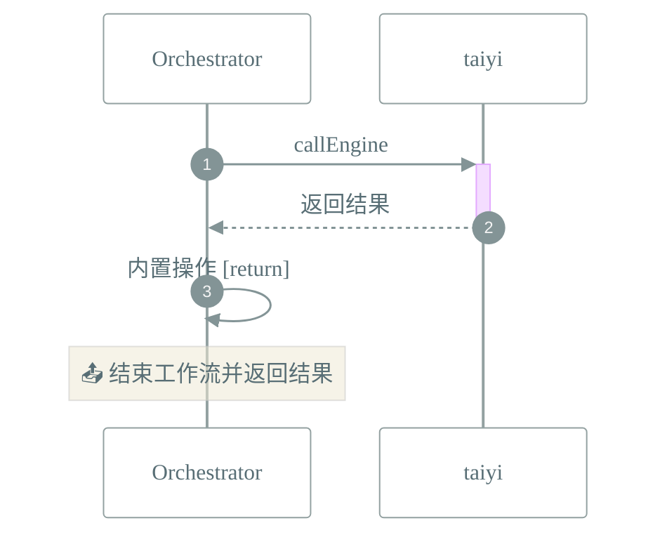

# 📜 工作流: 恢复应用状态

> 从司命引擎恢复完整appState，包括folderTree, currentFolder等

## 📑 基本信息

- **标识 (ID)**: `restore_app_state`
- **版本 (Version)**: `1.0.0`

## 📥 输入参数 (Inputs)

| 参数名 | 类型 | 必填 | 描述 |
| :----- | :--- | :--- | :--- |

## 📤 输出规范 (Outputs)

工作流执行完成后返回如下结构：

```json
{
    "data": "{{steps.restore_app_state}}"
}
```

## 📊 流程执行图 (Flowchart)



## 🔄 服务交互时序 (Sequence Diagram)


