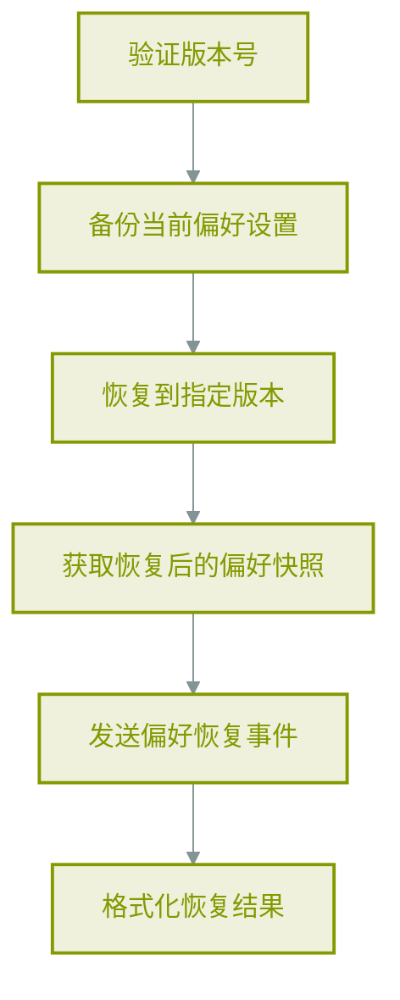
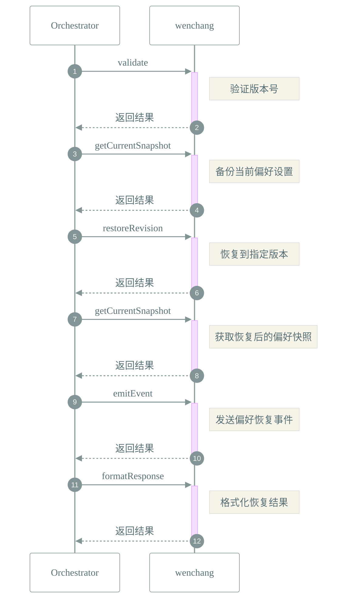

# 📜 工作流: 恢复偏好设置到指定历史版本

> 恢复偏好设置到指定历史版本

## 📑 基本信息

- **标识 (ID)**: `restore_preference_revision`
- **版本 (Version)**: `1.0.0`
- **作者 (Author)**: Tianshu Engine

## 📥 输入参数 (Inputs)

| 参数名     | 类型      | 必填 | 描述                     |
| :--------- | :-------- | :--- | :----------------------- |
| `revision` | `number`  | ✅   | 要恢复到的版本号         |
| `backup`   | `boolean` | ❌   | 是否在恢复前备份当前设置 |

## 📤 输出规范 (Outputs)

定义输出：

```json
{
    "success": {
        "description": "恢复是否成功",
        "type": "boolean"
    },
    "revision": {
        "description": "恢复到的版本号",
        "type": "number"
    },
    "snapshot": {
        "description": "恢复后的偏好快照",
        "type": "object"
    },
    "backup": {
        "description": "恢复前的备份快照",
        "type": "object"
    }
}
```

## 📊 流程执行图 (Flowchart)



## 🔄 服务交互时序 (Sequence Diagram)


