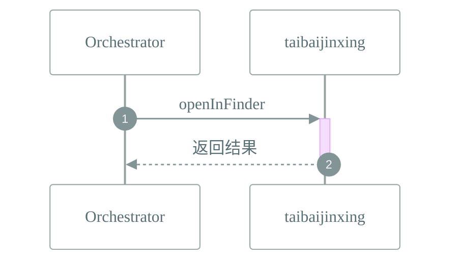

# 📜 工作流: 在 Finder 中显示文件
> 接收文件路径，通过太白金星适配器在 Finder 中显示

## 📑 基本信息
- **标识 (ID)**: `shell_openInFinder`
- **版本 (Version)**: `1.0.0`
- **作者 (Author)**: Tianshu Engine

## 📥 输入参数 (Inputs)
| 参数名 | 类型 | 必填 | 描述 |
| :--- | :--- | :--- | :--- |
| `path` | `string` | ✅ | 要在 Finder 中显示的文件路径 |

## 📤 输出规范 (Outputs)
定义输出：
```json
{
  "success": {
    "description": "是否成功在 Finder 中显示文件",
    "type": "boolean",
    "path": "success"
  },
  "message": {
    "description": "操作结果消息",
    "type": "string",
    "path": "message"
  }
}
```

## 📊 流程执行图 (Flowchart)


## 🔄 服务交互时序 (Sequence Diagram)

