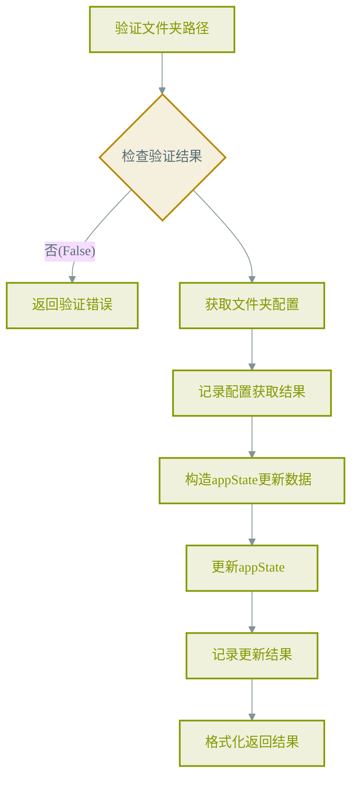
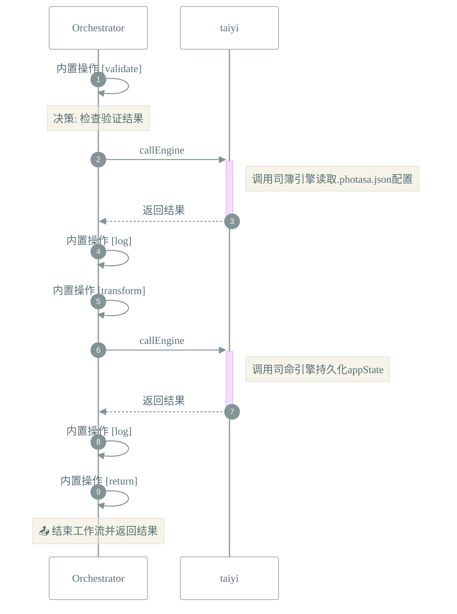

# 📜 工作流: 切换当前文件夹
> 切换当前文件夹，自动获取.photasa.json配置并更新appState

## 📑 基本信息
- **标识 (ID)**: `switch_current_folder`
- **版本 (Version)**: `1.0.0`
- **作者 (Author)**: Tianshu Engine

## 📥 输入参数 (Inputs)
| 参数名 | 类型 | 必填 | 描述 |
| :--- | :--- | :--- | :--- |
| `folder` | `string` | ✅ | 目标文件夹路径 |
| `source` | `string` | ❌ | 切换来源标识 |

## 📤 输出规范 (Outputs)
工作流执行完成后返回如下结构：
```json
{
  "success": true,
  "data": {
    "appState": {
      "currentFolder": "{{inputs.folder}}",
      "currentFolderConfig": "{{steps.get_folder_config.result.config}}"
    },
    "metadata": {
      "configExists": "{{steps.get_folder_config.result.exists}}",
      "source": "{{inputs.source}}"
    }
  },
  "timestamp": "{{now()}}"
}
```

## 📊 流程执行图 (Flowchart)



## 🔄 服务交互时序 (Sequence Diagram)

