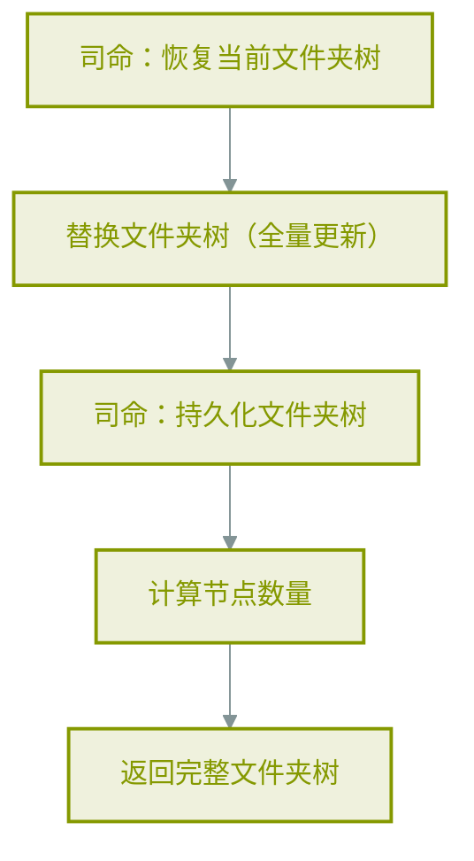
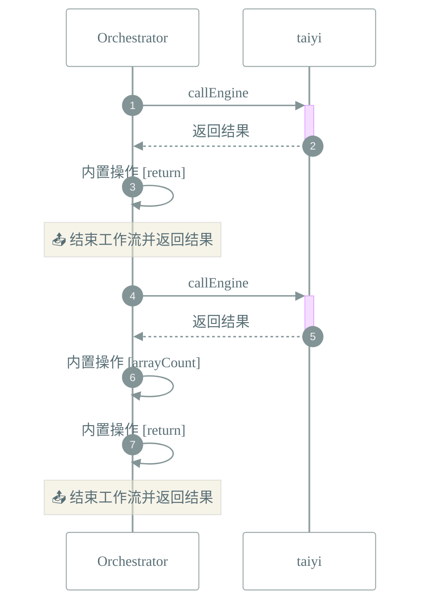

# 📜 工作流: 更新文件夹树

> 接收文件夹树，恢复现有，替换/合并，持久化，返回完整树

## 📑 基本信息

- **标识 (ID)**: `update_folder_tree`
- **版本 (Version)**: `1.0.0`

## 📥 输入参数 (Inputs)

| 参数名 | 类型    | 必填 | 描述                              |
| :----- | :------ | :--- | :-------------------------------- |
| `tree` | `array` | ✅   | 要更新的文件夹树数组 FolderNode[] |

## 📤 输出规范 (Outputs)

工作流执行完成后返回如下结构：

```json
{
    "success": true,
    "folderTree": "{{steps.update_tree}}",
    "nodeCount": "{{steps.count_nodes}}",
    "persisted": true
}
```

## 📊 流程执行图 (Flowchart)



## 🔄 服务交互时序 (Sequence Diagram)


