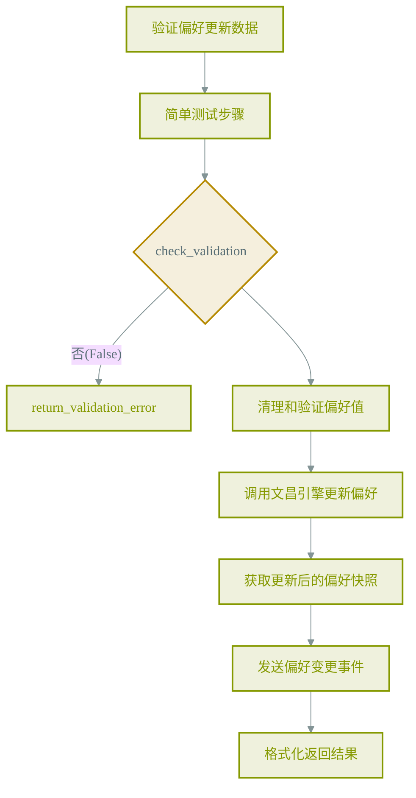
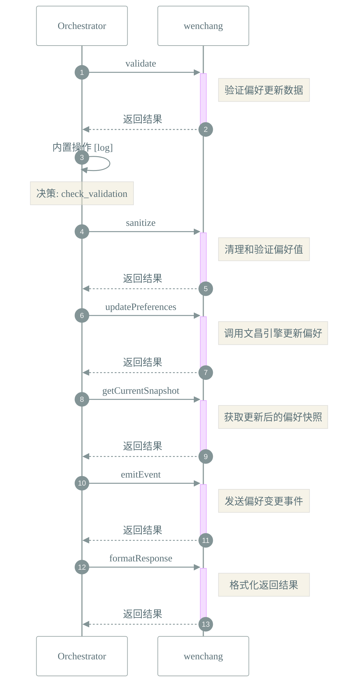

# 📜 工作流: 更新用户偏好设置

> 更新用户偏好设置

## 📑 基本信息

- **标识 (ID)**: `update_preferences`
- **版本 (Version)**: `1.0.0`
- **作者 (Author)**: Tianshu Engine

## 📥 输入参数 (Inputs)

| 参数名   | 类型     | 必填 | 描述                     |
| :------- | :------- | :--- | :----------------------- |
| `delta`  | `object` | ✅   | 要更新的偏好设置增量对象 |
| `source` | `string` | ❌   | 更新来源标识             |

## 📤 输出规范 (Outputs)

定义输出：

```json
{
    "success": {
        "description": "更新是否成功",
        "type": "boolean"
    },
    "updated": {
        "description": "实际更新的偏好项",
        "type": "object"
    },
    "snapshot": {
        "description": "更新后的完整偏好快照",
        "type": "object"
    }
}
```

## 📊 流程执行图 (Flowchart)



## 🔄 服务交互时序 (Sequence Diagram)


