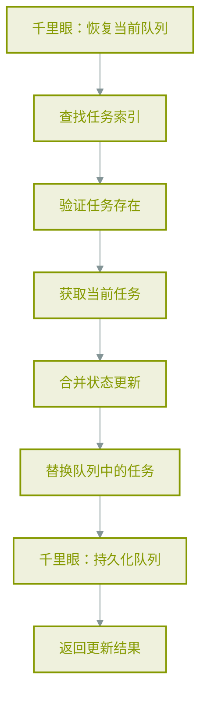
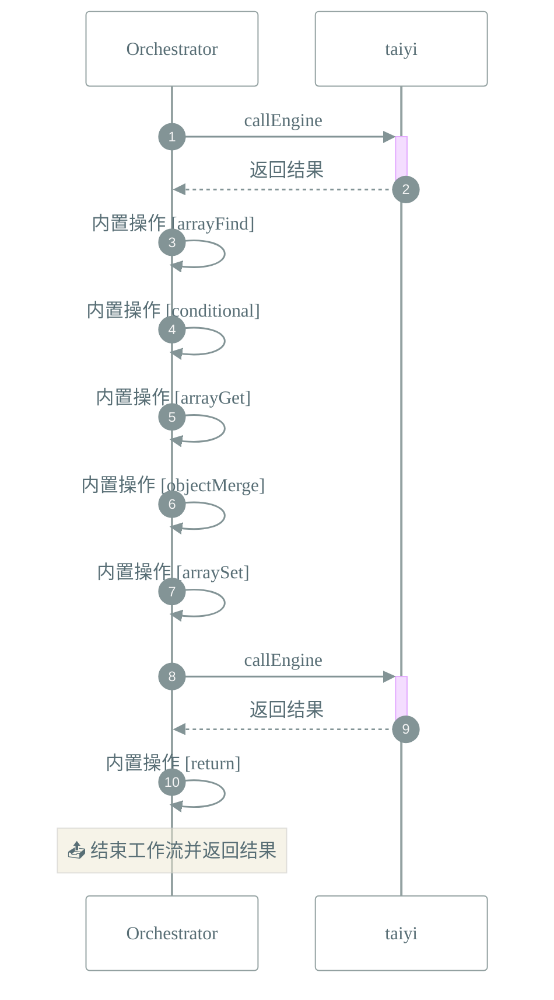

# 📜 工作流: 更新扫描任务状态
> 支持pending→processing→failed状态转换，更新状态机字段（startedAt, error, retryCount等）

## 📑 基本信息
- **标识 (ID)**: `update_scan_action_status`
- **版本 (Version)**: `1.0.0`

## 📥 输入参数 (Inputs)
| 参数名 | 类型 | 必填 | 描述 |
| :--- | :--- | :--- | :--- |
| `path` | `string` | ✅ | 任务路径（唯一标识符） |
| `status` | `string` | ✅ | 新状态: pending | processing | failed |
| `updates` | `object` | ❌ | 额外字段更新（如startedAt, error, retryCount, maxRetries, progress） |

## 📤 输出规范 (Outputs)
工作流执行完成后返回如下结构：
```json
{
  "success": true,
  "task": "{{steps.merge_updates}}",
  "queue": "{{steps.replace_task}}",
  "queueSize": "{{steps.replace_task.length}}",
  "persisted": true
}
```

## 📊 流程执行图 (Flowchart)



## 🔄 服务交互时序 (Sequence Diagram)

